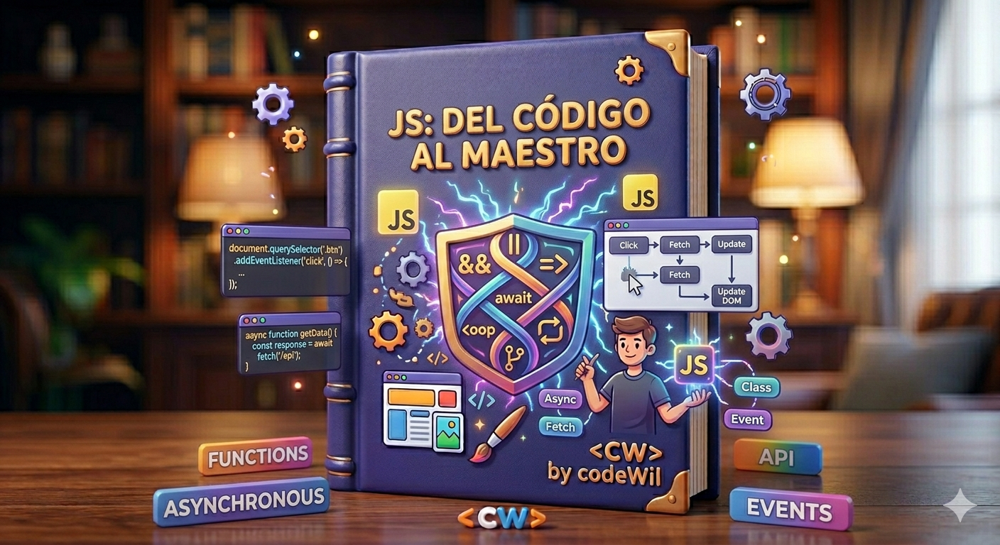
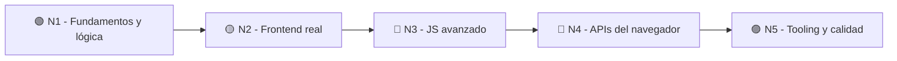

# 🚀 JavaScript Moderno: De Cero a Profesional

### Ruta de aprendizaje visual, práctica y progresiva

De no haber programado nunca a construir aplicaciones frontend reales. Pensada para **niños, jóvenes y adultos mayores**, sin teoría infinita ni consola negra.

     

---

## 🧠 Filosofía del curso

La mayoría de personas abandona JavaScript porque pasa demasiado tiempo en teoría, vive en la consola negra, no entiende para qué sirven las cosas y no ve resultados visuales rápidos.

> Esta ruta busca lo contrario: **resultados que se ven desde el primer día** y motivación que no se apaga.

|Regla 70/30|Retos rápidos|Aprender construyendo|
|:-:|:-:|:-:|
|70% práctica, 30% teoría|Ejercicios de 10 min|Crear, romper, corregir, repetir|

---

## 🎯 ¿Qué vas a lograr?

- Entender cómo funciona JavaScript **de verdad**.
- Manipular páginas web dinámicamente y consumir **APIs reales**.
- Construir **aplicaciones frontend interactivas**.
- Comprender la **asincronía moderna** y organizar código profesionalmente.
- Quedar listo para dar el salto a **React, Angular o Vue**.

---

## 🗺️ El camino completo

|Nivel|Lema|Lo que dominas|
|:-:|---|---|
|🟢 **1 · Fundamentos**|Aprender a pensar y crear|Lógica, DOM, eventos, arrays y estado|
|🟡 **2 · Frontend Real**|Construir apps dinámicas|Asincronía, APIs, formularios y persistencia|
|🔴 **3 · Avanzado**|Pensar como developer|Closures, `this`, POO, funcional y performance|
|🔵 **4 · Navegador**|Aprovechar la plataforma|Web APIs, observers, workers y PWA|
|🟣 **5 · Calidad Pro**|Trabajar como profesional|Tooling, testing y optimización|

---

## 🟢 Nivel 1 — Fundamentos Visuales y Lógica Básica

> **Aprender a pensar y crear.** El objetivo es perder el miedo y construir confianza con resultados visuales rápidos.

⚠️ Aquí **todavía no** se profundiza en Event Loop, prototypes, closures complejos ni arquitectura avanzada. Todo a su tiempo.

|  #  | Módulo                                           | Lo que aprenderás                                                    |
| :-: | ------------------------------------------------ | -------------------------------------------------------------------- |
|  1  | [Introducción a JavaScript](./modulo-01.md)      | Qué es JS, navegador vs Node, ECMAScript, DevTools y consola         |
|  2  | [Variables y Datos](./modulo-02.md)              | `let`/`const`, tipos de datos, operadores, coerción y truthy/falsy   |
|  3  | [Condicionales y Bucles](./modulo-03.md)         | `if`/`switch`, `for`/`while`, ternario, `??` y `?.`                  |
|  4  | [Funciones y Pensamiento Lógico](./modulo-04.md) | Declaraciones, arrow functions, parámetros y resolución de problemas |

### 🌟 Hito Visual 1 — DOM y Eventos · _"Ahora JavaScript cobra vida"_

|  #  | Módulo                                          | Lo que aprenderás                                                      |
| :-: | ----------------------------------------------- | ---------------------------------------------------------------------- |
|  5  | [Introducción al DOM](./modulo-05.md)           | `querySelector`, modificar contenido y eventos (click, input, teclado) |
|  6  | [Proyectos Visuales Básicos](./modulo-06.md)    | Contador, dark mode, calculadora, tabs, modal y menú responsive        |
|  7  | [Arrays y Renderizado Dinámico](./modulo-07.md) | Métodos de array, `map`/`filter`/`reduce` y render dinámico de UI      |
|  8  | [Objetos y Estado](./modulo-08.md)              | Objetos, `Object.keys/values/entries` y sincronizar datos con pantalla |
|  9  | [Strings, Fechas y JSON](./modulo-09.md)        | Métodos de string, template literals, `JSON` y `Date`/`Intl`           |
| 10  | [Debugging y Errores](./modulo-10.md)           | `console.log`, breakpoints, stack trace y tipos de errores             |

---

## 🟡 Nivel 2 — JavaScript Intermedio y Frontend Real

> **Construir aplicaciones dinámicas.** Asincronía, APIs, estado y arquitectura frontend básica.

|  #  | Módulo                                    | Lo que aprenderás                                                     |
| :-: | ----------------------------------------- | --------------------------------------------------------------------- |
| 11  | [Asincronía Moderna](./modulo-11.md)      | Callbacks, promesas (`.then`/`.catch`) y `async`/`await`              |
| 12  | [Fetch API y APIs Reales](./modulo-12.md) | `GET`/`POST`, APIs reales (clima, películas) y manejo de errores      |
| 13  | [Event Loop y JS Interno](./modulo-13.md) | Call Stack, Web APIs, Callback Queue, microtasks y Event Loop         |
| 14  | [Eventos Avanzados](./modulo-14.md)       | Bubbling, capturing, delegation, `preventDefault` y `stopPropagation` |
| 15  | [Formularios Reales](./modulo-15.md)      | Validaciones, sanitización, formularios dinámicos y accesibilidad     |
| 16  | [Storage y Persistencia](./modulo-16.md)  | `localStorage`, `sessionStorage` y guardar TODOs o carritos           |
| 17  | [Módulos y Organización](./modulo-17.md)  | `import`/`export`, component thinking y estructura de carpetas        |
| 18  | [Proyectos Intermedios](./modulo-18.md)   | TODO app, buscador de películas, ecommerce fake y app del clima       |

---

## 🔴 Nivel 3 — JavaScript Avanzado y Profesional

> **Pensar como frontend developer.** Lo que distingue a quien _usa_ JS de quien lo _entiende_.

|  #  | Módulo                                             | Lo que aprenderás                                                   |
| :-: | -------------------------------------------------- | ------------------------------------------------------------------- |
| 19  | [Scope y Closures](./modulo-19.md)                 | Lexical scope, closures, hoisting y TDZ                             |
| 20  | [This y Contexto](./modulo-20.md)                  | `this`, `bind`, `call`, `apply` y arrow functions                   |
| 21  | [Programación Orientada a Objetos](./modulo-21.md) | Prototypes, classes, herencia, encapsulación y getters/setters      |
| 22  | [Estructuras Avanzadas](./modulo-22.md)            | `Map`, `Set`, `WeakMap` y `WeakSet`                                 |
| 23  | [Programación Funcional](./modulo-23.md)           | Funciones puras, inmutabilidad, composición y currying              |
| 24  | [Iteradores y Generadores](./modulo-24.md)         | `Symbol.iterator`, generators y `yield`                             |
| 25  | [Memoria y Performance](./modulo-25.md)            | Stack vs heap, garbage collection, memory leaks, reflows y repaints |
| 26  | [Seguridad Frontend](./modulo-26.md)               | XSS, sanitización, CORS, CSP y seguridad con tokens                 |

---

## 🔵 Nivel 4 — JavaScript en el Navegador y Web APIs

> **Aprovechar la plataforma.** Todo lo que el navegador moderno pone a tu disposición.

|  #  | Módulo                                        | Lo que aprenderás                                              |
| :-: | --------------------------------------------- | -------------------------------------------------------------- |
| 27  | [APIs Modernas del Navegador](./modulo-27.md) | Clipboard, Geolocation, Notifications, Drag & Drop, File y URL |
| 28  | [Observers Modernos](./modulo-28.md)          | Intersection, Resize y Mutation Observer                       |
| 29  | [Web Workers](./modulo-29.md)                 | Hilos secundarios, tareas pesadas y performance de UI          |
| 30  | [Web Components](./modulo-30.md)              | Custom Elements, Shadow DOM, `template` y `slot`               |
| 31  | [Service Workers y PWA](./modulo-31.md)       | Cache, modo offline, instalación y estrategias offline         |

---

## 🟣 Nivel 5 — Tooling y Calidad Profesional

> **Trabajar como profesional.** Las herramientas y prácticas de los equipos reales.

|  #  | Módulo                                  | Lo que aprenderás                                              |
| :-: | --------------------------------------- | -------------------------------------------------------------- |
| 32  | [Tooling Moderno](./modulo-32.md)       | npm/pnpm, Vite, Babel, ESLint y Prettier                       |
| 33  | [Testing](./modulo-33.md)               | Testing unitario, Vitest, mocks y Testing Library              |
| 34  | [Optimización Frontend](./modulo-34.md) | Debounce, throttle, lazy loading, code splitting y memoization |

### 🎓 Módulo 35 — Proyecto Final Profesional

Construirás una **aplicación frontend moderna y completa** que reúne todo el camino:

|Datos|Interfaz|Calidad|
|---|---|---|
|APIs reales|Componentes|Accesibilidad|
|Autenticación simulada|Responsive|Performance|
|Persistencia||Arquitectura limpia|

---

## 🎯 Preparación para frameworks

Antes de saltar a **React, Angular o Vue**, esta ruta te asegura dominar lo que de verdad importa: arrays, objetos, `async`/`await`, DOM, eventos, estado, módulos y renderizado dinámico. Los frameworks se aprenden mucho más rápido cuando estas bases están sólidas.

---
### 🏁 Empieza por el [Módulo 1](./modulo-01.md) — JavaScript no se aprende leyendo, se aprende construyendo

_Crea, rompe cosas, corrige errores y construye proyectos reales._ 🌱