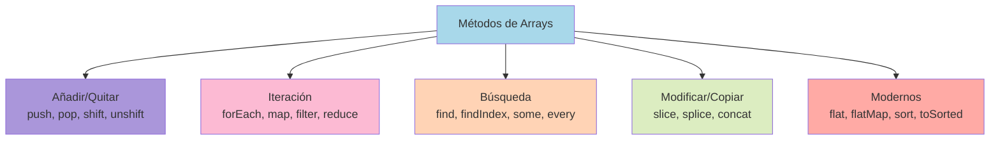

# 1.7 Arrays

> 📚 Un **array** (arreglo) es una **lista ordenada** de valores. Como una agenda donde cada renglón tiene un número.

---

## ¿Qué es un Array?

Imagina un **carrito de supermercado**: contiene varios productos en cierto orden. Cada producto tiene una **posición** numerada empezando en **0**.

```javascript
const frutas = ["manzana", "pera", "uva", "kiwi"];
//                0          1       2      3   ← índices (posiciones)

frutas[0]; // "manzana"
frutas[2]; // "uva"
frutas.length; // 4 → cantidad de elementos
```

---

## Creación y Manipulación

### 1. Arrays literales (la forma más común)

```javascript
const numeros = [1, 2, 3, 4, 5];
const vacio = [];
const mixto = [1, "hola", true, null];
```

### 2. Con el constructor `Array()`

```javascript
const arr1 = new Array(3); // [ <3 vacíos> ] → array de 3 huecos
const arr2 = new Array(1, 2, 3); // [1, 2, 3]
```

> ⚠️ Rara vez se usa. Mejor usa arrays literales.

### 3. `Array.from()` — crear desde algo iterable

Convierte cosas que parecen arrays (como un texto) en un array real.

```javascript
Array.from("hola"); // ["h", "o", "l", "a"]
Array.from({ length: 3 }, (_, i) => i + 1); // [1, 2, 3]
```

### 4. `Array.of()` — crear con los valores dados

```javascript
Array.of(1, 2, 3); // [1, 2, 3]
Array.of(7); // [7] (diferente de new Array(7) que crea 7 huecos)
```

---

## Métodos Básicos

### `push()` — añadir al **final**

```javascript
const frutas = ["manzana"];
frutas.push("pera"); // ["manzana", "pera"]
frutas.push("uva", "kiwi"); // ["manzana", "pera", "uva", "kiwi"]
```

### `pop()` — quitar el **último** y devolverlo

```javascript
const frutas = ["manzana", "pera", "uva"];
const ultima = frutas.pop(); // ultima = "uva"
// frutas = ["manzana", "pera"]
```

### `shift()` — quitar el **primero** y devolverlo

```javascript
const frutas = ["manzana", "pera", "uva"];
const primera = frutas.shift(); // primera = "manzana"
// frutas = ["pera", "uva"]
```

### `unshift()` — añadir al **inicio**

```javascript
const frutas = ["pera", "uva"];
frutas.unshift("manzana"); // ["manzana", "pera", "uva"]
```

### `slice(inicio, fin)` — **copiar** un trozo (NO modifica el original)

```javascript
const frutas = ["manzana", "pera", "uva", "kiwi"];
const trozo = frutas.slice(1, 3); // ["pera", "uva"]
// frutas sigue intacto
```

### `splice(inicio, cuántos, ...nuevos)` — **modificar** el array (cortar/agregar)

```javascript
const frutas = ["manzana", "pera", "uva", "kiwi"];

// Borrar 2 desde la posición 1
frutas.splice(1, 2); // ["manzana", "kiwi"]

// Insertar sin borrar
const arr = ["a", "d"];
arr.splice(1, 0, "b", "c"); // ["a", "b", "c", "d"]
```

> 💡 **Truco para recordar:** `slice` corta una **rebanada** (no modifica). `splice` **opera** el array (sí modifica).

---

## Iteración: recorrer arrays

Métodos modernos para recorrer arrays sin usar `for` clásico.

### `forEach()` — ejecuta una función por cada elemento

```javascript
const numeros = [1, 2, 3];
numeros.forEach((n) => console.log(n));
// 1
// 2
// 3
```

> ⚠️ No devuelve nada (`undefined`). Solo "hace cosas".

### `map()` — transforma cada elemento, devuelve un **nuevo array**

```javascript
const numeros = [1, 2, 3];
const dobles = numeros.map((n) => n * 2);
// dobles = [2, 4, 6]
```

### `filter()` — filtra elementos según una condición

```javascript
const numeros = [1, 2, 3, 4, 5];
const pares = numeros.filter((n) => n % 2 === 0);
// pares = [2, 4]
```

### `reduce()` — reduce el array a **un solo valor**

```javascript
const numeros = [1, 2, 3, 4];
const suma = numeros.reduce((acumulado, actual) => acumulado + actual, 0);
// suma = 10
```

- `acumulado`: el resultado que se va guardando.
- `actual`: el elemento de la vuelta actual.
- `0`: el valor inicial.

### `find()` — devuelve el **primer elemento** que cumple la condición

```javascript
const personas = [{ nombre: "Ana" }, { nombre: "Luis" }];
const luis = personas.find((p) => p.nombre === "Luis");
// luis = {nombre: "Luis"}
```

### `findIndex()` — devuelve la **posición** del primer match

```javascript
const numeros = [10, 20, 30];
const idx = numeros.findIndex((n) => n === 20);
// idx = 1
```

### `some()` — `true` si **al menos uno** cumple la condición

```javascript
[1, 2, 3].some((n) => n > 2); // true
```

### `every()` — `true` si **todos** cumplen la condición

```javascript
[1, 2, 3].every((n) => n > 0); // true
[1, 2, 3].every((n) => n > 1); // false
```

---

## Métodos Modernos

### `flat()` — aplana arrays anidados

```javascript
[1, [2, 3], [4, [5, 6]]].flat(); // [1, 2, 3, 4, [5, 6]]
[1, [2, 3], [4, [5, 6]]].flat(2); // [1, 2, 3, 4, 5, 6]
```

### `flatMap()` — `map` + `flat` en uno

```javascript
const frases = ["hola mundo", "adiós tierra"];
const palabras = frases.flatMap((f) => f.split(" "));
// ["hola", "mundo", "adiós", "tierra"]
```

### `sort()` — ordena el array (modifica el original)

```javascript
const letras = ["c", "a", "b"];
letras.sort(); // ["a", "b", "c"]

// Para números, hay que pasar una función:
const nums = [10, 2, 30, 4];
nums.sort((a, b) => a - b); // [2, 4, 10, 30] ascendente
nums.sort((a, b) => b - a); // [30, 10, 4, 2] descendente
```

> ⚠️ Sin la función, `sort()` ordena alfabéticamente, así que `[10, 2]` queda `[10, 2]` (el "1" va antes que "2" como texto).

### Métodos "to" — versiones **inmutables** (no modifican el original)

Estos son nuevos (ES2023+) y son más seguros porque devuelven un array nuevo.

```javascript
const arr = [3, 1, 2];
const ordenado = arr.toSorted(); // [1, 2, 3] (arr no cambia)
const reverso = arr.toReversed(); // [2, 1, 3]
const cortado = arr.toSpliced(1, 1); // [3, 2] (sin el del medio)
```

### `groupBy()` (ES2024) — agrupa elementos por una clave

```javascript
const personas = [
  { nombre: "Ana", edad: 40 },
  { nombre: "Luis", edad: 25 },
  { nombre: "Carla", edad: 40 },
];

const porEdad = Object.groupBy(personas, (p) => p.edad);
// {
//   40: [{nombre: "Ana"...}, {nombre: "Carla"...}],
//   25: [{nombre: "Luis"...}]
// }
```

---

## 📊 Gráfico: Métodos por categoría



---

## 📝 Notas importantes

> 💡 **Nota:** Los arrays empiezan en el **índice 0**, no en 1. El primer elemento es `arr[0]`.

> ⚠️ **Observación:** Métodos como `push`, `pop`, `splice`, `sort` **modifican** el array original (mutables). Métodos como `map`, `filter`, `slice`, `toSorted` **devuelven uno nuevo** (inmutables). Prefiere los inmutables.

> 🎯 **Recomendación:** Aprende bien `map`, `filter` y `reduce`. Son las herramientas más usadas en JavaScript moderno.

---

## ✅ Resumen

- Un **array** es una lista ordenada con índices empezando en 0.
- **Añadir/quitar**: `push`, `pop`, `shift`, `unshift`.
- **Copiar/cortar**: `slice` (no muta), `splice` (sí muta).
- **Iteración moderna**: `forEach`, `map`, `filter`, `reduce`.
- **Búsqueda**: `find`, `findIndex`, `some`, `every`.
- **Modernos**: `flat`, `flatMap`, `sort`, `toSorted`, `toReversed`, `groupBy`.
- Prefiere métodos **inmutables** (no modifican el original).
