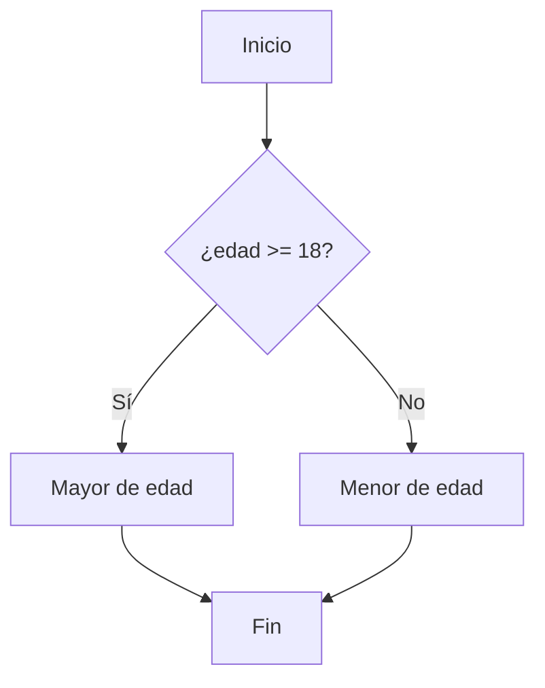
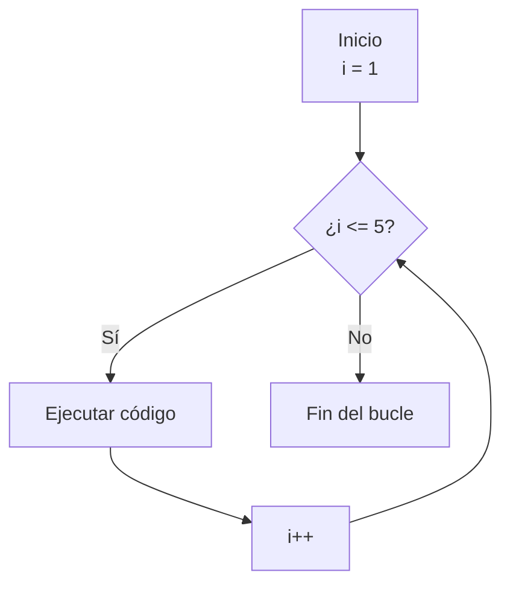

# 1.5 Estructuras de Control

> 📚 Las estructuras de control permiten que el código **tome decisiones** (condicionales) o **repita acciones** (bucles).

---

## Condicionales: tomar decisiones

### `if` — "si pasa esto, haz aquello"

```javascript
let edad = 40;

if (edad >= 18) {
  console.log("Eres mayor de edad");
}
```

### `if ... else` — alternativa

```javascript
let edad = 15;

if (edad >= 18) {
  console.log("Mayor de edad");
} else {
  console.log("Menor de edad");
}
```

### `if ... else if ... else` — varias opciones

```javascript
let nota = 85;

if (nota >= 90) {
  console.log("Excelente");
} else if (nota >= 70) {
  console.log("Aprobado");
} else {
  console.log("Reprobado");
}
```

### `switch` — cuando hay muchas opciones del mismo tipo

Útil para evitar muchos `else if`. Compara un valor con varios casos.

```javascript
let dia = "lunes";

switch (dia) {
  case "lunes":
    console.log("Inicio de semana");
    break;
  case "viernes":
    console.log("¡Casi fin de semana!");
    break;
  case "sábado":
  case "domingo":
    console.log("Fin de semana");
    break;
  default:
    console.log("Día normal");
}
```

> ⚠️ **Importante:** No olvides el `break` después de cada caso, o ejecutará los siguientes ("caída en cascada").

---

## Loops (Bucles): repetir acciones

### `for` — repetir un número conocido de veces

Estructura: `for (inicio; condición; paso) { ... }`

```javascript
for (let i = 1; i <= 5; i++) {
  console.log("Vuelta número " + i);
}
// Vuelta número 1
// Vuelta número 2
// ... hasta 5
```

**Desglose:**

- `let i = 1` → empieza en 1
- `i <= 5` → mientras `i` sea menor o igual a 5
- `i++` → suma 1 en cada vuelta

### `while` — repetir mientras una condición sea verdadera

```javascript
let contador = 0;
while (contador < 3) {
  console.log("Contador: " + contador);
  contador++;
}
// 0, 1, 2
```

> ⚠️ **Cuidado:** Si la condición nunca se vuelve `false`, creas un **bucle infinito** que congela el navegador.

### `do ... while` — al menos una vez

Igual que `while`, pero **siempre se ejecuta una vez**, aunque la condición sea falsa.

```javascript
let n = 10;
do {
  console.log("Esto se ejecuta al menos 1 vez");
} while (n < 5); // false, pero ya se ejecutó
```

### `for ... in` — recorrer **propiedades de un objeto**

```javascript
const persona = { nombre: "Ana", edad: 40, ciudad: "Lima" };

for (const clave in persona) {
  console.log(clave + ": " + persona[clave]);
}
// nombre: Ana
// edad: 40
// ciudad: Lima
```

### `for ... of` — recorrer **valores de un array** (o iterable)

```javascript
const frutas = ["manzana", "pera", "uva"];

for (const fruta of frutas) {
  console.log(fruta);
}
// manzana
// pera
// uva
```

> 💡 **Truco para recordar:**
>
> - `for...in` → **i**ndices/claves (propiedades).
> - `for...of` → **o**bjetos (valores reales).

---

## Control de Flujo dentro de bucles

### `break` — salir del bucle

```javascript
for (let i = 1; i <= 10; i++) {
  if (i === 5) break; // sale cuando i = 5
  console.log(i);
}
// 1, 2, 3, 4
```

### `continue` — saltar a la siguiente vuelta

```javascript
for (let i = 1; i <= 5; i++) {
  if (i === 3) continue; // salta el 3
  console.log(i);
}
// 1, 2, 4, 5
```

### `return` — salir de una función

```javascript
function buscar(numero) {
  if (numero < 0) {
    return "Número inválido"; // sale de la función aquí
  }
  return "Número válido: " + numero;
}
```

---

## 📊 Gráfico: Flujo de un condicional



## 📊 Gráfico: Flujo de un bucle `for`



---

## 📝 Notas importantes

> 💡 **Nota:** Usa `for...of` para arrays y `for...in` para objetos. No los confundas.

> ⚠️ **Observación:** Siempre revisa que tus bucles **terminen**. Un bucle infinito puede colgar el navegador o el programa.

> 🎯 **Recomendación:** Si vas a recorrer un array, los métodos modernos como `forEach`, `map`, `filter` (tema 1.7) son más limpios que un `for` clásico.

---

## ✅ Resumen

- **`if / else / switch`** → decisiones.
- **`for / while / do-while`** → repeticiones.
- **`for...in`** → propiedades de un **objeto**.
- **`for...of`** → valores de un **array**.
- **`break`** sale del bucle, **`continue`** salta a la siguiente vuelta, **`return`** sale de una función.
- Cuidado con los **bucles infinitos**: asegúrate de que la condición pueda volverse falsa.
