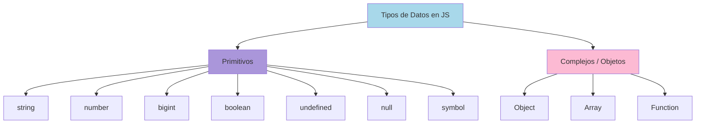

# 1.3 Tipos de Datos

> 📚 Aprende qué tipos de información puede manejar JavaScript: números, textos, listas, objetos, etc.

---

## ¿Qué es un "tipo de dato"?

Es la **categoría** del valor que guardas. Como en una tienda: hay productos sólidos (latas), líquidos (botellas), perecederos (frutas). Cada tipo se trata distinto.

JavaScript divide los datos en dos grandes grupos:

1. **Primitivos**: datos simples e indivisibles.
2. **Complejos**: datos que agrupan información.

---

## Tipos Primitivos

Son **valores simples**: un número, un texto, un sí/no… Se copian directamente cuando los asignas.

### 1. `string` (texto)

Cualquier texto, entre comillas simples `'`, dobles `"` o backticks `` ` ``.

```javascript
let nombre = "Ana";
let saludo = "Hola";
let mensaje = `Bienvenido`; // backticks (template literal)
```

### 2. `number` (número)

Cualquier número: entero o decimal, positivo o negativo.

```javascript
let edad = 40;
let precio = 19.99;
let temperatura = -5;
```

### 3. `bigint` (número muy grande)

Para números **enormes** que `number` no puede manejar bien. Se escribe con una `n` al final.

```javascript
let numeroEnorme = 9007199254740993n;
```

### 4. `boolean` (verdadero o falso)

Solo dos valores posibles: `true` o `false`. Como un interruptor.

```javascript
let mayorDeEdad = true;
let estaLloviendo = false;
```

### 5. `undefined` (no definido)

Es el valor por defecto cuando una variable existe pero **no se le ha dado valor**.

```javascript
let algo;
console.log(algo); // undefined
```

### 6. `null` (nada / vacío intencional)

Significa **"vacío a propósito"**. Tú dices: "aquí no hay nada".

```javascript
let respuesta = null; // Intencionalmente vacío
```

> ⚠️ **Observación:** `undefined` = JavaScript no le dio valor; `null` = tú le pusiste vacío.

### 7. `symbol` (identificador único)

Un valor único e irrepetible. Útil para casos avanzados, no te preocupes mucho ahora.

```javascript
let id = Symbol("id");
```

---

## Tipos Complejos (Objetos)

Son **estructuras** que agrupan varios datos. Cuando los asignas, se copia la **referencia**, no el contenido (lo veremos en 1.8).

### 1. `Object` (objeto)

Una colección de pares **clave: valor**. Como una ficha con varios datos.

```javascript
let persona = {
  nombre: "Carlos",
  edad: 40,
  ciudad: "Bogotá",
};

console.log(persona.nombre); // "Carlos"
```

### 2. `Array` (arreglo / lista)

Una **lista ordenada** de valores. Cada uno tiene una posición (índice) empezando en **0**.

```javascript
let frutas = ["manzana", "pera", "uva"];
console.log(frutas[0]); // "manzana"
console.log(frutas[2]); // "uva"
```

### 3. `Function` (función)

Un **bloque de instrucciones** que podemos ejecutar varias veces. Sí, las funciones también son un tipo de dato.

```javascript
function saludar() {
  console.log("¡Hola!");
}
saludar(); // ¡Hola!
```

---

## Conversión de Tipos

### Type Coercion (Conversión automática)

JavaScript a veces **convierte tipos por su cuenta**, lo cual puede ser confuso.

```javascript
console.log("5" + 3); // "53" → convierte 3 a texto
console.log("5" - 3); // 2 → convierte "5" a número
console.log(true + 1); // 2 → true vale 1
```

### Conversión explícita

**Tú** decides convertir, lo cual es más claro y seguro.

```javascript
Number("42"); // 42 (número)
String(42); // "42" (texto)
Boolean(1); // true
Boolean(0); // false
parseInt("3.7"); // 3 (entero)
parseFloat("3.7"); // 3.7 (decimal)
```

### Truthy y Falsy

Cuando JavaScript evalúa un valor en un `if`, lo convierte a `true` o `false`.

**Valores falsy (se evalúan como `false`):**

- `false`
- `0`
- `""` (texto vacío)
- `null`
- `undefined`
- `NaN` (Not a Number)

**Todo lo demás es truthy** (se evalúa como `true`).

```javascript
if ("") {
  console.log("Sí");
} else {
  console.log("No");
}
// "No" → el texto vacío es falsy

if ("hola") {
  console.log("Sí");
}
// "Sí" → cualquier texto con contenido es truthy
```

---

## Operadores de Tipos

### `typeof`

Te dice **qué tipo es** un valor.

```javascript
typeof "hola"; // "string"
typeof 42; // "number"
typeof true; // "boolean"
typeof undefined; // "undefined"
typeof null; // "object" ⚠️ (curiosidad histórica de JS)
typeof {}; // "object"
typeof []; // "object"
typeof function () {}; // "function"
```

> ⚠️ **Observación:** `typeof null` da `"object"`. Es un error histórico de JavaScript que nunca se corrigió.

### `instanceof`

Te dice si un objeto es una **instancia** de cierta clase. Más usado con objetos complejos.

```javascript
let fecha = new Date();
console.log(fecha instanceof Date); // true

let arr = [1, 2, 3];
console.log(arr instanceof Array); // true
```

---

## 📊 Gráfico: Tipos de datos en JavaScript



---

## 📝 Notas importantes

> 💡 **Nota:** JavaScript es un lenguaje **dinámicamente tipado**: una misma variable puede cambiar de tipo.
>
> ```javascript
> let x = 5; // number
> x = "hola"; // ahora string ✅
> ```

> ⚠️ **Observación:** Evita confiar en la conversión automática. Cuando sea posible, **convierte tú mismo** los tipos.

> 🎯 **Truco:** Para saber si algo es un array, usa `Array.isArray(valor)` en lugar de `typeof`.

---

## ✅ Resumen

- Tipos **primitivos**: `string`, `number`, `bigint`, `boolean`, `undefined`, `null`, `symbol`.
- Tipos **complejos**: `Object`, `Array`, `Function`.
- **`null`** = vacío a propósito; **`undefined`** = sin asignar.
- JavaScript **convierte tipos automáticamente** (type coercion), pero es mejor hacerlo explícitamente.
- Hay **6 valores falsy**: `false`, `0`, `""`, `null`, `undefined`, `NaN`.
- Usa **`typeof`** para conocer el tipo de un valor.
