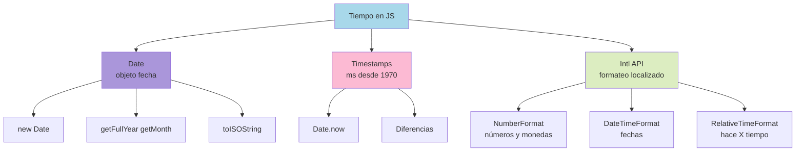

# 1.11 Fechas e Internacionalización

> 📚 Aprende a trabajar con **fechas** en JavaScript y a **formatear datos** (números, fechas, monedas) según el idioma y país del usuario.

---

## Dates (Fechas)

JavaScript tiene un objeto especial para manejar fechas: `Date`.

### Crear una fecha con `new Date()`

```javascript
// Fecha y hora actual
const ahora = new Date();
console.log(ahora);
// 2026-05-21T15:30:00.000Z (algo así)

// Fecha específica (mes empieza en 0, ¡cuidado!)
const cumple = new Date(1985, 4, 21); // 21 de MAYO de 1985 (mes 4 = mayo)
console.log(cumple);

// Desde un string
const navidad = new Date("2026-12-25");

// Desde un timestamp (milisegundos desde 1970)
const fecha = new Date(0); // 1 de enero de 1970
```

> ⚠️ **MUY importante:** En `new Date(año, mes, día)`, **los meses empiezan en 0**:
>
> - 0 = Enero
> - 1 = Febrero
> - 11 = Diciembre

### Obtener partes de una fecha

```javascript
const fecha = new Date(); // ahora

fecha.getFullYear(); // 2026 → año
fecha.getMonth(); // 4 → mes (0-11) ⚠️
fecha.getDate(); // 21 → día del mes
fecha.getDay(); // 4 → día de la semana (0=domingo, 6=sábado)
fecha.getHours(); // 15 → hora
fecha.getMinutes(); // 30 → minutos
fecha.getSeconds(); // 45 → segundos
fecha.getTime(); // 1716304245000 → timestamp
```

### Modificar una fecha

```javascript
const f = new Date();
f.setFullYear(2030);
f.setMonth(0); // enero
f.setDate(15);
console.log(f); // 15 de enero de 2030
```

---

## Timestamps (Marcas de tiempo)

Un **timestamp** es la cantidad de **milisegundos** transcurridos desde el **1 de enero de 1970** (la "época Unix"). Es la forma estándar de medir el tiempo en programación.

```javascript
Date.now(); // 1716304245000 (timestamp del momento actual)

const fecha = new Date(1716304245000);
console.log(fecha); // Convierte ese número en fecha

// Diferencia entre fechas (cuánto tiempo pasó)
const inicio = Date.now();
// ... hacer algo ...
const fin = Date.now();
const tiempoMs = fin - inicio;
console.log(`Tomó ${tiempoMs} milisegundos`);
```

---

## Parseo de Fechas

Convertir un **texto** en un objeto Date.

```javascript
const f1 = new Date("2026-05-21"); // ✅ Formato ISO (recomendado)
const f2 = new Date("2026-05-21T15:30:00"); // ✅ Con hora
const f3 = new Date("May 21, 2026"); // ✅ También funciona
const f4 = new Date("21/05/2026"); // ⚠️ Puede dar problemas (depende del navegador)
```

> 💡 **Recomendación:** Usa siempre el formato **ISO 8601** (`YYYY-MM-DD`) para evitar ambigüedades.

---

## Timezones (Zonas horarias)

Las fechas en JavaScript se guardan internamente en **UTC** (tiempo universal), pero se muestran según la **zona horaria del usuario**.

```javascript
const f = new Date();
f.toString(); // Fecha en zona horaria local
f.toISOString(); // Fecha en UTC (formato estándar)
f.toUTCString(); // Fecha en UTC, texto legible
f.getTimezoneOffset(); // Diferencia en minutos con UTC
```

Ejemplo:

```javascript
const f = new Date("2026-05-21T12:00:00Z"); // 12:00 UTC

console.log(f.toISOString());
// "2026-05-21T12:00:00.000Z" (siempre UTC)

console.log(f.toString());
// "Thu May 21 2026 07:00:00 GMT-0500 ..." (en Bogotá/Lima, -5 horas)
```

> ⚠️ **Observación:** Trabajar con zonas horarias es uno de los temas más complicados. Para apps reales, considera librerías como **date-fns**, **dayjs** o **Luxon**.

---

## Intl API (Internacionalización)

`Intl` es una API integrada para **formatear datos según el idioma y país** del usuario. Sin librerías externas.

### `Intl.NumberFormat` — formatear números y monedas

```javascript
const numero = 1234567.89;

// Formato según el país
new Intl.NumberFormat("es-CO").format(numero);
// "1.234.567,89" (Colombia)

new Intl.NumberFormat("en-US").format(numero);
// "1,234,567.89" (EE.UU.)

new Intl.NumberFormat("de-DE").format(numero);
// "1.234.567,89" (Alemania)
```

#### Como moneda

```javascript
new Intl.NumberFormat("es-CO", {
  style: "currency",
  currency: "COP",
}).format(1500000);
// "$ 1.500.000,00"

new Intl.NumberFormat("en-US", {
  style: "currency",
  currency: "USD",
}).format(1500);
// "$1,500.00"

new Intl.NumberFormat("ja-JP", {
  style: "currency",
  currency: "JPY",
}).format(1500);
// "￥1,500"
```

#### Como porcentaje

```javascript
new Intl.NumberFormat("es-CO", { style: "percent" }).format(0.25);
// "25 %"
```

### `Intl.DateTimeFormat` — formatear fechas

```javascript
const f = new Date("2026-05-21");

new Intl.DateTimeFormat("es-CO").format(f);
// "21/05/2026"

new Intl.DateTimeFormat("en-US").format(f);
// "5/21/2026"

new Intl.DateTimeFormat("es-CO", {
  dateStyle: "full",
}).format(f);
// "jueves, 21 de mayo de 2026"

new Intl.DateTimeFormat("es-CO", {
  dateStyle: "long",
  timeStyle: "short",
}).format(new Date());
// "21 de mayo de 2026, 15:30"
```

#### Opciones detalladas

```javascript
new Intl.DateTimeFormat("es-CO", {
  year: "numeric",
  month: "long",
  day: "numeric",
  weekday: "long",
  hour: "2-digit",
  minute: "2-digit",
}).format(new Date());
// "jueves, 21 de mayo de 2026, 15:30"
```

### `Intl.RelativeTimeFormat` — fechas relativas

Para mostrar cosas como "hace 3 días", "en 2 semanas".

```javascript
const rtf = new Intl.RelativeTimeFormat("es", { numeric: "auto" });

rtf.format(-1, "day"); // "ayer"
rtf.format(0, "day"); // "hoy"
rtf.format(1, "day"); // "mañana"
rtf.format(-3, "day"); // "hace 3 días"
rtf.format(2, "month"); // "dentro de 2 meses"
rtf.format(-1, "year"); // "el año pasado"
```

---

## 📊 Gráfico: Date e Intl



---

## 📝 Notas importantes

> 💡 **Nota:** Los meses en `Date` empiezan en **0** (enero = 0, diciembre = 11). Es el error más común.

> ⚠️ **Observación:** Si tu app va a usarse en distintos países, usa `Intl` para formatear números, monedas y fechas. **Nunca asumas un formato fijo**.

> 🎯 **Recomendación:** Para apps reales con muchas operaciones de fechas (sumar días, comparar, zonas horarias complejas), usa **date-fns** o **dayjs**. El `Date` nativo es limitado.

---

## ✅ Resumen

- **`Date`** es el objeto para manejar fechas. Ojo: los meses empiezan en **0**.
- **Timestamps** = milisegundos desde 1970, obtenidos con `Date.now()`.
- Usa el formato **ISO 8601** (`YYYY-MM-DD`) al parsear fechas para evitar ambigüedades.
- Las fechas internamente están en **UTC**; se muestran en la zona del usuario.
- La **API `Intl`** formatea según idioma/país:
  - `Intl.NumberFormat` → números y monedas.
  - `Intl.DateTimeFormat` → fechas y horas.
  - `Intl.RelativeTimeFormat` → tiempos relativos ("hace 3 días").
