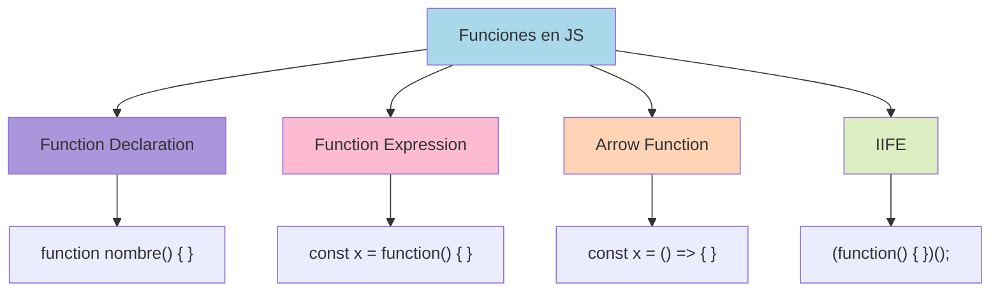
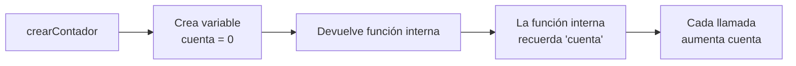

# 1.6 Funciones

> 📚 Una **función** es como una **receta** o un **bloque de instrucciones** que guardas para usar muchas veces, en lugar de repetir el mismo código.

---

## ¿Qué es una función?

Imagina que cada mañana preparas café siguiendo los mismos pasos. Sería más práctico tener una "receta" que digas: "ejecuta receta de café". Eso es una función.

```javascript
function prepararCafe() {
  console.log("1. Calentar agua");
  console.log("2. Servir café");
  console.log("3. Endulzar");
}

prepararCafe(); // Ejecuta la receta
prepararCafe(); // Puedes ejecutarla tantas veces como quieras
```

---

## Tipos de Funciones

### 1. Function Declaration (declaración clásica)

Se declara con la palabra `function` y se le puede dar un nombre.

```javascript
function sumar(a, b) {
  return a + b;
}

sumar(3, 4); // 7
```

> 💡 **Característica:** Se pueden usar **antes** de declararlas (hoisting).

### 2. Function Expression (expresión de función)

Se guarda una función dentro de una variable.

```javascript
const restar = function (a, b) {
  return a - b;
};

restar(10, 3); // 7
```

> ⚠️ A diferencia de las declaraciones, **no se pueden usar antes** de definirlas.

### 3. Arrow Functions (funciones flecha) ✨

Sintaxis moderna, más corta. Se escriben con `=>`.

```javascript
const multiplicar = (a, b) => {
  return a * b;
};

multiplicar(2, 5); // 10
```

**Versiones más cortas:**

```javascript
// Si solo hay una expresión, se puede omitir return y llaves
const multiplicar = (a, b) => a * b;

// Si solo hay un parámetro, se pueden quitar los paréntesis
const cuadrado = (n) => n * n;

// Sin parámetros, mantienes los paréntesis vacíos
const saludar = () => "Hola";
```

### 4. IIFE (Immediately Invoked Function Expression)

Una función que **se ejecuta sola** al definirla. Su nombre suena complejo pero la idea es simple.

```javascript
(function () {
  console.log("Esto se ejecuta de inmediato");
})();

// Versión con arrow function
(() => {
  console.log("También se ejecuta de inmediato");
})();
```

> 💡 **Útil para:** crear un "espacio aislado" donde las variables no contaminen el resto del código.

---

## Parámetros

Los **parámetros** son los **valores que recibe** la función para trabajar con ellos.

### Parámetros por defecto

Si no le pasas un valor, usa uno predeterminado.

```javascript
function saludar(nombre = "Invitado") {
  console.log("Hola " + nombre);
}

saludar(); // Hola Invitado
saludar("Carlos"); // Hola Carlos
```

### Rest Parameters (`...`)

**Recoge** varios argumentos en un array. Útil cuando no sabes cuántos vas a recibir.

```javascript
function sumarTodos(...numeros) {
  let total = 0;
  for (const n of numeros) {
    total += n;
  }
  return total;
}

sumarTodos(1, 2, 3); // 6
sumarTodos(1, 2, 3, 4, 5); // 15
```

### Spread en funciones

Lo contrario: **despliega** los valores de un array como argumentos sueltos.

```javascript
const numeros = [1, 2, 3];

function sumar(a, b, c) {
  return a + b + c;
}

sumar(...numeros); // Equivale a sumar(1, 2, 3) → 6
```

---

## Conceptos Avanzados

### Closures (Clausuras)

Es cuando una función **"recuerda"** las variables del lugar donde fue creada, incluso después de que ese lugar termine.

Imagínalo como un **termo**: la función guarda el calor (variables) y se lo lleva consigo.

```javascript
function crearContador() {
  let cuenta = 0;
  return function () {
    cuenta++;
    return cuenta;
  };
}

const contador = crearContador();
console.log(contador()); // 1
console.log(contador()); // 2
console.log(contador()); // 3
```

La función interna **recuerda** `cuenta` aunque `crearContador` ya terminó.

### Lexical Scope (recordatorio)

Como vimos en 1.2: una función **ve las variables del lugar donde fue escrita**.

```javascript
const saludo = "Hola";

function saludar() {
  console.log(saludo); // ✅ Ve "saludo" porque fue escrita junto a ella
}

saludar();
```

### Higher-Order Functions (funciones de orden superior)

Son funciones que **reciben otras funciones como parámetro** o **devuelven funciones**.

```javascript
// Recibe una función como parámetro
function ejecutar(funcion) {
  funcion();
}

ejecutar(() => console.log("¡Hola!"));

// Devuelve una función
function crearSaludo(saludo) {
  return function (nombre) {
    console.log(saludo + ", " + nombre);
  };
}

const saludarFormal = crearSaludo("Buenos días");
saludarFormal("Ana"); // "Buenos días, Ana"
```

### Callbacks

Una función que se **pasa como argumento** para que otra la ejecute después. Es un patrón muy común.

```javascript
function procesar(dato, callback) {
  console.log("Procesando " + dato);
  callback(); // ejecuta la función recibida
}

procesar("archivo.txt", () => {
  console.log("Terminó el procesamiento");
});
```

> 💡 Métodos como `setTimeout`, `forEach`, `map` (que veremos en arrays) reciben callbacks.

---

## 📊 Gráfico: Tipos de Funciones



## 📊 Gráfico: Cómo funciona una Closure



---

## 📝 Notas importantes

> 💡 **Nota:** Las **arrow functions** tienen un comportamiento especial con `this`, pero por ahora basta saber que son una forma corta de escribir funciones.

> ⚠️ **Observación:** Si una función no tiene `return`, devuelve `undefined` automáticamente.

> 🎯 **Recomendación:** Usa **arrow functions** para funciones cortas y como callbacks, y **function declaration** para funciones grandes y reutilizables.

---

## ✅ Resumen

- Una **función** es un bloque de código reutilizable.
- Tipos: **declaration**, **expression**, **arrow**, **IIFE**.
- **Parámetros por defecto** dan un valor si no se pasa ninguno.
- **Rest (`...args`)** recoge muchos argumentos; **spread (`...arr`)** los despliega.
- **Closures**: las funciones "recuerdan" las variables de su entorno.
- **Higher-order functions**: aceptan o devuelven otras funciones.
- **Callbacks**: funciones pasadas como argumento.
