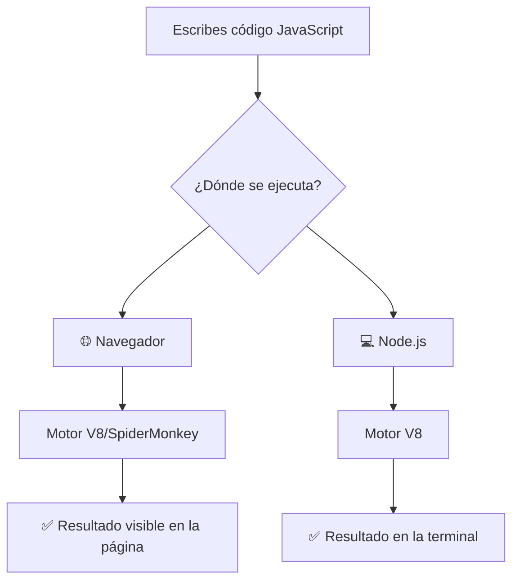

## Cómo ejecutar JavaScript

### DevTools (Herramientas de desarrollador)

Cada navegador trae un panel de desarrollador. Para abrirlo, presiona **F12** o clic derecho → _"Inspeccionar"_.

### Console (Consola)

Dentro de las DevTools, la pestaña **Console** te deja escribir y ejecutar JavaScript al instante.

```javascript
// Ejemplo: escribe esto en la consola del navegador
console.log("¡Hola mundo!");
// Salida: ¡Hola mundo!

2 + 2;
// Salida: 4
```

### Node.js

Si tienes Node.js instalado, puedes crear un archivo `hola.js` y ejecutarlo en la terminal:

```bash
node hola.js
```

### CodePen / JSFiddle

Son **sitios web gratuitos** donde puedes escribir HTML, CSS y JavaScript y ver el resultado al instante, sin instalar nada. Ideales para practicar.

---

## 📊 Gráfico: ¿Cómo se ejecuta JavaScript?



---

## 📝 Notas importantes

> 💡 **Nota:** JavaScript es un lenguaje **interpretado**, lo que significa que no necesita "compilarse" antes de usarse. El motor lo lee línea por línea.

> ⚠️ **Observación:** JavaScript es **sensible a mayúsculas y minúsculas**. `miVariable` y `mivariable` son distintos.

> 🎯 **Recomendación:** Para empezar a practicar, abre Chrome → F12 → pestaña Console. Es la forma más rápida.
