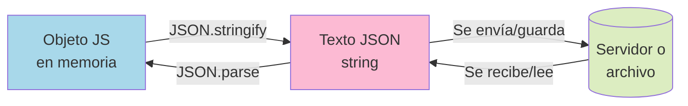

# 1.10 JSON

> 📚 **JSON** es una forma estándar de **escribir datos como texto** para que cualquier programa pueda leerlos. Es como un "idioma universal" para intercambiar información.

---

## ¿Qué es JSON?

**JSON** significa **JavaScript Object Notation** (Notación de Objetos de JavaScript). Es un **formato de texto** que se parece mucho a un objeto de JavaScript, pero es **un texto**, no un objeto.

Se usa muchísimo para:

- 📡 Enviar y recibir datos entre el navegador y un servidor.
- 💾 Guardar configuraciones o datos en archivos.
- 🔄 Compartir información entre lenguajes (Python, Java, etc. también lo leen).

### Ejemplo de JSON

```json
{
  "nombre": "Ana",
  "edad": 40,
  "esActivo": true,
  "hobbies": ["leer", "viajar"],
  "direccion": {
    "ciudad": "Lima",
    "pais": "Perú"
  }
}
```

### Diferencias con un Objeto de JavaScript

| JSON                                                        | Objeto JS                                   |
| ----------------------------------------------------------- | ------------------------------------------- |
| Las claves van **siempre entre comillas dobles** `"nombre"` | Las claves pueden ir sin comillas: `nombre` |
| Solo se permiten **comillas dobles**                        | Permite simples, dobles o backticks         |
| **No permite** funciones, `undefined`, comentarios          | Sí permite                                  |
| Es **texto** (string)                                       | Es una **estructura en memoria**            |

```javascript
// Objeto JS (no es JSON):
const obj = { nombre: "Ana", edad: 40 };

// JSON (es un string):
const json = '{"nombre":"Ana","edad":40}';
```

---

## `JSON.stringify()` — de Objeto a Texto

Convierte un objeto/array de JavaScript en un **string JSON**.

```javascript
const persona = {
  nombre: "Ana",
  edad: 40,
  hobbies: ["leer", "viajar"],
};

const texto = JSON.stringify(persona);
console.log(texto);
// '{"nombre":"Ana","edad":40,"hobbies":["leer","viajar"]}'

console.log(typeof texto); // "string"
```

### Con formato bonito (indentado)

```javascript
JSON.stringify(persona, null, 2);
// {
//   "nombre": "Ana",
//   "edad": 40,
//   "hobbies": ["leer", "viajar"]
// }
```

> El `2` es el número de espacios de indentación.

### Filtrando propiedades

```javascript
JSON.stringify(persona, ["nombre", "edad"]);
// '{"nombre":"Ana","edad":40}' (sin hobbies)
```

---

## `JSON.parse()` — de Texto a Objeto

Convierte un **string JSON** en un objeto/array de JavaScript real.

```javascript
const texto = '{"nombre":"Ana","edad":40}';

const persona = JSON.parse(texto);

console.log(persona.nombre); // "Ana"
console.log(persona.edad); // 40
console.log(typeof persona); // "object"
```

> ⚠️ Si el JSON está mal formado, `JSON.parse` lanza un **error**. Conviene envolverlo en un `try/catch`:

```javascript
try {
  const datos = JSON.parse(textoSospechoso);
} catch (error) {
  console.log("JSON inválido");
}
```

---

## Serialización

**Serializar** = convertir datos de la memoria en un formato que se puede guardar o enviar (texto, binario, etc.).
**Deserializar** = el proceso contrario.

```
Objeto en memoria  →→ JSON.stringify ──→ Texto JSON (se puede guardar/enviar)
Objeto en memoria  ←←  JSON.parse    ←── Texto JSON
```

### Ejemplo práctico: guardar en localStorage

```javascript
const usuario = { nombre: "Ana", edad: 40 };

// Guardar (necesita ser string):
localStorage.setItem("usuario", JSON.stringify(usuario));

// Recuperar (parsear el texto):
const recuperado = JSON.parse(localStorage.getItem("usuario"));
console.log(recuperado.nombre); // "Ana"
```

---

## Limitaciones del JSON

JSON **no soporta** todo lo que JavaScript sí. Cuando usas `JSON.stringify`, ciertos valores se **pierden o transforman**:

### ❌ Funciones

```javascript
const obj = { saludar: () => "Hola" };
JSON.stringify(obj); // "{}" → la función desaparece
```

### ❌ `undefined`

```javascript
const obj = { a: 1, b: undefined };
JSON.stringify(obj); // '{"a":1}' → b desaparece
```

### ❌ Comentarios

JSON **no permite comentarios** como `// esto` o `/* esto */`. Es texto plano.

### ⚠️ Fechas (`Date`)

Se convierten en texto, pero `JSON.parse` no las vuelve a convertir en Date.

```javascript
const obj = { fecha: new Date() };
const texto = JSON.stringify(obj);
// '{"fecha":"2024-01-15T10:00:00.000Z"}'

const parseado = JSON.parse(texto);
console.log(typeof parseado.fecha); // "string" ⚠️ no Date
```

### ❌ Referencias circulares

Si un objeto se referencia a sí mismo, `JSON.stringify` lanza error.

```javascript
const a = {};
a.self = a;
JSON.stringify(a); // ❌ Error: cyclic object
```

### ❌ `Symbol`, `BigInt`, `Map`, `Set`

Tampoco se serializan correctamente.

```javascript
JSON.stringify({ id: 10n }); // ❌ Error: BigInt
JSON.stringify({ s: Symbol("x") }); // '{}' → desaparece
```

---

## 📊 Gráfico: Flujo de JSON



---

## 📝 Notas importantes

> 💡 **Nota:** En JSON, las claves van **siempre con comillas dobles**. Esto es JSON válido: `{"a":1}`. Esto **NO** lo es: `{a:1}`.

> ⚠️ **Observación:** `JSON.parse` lanza error si el texto está mal formado. Envuélvelo en `try/catch` cuando trabajes con datos que vienen de fuera (red, archivos, formularios).

> 🎯 **Recomendación:** Para hacer una **copia profunda rápida** de objetos simples (sin funciones ni fechas), puedes usar:
>
> ```javascript
> const copia = JSON.parse(JSON.stringify(original));
> ```
>
> Aunque hoy en día es mejor usar `structuredClone()` (visto en 1.8).

---

## ✅ Resumen

- **JSON** es un formato de texto para representar datos.
- **`JSON.stringify(obj)`** → convierte objeto → texto.
- **`JSON.parse(texto)`** → convierte texto → objeto.
- Las claves en JSON van **siempre entre comillas dobles**.
- JSON **no soporta** funciones, `undefined`, comentarios, fechas (las convierte a texto), `BigInt`, `Symbol`, `Map`, `Set`, ni referencias circulares.
- Es el formato estándar para **comunicación entre sistemas** (web, APIs, almacenamiento).
