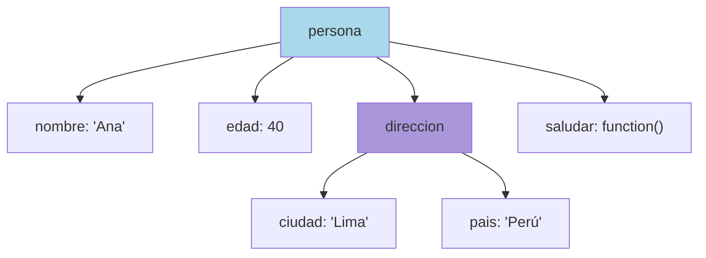

# 1.8 Objetos

> 📚 Un **objeto** es una **colección de datos relacionados**, organizados en pares **clave: valor**. Como una ficha personal.

---

## ¿Qué es un Objeto?

Piensa en una **ficha de identidad**:

```
Nombre:   Ana
Edad:     40
Ciudad:   Lima
```

En JavaScript se ve así:

```javascript
const persona = {
  nombre: "Ana",
  edad: 40,
  ciudad: "Lima",
};
```

Cada línea es una **propiedad**: `clave: valor`.

---

## Creación de Objetos

### 1. Object Literal (la forma más común)

```javascript
const auto = {
  marca: "Toyota",
  año: 2024,
  color: "rojo",
};
```

### 2. Con `new Object()`

```javascript
const auto = new Object();
auto.marca = "Toyota";
auto.año = 2024;
```

> ⚠️ Rara vez se usa. Mejor el literal.

### 3. Con `Object.create()`

Crea un objeto que **hereda** de otro objeto (concepto avanzado).

```javascript
const animal = { tipo: "mamífero" };
const perro = Object.create(animal);
console.log(perro.tipo); // "mamífero" (lo heredó)
```

---

## Propiedades y Métodos

### Dot Notation (notación con punto)

La forma normal de acceder o asignar.

```javascript
const persona = { nombre: "Ana" };
console.log(persona.nombre); // "Ana"
persona.edad = 40; // Añade nueva propiedad
```

### Bracket Notation (notación con corchetes)

Útil cuando la clave **tiene espacios**, **caracteres raros** o **está en una variable**.

```javascript
const persona = { "nombre completo": "Ana Pérez" };
console.log(persona["nombre completo"]); // "Ana Pérez"

const clave = "edad";
persona[clave] = 40; // Equivale a persona.edad = 40
```

### Métodos (funciones dentro de un objeto)

Un **método** es simplemente una función que está dentro de un objeto.

```javascript
const persona = {
  nombre: "Ana",
  saludar: function () {
    console.log("Hola, soy " + this.nombre);
  },
  // Forma corta moderna:
  despedirse() {
    console.log("Adiós");
  },
};

persona.saludar(); // "Hola, soy Ana"
persona.despedirse(); // "Adiós"
```

> 💡 **`this`** dentro de un método se refiere al **objeto mismo**.

---

## Métodos de `Object` (helpers globales)

### `Object.keys()` — lista de **claves**

```javascript
const persona = { nombre: "Ana", edad: 40 };
Object.keys(persona); // ["nombre", "edad"]
```

### `Object.values()` — lista de **valores**

```javascript
Object.values(persona); // ["Ana", 40]
```

### `Object.entries()` — lista de **pares [clave, valor]**

```javascript
Object.entries(persona);
// [["nombre", "Ana"], ["edad", 40]]
```

### `Object.assign()` — copiar/combinar objetos

```javascript
const a = { x: 1 };
const b = { y: 2 };
const combinado = Object.assign({}, a, b);
// { x: 1, y: 2 }
```

> 💡 Hoy en día es más común usar el spread: `const combinado = { ...a, ...b };`

### `Object.freeze()` — **congela** un objeto (no se puede modificar)

```javascript
const persona = Object.freeze({ nombre: "Ana" });
persona.nombre = "Luis"; // No cambia
console.log(persona.nombre); // "Ana"
```

### `Object.seal()` — **sella**: no se pueden añadir ni borrar propiedades, pero sí modificar las existentes

```javascript
const persona = Object.seal({ nombre: "Ana" });
persona.nombre = "Luis"; // ✅ Cambia
persona.edad = 40; // ❌ No se añade
```

### `Object.hasOwn()` — comprueba si una propiedad **existe** en el objeto

```javascript
const persona = { nombre: "Ana" };
Object.hasOwn(persona, "nombre"); // true
Object.hasOwn(persona, "edad"); // false
```

---

## Copias y Referencias ⚠️ (concepto MUY importante)

Los objetos **no se copian** al asignarlos. Se copia la **referencia** (la "dirección").

```javascript
const a = { valor: 1 };
const b = a; // b apunta al MISMO objeto que a
b.valor = 99;
console.log(a.valor); // 99 ⚠️ ¡también cambió!
```

Es como tener **dos llaves de la misma casa**: si uno entra y mueve algo, el otro lo verá.

### Shallow Copy (copia superficial)

Copia el primer nivel, pero los objetos anidados siguen compartidos.

```javascript
const original = { nombre: "Ana", direccion: { ciudad: "Lima" } };
const copia = { ...original }; // o Object.assign({}, original)

copia.nombre = "Luis"; // ✅ no afecta a original
copia.direccion.ciudad = "Madrid"; // ⚠️ ¡también cambia original!
```

### Deep Copy (copia profunda)

Copia **todo el contenido**, incluso los anidados.

#### Método antiguo (con limitaciones):

```javascript
const copia = JSON.parse(JSON.stringify(original));
```

> ⚠️ No funciona con funciones, fechas, `undefined`, etc.

#### `structuredClone()` ✨ (moderno y recomendado)

```javascript
const copia = structuredClone(original);
copia.direccion.ciudad = "Madrid"; // ✅ original NO cambia
```

---

## Destructuring (Desestructuración)

Forma rápida de **sacar valores** de un objeto o array y meterlos en variables.

### En Objetos

```javascript
const persona = { nombre: "Ana", edad: 40, ciudad: "Lima" };

// Forma tradicional:
const nombre = persona.nombre;
const edad = persona.edad;

// Con destructuring:
const { nombre, edad } = persona;
console.log(nombre); // "Ana"
console.log(edad); // 40

// Con renombrado:
const { nombre: nombreUsuario } = persona;
console.log(nombreUsuario); // "Ana"

// Con valor por defecto:
const { pais = "Perú" } = persona;
console.log(pais); // "Perú" (porque persona no tiene "pais")
```

### En Arrays

```javascript
const colores = ["rojo", "verde", "azul"];

const [primero, segundo, tercero] = colores;
console.log(primero); // "rojo"

// Saltar elementos:
const [, , ultimo] = colores;
console.log(ultimo); // "azul"

// Con rest:
const [primer, ...resto] = colores;
console.log(resto); // ["verde", "azul"]
```

---

## 📊 Gráfico: Estructura de un Objeto



## 📊 Gráfico: Referencias vs Copias

```mermaid
flowchart LR
    A["const a = {x:1}"] --> M[(Memoria<br/>{x:1})]
    B["const b = a"] --> M
    C["const c = structuredClone(a)"] --> N[(Memoria<br/>{x:1})]

    style M fill:#fcbad3
    style N fill:#dcedc1
```

> `a` y `b` apuntan a la misma memoria. `c` tiene su propia copia.

---

## 📝 Notas importantes

> 💡 **Nota:** Casi **todo en JavaScript es un objeto**: arrays, funciones, fechas… son objetos por dentro.

> ⚠️ **Observación crítica:** Los objetos se pasan por **referencia**. Si vas a modificar uno sin afectar al original, **haz una copia** (preferiblemente con `structuredClone`).

> 🎯 **Recomendación:** Usa **destructuring** siempre que puedas. Hace el código más corto y claro.

---

## ✅ Resumen

- Un **objeto** es una colección de pares `clave: valor`.
- Accedes con **dot** (`obj.x`) o **bracket** (`obj["x"]`).
- Los **métodos** son funciones dentro de objetos; `this` es el objeto mismo.
- **`Object.keys/values/entries`** te dan acceso a claves, valores o ambos.
- Los objetos se pasan por **referencia**: para copiarlos usa **spread** (superficial) o **`structuredClone`** (profundo).
- **Destructuring** simplifica la extracción de valores.
