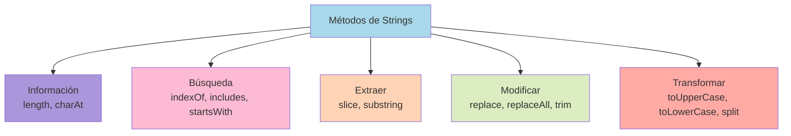

# 1.9 Strings

> 📚 Un **string** es simplemente **texto**: una cadena de caracteres. JavaScript tiene muchas herramientas para manipular textos.

---

## ¿Qué es un String?

Un texto encerrado entre comillas. Hay tres tipos:

```javascript
let simples = "Hola";
let dobles = "Hola";
let backticks = `Hola`; // template literal
```

Los tres funcionan igual, pero los **backticks** tienen poderes extra (los veremos abajo).

---

## Métodos de Strings

### `length` — longitud del texto

```javascript
"Hola mundo".length; // 10
```

> Cuenta espacios y todos los caracteres.

### `charAt(posición)` — devuelve el caracter en esa posición

```javascript
"Hola".charAt(0); // "H"
"Hola".charAt(3); // "a"
```

> 💡 También puedes usar corchetes: `"Hola"[0]` → `"H"`.

### `indexOf(texto)` — posición donde aparece (o -1 si no está)

```javascript
"Hola mundo".indexOf("mundo"); // 5
"Hola mundo".indexOf("zapato"); // -1
```

### `includes(texto)` — ¿contiene ese texto? (true/false)

```javascript
"Hola mundo".includes("mundo"); // true
"Hola mundo".includes("Zapato"); // false
```

### `slice(inicio, fin)` — recorta una parte

```javascript
"JavaScript".slice(0, 4); // "Java"
"JavaScript".slice(4); // "Script"
"JavaScript".slice(-6); // "Script" (negativos cuentan desde el final)
```

### `substring(inicio, fin)` — parecido a slice

```javascript
"JavaScript".substring(4, 10); // "Script"
```

> ⚠️ A diferencia de `slice`, **no acepta números negativos**. Casi siempre se usa `slice`.

### `replace(buscar, reemplazo)` — reemplaza la **primera** aparición

```javascript
"Hola hola".replace("hola", "adiós"); // "Hola adiós"
// Solo cambia el primer "hola" que encuentra
```

### `replaceAll(buscar, reemplazo)` — reemplaza **todas** las apariciones

```javascript
"Hola hola hola".replaceAll("hola", "adiós");
// "Hola adiós adiós" (mantiene mayúsculas como están)
```

### `split(separador)` — divide en array por un separador

```javascript
"manzana,pera,uva".split(",");
// ["manzana", "pera", "uva"]

"Hola mundo".split(" ");
// ["Hola", "mundo"]

"abc".split("");
// ["a", "b", "c"]
```

### `trim()` — quita espacios al **inicio y final**

```javascript
"   hola   ".trim(); // "hola"
"   hola   ".trimStart(); // "hola   "
"   hola   ".trimEnd(); // "   hola"
```

### Otros métodos útiles

```javascript
"hola".toUpperCase(); // "HOLA"
"HOLA".toLowerCase(); // "hola"
"hola".repeat(3); // "holaholahola"
"hola".startsWith("ho"); // true
"hola".endsWith("la"); // true
"abc".concat("def"); // "abcdef" (mejor usar + o template literals)
"5".padStart(3, "0"); // "005"
"5".padEnd(3, "0"); // "500"
```

> ⚠️ **Importante:** Los strings son **inmutables**. Estos métodos no cambian el original, devuelven uno nuevo.
>
> ```javascript
> let saludo = "hola";
> saludo.toUpperCase(); // "HOLA"
> console.log(saludo); // "hola" (sigue igual)
> saludo = saludo.toUpperCase(); // ahora sí cambia
> ```

---

## Template Literals (backticks `` ` ``)

Es una forma moderna y poderosa de trabajar con strings. Se usan **backticks** (acento grave).

### Interpolación: insertar variables con `${}`

```javascript
const nombre = "Ana";
const edad = 40;

// Forma antigua:
const saludo1 = "Hola " + nombre + ", tienes " + edad + " años.";

// Con template literals (mucho más limpio):
const saludo2 = `Hola ${nombre}, tienes ${edad} años.`;

console.log(saludo2);
// "Hola Ana, tienes 40 años."
```

Dentro de `${ }` puedes meter **cualquier expresión**:

```javascript
const a = 5,
  b = 3;
console.log(`La suma es ${a + b}`); // "La suma es 8"
console.log(`Es mayor: ${a > b ? "sí" : "no"}`); // "Es mayor: sí"
```

### Multiline strings: textos de varias líneas

Con comillas normales, tendrías que usar `\n` para saltos de línea:

```javascript
// Antiguo:
const texto = "Línea 1\nLínea 2\nLínea 3";

// Con template literals:
const texto2 = `Línea 1
Línea 2
Línea 3`;
```

Muy útil para escribir HTML, mensajes largos, etc:

```javascript
const html = `
  <div>
    <h1>${titulo}</h1>
    <p>${descripcion}</p>
  </div>
`;
```

---

## 📊 Gráfico: Métodos de Strings por categoría



---

## Caracteres Especiales (escape)

Cuando usas comillas simples o dobles, necesitas "escapar" ciertos caracteres con `\`:

| Carácter | Significado                                              |
| -------- | -------------------------------------------------------- |
| `\n`     | Salto de línea                                           |
| `\t`     | Tabulación                                               |
| `\\`     | Una barra `\`                                            |
| `\"`     | Una comilla doble dentro de string con comillas dobles   |
| `\'`     | Una comilla simple dentro de string con comillas simples |

```javascript
console.log("Línea 1\nLínea 2");
// Línea 1
// Línea 2

console.log('Me dijo "hola"');
// Me dijo "hola"
```

---

## 📝 Notas importantes

> 💡 **Nota:** Los strings son **inmutables**: nunca cambian, los métodos devuelven nuevos strings.

> ⚠️ **Observación:** El método `replace()` cambia **solo la primera coincidencia**. Para cambiarlas todas, usa `replaceAll()` o una expresión regular con bandera `g`.

> 🎯 **Recomendación:** Usa **template literals** (`` ` ``) en lugar de concatenar con `+`. Es más legible y moderno.

---

## ✅ Resumen

- Un **string** es un texto. Se escribe con `'`, `"` o `` ` ``.
- Los strings son **inmutables**: los métodos devuelven nuevos strings.
- **Buscar:** `indexOf`, `includes`, `startsWith`, `endsWith`.
- **Extraer:** `slice`, `substring`, `charAt`.
- **Modificar:** `replace`, `replaceAll`, `trim`, `toUpperCase`, `toLowerCase`.
- **Dividir:** `split` (a array).
- **Template literals (`` ` ``):** permiten interpolación `${}` y textos multilínea.
