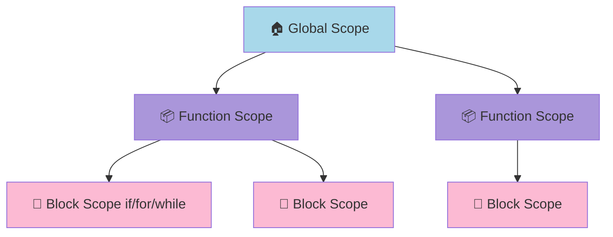

# 1.2 Variables y Scope

> 📚 Aprende a guardar información en JavaScript y entender en qué "zonas" del código puede usarse.

---

## ¿Qué es una variable?

Una **variable** es como una **caja con etiqueta** donde guardamos un dato para usarlo después. La etiqueta es el nombre, y el contenido es el valor.

```javascript
let edad = 40; // Caja "edad" con el número 40 dentro
let nombre = "Ana"; // Caja "nombre" con el texto "Ana" dentro
```

---

## Declaración de variables: `var`, `let`, `const`

JavaScript tiene **tres formas** de crear variables. La diferencia es importante.

### `var` (la forma antigua) ⚠️

```javascript
var ciudad = "Madrid";
ciudad = "Barcelona"; // Se puede cambiar
```

- Existe desde el inicio de JavaScript.
- Tiene comportamientos confusos (hoisting raro, scope amplio).
- **Hoy en día se recomienda evitarla.**

### `let` (variable que puede cambiar) ✅

```javascript
let edad = 40;
edad = 41; // ✅ Permitido, cambiamos el valor
```

- Forma moderna y recomendada cuando el valor **va a cambiar**.

### `const` (constante, no cambia) ✅

```javascript
const PI = 3.1416;
PI = 3.14; // ❌ Error: no se puede cambiar
```

- Para valores que **nunca van a cambiar**.
- Es la opción **más segura y recomendada por defecto**.

> 💡 **Regla práctica:** Usa siempre `const`. Solo cambia a `let` si necesitas reasignar el valor. **Nunca uses `var`**.

---

## Scope (Alcance): ¿Dónde "vive" una variable?

El **scope** es la **zona del código** donde una variable existe y puede usarse. Piénsalo como **habitaciones de una casa**: lo que ocurre en el baño no se ve en la cocina.

### Global Scope (Alcance global)

Variable accesible desde **cualquier parte** del código. Como si la pusieras en la sala principal: todos la ven.

```javascript
const pais = "Colombia"; // Global

function saludar() {
  console.log(pais); // ✅ Puede verla
}
saludar(); // "Colombia"
```

### Function Scope (Alcance de función)

Variable que solo existe **dentro de una función**, como si estuviera dentro de un cuarto cerrado.

```javascript
function calcular() {
  var resultado = 10; // Solo vive aquí dentro
  console.log(resultado); // ✅ 10
}
calcular();
console.log(resultado); // ❌ Error: no existe afuera
```

### Block Scope (Alcance de bloque)

Un **bloque** es todo lo que está entre llaves `{ }`. Con `let` y `const`, la variable solo vive dentro de ese bloque.

```javascript
if (true) {
  let mensaje = "Hola"; // Solo vive dentro del if
  console.log(mensaje); // ✅ "Hola"
}
console.log(mensaje); // ❌ Error: no existe afuera
```

### Lexical Scope (Alcance léxico)

Es una forma elegante de decir: **una función "ve" las variables del lugar donde fue escrita**, no donde se usa.

```javascript
const nombre = "Pedro";

function decirHola() {
  console.log("Hola " + nombre); // ✅ Ve "nombre" porque fue escrita junto a ella
}
decirHola(); // "Hola Pedro"
```

---

## Hoisting (Elevación)

**Hoisting** es un comportamiento donde JavaScript "sube" las declaraciones al inicio antes de ejecutar el código. Como si el código se reorganizara solo.

### Hoisting en funciones

Las funciones declaradas con `function` se pueden usar **antes de escribirlas**:

```javascript
saludar(); // ✅ Funciona, dice "Hola"

function saludar() {
  console.log("Hola");
}
```

### Hoisting en variables

- **`var`**: se eleva pero queda como `undefined` (sin valor).
- **`let` y `const`**: también se elevan, pero **no se pueden usar** antes de declararlas (ver TDZ abajo).

```javascript
console.log(x); // undefined (no error, pero raro)
var x = 5;

console.log(y); // ❌ Error: ReferenceError
let y = 5;
```

---

## Temporal Dead Zone (TDZ)

Es la **zona prohibida** entre el inicio del bloque y la línea donde se declara una variable con `let` o `const`. Dentro de esa zona, la variable existe pero **no puedes tocarla**.

```javascript
// 🚫 Zona muerta para "edad"
console.log(edad); // ❌ Error
let edad = 40; // ✅ Aquí termina la zona muerta
console.log(edad); // 40
```

> 💡 **Nota:** La TDZ es una protección: te avisa con un error si intentas usar la variable antes de declararla.

---

## Reglas de nomenclatura

Cómo **nombrar bien** tus variables:

| Regla                           | Ejemplo válido               | Ejemplo inválido  |
| ------------------------------- | ---------------------------- | ----------------- |
| Solo letras, números, `_` y `$` | `nombre`, `_edad`, `$precio` | `mi-edad` (guión) |
| **No empezar con número**       | `valor1`                     | `1valor` ❌       |
| **No usar palabras reservadas** | `miFuncion`                  | `function` ❌     |
| **Sensible a mayúsculas**       | `edad ≠ Edad ≠ EDAD`         | —                 |

### Convenciones recomendadas

- **camelCase** para variables y funciones: `nombreUsuario`, `calcularTotal`.
- **PascalCase** para clases: `Persona`, `CuentaBancaria`.
- **UPPER_CASE** para constantes fijas: `PI`, `MAX_USUARIOS`.

```javascript
const PI = 3.1416; // Constante fija
let nombreUsuario = "Ana"; // Variable normal
function calcularEdad() {} // Función
```

---

## 📊 Gráfico: Tipos de Scope



> Cada nivel "ve" hacia afuera (puede leer las variables del padre), pero el padre **no ve** las variables del hijo.

---

## 📝 Notas importantes

> 💡 **Nota:** Usa `const` por defecto. Solo usa `let` cuando necesites reasignar.

> ⚠️ **Observación:** `const` no hace que un objeto sea inmutable. Sus propiedades sí pueden cambiar:
>
> ```javascript
> const persona = { edad: 40 };
> persona.edad = 41; // ✅ Permitido
> persona = {}; // ❌ No permitido reasignar
> ```

> 🎯 **Recomendación:** Nombra tus variables de forma clara. `let x = 5` no dice nada, pero `let edadUsuario = 5` sí.

---

## ✅ Resumen

- Una **variable** es una caja con un valor.
- Usa **`const`** para valores fijos, **`let`** para los que cambian. **Evita `var`**.
- El **scope** define dónde existe una variable: global, función o bloque.
- **Hoisting** "eleva" declaraciones al inicio del código.
- **TDZ** impide usar `let`/`const` antes de declararlas.
- Nombra tus variables en **camelCase** y de forma descriptiva.
