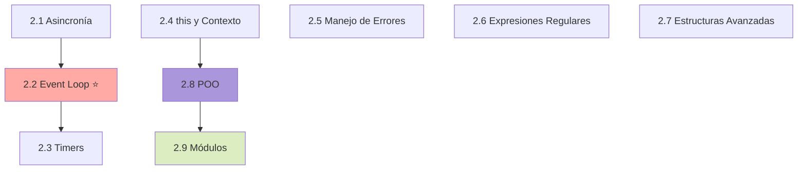

# 📘 Nivel 2: JavaScript Intermedio

> Guía didáctica del Nivel 2, explicada de manera sencilla, con ejemplos, notas y gráficos Mermaid.

---

## 📑 Índice de temas

|#|Tema|Archivo|
|---|---|---|
|2.1|Asincronía (Callbacks, Promises, Async/Await)|[2.1-asincronia.md](https://claude.ai/chat/2.1-asincronia.md)|
|2.2|Event Loop ⭐ MUY IMPORTANTE|[2.2-event-loop.md](https://claude.ai/chat/2.2-event-loop.md)|
|2.3|Timers y Scheduler APIs|[2.3-timers-scheduler-apis.md](https://claude.ai/chat/2.3-timers-scheduler-apis.md)|
|2.4|`this` y Contexto|[2.4-this-y-contexto.md](https://claude.ai/chat/2.4-this-y-contexto.md)|
|2.5|Manejo de Errores|[2.5-manejo-de-errores.md](https://claude.ai/chat/2.5-manejo-de-errores.md)|
|2.6|Expresiones Regulares|[2.6-expresiones-regulares.md](https://claude.ai/chat/2.6-expresiones-regulares.md)|
|2.7|Estructuras Avanzadas (Map, Set, WeakMap, WeakSet)|[2.7-estructuras-avanzadas.md](https://claude.ai/chat/2.7-estructuras-avanzadas.md)|
|2.8|Programación Orientada a Objetos|[2.8-poo.md](https://claude.ai/chat/2.8-poo.md)|
|2.9|Módulos (CommonJS y ES Modules)|[2.9-modulos.md](https://claude.ai/chat/2.9-modulos.md)|

---

## 🎯 ¿Cómo aprovechar este nivel?

1. **Asincronía primero**: 2.1 y 2.2 son la **base** del JavaScript moderno. Sin entender estos, lo demás te costará.
2. **Practica el Event Loop**: copia los ejemplos y predice la salida antes de ejecutar.
3. **Vuelve al Nivel 1 si algo no encaja**: muchos conceptos aquí se apoyan en variables, funciones y objetos.
4. **Las clases y módulos** son la base para construir aplicaciones reales.

---

## 🗺️ Mapa general del Nivel 2

---

## ✅ Al terminar este nivel sabrás:

- ✔️ Manejar tareas asíncronas con callbacks, promises y async/await
- ✔️ Entender cómo funciona el Event Loop por dentro
- ✔️ Usar timers y APIs de planificación correctamente
- ✔️ Dominar `this` y los métodos de binding (call/apply/bind)
- ✔️ Manejar errores de forma profesional con errores personalizados
- ✔️ Crear expresiones regulares para validar y procesar texto
- ✔️ Usar Map, Set y sus versiones débiles
- ✔️ Aplicar programación orientada a objetos con clases, herencia y encapsulación
- ✔️ Organizar tu código en módulos importables/exportables