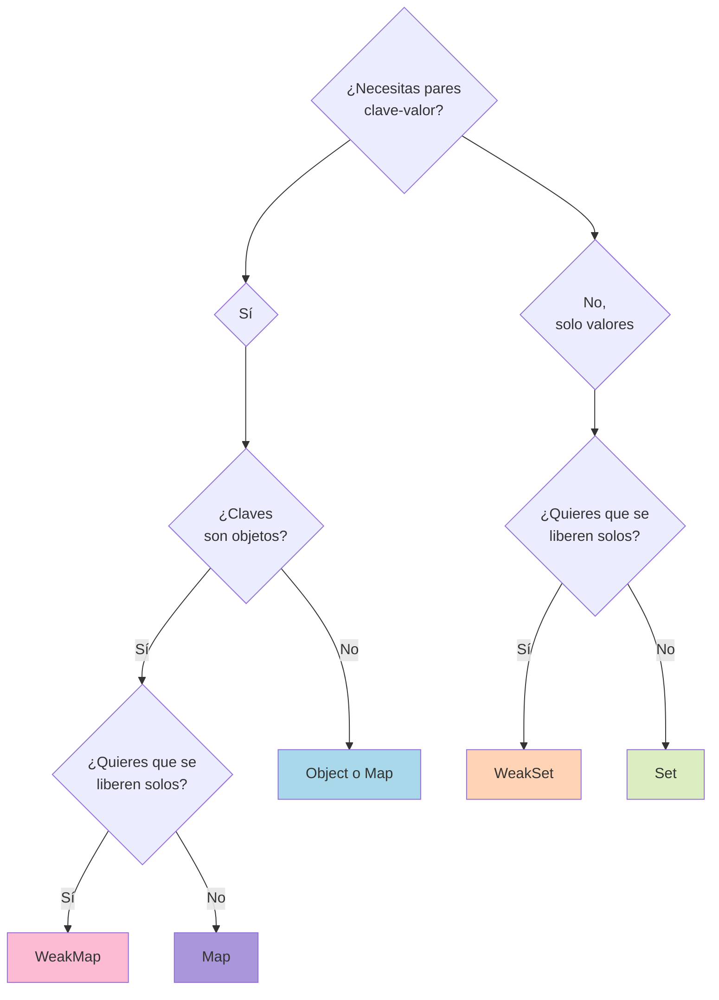

# 2.7 Estructuras Avanzadas: Map, Set, WeakMap, WeakSet

> 📚 Estas estructuras son **alternativas más potentes** a los objetos y arrays para casos específicos.

---

## Map: como un objeto, pero mejor

Un **Map** es una colección de pares **clave → valor**, similar a un objeto, pero con algunas ventajas:

|Map|Object|
|---|---|
|Las claves pueden ser **cualquier cosa** (objetos, funciones, etc.)|Las claves son siempre strings o symbols|
|Mantiene el **orden** de inserción|El orden no está garantizado del todo|
|Tiene **tamaño rápido** (`.size`)|Hay que usar `Object.keys().length`|
|Más eficiente para muchas adiciones/borrados|Optimizado para acceso fijo|

### Crear y usar un Map

```javascript
const mapa = new Map();

// .set(clave, valor) → añadir
mapa.set("nombre", "Ana");
mapa.set("edad", 40);
mapa.set(1, "número uno");           // clave: número
mapa.set(true, "valor para true");   // clave: booleano

// .get(clave) → obtener
mapa.get("nombre");  // "Ana"
mapa.get(1);         // "número uno"

// .has(clave) → comprobar si existe
mapa.has("edad");    // true
mapa.has("ciudad");  // false

// .delete(clave) → eliminar
mapa.delete("edad");

// .size → cantidad
mapa.size; // 3

// .clear() → vaciar
// mapa.clear();
```

### Recorrer un Map

```javascript
const mapa = new Map([
  ["a", 1],
  ["b", 2],
  ["c", 3]
]);

for (const [clave, valor] of mapa) {
  console.log(clave, valor);
}

mapa.forEach((valor, clave) => console.log(clave, valor));
mapa.keys();    // iterador de claves
mapa.values();  // iterador de valores
mapa.entries(); // iterador de [clave, valor]
```

### Cuándo usar Map en vez de Object

- Cuando las claves no son strings (objetos, funciones).
- Cuando necesitas saber el tamaño rápido.
- Cuando importa el orden.
- Cuando agregas/borras claves frecuentemente.

---

## Set: colección de **valores únicos**

Un **Set** es una colección donde **no se permiten valores repetidos**. Como una lista que automáticamente elimina duplicados.

```javascript
const conjunto = new Set();

conjunto.add(1);
conjunto.add(2);
conjunto.add(2); // se ignora, ya existe
conjunto.add(3);

console.log(conjunto); // Set(3) {1, 2, 3}

conjunto.has(2);    // true
conjunto.delete(1);
conjunto.size;      // 2
conjunto.clear();
```

### Crear desde un array

```javascript
const sinDuplicados = new Set([1, 2, 2, 3, 3, 3, 4]);
console.log(sinDuplicados); // Set {1, 2, 3, 4}
```

### Truco famoso: eliminar duplicados de un array

```javascript
const conDuplicados = [1, 2, 2, 3, 3, 4];
const sinDuplicados = [...new Set(conDuplicados)];
console.log(sinDuplicados); // [1, 2, 3, 4]
```

### Recorrer un Set

```javascript
const set = new Set(["a", "b", "c"]);
for (const valor of set) {
  console.log(valor);
}
set.forEach(v => console.log(v));
```

---

## WeakMap y WeakSet

Versiones **"débiles"** de Map y Set. Su característica especial: **no impiden que el recolector de basura libere memoria**.

### Garbage Collection (recolector de basura)

JavaScript libera la memoria automáticamente cuando un objeto **ya no se usa**. Si tienes un objeto guardado en un `Map` normal, el Map lo **mantiene vivo** aunque no lo uses en otro lado. En cambio, `WeakMap` **no lo retiene**: si nadie más usa ese objeto, se borra solo.

### WeakMap

```javascript
const wm = new WeakMap();
let usuario = { nombre: "Ana" };

wm.set(usuario, "datos privados");
console.log(wm.get(usuario)); // "datos privados"

usuario = null; // ya no se usa
// El recolector de basura puede borrarlo del WeakMap automáticamente
```

#### Reglas de WeakMap

- Las claves **deben ser objetos** (no strings ni números).
- **No es iterable** (no puedes hacer `for...of`, ni `.keys()`, ni `.size`).
- Métodos disponibles: `set`, `get`, `has`, `delete`.

### WeakSet

```javascript
const ws = new WeakSet();
let elemento = document.getElementById("boton");

ws.add(elemento);
ws.has(elemento); // true

elemento = null;
// Si nadie más usa elemento, se borra del WeakSet automáticamente
```

#### Reglas de WeakSet

- Solo acepta **objetos** como valores.
- **No es iterable**.
- Métodos: `add`, `has`, `delete`.

### ¿Cuándo usar WeakMap/WeakSet?

- Para **asociar datos privados** a objetos sin causar fugas de memoria.
- Para **marcar objetos** (¿este elemento ya fue procesado?).
- En librerías que necesitan recordar cosas sobre nodos del DOM sin retenerlos.

```javascript
// Ejemplo: marcar elementos del DOM como "procesados"
const procesados = new WeakSet();

function procesar(elemento) {
  if (procesados.has(elemento)) return; // ya procesado
  // ... hacer cosas ...
  procesados.add(elemento);
}
```

Cuando ese elemento se quite del DOM, se libera automáticamente.

---

## Comparación rápida

|Estructura|Claves/Valores|Duplicados|Iterable|Garbage Collection|
|---|---|---|---|---|
|**Object**|claves string/symbol|claves únicas|Sí (limitado)|No retiene si no lo referencias|
|**Map**|claves de cualquier tipo|claves únicas|Sí (completo)|Retiene las claves|
|**Set**|solo valores|sin duplicados|Sí|Retiene los valores|
|**WeakMap**|claves objeto|claves únicas|No|**Libera automáticamente**|
|**WeakSet**|solo objetos|sin duplicados|No|**Libera automáticamente**|

---

## 📊 Gráfico: ¿Qué estructura usar?



---

## Ejemplos prácticos

### Contador de palabras con Map

```javascript
const texto = "hola mundo hola JavaScript hola";
const contador = new Map();

for (const palabra of texto.split(" ")) {
  contador.set(palabra, (contador.get(palabra) || 0) + 1);
}

console.log(contador);
// Map { "hola" => 3, "mundo" => 1, "JavaScript" => 1 }
```

### Operaciones de conjuntos con Set

```javascript
const a = new Set([1, 2, 3, 4]);
const b = new Set([3, 4, 5, 6]);

// Unión
const union = new Set([...a, ...b]); // {1,2,3,4,5,6}

// Intersección
const interseccion = new Set([...a].filter(x => b.has(x))); // {3,4}

// Diferencia
const diferencia = new Set([...a].filter(x => !b.has(x))); // {1,2}
```

---

## 📝 Notas importantes

> 💡 **Nota:** Los `Set` comparan valores con **`===`**. Por eso `{} !== {}` (objetos distintos aunque parezcan iguales).

> ⚠️ **Observación:** `WeakMap` y `WeakSet` **no se pueden recorrer**. Si necesitas iterar, usa `Map` o `Set` normales.

> 🎯 **Recomendación:** Para la mayoría de casos cotidianos, **`Object` y `Array` siguen siendo suficientes**. Usa Map/Set cuando realmente aporten algo (claves no-string, evitar duplicados, etc.).

---

## ✅ Resumen

- **`Map`**: pares clave-valor con claves de cualquier tipo. Métodos: `set`, `get`, `has`, `delete`.
- **`Set`**: valores únicos. Métodos: `add`, `has`, `delete`. Ideal para eliminar duplicados.
- **`WeakMap` / `WeakSet`**: versiones "débiles" que permiten que el recolector de basura **libere objetos no usados** automáticamente.
- **WeakMap/WeakSet** solo aceptan objetos como claves/valores y **no son iterables**.
- Truco rápido para quitar duplicados: `[...new Set(array)]`.