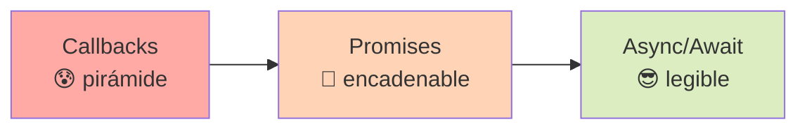
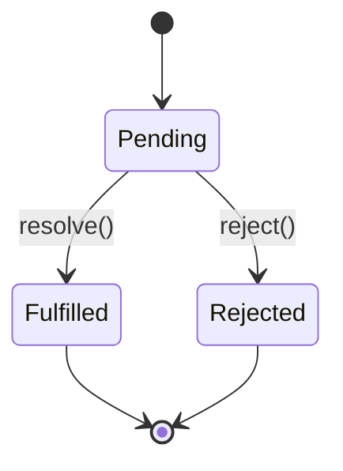

# 2.1 Asincronía

> 📚 La **asincronía** te permite hacer tareas que tardan tiempo (pedir datos, leer archivos, esperar) **sin congelar el programa**.

---

## ¿Qué es la asincronía?

Imagina que estás en un **restaurante**. El mesero toma tu pedido y lo lleva a la cocina. Mientras la cocina prepara tu plato, el mesero **no se queda parado esperando**: atiende a otros clientes. Cuando tu plato está listo, lo trae a tu mesa.

Eso es **asincronía**: dejar una tarea "cocinándose" en segundo plano mientras seguimos haciendo otras cosas.

En JavaScript se usa muchísimo para:

- 🌐 Llamar a un servidor (pedir datos por internet)
- 📁 Leer archivos
- ⏱️ Temporizadores
- 🖱️ Esperar eventos del usuario

---

## Callbacks

Un **callback** es una función que se pasa a otra para que se ejecute **cuando termine** una tarea. Es como dejar tu número y decir: _"cuando esté listo el plato, me llamas"_.

### Callback functions

```javascript
function pedirComida(plato, callback) {
  console.log("Preparando " + plato + "...");
  setTimeout(() => {
    console.log(plato + " listo");
    callback(); // se ejecuta cuando termina
  }, 2000);
}

pedirComida("pizza", () => {
  console.log("¡A comer!");
});

// Salida:
// Preparando pizza...
// (espera 2 segundos)
// pizza listo
// ¡A comer!
```

### Callback Hell (el "infierno" de los callbacks)

Cuando una tarea depende de otra que depende de otra, los callbacks se anidan y el código se vuelve **una pirámide imposible de leer**:

```javascript
pedir("entrada", () => {
  pedir("plato fuerte", () => {
    pedir("postre", () => {
      pedir("café", () => {
        console.log("Cena completa");
        // 😰 cada vez más adentro
      });
    });
  });
});
```

Esto se llama **callback hell** o "pirámide del terror". Las promesas (siguiente sección) lo solucionan.

### Error-first callbacks

Convención muy usada en Node.js: el **primer parámetro** del callback es el error (si hubo alguno), el segundo es el resultado.

```javascript
function leerArchivo(ruta, callback) {
  // Simulación
  if (!ruta) {
    callback("No diste ruta", null); // primer arg: error
  } else {
    callback(null, "contenido del archivo"); // primer arg: null = sin error
  }
}

leerArchivo("notas.txt", (error, datos) => {
  if (error) {
    console.log("Error:", error);
    return;
  }
  console.log("Datos:", datos);
});
```

---

## Promises (Promesas)

Una **Promise** es un objeto que representa el **resultado futuro** de una tarea asíncrona. Como un _ticket_ del restaurante que prometes recoger cuando esté listo.

### Estados de una Promise

Una promesa tiene **3 estados posibles**:

|Estado|Significado|
|---|---|
|**Pending** (pendiente)|Aún se está procesando|
|**Fulfilled** (cumplida)|Terminó con éxito ✅|
|**Rejected** (rechazada)|Terminó con error ❌|

```javascript
const promesa = new Promise((resolve, reject) => {
  const exito = true;
  if (exito) {
    resolve("Todo salió bien"); // cumplida
  } else {
    reject("Algo falló");        // rechazada
  }
});
```

### `.then` — qué hacer si **sale bien**

```javascript
promesa.then(resultado => {
  console.log(resultado); // "Todo salió bien"
});
```

### `.catch` — qué hacer si **falla**

```javascript
promesa
  .then(resultado => console.log(resultado))
  .catch(error => console.log("Error:", error));
```

### `.finally` — se ejecuta **siempre**, salga bien o mal

```javascript
promesa
  .then(r => console.log(r))
  .catch(e => console.log(e))
  .finally(() => console.log("Terminó"));
```

### Encadenando promesas (adiós callback hell)

```javascript
pedir("entrada")
  .then(() => pedir("plato fuerte"))
  .then(() => pedir("postre"))
  .then(() => pedir("café"))
  .then(() => console.log("Cena completa"))
  .catch(error => console.log("Falló:", error));
```

Mucho más legible que la pirámide anterior. 🙌

---

## Métodos de Promise

A veces necesitas manejar **varias promesas a la vez**. JavaScript ofrece cuatro helpers:

### `Promise.all` — espera que **todas** se cumplan

Si **una sola** falla, falla todo.

```javascript
Promise.all([pedirPizza(), pedirGaseosa(), pedirHelado()])
  .then(resultados => {
    console.log(resultados); // ["pizza", "gaseosa", "helado"]
  })
  .catch(error => console.log("Algo falló:", error));
```

> 💡 **Úsalo cuando:** necesitas todos los resultados sí o sí.

### `Promise.race` — devuelve la **primera** que termine (ganadora)

Sea éxito o error, gana la más rápida.

```javascript
Promise.race([servidor1(), servidor2(), servidor3()])
  .then(resultado => console.log("Más rápido:", resultado));
```

> 💡 **Úsalo cuando:** quieres el más rápido (timeouts, fallback).

### `Promise.allSettled` — espera a **todas**, sin importar si fallan

Devuelve un array con el resultado de cada una (éxito o error).

```javascript
Promise.allSettled([tarea1(), tarea2(), tarea3()])
  .then(resultados => {
    resultados.forEach(r => {
      if (r.status === "fulfilled") console.log("OK:", r.value);
      else console.log("Falló:", r.reason);
    });
  });
```

> 💡 **Úsalo cuando:** quieres saber qué pasó con cada una, sin que una mala dañe el resto.

### `Promise.any` — devuelve la **primera que tenga éxito**

Ignora los fallos hasta que una se cumpla.

```javascript
Promise.any([servidor1(), servidor2(), servidor3()])
  .then(primera => console.log("La primera que respondió OK:", primera))
  .catch(() => console.log("Todas fallaron"));
```

> 💡 **Úsalo cuando:** intentas varias opciones y te basta con que una funcione.

---

## Async/Await

Es una forma moderna y **más legible** de trabajar con promesas. Hace que el código asíncrono **parezca síncrono**.

### `async`

Marca una función como asíncrona. **Siempre devuelve una promesa**.

```javascript
async function saludar() {
  return "Hola";
}

saludar().then(r => console.log(r)); // "Hola"
```

### `await`

**Pausa** la función hasta que la promesa se resuelva. **Solo se puede usar dentro de una función `async`**.

```javascript
async function obtenerDatos() {
  const respuesta = await fetch("https://api.ejemplo.com/usuario");
  const datos = await respuesta.json();
  console.log(datos);
}

obtenerDatos();
```

Compara cómo se ve igual con `.then`:

```javascript
// Con then:
fetch("https://api.ejemplo.com/usuario")
  .then(r => r.json())
  .then(datos => console.log(datos));

// Con async/await:
const r = await fetch("https://api.ejemplo.com/usuario");
const datos = await r.json();
console.log(datos);
```

### Manejo de errores con async/await

Como ya no usamos `.catch`, los errores se atrapan con **`try/catch`**:

```javascript
async function obtenerDatos() {
  try {
    const respuesta = await fetch("https://api.ejemplo.com/usuario");
    const datos = await respuesta.json();
    console.log(datos);
  } catch (error) {
    console.log("Algo falló:", error);
  } finally {
    console.log("Termina siempre");
  }
}
```

---

## 📊 Gráfico: Evolución de la asincronía



## 📊 Gráfico: Estados de una Promise



---

## 📝 Notas importantes

> 💡 **Nota:** `async/await` no reemplaza a las promesas, las **usa por debajo**. Es solo una forma más bonita de escribirlas.

> ⚠️ **Observación:** `await` solo funciona dentro de funciones `async`. Si lo usas fuera, da error (aunque hoy se permite a nivel top-level en módulos ES).

> 🎯 **Recomendación:** Usa **async/await** en código nuevo. Es más legible y los errores se manejan con `try/catch` como en código normal.

---

## ✅ Resumen

- **Asincronía** = hacer tareas largas sin bloquear el programa.
- **Callbacks**: funciones pasadas para ejecutar al final. Riesgo: **callback hell**.
- **Promises**: representan un resultado futuro. Estados: _pending_, _fulfilled_, _rejected_.
- **`.then / .catch / .finally`** manejan los resultados.
- **`Promise.all`** (todas), **`race`** (primera), **`allSettled`** (todas, sin importar éxito), **`any`** (primera exitosa).
- **`async/await`** es la forma moderna de escribir asincronía legible.
- Errores con `await` se atrapan con **`try/catch`**.