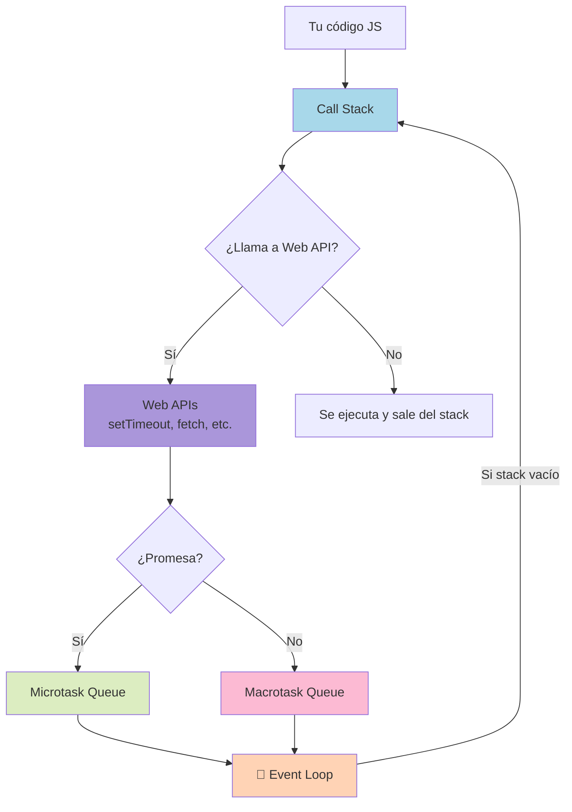
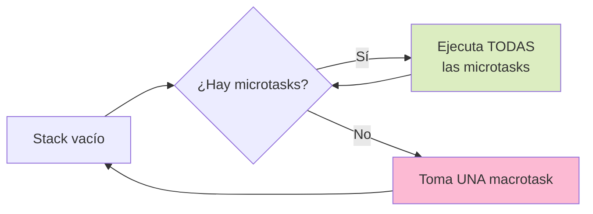

# 2.2 Event Loop (MUY IMPORTANTE)

> 📚 El **Event Loop** es el "motor" que permite a JavaScript hacer **muchas cosas a la vez** aunque solo tenga **un hilo**. Entender esto te aclara muchísimo cómo funciona JS por dentro.

---

## El gran misterio: JavaScript es single-thread, ¿cómo hace varias cosas a la vez?

Como vimos en el tema 1.1, JavaScript tiene **un solo hilo**: hace una cosa a la vez. Sin embargo, podemos cargar imágenes, hacer animaciones y pedir datos al servidor **al mismo tiempo**. ¿Cómo?

La respuesta es: **JavaScript no trabaja solo**. El navegador (o Node.js) le ayuda con varias piezas. Vamos a verlas.

---

## Las piezas del rompecabezas

### 1. Call Stack (Pila de llamadas)

Es la **lista de tareas en ejecución**. JavaScript ejecuta una función y la pone en la pila. Cuando termina, la quita. Funciona como una **pila de platos**: lo último que entra es lo primero que sale.

```javascript
function saludar() { console.log("Hola"); }
function principal() { saludar(); }
principal();

// Call Stack:
// 1. principal() entra
// 2. saludar() entra
// 3. console.log("Hola") entra y sale
// 4. saludar() sale
// 5. principal() sale
```

> ⚠️ Si una función tarda mucho (un bucle infinito, por ejemplo), **toda la página se congela**, porque el call stack está ocupado.

### 2. Web APIs (en el navegador) / C++ APIs (en Node.js)

Son **herramientas externas** que el navegador te presta. JavaScript les dice: _"hazme esto"_ y sigue trabajando.

Ejemplos:

- `setTimeout` (esperar tiempo)
- `fetch` (pedir datos a un servidor)
- DOM (interacción con HTML)
- Eventos (click, scroll…)

```javascript
setTimeout(() => console.log("3 segundos después"), 3000);
console.log("Ahora");

// Salida:
// "Ahora"
// (3 segundos…)
// "3 segundos después"
```

JS le pasa la tarea al navegador y **sigue ejecutando** el siguiente `console.log`.

### 3. Callback Queue / Task Queue (Cola de tareas)

Cuando una Web API termina, **no ejecuta el callback de inmediato**. Lo pone en una **cola de espera**. Como una fila en el banco.

### 4. Event Loop (el "controlador de tráfico")

Es el que **vigila** el call stack y la cola. Su regla es simple:

> 🔄 _"Cuando el call stack esté vacío, toma la siguiente tarea de la cola y métela al stack."_

Es un bucle infinito que pregunta una y otra vez: _¿stack vacío? ¿Hay algo en la cola? Mueve._

---

## Microtasks vs Macrotasks

No todas las tareas pendientes son iguales. Hay **dos colas distintas** con prioridades diferentes.

### Macrotasks (tareas grandes)

- `setTimeout`
- `setInterval`
- Eventos del DOM (click, etc.)
- I/O (entrada/salida)

### Microtasks (tareas pequeñas y prioritarias)

- **Promises** (`.then`, `.catch`, `.finally`)
- `queueMicrotask`
- `MutationObserver`

### La regla de oro del Event Loop

Cuando el call stack queda vacío, el Event Loop:

1. **Vacía TODA la cola de microtasks** primero (todas las que haya).
2. Luego toma **UNA macrotask** y la ejecuta.
3. Repite.

```javascript
console.log("1");

setTimeout(() => console.log("2"), 0); // macrotask

Promise.resolve().then(() => console.log("3")); // microtask

console.log("4");

// Salida:
// 1
// 4
// 3   ← microtask se ejecuta antes que setTimeout
// 2   ← macrotask al final
```

¿Por qué? Porque las **microtasks tienen prioridad**, aunque el `setTimeout` sea de 0 ms.

---

## Promises en el Event Loop

Las promesas usan la **cola de microtasks**. Eso significa que sus `.then` se ejecutan **antes** de cualquier `setTimeout`, aunque el timeout sea 0.

```javascript
console.log("inicio");

setTimeout(() => console.log("setTimeout"), 0);

Promise.resolve()
  .then(() => console.log("promise 1"))
  .then(() => console.log("promise 2"));

console.log("fin");

// Salida:
// inicio
// fin
// promise 1
// promise 2
// setTimeout
```

> 💡 Por eso a veces se dice que las promesas son "más rápidas" que `setTimeout(fn, 0)`.

---

## `queueMicrotask`

Permite **encolar manualmente** una microtask, sin usar una promesa.

```javascript
console.log("1");

queueMicrotask(() => console.log("2 - microtask"));

setTimeout(() => console.log("3 - macrotask"), 0);

console.log("4");

// Salida:
// 1
// 4
// 2 - microtask
// 3 - macrotask
```

Uso raro pero útil para librerías que necesitan ejecutar algo _justo después_ del código actual pero antes de cualquier timer.

---

## 📊 Gráfico: El Event Loop en acción



## 📊 Gráfico: Prioridad de las colas



---

## Ejemplo completo paso a paso

```javascript
console.log("A");

setTimeout(() => console.log("B"), 0);

Promise.resolve().then(() => {
  console.log("C");
  return Promise.resolve();
}).then(() => console.log("D"));

console.log("E");
```

**Análisis:**

1. `console.log("A")` → stack → imprime **A**
2. `setTimeout` → se va a Web APIs, después a macrotask queue
3. `Promise.resolve().then` → se va a microtask queue
4. `console.log("E")` → stack → imprime **E**
5. Stack vacío → ejecuta microtasks
6. Primera `.then` → imprime **C**, agrega otra microtask
7. Sigue habiendo microtasks → imprime **D**
8. No hay más microtasks → ejecuta macrotask → imprime **B**

**Salida final:**

```
A
E
C
D
B
```

---

## 📝 Notas importantes

> 💡 **Nota:** Las **microtasks bloquean las macrotasks**. Si pones miles de promesas encadenadas, los timers se retrasan.

> ⚠️ **Observación:** `setTimeout(fn, 0)` **no significa "ejecutar ahora"**. Significa "ejecutar lo más pronto posible, después de que se vacíen el stack y las microtasks".

> 🎯 **Recomendación:** Si tienes una tarea muy pesada que congela el navegador, **divídela en trozos** usando `setTimeout` o `requestIdleCallback`, así el Event Loop puede atender otras cosas (como clicks del usuario).

---

## ✅ Resumen

- JavaScript es **single-thread**, pero el **navegador/Node** le presta herramientas (Web APIs) para tareas asíncronas.
- **Call Stack**: pila donde se ejecutan las funciones.
- **Web APIs**: hacen tareas en segundo plano (timers, fetch, eventos).
- **Callback Queue**: cola donde esperan los callbacks de macrotasks.
- **Microtask Queue**: cola prioritaria para promesas y `queueMicrotask`.
- **Event Loop**: vigila el stack y mueve tareas de las colas cuando está vacío.
- **Regla**: vaciar TODAS las microtasks antes de tomar UNA macrotask.