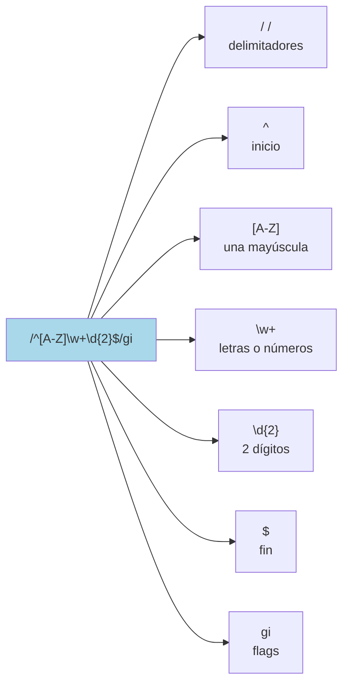

# 2.6 Expresiones Regulares (RegEx)

> 📚 Las **expresiones regulares** son **patrones de búsqueda** para encontrar, validar o reemplazar texto. Parecen complicadas a primera vista, pero son muy potentes.

---

## ¿Qué es una expresión regular?

Es como una **descripción** de un texto que buscas, en lugar de buscar texto literal. En vez de decir "busca la palabra hola", puedes decir cosas como:

- "Busca **cualquier número de 3 dígitos**"
- "Busca **un email válido**"
- "Busca **una palabra que empiece con mayúscula**"

En JavaScript, una expresión regular se escribe entre **barras `/`**:

```javascript
const patron = /hola/;
"Hola mundo, hola amigo".match(patron); // ["hola"]
```

---

## Sintaxis Básica

### Caracteres especiales (metacaracteres)

|Símbolo|Significado|Ejemplo|
|---|---|---|
|`.`|Cualquier carácter (excepto salto de línea)|`/h.la/` → "hola", "hela"|
|`\d`|Dígito (0-9)|`/\d/` → "5"|
|`\D`|No dígito|—|
|`\w`|Letra, número o `_`|`/\w/` → "a", "1", "_"|
|`\W`|No letra/número|—|
|`\s`|Espacio en blanco|`/\s/` → " ", tab|
|`\S`|No espacio|—|
|`\b`|Frontera de palabra|`/\bhola\b/`|
|`^`|Inicio del texto|`/^hola/`|
|`$`|Final del texto|`/mundo$/`|

### Cuantificadores: cuántas veces se repite

|Símbolo|Significado|
|---|---|
|`*`|0 o más veces|
|`+`|1 o más veces|
|`?`|0 o 1 vez (opcional)|
|`{3}`|Exactamente 3 veces|
|`{2,5}`|Entre 2 y 5 veces|
|`{2,}`|Mínimo 2, sin máximo|

```javascript
/\d+/        // uno o más dígitos: "5", "123"
/colou?r/    // "color" o "colour" (la "u" es opcional)
/\d{3}-\d{4}/ // formato 123-4567
```

### Grupos y opciones

|Símbolo|Significado|Ejemplo|
|---|---|---|
|`[abc]`|Cualquiera de esas letras|`/[aeiou]/` → vocal|
|`[a-z]`|Rango (a hasta z)|`/[a-z]/` → cualquier minúscula|
|`[^abc]`|**NO** una de esas letras|`/[^0-9]/` → no dígito|
|`(abc)`|Grupo|`/(hola)+/`|
|`a\|b`|"a" o "b"|`/perro\|gato/`|

```javascript
/[A-Z][a-z]+/    // palabra que empieza con mayúscula
/(perro|gato)/   // perro o gato
```

---

## Flags (banderas)

Modificadores que cambian el comportamiento. Van **después** de la última `/`.

|Flag|Significado|
|---|---|
|`i`|Ignora mayúsculas/minúsculas|
|`g`|Busca **todas** las coincidencias (no solo la primera)|
|`m`|Multilinea: `^` y `$` funcionan por línea|
|`s`|El `.` también captura saltos de línea|
|`u`|Soporte Unicode|
|`y`|"Sticky": busca desde una posición exacta|

```javascript
/hola/i     // busca "hola", "Hola", "HOLA"...
/hola/g     // busca todas las apariciones
/hola/gi    // ambos combinados
```

---

## Métodos para usar RegEx

### `test()` — devuelve `true` o `false`

Prueba si el texto **contiene** el patrón.

```javascript
const tieneNumero = /\d/;
tieneNumero.test("hola 123"); // true
tieneNumero.test("hola");     // false
```

> 💡 **Ideal para:** validar (¿el email tiene formato correcto?, ¿la contraseña tiene un número?).

### `exec()` — devuelve detalles de la **primera** coincidencia

Devuelve un array con info, o `null` si no encuentra.

```javascript
const patron = /(\w+) (\w+)/;
const resultado = patron.exec("Hola mundo");
console.log(resultado);
// ["Hola mundo", "Hola", "mundo", index: 0, ...]
```

### `match()` (método de strings)

**El texto** llama al método.

```javascript
"Hola mundo".match(/mundo/);    // ["mundo", index: 5, ...]
"Hola mundo".match(/zapato/);   // null

// Con flag g, devuelve solo las coincidencias:
"manzana, pera, manzana".match(/manzana/g);
// ["manzana", "manzana"]
```

### `replace()` (método de strings)

Reemplaza coincidencias.

```javascript
"Hola hola HOLA".replace(/hola/, "adiós");
// "Hola adiós HOLA" (solo la primera)

"Hola hola HOLA".replace(/hola/gi, "adiós");
// "adiós adiós adiós" (todas, sin distinguir mayúsculas)
```

#### Con grupos capturados (`$1`, `$2`)

```javascript
"Juan Pérez".replace(/(\w+) (\w+)/, "$2 $1");
// "Pérez Juan"
```

#### Con función

```javascript
"hola mundo".replace(/\w+/g, palabra => palabra.toUpperCase());
// "HOLA MUNDO"
```

---

## Ejemplos prácticos

### Validar un email (simple)

```javascript
const email = /^[\w.-]+@[\w.-]+\.\w+$/;
email.test("ana@correo.com");    // true
email.test("texto raro");         // false
```

### Validar teléfono colombiano (10 dígitos)

```javascript
const tel = /^\d{10}$/;
tel.test("3001234567"); // true
```

### Extraer todos los números

```javascript
"Tengo 3 manzanas y 5 peras".match(/\d+/g);
// ["3", "5"]
```

### Reemplazar espacios múltiples por uno solo

```javascript
"hola      mundo".replace(/\s+/g, " ");
// "hola mundo"
```

### Validar contraseña fuerte

```javascript
// Mínimo 8 caracteres, 1 mayúscula, 1 minúscula, 1 número
const fuerte = /^(?=.*[a-z])(?=.*[A-Z])(?=.*\d).{8,}$/;
fuerte.test("Ana12345");  // true
fuerte.test("hola");      // false
```

---

## 📊 Gráfico: Anatomía de una RegEx



---

## Tips para no volverte loco

1. **Prueba en línea**: usa sitios como [regex101.com](https://regex101.com/) para probar y entender qué hace cada parte.
2. **Empieza simple**: construye la regex paso a paso, no de golpe.
3. **No abuses**: para tareas simples, los métodos de string (`includes`, `split`) son más legibles.
4. **Comenta**: una regex compleja **siempre** debe llevar comentario explicando qué hace.

---

## 📝 Notas importantes

> 💡 **Nota:** Las RegEx pueden tener **2 formas**:
> 
> ```javascript
> const r1 = /hola/i;              // literal (más común)
> const r2 = new RegExp("hola", "i"); // constructor (cuando el patrón viene como string)
> ```

> ⚠️ **Observación:** Sin el flag `g`, los métodos `match` y `replace` solo encuentran la **primera** coincidencia.

> 🎯 **Recomendación:** Para validar emails reales, **no inventes tu propia regex**. Usa una librería o una más completa. La validación de email es notoriamente complicada.

---

## ✅ Resumen

- Las **RegEx** son **patrones** para buscar/validar/reemplazar texto.
- Se escriben entre **`/.../`** con flags opcionales después.
- **`\d`** dígito, **`\w`** letra, **`\s`** espacio, **`.`** cualquier carácter.
- **Cuantificadores**: `*` (0+), `+` (1+), `?` (0 o 1), `{n}` (exacto), `{n,m}` (rango).
- **Flags**: `i` (ignorar mayúsculas), `g` (todas), `m` (multilinea).
- **Métodos**: `test` (true/false), `exec`, `match`, `replace`.
- Útiles para validaciones, búsquedas y transformaciones.