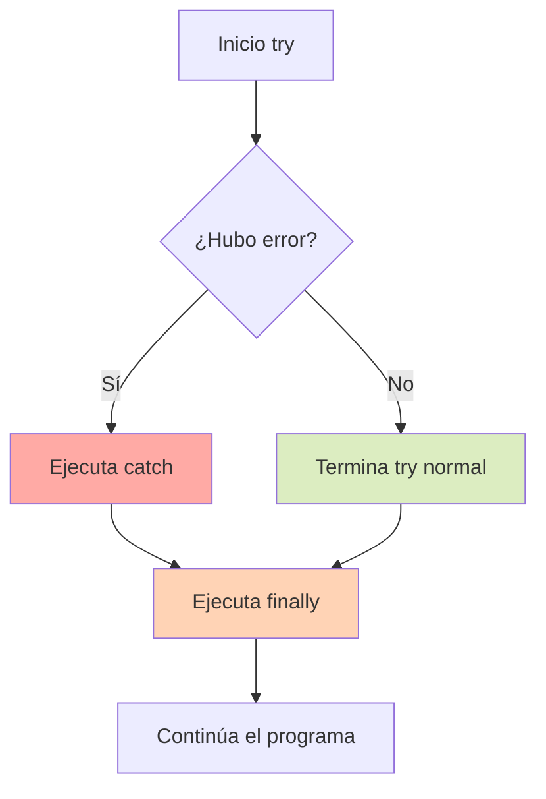

# 2.5 Manejo de Errores

> 📚 En programación, los errores **van a ocurrir**. Lo importante es saber **detectarlos y reaccionar** sin que el programa muera.

---

## ¿Por qué manejar errores?

Imagina que pides datos a un servidor pero no hay internet. Si no haces nada, tu programa **se rompe** y deja de funcionar. Con manejo de errores, puedes:

- Mostrar un mensaje amable al usuario.
- Intentar otra vez.
- Guardar lo que se pueda y continuar.

---

## `try / catch` — atrapar errores

La estructura básica:

```javascript
try {
  // Código que PUEDE fallar
} catch (error) {
  // Qué hacer si falla
}
```

**Ejemplo:**

```javascript
try {
  const datos = JSON.parse("esto no es JSON válido");
  console.log(datos);
} catch (error) {
  console.log("Error al parsear:", error.message);
}

// Salida:
// Error al parsear: Unexpected token e in JSON at position 0
```

Sin el `try/catch`, el programa se habría detenido. Con él, **continúa normalmente**.

### El objeto `error`

Contiene información útil:

```javascript
try {
  null.algo; // error
} catch (error) {
  console.log(error.name);    // "TypeError"
  console.log(error.message); // "Cannot read properties of null"
  console.log(error.stack);   // ruta del error en el código
}
```

---

## `finally` — código que se ejecuta **siempre**

Bloque opcional que se ejecuta **pase lo que pase**: haya error o no.

```javascript
try {
  console.log("Intentando...");
  throw new Error("Falló");
} catch (error) {
  console.log("Atrapado:", error.message);
} finally {
  console.log("Esto se ejecuta siempre");
}

// Salida:
// Intentando...
// Atrapado: Falló
// Esto se ejecuta siempre
```

> 💡 **Útil para:** cerrar conexiones, liberar recursos, ocultar un spinner de carga, etc.

---

## `throw` — lanzar errores manualmente

Puedes **crear tus propios errores** cuando algo no cumple tus reglas:

```javascript
function dividir(a, b) {
  if (b === 0) {
    throw new Error("No se puede dividir por cero");
  }
  return a / b;
}

try {
  dividir(10, 0);
} catch (error) {
  console.log(error.message); // "No se puede dividir por cero"
}
```

Puedes lanzar **cualquier valor**, pero es mejor usar `new Error(...)` para tener stack trace y mensaje claro.

```javascript
throw new Error("Mensaje del error");
throw "texto";   // funciona pero no recomendado
throw 42;        // funciona pero no recomendado
```

---

## Errores personalizados

Puedes crear **tus propias clases de error** extendiendo de `Error`. Sirve para distinguir tipos de problemas en tu app.

```javascript
class ValidationError extends Error {
  constructor(mensaje) {
    super(mensaje);
    this.name = "ValidationError";
  }
}

class NetworkError extends Error {
  constructor(mensaje) {
    super(mensaje);
    this.name = "NetworkError";
  }
}

function registrarUsuario(edad) {
  if (edad < 18) {
    throw new ValidationError("Debe ser mayor de edad");
  }
}

try {
  registrarUsuario(15);
} catch (error) {
  if (error instanceof ValidationError) {
    console.log("Datos inválidos:", error.message);
  } else if (error instanceof NetworkError) {
    console.log("Problema de red:", error.message);
  } else {
    console.log("Error desconocido");
  }
}
```

> 💡 **Ventaja:** con `instanceof` puedes reaccionar distinto según el tipo.

---

## Tipos de Errores Comunes

JavaScript trae varios tipos integrados. Verlos te ayuda a entender qué falló.

### `TypeError` — tipo equivocado

Usas un valor de una forma que no soporta.

```javascript
null.algo;           // TypeError
"hola".push("a");    // TypeError (los strings no tienen push)
undefined();         // TypeError (no es función)
```

### `ReferenceError` — variable no existe

Intentas usar algo que no se ha declarado.

```javascript
console.log(noExiste); // ReferenceError: noExiste is not defined
```

### `SyntaxError` — error de sintaxis

El código está mal escrito y JavaScript no puede ni leerlo.

```javascript
JSON.parse("{");        // SyntaxError
const 1variable = 5;    // SyntaxError
```

> ⚠️ Los `SyntaxError` ocurren al **leer** el código, antes de ejecutarse. Por eso **no se pueden atrapar con try/catch** en el mismo archivo, salvo en casos como `JSON.parse` o `eval`.

### Otros tipos útiles

|Tipo|Cuándo ocurre|
|---|---|
|`RangeError`|Número fuera de rango: `new Array(-1)`|
|`URIError`|Error en `encodeURI` o `decodeURI`|
|`EvalError`|Errores con `eval` (raro)|

---

## try/catch con async/await

Como vimos en 2.1, los errores en código asíncrono también se atrapan con `try/catch`.

```javascript
async function obtenerUsuario(id) {
  try {
    const r = await fetch(`/api/usuarios/${id}`);
    if (!r.ok) throw new Error("Usuario no encontrado");
    return await r.json();
  } catch (error) {
    console.log("Error:", error.message);
    return null;
  } finally {
    console.log("Petición terminada");
  }
}
```

---

## 📊 Gráfico: Flujo de try/catch/finally



---

## Ejemplo completo

```javascript
class EdadInvalidaError extends Error {
  constructor(mensaje) {
    super(mensaje);
    this.name = "EdadInvalidaError";
  }
}

function calcularDescuento(edad) {
  if (typeof edad !== "number") {
    throw new TypeError("Edad debe ser número");
  }
  if (edad < 0) {
    throw new EdadInvalidaError("Edad no puede ser negativa");
  }
  return edad >= 65 ? 0.5 : 0.1;
}

try {
  console.log(calcularDescuento("treinta"));
} catch (error) {
  if (error instanceof TypeError) {
    console.log("Tipo inválido:", error.message);
  } else if (error instanceof EdadInvalidaError) {
    console.log("Edad inválida:", error.message);
  }
} finally {
  console.log("Cálculo terminado");
}

// Salida:
// Tipo inválido: Edad debe ser número
// Cálculo terminado
```

---

## 📝 Notas importantes

> 💡 **Nota:** No uses `try/catch` para **controlar el flujo normal**. Solo para **errores reales e inesperados**.

> ⚠️ **Observación:** Atrapar un error y no hacer nada (catch vacío) es una **mala práctica**. Como mínimo, registra el error con `console.log` o `console.error`.

> 🎯 **Recomendación:** Lanza errores **descriptivos**. `throw new Error("Algo falló")` no ayuda. `throw new Error("No se pudo conectar al servidor en el puerto 3000")` sí.

---

## ✅ Resumen

- **`try/catch`** atrapa errores y evita que el programa muera.
- **`finally`** se ejecuta **siempre**, haya error o no.
- **`throw`** lanza errores manualmente: `throw new Error("mensaje")`.
- Puedes crear **errores personalizados** extendiendo de `Error`.
- Tipos comunes: **`TypeError`** (tipo equivocado), **`ReferenceError`** (variable inexistente), **`SyntaxError`** (sintaxis inválida).
- En **async/await**, los errores se atrapan con `try/catch` normalmente.