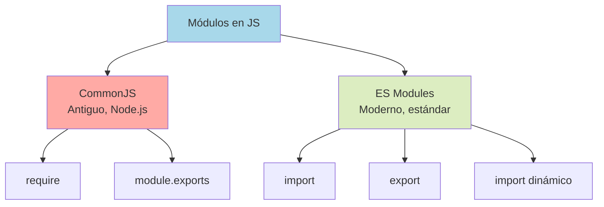
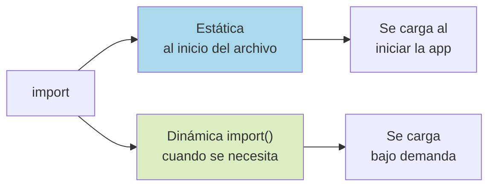

# 2.9 Módulos

> 📚 Los **módulos** te permiten **dividir tu código en archivos**, importando y exportando lo que necesites. Como dividir un libro en capítulos en vez de tener uno enorme.

---

## ¿Por qué usar módulos?

Imagina una app grande. Si todo está en un solo archivo, tienes:

- Miles de líneas imposibles de mantener.
- Variables que pueden chocar entre sí.
- Código difícil de reutilizar.

Con módulos, separas el código en archivos pequeños, cada uno con una responsabilidad clara. Así puedes:

- **Reutilizar** código en distintos lugares.
- **Aislar** variables (no contaminan otros archivos).
- **Entender** mejor el código.

En JavaScript hay **dos sistemas de módulos** principales:

- **CommonJS** (CJS): el antiguo, usado en Node.js.
- **ES Modules** (ESM): el moderno y estándar oficial.

---

## CommonJS (Node.js tradicional)

Es el sistema **original de Node.js**. Usa `require` para importar y `module.exports` para exportar.

### Exportar (archivo `matematica.js`)

```javascript
function sumar(a, b) {
  return a + b;
}

function restar(a, b) {
  return a - b;
}

// Exportar varias cosas
module.exports = { sumar, restar };

// O exportar una sola:
// module.exports = sumar;
```

### Importar (archivo `app.js`)

```javascript
const matematica = require("./matematica");
console.log(matematica.sumar(2, 3)); // 5

// Con destructuring:
const { sumar, restar } = require("./matematica");
console.log(sumar(5, 1)); // 6
```

### Características de CommonJS

- Carga **síncrona** (espera a tener el archivo antes de continuar).
- Funciona principalmente en **Node.js**.
- No nativo en navegadores (necesitas un bundler).
- `require` puede ser **dinámico** (dentro de un `if`, por ejemplo).

---

## ES Modules (ESM, el moderno)

Es el **estándar oficial** de JavaScript (ES6+). Funciona en navegadores modernos y en Node.js (versiones recientes).

### Exportar (archivo `matematica.js`)

#### Exportaciones nombradas (named exports)

```javascript
export function sumar(a, b) {
  return a + b;
}

export function restar(a, b) {
  return a - b;
}

export const PI = 3.1416;
```

O al final:

```javascript
function sumar(a, b) { return a + b; }
function restar(a, b) { return a - b; }

export { sumar, restar };
```

#### Export por defecto (default export)

Solo uno por archivo. Es lo "principal" que exporta el módulo.

```javascript
// usuario.js
export default class Usuario {
  constructor(nombre) {
    this.nombre = nombre;
  }
}
```

### Importar (archivo `app.js`)

#### Importar nombrados

```javascript
import { sumar, restar } from "./matematica.js";
console.log(sumar(2, 3)); // 5
```

#### Renombrar al importar

```javascript
import { sumar as add } from "./matematica.js";
console.log(add(2, 3));
```

#### Importar el default

```javascript
import Usuario from "./usuario.js";
const ana = new Usuario("Ana");
```

#### Importar todo como un objeto

```javascript
import * as math from "./matematica.js";
console.log(math.sumar(2, 3));
console.log(math.PI);
```

#### Combinar default y nombrados

```javascript
import Usuario, { ROLES } from "./usuario.js";
```

### Cómo activar ES Modules

**En HTML:**

```html
<script type="module" src="app.js"></script>
```

**En Node.js** (una de estas opciones):

- Usar extensión `.mjs`
- En `package.json` poner `"type": "module"`

---

## Dynamic Imports (importación dinámica)

A veces no quieres cargar un módulo **al iniciar**, sino **cuando lo necesites**. Por ejemplo, cuando el usuario haga clic en un botón. Eso ahorra tiempo de carga inicial.

```javascript
boton.addEventListener("click", async () => {
  const modulo = await import("./pesado.js");
  modulo.iniciar();
});
```

`import(...)` devuelve una **promesa**. Por eso se usa con `await` (o `.then`).

### Ventajas

- **Code splitting**: el navegador solo descarga el módulo cuando lo necesita.
- **Cargas condicionales**: cargar diferentes módulos según el caso.
- **Mejor rendimiento** en apps grandes.

### Ejemplo: cargar según el idioma

```javascript
async function cargarTraducciones(idioma) {
  const modulo = await import(`./idiomas/${idioma}.js`);
  return modulo.default;
}

const textos = await cargarTraducciones("es");
```

---

## Comparación: CommonJS vs ES Modules

|Característica|CommonJS|ES Modules|
|---|---|---|
|Sintaxis|`require / module.exports`|`import / export`|
|Carga|Síncrona|Asíncrona|
|Donde corre|Node.js|Navegador + Node.js|
|`import` dinámico|`require()` cualquier momento|`import()` (devuelve Promise)|
|Estándar oficial|No|✅ Sí|
|Tree-shaking*|Limitado|✅ Bueno|

> *Tree-shaking: los bundlers eliminan código no usado en el bundle final.

---

## 📊 Gráfico: Sistemas de módulos



## 📊 Gráfico: Importación estática vs dinámica



---

## Ejemplo completo (ESM)

**Archivo `db.js`:**

```javascript
const usuarios = [];

export function agregar(usuario) {
  usuarios.push(usuario);
}

export function listar() {
  return [...usuarios];
}

export default usuarios;
```

**Archivo `usuario.js`:**

```javascript
export default class Usuario {
  constructor(nombre, edad) {
    this.nombre = nombre;
    this.edad = edad;
  }
}
```

**Archivo `app.js`:**

```javascript
import Usuario from "./usuario.js";
import { agregar, listar } from "./db.js";

agregar(new Usuario("Ana", 40));
agregar(new Usuario("Luis", 25));

console.log(listar());

// Carga dinámica de un módulo opcional
if (location.search.includes("debug")) {
  const dbg = await import("./debug.js");
  dbg.iniciar();
}
```

---

## 📝 Notas importantes

> 💡 **Nota:** En **ES Modules**, los `import` van **siempre al inicio** del archivo y se procesan antes de ejecutar el código. Para imports condicionales, usa `import()` dinámico.

> ⚠️ **Observación:** En el navegador, los módulos **necesitan ser servidos por HTTP**. Si abres un archivo con `file://`, los imports no funcionarán. Usa un servidor local (como `live-server`, `vite`, etc.).

> 🎯 **Recomendación:** Para proyectos nuevos, usa **ES Modules**. Es el estándar y funciona en todos lados. Solo usa CommonJS si trabajas en código Node.js antiguo.

---

## ✅ Resumen

- Los **módulos** dividen el código en archivos reutilizables.
- **CommonJS** (antiguo, Node.js): `require` y `module.exports`.
- **ES Modules** (moderno, estándar): `import` y `export`.
- Hay **exportaciones nombradas** (`export function...`) y **default** (`export default`).
- **`import()`** dinámico carga módulos cuando se necesitan (devuelve una Promise).
- En navegador: `<script type="module">`. En Node.js: `.mjs` o `"type": "module"` en `package.json`.
- Para proyectos nuevos: **ES Modules**.