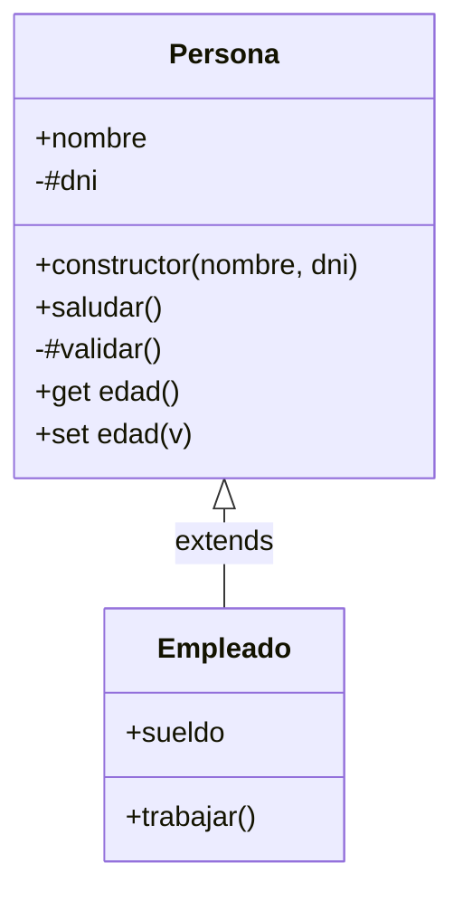
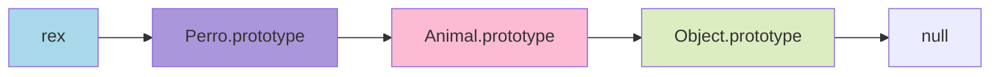

# 2.8 Programación Orientada a Objetos (POO)

> 📚 La POO es una forma de organizar el código en torno a **"objetos"** que representan cosas del mundo real (un usuario, un auto, una cuenta bancaria). JavaScript tiene su propio sabor de POO basado en **prototipos**.

---

## ¿Qué es la POO?

Imagina que vas a construir una app de gestión de empleados. En lugar de tener variables y funciones sueltas, defines una **plantilla** llamada "Empleado" con sus datos (nombre, sueldo) y acciones (trabajar, cobrar). Luego creas **instancias** (empleados concretos) a partir de esa plantilla.

Los **4 pilares** de la POO son:

1. **Encapsulación**: ocultar detalles internos.
2. **Herencia**: una clase hereda de otra.
3. **Polimorfismo**: una misma acción se comporta distinto según el objeto.
4. **Abstracción**: representar conceptos del mundo real.

---

## Prototypes (Prototipos)

JavaScript no tenía clases hasta ES6. Su mecanismo original es el de **prototipos**: cada objeto tiene un "objeto padre" del que **hereda propiedades y métodos**.

```javascript
const animal = {
  comer() { console.log("Comiendo..."); }
};

const perro = Object.create(animal); // perro hereda de animal
perro.ladrar = function() { console.log("Guau"); };

perro.ladrar(); // "Guau" (propio)
perro.comer();  // "Comiendo..." (heredado)
```

### Prototype Chain (cadena de prototipos)

Cuando buscas una propiedad en un objeto, JavaScript:

1. La busca en el objeto.
2. Si no la encuentra, sube al **prototipo**.
3. Sube otra vez si tampoco está…
4. Hasta llegar a `null` (final de la cadena).

```
perro → animal → Object.prototype → null
```

```javascript
console.log(perro.toString); // viene de Object.prototype
```

### Herencia prototípica

Es esto mismo: los objetos heredan de otros objetos.

```javascript
const vehiculo = {
  encender() { console.log("Encendido"); }
};

const auto = Object.create(vehiculo);
auto.tipo = "auto";

auto.encender(); // "Encendido" (heredado de vehiculo)
```

> 💡 Hoy en día normalmente se usa la sintaxis de **clases** (que por dentro usa prototipos), porque es más clara.

---

## Classes (Clases)

Desde ES6, JavaScript tiene una sintaxis **estilo clases** (parecida a otros lenguajes). Por dentro siguen usando prototipos, pero se ve más limpio.

### Constructor y métodos

```javascript
class Persona {
  constructor(nombre, edad) {
    this.nombre = nombre;
    this.edad = edad;
  }

  saludar() {
    console.log(`Hola, soy ${this.nombre}`);
  }
}

const ana = new Persona("Ana", 40);
ana.saludar(); // "Hola, soy Ana"
```

#### Desglose:

- **`class`**: declara la clase.
- **`constructor`**: función especial que se ejecuta al crear una instancia con `new`.
- **`this`**: la nueva instancia (ver tema 2.4).
- **Métodos**: funciones dentro de la clase.

### Static methods (métodos estáticos)

Pertenecen a la **clase**, no a las instancias. Se llaman directamente sobre la clase.

```javascript
class MathUtil {
  static sumar(a, b) {
    return a + b;
  }
}

MathUtil.sumar(2, 3); // 5

// No funciona en instancias:
const m = new MathUtil();
m.sumar(2, 3); // ❌ Error
```

> 💡 **Usa estáticos para:** funciones utilitarias que no dependen del estado de una instancia.

### Getters y Setters

Permiten **leer/modificar** propiedades como si fueran simples, pero ejecutando código por debajo.

```javascript
class Persona {
  constructor(nombre) {
    this._nombre = nombre;
  }

  get nombre() {
    return this._nombre.toUpperCase();
  }

  set nombre(valor) {
    if (typeof valor !== "string") {
      throw new Error("Debe ser texto");
    }
    this._nombre = valor;
  }
}

const ana = new Persona("Ana");
console.log(ana.nombre); // "ANA" (pasó por el get)
ana.nombre = "Luis";     // pasó por el set
ana.nombre = 123;        // ❌ Error
```

> 💡 **Útil para:** validar al asignar, transformar al leer, propiedades calculadas.

---

## Herencia con `extends` y `super`

Una clase puede **heredar** de otra: recibe sus propiedades y métodos.

```javascript
class Animal {
  constructor(nombre) {
    this.nombre = nombre;
  }

  comer() {
    console.log(`${this.nombre} está comiendo`);
  }
}

class Perro extends Animal {
  constructor(nombre, raza) {
    super(nombre);     // llama al constructor del padre
    this.raza = raza;
  }

  ladrar() {
    console.log(`${this.nombre} dice Guau`);
  }
}

const rex = new Perro("Rex", "Labrador");
rex.comer();  // "Rex está comiendo" (heredado)
rex.ladrar(); // "Rex dice Guau" (propio)
```

### `super`

- En el **constructor**: llama al constructor del padre. **Obligatorio** antes de usar `this`.
- En **métodos**: llama a métodos del padre.

```javascript
class Perro extends Animal {
  comer() {
    super.comer();             // llama al método del padre
    console.log("y luego juega");
  }
}
```

---

## Encapsulación: campos privados `#`

A veces quieres que **ciertas propiedades** no se puedan tocar desde fuera. Se llaman **privadas** y se marcan con `#`.

```javascript
class CuentaBancaria {
  #saldo = 0; // campo privado

  depositar(cantidad) {
    this.#saldo += cantidad;
  }

  get saldo() {
    return this.#saldo;
  }
}

const cuenta = new CuentaBancaria();
cuenta.depositar(1000);
console.log(cuenta.saldo);    // 1000 ✅ (vía getter)
console.log(cuenta.#saldo);   // ❌ Error: no accesible desde fuera
```

### Métodos privados

También se pueden tener métodos privados:

```javascript
class App {
  iniciar() {
    this.#configurar();
  }

  #configurar() {
    console.log("Configurando...");
  }
}
```

> 💡 **Convención antigua:** antes de los campos privados, se usaba un guion bajo `_saldo` por convención (pero seguía siendo accesible). Hoy es mejor usar `#`.

---

## 📊 Gráfico: Anatomía de una Clase



## 📊 Gráfico: Cadena de prototipos



---

## Ejemplo completo

```javascript
class Vehiculo {
  #encendido = false;

  constructor(marca, modelo) {
    this.marca = marca;
    this.modelo = modelo;
  }

  encender() {
    this.#encendido = true;
    console.log(`${this.marca} encendido`);
  }

  get estaEncendido() {
    return this.#encendido;
  }

  static comparar(v1, v2) {
    return v1.marca === v2.marca;
  }
}

class Auto extends Vehiculo {
  constructor(marca, modelo, puertas) {
    super(marca, modelo);
    this.puertas = puertas;
  }

  encender() {
    super.encender();
    console.log("Motor de auto en marcha 🚗");
  }
}

const corolla = new Auto("Toyota", "Corolla", 4);
corolla.encender();
// "Toyota encendido"
// "Motor de auto en marcha 🚗"

console.log(corolla.estaEncendido); // true
```

---

## 📝 Notas importantes

> 💡 **Nota:** En JavaScript, las **clases son syntactic sugar** (azúcar sintáctico) sobre el sistema de prototipos. Por dentro, todo sigue funcionando igual.

> ⚠️ **Observación:** Los **campos privados `#`** son relativamente nuevos. Si trabajas con código antiguo, verás `_propiedad` por convención.

> 🎯 **Recomendación:** Para la mayoría de código nuevo, usa **clases**. Solo necesitas los prototipos directamente en casos muy específicos o al leer librerías antiguas.

---

## ✅ Resumen

- En JavaScript, los objetos heredan de **prototipos**: una cadena `objeto → prototype → ... → null`.
- **`class`** es la forma moderna de crear "plantillas" de objetos.
- **`constructor`**: se ejecuta al hacer `new`.
- **Métodos estáticos** (`static`) pertenecen a la clase, no a las instancias.
- **Getters/Setters** permiten ejecutar código al leer/asignar propiedades.
- **`extends`** crea herencia; **`super`** llama al padre.
- **`#nombre`** define campos o métodos **privados** (inaccesibles desde fuera).