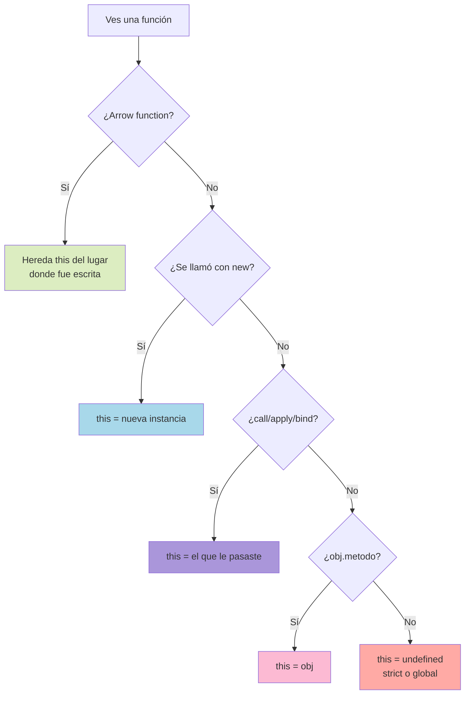

# 2.4 `this` y Contexto

> 📚 La palabra `this` es de las más **confusas** de JavaScript. Aquí la vas a entender de una vez por todas. Su valor depende de **cómo se llama** la función, no de **dónde** se escribió.

---

## ¿Qué es `this`?

`this` es una palabra clave que, dentro de una función, se refiere a **el objeto que la está ejecutando**.

Piénsalo como el **"yo" en una conversación**: depende de quién esté hablando.

- Si **Ana** dice "yo tengo 40 años", "yo" = Ana.
- Si **Luis** dice "yo tengo 30 años", "yo" = Luis.

En JavaScript, **el dueño de la función determina qué es `this`**.

---

## `this` en distintos contextos

### 1. `this` en un Objeto (método)

Cuando llamas un método con la notación `objeto.metodo()`, `this` es **el objeto antes del punto**.

```javascript
const persona = {
  nombre: "Ana",
  saludar() {
    console.log("Hola, soy " + this.nombre);
  }
};

persona.saludar(); // "Hola, soy Ana" → this = persona
```

### 2. `this` en una función "normal"

Si llamas una función **sola** (sin objeto delante), `this` apunta a:

- **`undefined`** en modo estricto (`"use strict"`).
- **`window`** (en navegador) o **`global`** (en Node) en modo no estricto.

```javascript
function mostrar() {
  console.log(this);
}

mostrar(); // window (o undefined en strict mode)
```

> ⚠️ **Trampa común:** si extraes un método de un objeto, pierde su `this`.
> 
> ```javascript
> const fn = persona.saludar;
> fn(); // "Hola, soy undefined" 😱 (porque this ya no es persona)
> ```

### 3. `this` en Arrow Functions ✨

**Las arrow functions no tienen su propio `this`**. Heredan el `this` del lugar donde fueron escritas (lexical scope).

```javascript
const persona = {
  nombre: "Ana",
  saludar: () => {
    console.log("Hola, soy " + this.nombre);
  }
};

persona.saludar(); // "Hola, soy undefined" ⚠️
// (porque la arrow heredó el this de fuera, donde no hay "nombre")
```

#### Pero esto sí es útil dentro de callbacks:

```javascript
const persona = {
  nombre: "Ana",
  amigos: ["Luis", "Carla"],
  saludarAmigos() {
    this.amigos.forEach(amigo => {
      // arrow function: hereda this del método saludarAmigos
      console.log(this.nombre + " saluda a " + amigo);
    });
  }
};

persona.saludarAmigos();
// "Ana saluda a Luis"
// "Ana saluda a Carla"
```

> 💡 **Regla de oro:**
> 
> - **Método de objeto** → función normal (`function` o sintaxis corta).
> - **Callback dentro de un método** → arrow function (para conservar `this`).

### 4. `this` en Clases

Dentro de una clase, `this` es **la instancia** del objeto.

```javascript
class Persona {
  constructor(nombre) {
    this.nombre = nombre;
  }

  saludar() {
    console.log("Soy " + this.nombre);
  }
}

const ana = new Persona("Ana");
ana.saludar(); // "Soy Ana" → this = ana
```

---

## Binding: forzar el valor de `this`

A veces necesitas **decidir tú mismo** quién es `this`. Para eso existen tres métodos: `call`, `apply` y `bind`.

### `call(thisArg, arg1, arg2, ...)`

Ejecuta la función **inmediatamente** con el `this` que le digas.

```javascript
function saludar(saludo, signo) {
  console.log(saludo + ", soy " + this.nombre + signo);
}

const ana = { nombre: "Ana" };

saludar.call(ana, "Hola", "!"); // "Hola, soy Ana!"
```

### `apply(thisArg, [argsArray])`

**Igual que `call`**, pero los argumentos van en un **array**.

```javascript
saludar.apply(ana, ["Hola", "!"]); // "Hola, soy Ana!"
```

> 💡 **Truco para recordar:**
> 
> - **c**all = **c**omma (con comas separadas).
> - **a**pply = **a**rray (en array).

### `bind(thisArg, arg1, ...)`

**No ejecuta la función**. Devuelve una **nueva función** con el `this` "amarrado".

```javascript
const saludarAna = saludar.bind(ana, "Hola");

saludarAna("!"); // "Hola, soy Ana!"
saludarAna("?"); // "Hola, soy Ana?"
```

Muy útil cuando pasas funciones como callbacks:

```javascript
const persona = {
  nombre: "Ana",
  saludar() { console.log(this.nombre); }
};

// Sin bind: pierde el this
setTimeout(persona.saludar, 1000); // undefined

// Con bind: conserva el this
setTimeout(persona.saludar.bind(persona), 1000); // "Ana"
```

---

## Resumen de cómo se decide `this`

Cuando ves una función, pregunta:

1. ¿Es una **arrow function**? → `this` viene del **lugar donde se escribió**.
2. ¿Se llamó con **`new`** (constructor o clase)? → `this` es la **nueva instancia**.
3. ¿Se llamó con **`.call/.apply/.bind`**? → `this` es el que tú le dijiste.
4. ¿Se llamó como **`objeto.metodo()`**? → `this` es el **objeto antes del punto**.
5. En cualquier otro caso → `this` es **`undefined` (strict)** o **global**.

---

## 📊 Gráfico: ¿Quién es `this`?



---

## 📝 Notas importantes

> 💡 **Nota:** Las **arrow functions no se pueden usar como métodos** si necesitas `this`. Tampoco como constructores (con `new`).

> ⚠️ **Observación:** Si alguna vez ves `this` y no estás seguro, **revisa cómo se llama la función**, no dónde está escrita.

> 🎯 **Recomendación:** En código moderno con clases, normalmente usas `bind` en el constructor para "amarrar" métodos que se van a pasar como callbacks:
> 
> ```javascript
> class App {
>   constructor() {
>     this.click = this.click.bind(this);
>   }
>   click() { console.log(this); }
> }
> ```

---

## ✅ Resumen

- **`this`** depende de **cómo se llama** la función, no de dónde se escribió.
- En un **método** `obj.fn()`: `this` = `obj`.
- En una **arrow function**: hereda el `this` del entorno léxico.
- En una **clase**: `this` es la instancia.
- **`call(this, ...args)`** y **`apply(this, [args])`** ejecutan la función con el `this` que indiques.
- **`bind(this, ...)`** devuelve una nueva función con el `this` amarrado.
- En una función "suelta" → `this` es `undefined` (strict) o `window/global`.