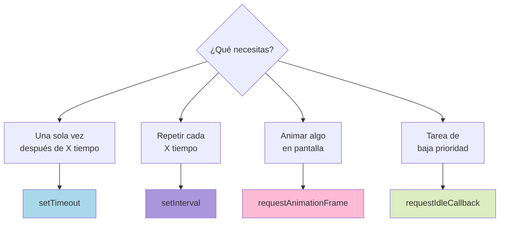

# 2.3 Timers y Scheduler APIs

> 📚 Los **timers** te permiten ejecutar código **más tarde** o **cada cierto tiempo**. Los **scheduler APIs** son herramientas modernas para coordinar tareas con el navegador.

---

## `setTimeout` — ejecutar algo **una vez** después de X tiempo

Es como poner una **alarma**: "en 3 segundos suena". Recibe dos cosas:

1. Una **función** a ejecutar.
2. El **tiempo de espera** en milisegundos (1000 ms = 1 segundo).

```javascript
setTimeout(() => {
  console.log("Han pasado 2 segundos");
}, 2000);

console.log("Esto se imprime primero");
```

**Salida:**

```
Esto se imprime primero
(2 segundos después...)
Han pasado 2 segundos
```

### Cancelar un setTimeout

Devuelve un **ID** que puedes usar para cancelarlo con `clearTimeout`.

```javascript
const id = setTimeout(() => {
  console.log("Esto NO se imprimirá");
}, 5000);

clearTimeout(id); // cancela
```

> ⚠️ **Observación:** El tiempo es **aproximado**, no exacto. El callback se ejecuta cuando el Event Loop pueda (ver tema 2.2). Si el stack está ocupado, esperará.

---

## `setInterval` — ejecutar algo **repetidamente** cada X tiempo

Como una **alarma que suena cada N segundos**, sin parar.

```javascript
const id = setInterval(() => {
  console.log("Tic");
}, 1000);

// Imprime "Tic" cada segundo, para siempre
```

### Cancelar un setInterval

**Siempre** cancélalo cuando no lo necesites, o seguirá ejecutándose.

```javascript
const id = setInterval(() => console.log("Tic"), 1000);

// Después de 5 segundos, parar
setTimeout(() => clearInterval(id), 5000);
```

> ⚠️ **Cuidado:** Si el código dentro del intervalo tarda más que el intervalo, las ejecuciones se acumulan y puede causar problemas.

---

## `requestAnimationFrame` (rAF) — para **animaciones suaves**

Le pide al **navegador** que ejecute tu función **justo antes de pintar el siguiente cuadro** de la pantalla. Lo normal son ~60 cuadros por segundo (cada ~16 ms).

```javascript
function mover() {
  caja.style.left = (parseInt(caja.style.left) + 1) + "px";
  requestAnimationFrame(mover); // pide el siguiente cuadro
}

requestAnimationFrame(mover);
```

### ¿Por qué no usar `setInterval` para animaciones?

|Con `setInterval(fn, 16)`|Con `requestAnimationFrame`|
|---|---|
|Se ejecuta aunque la pestaña esté oculta (gasta batería)|Se pausa automáticamente si la pestaña no se ve|
|No siempre coincide con el repintado del navegador|Sincronizado con el repintado (suave)|
|Puede causar parpadeos|Animaciones fluidas|

### Cancelar

```javascript
const id = requestAnimationFrame(mover);
cancelAnimationFrame(id);
```

---

## `requestIdleCallback` — ejecutar cuando el navegador esté **ocioso**

Sirve para tareas **de baja prioridad** que no son urgentes. El navegador las ejecuta cuando tenga **tiempo libre**, sin estorbar a animaciones o eventos.

```javascript
requestIdleCallback(() => {
  console.log("Hago algo cuando el navegador no está ocupado");
});
```

### Con tiempo limitado

Recibes un objeto que te dice cuánto tiempo "ocioso" queda. Útil para no excederse.

```javascript
requestIdleCallback((deadline) => {
  while (deadline.timeRemaining() > 0 && hayTareas()) {
    procesarUna();
  }
});
```

### ¿Cuándo usarlo?

- Pre-cargar datos no críticos
- Limpiar caché
- Enviar estadísticas
- Tareas que pueden esperar

### Cancelar

```javascript
const id = requestIdleCallback(fn);
cancelIdleCallback(id);
```

> ⚠️ **Observación:** Su soporte en navegadores no es 100% universal todavía. En Safari requiere verificar antes:
> 
> ```javascript
> if ("requestIdleCallback" in window) { /* ... */ }
> ```

---

## Comparación rápida

|API|Cuándo usar|Frecuencia|
|---|---|---|
|`setTimeout`|Tarea **una sola vez** después de un tiempo|Una vez|
|`setInterval`|Tarea **repetida** cada cierto tiempo|Cada X ms|
|`requestAnimationFrame`|**Animaciones suaves**|Cada cuadro (~16ms)|
|`requestIdleCallback`|Tareas de **baja prioridad**|Cuando hay tiempo libre|

---

## 📊 Gráfico: Cuándo usar cada uno



---

## Ejemplo práctico: animación con rAF

```javascript
const caja = document.getElementById("caja");
let posicion = 0;

function animar() {
  posicion += 2;
  caja.style.transform = `translateX(${posicion}px)`;

  if (posicion < 300) {
    requestAnimationFrame(animar); // sigue animando
  }
}

requestAnimationFrame(animar);
```

La caja se mueve suavemente hasta los 300 px y se detiene.

---

## 📝 Notas importantes

> 💡 **Nota:** El tiempo de `setTimeout` y `setInterval` es **mínimo, no exacto**. JavaScript no garantiza que se ejecute exactamente a los X ms.

> ⚠️ **Observación:** Si abres muchos `setInterval` sin cancelarlos, consumen memoria y CPU. **Siempre guarda el ID** y cancela cuando no lo necesites.

> 🎯 **Recomendación:**
> 
> - Animaciones → `requestAnimationFrame`.
> - Repetición lenta (cada segundo o más) → `setInterval`.
> - Tareas sin prisa → `requestIdleCallback`.
> - Para CSS, considera primero hacer animaciones con CSS puro (más eficiente).

---

## ✅ Resumen

- **`setTimeout`**: ejecuta una función **una vez** después de N ms.
- **`setInterval`**: ejecuta una función **repetidamente** cada N ms. Cancélalo con `clearInterval`.
- **`requestAnimationFrame`**: para **animaciones suaves**, sincronizadas con el navegador.
- **`requestIdleCallback`**: para tareas de **baja prioridad** que pueden esperar.
- Todos devuelven un **ID** para cancelarlos.
- Los tiempos son **aproximados**: el Event Loop puede retrasarlos.