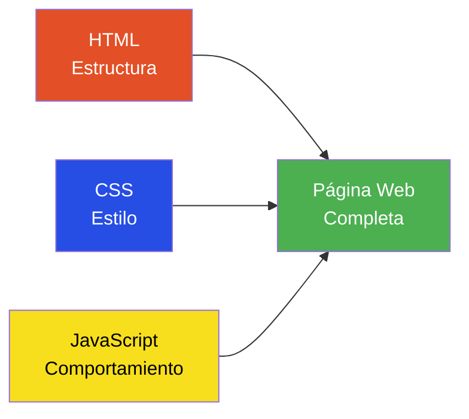
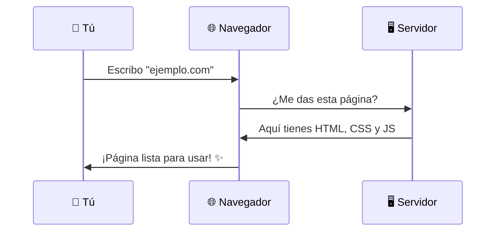
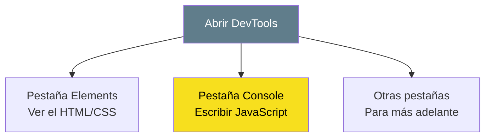
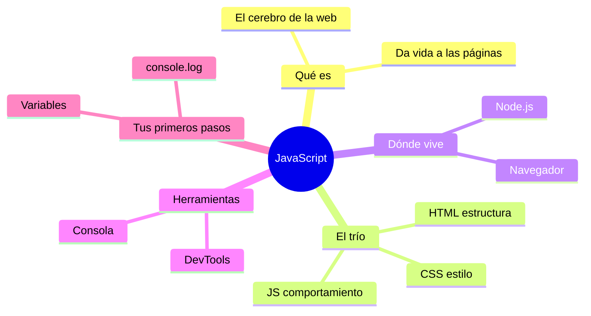

# 🧩 Módulo 1 — Introducción a JavaScript

> 💡 **Antes de empezar:** No necesitas saber nada de programación para entender este módulo. Aquí no vamos a memorizar, vamos a _entender_. Imagina que estás aprendiendo a cocinar: primero conoces la cocina, luego los ingredientes, y poco a poco preparas tu primer plato. Vamos paso a paso. 🍳

---

## 🎯 ¿Qué aprenderás en este módulo?

Al terminar serás capaz de:

- Entender qué es JavaScript y para qué sirve.
- Saber cómo trabajan juntos HTML, CSS y JavaScript.
- Comprender qué pasa "por detrás" cuando abres una página web.
- Abrir las herramientas que usan los programadores de verdad.
- Escribir tus primeras líneas de código (sí, ¡tú!).

---

## 1. ¿Qué es JavaScript?

JavaScript es un **lenguaje de programación**: una forma de darle instrucciones a la computadora para que haga cosas.

### 🎭 La metáfora del teatro

Imagina una página web como una **obra de teatro**:

- El **escenario y los actores quietos** son el contenido (texto, imágenes, botones).
- Cuando los actores **se mueven, hablan y reaccionan** al público, eso es JavaScript.

Sin JavaScript, una página sería como una foto: bonita, pero estática. Con JavaScript, la página **cobra vida**: responde cuando haces clic, valida un formulario, muestra mensajes, anima cosas.

```javascript
// Tu primera línea de JavaScript
alert("¡Hola! Soy JavaScript y acabo de cobrar vida 🎉");
```

> 🧠 **Idea clave:** JavaScript es el "cerebro" que hace que una web _reaccione_. Es el lenguaje que entienden todos los navegadores del mundo.

---

## 2. HTML + CSS + JavaScript: el trío inseparable

Una página web moderna se construye con tres tecnologías que trabajan en equipo. Cada una tiene un trabajo diferente.

### 🏠 La metáfora de la casa

|Tecnología|Rol en la casa|¿Qué hace?|
|---|---|---|
|**HTML**|La estructura (paredes, puertas)|Define _qué hay_: títulos, párrafos, imágenes, botones.|
|**CSS**|La decoración (pintura, muebles)|Define _cómo se ve_: colores, tamaños, posiciones.|
|**JavaScript**|La electricidad y la gente|Define _qué hace_: el comportamiento y la interacción.|

Una casa con solo paredes (HTML) se ve incompleta. Con decoración (CSS) ya es acogedora. Pero solo cuando le pones luz, agua y movimiento (JavaScript) se vuelve una casa donde _vivir_.



> 🔑 **Para recordar:** HTML es el _qué_, CSS es el _cómo se ve_, JavaScript es el _qué hace_.

---

## 3. ¿Cómo funciona una página web?

Cuando escribes una dirección (como `google.com`) y presionas Enter, pasan varias cosas en menos de un segundo.

### 📮 La metáfora del restaurante

1. **Tú haces el pedido** → escribes la dirección en el navegador.
2. **El mesero lleva el pedido a la cocina** → tu navegador pide los archivos a un servidor.
3. **La cocina prepara el plato** → el servidor envía de vuelta el HTML, CSS y JavaScript.
4. **El plato llega a tu mesa** → el navegador _arma_ todo y te muestra la página lista.



> 🧠 **Idea clave:** Tú nunca ves los "archivos crudos". El navegador los lee, los arma y te muestra el resultado final, igual que tú no ves la cocina, solo el plato servido.

---

## 4. Navegador vs Node.js: dos lugares donde vive JavaScript

JavaScript nació para vivir dentro del **navegador**, pero hoy también puede correr **fuera** de él, gracias a algo llamado **Node.js**.

### 🐠 La metáfora del pez y el acuario

- **El navegador** (Chrome, Firefox, Edge) es el _acuario original_ donde nació JavaScript. Aquí controla páginas web.
- **Node.js** es como sacar al pez y ponerlo en un _lago más grande_: ahora JavaScript puede crear servidores, herramientas, apps de escritorio y mucho más.

||Navegador|Node.js|
|---|---|---|
|**¿Dónde corre?**|Dentro de Chrome, Firefox, etc.|En tu computadora, sin navegador.|
|**¿Para qué se usa?**|Páginas web interactivas.|Servidores, herramientas, apps.|
|**¿Lo necesitas ahora?**|Sí, ya lo tienes.|No todavía, llegará más adelante.|

> 💡 **No te preocupes por Node.js todavía.** En este curso empezamos en el navegador, que ya tienes instalado. Solo necesitas saber que JavaScript es tan versátil que puede vivir en dos mundos.

---

## 5. ECMAScript y JavaScript moderno

Quizás escuches palabras raras como **ECMAScript**, **ES6** o **JavaScript moderno**. Suena complicado, pero es muy simple.

### 📖 La metáfora del idioma y su diccionario

- **ECMAScript** es como el **diccionario oficial** que define las reglas del idioma.
- **JavaScript** es el **idioma que hablamos** todos los días siguiendo esas reglas.

Cada cierto tiempo, el diccionario se actualiza y agrega "palabras nuevas" (funciones más fáciles y potentes). La gran actualización de 2015 se llamó **ES6**, y desde entonces hablamos de **"JavaScript moderno"**.

```javascript
// Forma antigua de saludar
var nombre = "Ana";
console.log("Hola " + nombre);

// Forma moderna (más limpia y clara)
const nombre = "Ana";
console.log(`Hola ${nombre}`);
```

> 🔑 **Para recordar:** No tienes que aprenderte las versiones. Solo aprenderás directamente la forma _moderna_, que es más fácil y la que usan los profesionales hoy.

---

## 6. Las DevTools: el taller secreto del navegador

Todo navegador esconde un **panel de herramientas para programadores** llamado **DevTools** (Developer Tools). Es donde la magia se vuelve visible.

### 🔧 La metáfora del taller del mecánico

Una página web es como un carro. Normalmente solo lo conduces. Pero las DevTools son como **abrir el capó**: puedes ver el motor, hacer pruebas y entender cómo funciona todo por dentro.

**Cómo abrirlas (¡pruébalo ahora mismo!):**

- En Windows/Linux: presiona `F12` o `Ctrl + Shift + I`
- En Mac: presiona `Cmd + Option + I`
- O haz clic derecho en cualquier página → **"Inspeccionar"**



> 😌 **No tengas miedo.** Nada de lo que hagas aquí daña tu computadora ni la página real. Es un espacio seguro para experimentar. Si algo se ve raro, solo recarga la página y vuelve a la normalidad.

---

## 7. La consola: tu primer lugar para escribir código

Dentro de las DevTools hay una pestaña llamada **Console** (Consola). Es el lugar perfecto para escribir JavaScript y ver resultados al instante.

### 💬 La metáfora del chat con la computadora

La consola es como un **chat directo con tu navegador**. Tú escribes algo, presionas Enter, y él te responde de inmediato. No hay nada que instalar ni configurar.

```javascript
// Escribe esto en la consola y presiona Enter
console.log("¡Mi primer mensaje!");
```

El comando `console.log()` es el más usado por todos los programadores. Sirve para **mostrar mensajes** y ver qué está pasando dentro de tu código.

> 🧠 **Idea clave:** `console.log()` es tu mejor amigo. Lo usarás miles de veces para "ver" lo que hace tu programa, como encender una linterna dentro de una caja oscura.

---

## 🛠️ Mini práctica: ¡tu turno!

Llegó el momento de ensuciarte las manos. Abre la consola del navegador (`F12` → pestaña **Console**) y prueba estos ejercicios. No te preocupes por equivocarte: **equivocarse es parte de aprender**. 🚀

### Ejercicio 1 — Mostrar mensajes

Escribe esto y presiona Enter:

```javascript
console.log("Estoy aprendiendo JavaScript 🎉");
```

✅ Deberías ver tu mensaje aparecer en la consola. ¡Acabas de programar!

### Ejercicio 2 — Cambiar valores

Vamos a guardar información en "cajitas" llamadas **variables** y luego cambiarlas:

```javascript
let edad = 20;
console.log(edad);   // Muestra: 20

edad = 25;
console.log(edad);   // Muestra: 25
```

> 🎁 **Metáfora:** Una variable es como una **caja con etiqueta**. La etiqueta es el nombre (`edad`) y dentro guardas un valor (`20`). Puedes cambiar lo que hay dentro cuando quieras.

### Ejercicio 3 — Ejecutar scripts simples

Combina varias cosas en un mini-programa:

```javascript
let nombre = "Carlos";
let pais = "Colombia";
console.log(`Hola, soy ${nombre} y vivo en ${pais}.`);
```

✅ Resultado esperado: `Hola, soy Carlos y vivo en Colombia.`

Ahora **cámbialo por tu propio nombre y país** y vuelve a ejecutarlo. 😎

---

## 🧭 Resumen visual del módulo



---

## ✅ Checklist: ¿lo lograste?

Marca mentalmente lo que ya entiendes:

- [ ] Sé que JavaScript le da _comportamiento_ a las páginas web.
- [ ] Puedo explicar la diferencia entre HTML, CSS y JavaScript.
- [ ] Entiendo cómo un navegador pide y muestra una página.
- [ ] Sé que JavaScript vive en el navegador y también en Node.js.
- [ ] Abrí las DevTools y encontré la consola.
- [ ] Escribí mi primer `console.log()`.

Si marcaste aunque sea la mitad, **vas excelente**. El resto se afianza con la práctica. 💪

---

## 🌱 Reflexión final: pierde el miedo al código

El código no es magia ni algo reservado para "genios". Es simplemente un **conjunto de instrucciones** que aprendes a escribir poco a poco, como aprendiste a escribir en tu idioma.

Vas a equivocarte muchas veces, y eso está **perfecto**: cada error es una pista que te acerca a la solución. Los mejores programadores del mundo siguen cometiendo errores todos los días; la diferencia es que ya no les tienen miedo.

> 🎯 **El secreto:** No tienes que entenderlo todo de golpe. Solo tienes que dar el siguiente pasito. Y ya diste el primero. 👏

**¡Nos vemos en el Módulo 2!**