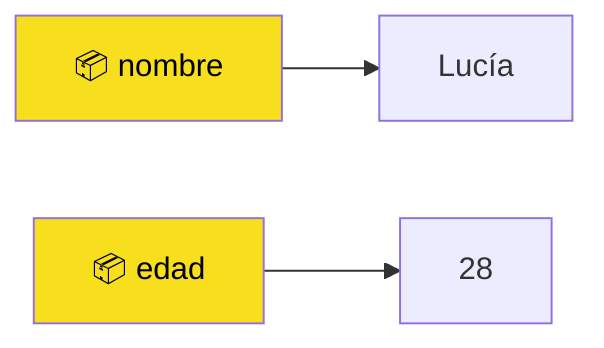
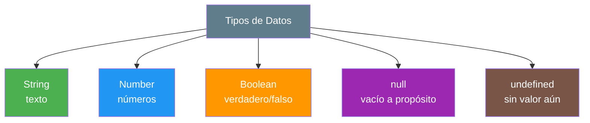
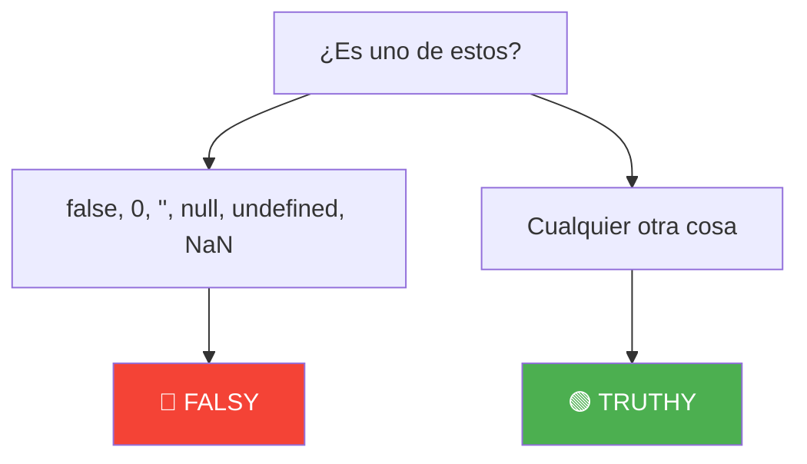
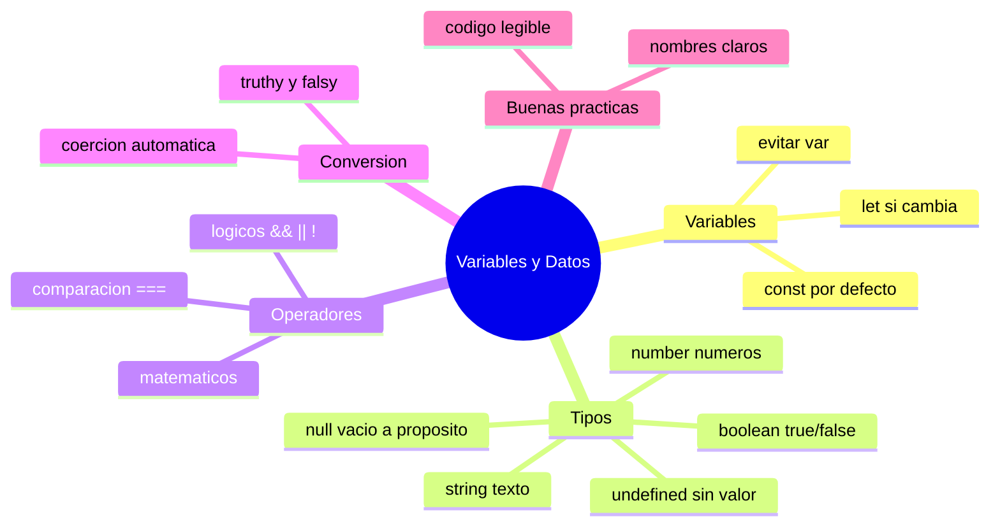

# 🧩 Módulo 2 — Variables y Datos

> 💡 **Antes de empezar:** En el Módulo 1 aprendiste a darle órdenes a la computadora. Ahora vamos a aprender a _guardar información_ para usarla cuando queramos. Imagina que tu cocina ya está lista; hoy organizamos la despensa: dónde guardar cada ingrediente y de qué tipo es cada uno. 🥫

---

## 🎯 ¿Qué aprenderás en este módulo?

Al terminar serás capaz de:

- Guardar información usando variables con `let` y `const`.
- Reconocer los distintos _tipos de datos_ y cuándo usar cada uno.
- Hacer operaciones matemáticas, comparaciones y combinar condiciones.
- Entender cómo JavaScript convierte un tipo de dato en otro.
- Escribir código limpio que cualquiera (¡incluido tu yo del futuro!) pueda leer.

---

## 1. Variables: las cajas donde guardamos información

Una **variable** es un espacio con nombre donde guardas un valor para usarlo después.

### 📦 La metáfora de las cajas etiquetadas

Imagina un estante lleno de cajas. Cada caja tiene una **etiqueta** (el nombre) y un **contenido** (el valor). Cuando necesitas algo, lo buscas por su etiqueta en lugar de recordar dónde lo dejaste.

```javascript
let nombre = "Lucía";   // Caja etiquetada "nombre" que contiene "Lucía"
let edad = 28;          // Caja etiquetada "edad" que contiene 28
```



> 🧠 **Idea clave:** En vez de repetir el valor por todos lados, lo guardas una vez en una variable y lo reutilizas por su nombre.

---

### `let`: la caja que puede cambiar

`let` se usa cuando el contenido de la caja **puede cambiar** más adelante.

```javascript
let puntos = 0;
console.log(puntos);  // Muestra: 0

puntos = 10;          // Cambiamos el contenido
console.log(puntos);  // Muestra: 10
```

> 🎮 **Metáfora:** `let` es como el marcador de un videojuego: empieza en 0 y va cambiando mientras juegas.

---

### `const`: la caja sellada

`const` se usa cuando el contenido **nunca va a cambiar**. Si intentas cambiarlo, JavaScript te avisa con un error.

```javascript
const fechaNacimiento = "1995-04-12";
console.log(fechaNacimiento);  // Muestra: 1995-04-12

fechaNacimiento = "2000-01-01"; // ❌ Error: no se puede reasignar
```

> 🔒 **Metáfora:** `const` es como tu fecha de nacimiento o tu nombre de pila: una vez definidos, no cambian.

**¿Cuál uso?** Una regla sencilla y profesional:

> 🔑 **Usa `const` por defecto.** Solo cambia a `let` cuando sepas que el valor va a cambiar. Esto hace tu código más seguro y predecible.

---

### Por qué evitar `var`

Quizás veas en internet código viejo que usa `var`. Es la forma _antigua_ de crear variables, y tiene comportamientos confusos que causan errores difíciles de encontrar.

### 🚪 La metáfora de la puerta sin cerradura

`var` es como una caja **sin tapa**: su contenido se puede "escapar" a lugares donde no esperabas, y eso provoca sorpresas desagradables. `let` y `const`, en cambio, mantienen todo ordenado dentro de su lugar.

```javascript
// ❌ Forma antigua (evítala)
var ciudad = "Madrid";

// ✅ Forma moderna (úsala siempre)
let ciudad = "Madrid";
const pais = "España";
```

> ⚠️ **Para recordar:** No es que `var` esté "prohibido", pero el JavaScript moderno usa `let` y `const` porque son más claros y seguros. Tú empieza directamente con los buenos hábitos.

---

## 2. Tipos de datos: los diferentes "ingredientes"

No toda la información es igual. Un nombre no es lo mismo que un número, y un "sí/no" es diferente de ambos. A estos diferentes formatos los llamamos **tipos de datos**.

### 🍱 La metáfora de la lonchera

Una lonchera puede llevar cosas distintas: un sándwich (texto), unas monedas (números), una nota que dice "sí almorcé" (verdadero/falso). Cada cosa tiene su naturaleza. JavaScript también distingue entre tipos.



---

### Strings (texto)

Son cualquier texto: nombres, frases, mensajes. Siempre van entre **comillas**.

```javascript
let saludo = "Hola mundo";
let nombre = 'Andrea';
let frase = `Tengo ${edad} años`;  // comillas especiales para insertar variables
```

> 📝 **Tip:** Las comillas invertidas (`` ` ``) se llaman _template strings_ y te dejan meter variables dentro del texto con `${ }`. Son las más cómodas.

---

### Numbers (números)

Sirven para cálculos. **No** llevan comillas. Pueden ser enteros o con decimales.

```javascript
let cantidad = 5;
let precio = 19.99;
let temperatura = -3;
```

> ⚠️ **Cuidado:** `"5"` (con comillas) es un texto, no un número. No es lo mismo `5 + 5` (igual a `10`) que `"5" + "5"` (igual a `"55"`).

---

### Booleans (verdadero o falso)

Solo tienen dos valores posibles: `true` (verdadero) o `false` (falso). Son la base de las decisiones.

```javascript
let estaLloviendo = false;
let mayorDeEdad = true;
```

> 💡 **Metáfora:** Un boolean es como un interruptor de luz: solo puede estar encendido (`true`) o apagado (`false`).

---

### null (vacío a propósito)

`null` significa "aquí no hay nada, **y lo puse así a propósito**".

```javascript
let premioGanado = null;  // Todavía no ha ganado ningún premio
```

> 🗑️ **Metáfora:** `null` es como una caja que vaciaste tú mismo, sabiendo que está vacía.

---

### undefined (sin valor todavía)

`undefined` significa "esta variable existe pero **aún no le has dado valor**". JavaScript lo asigna automáticamente.

```javascript
let direccion;
console.log(direccion);  // Muestra: undefined
```

> 📦 **Metáfora:** `undefined` es una caja recién comprada que todavía no has llenado.

**Diferencia clave:** `null` es un vacío que _tú_ decidiste; `undefined` es un vacío que ocurre _porque aún no asignaste nada_.

---

## 3. Operadores: las herramientas para trabajar con datos

Los **operadores** son símbolos que hacen algo con tus datos: sumarlos, compararlos o combinarlos.

### Operadores matemáticos

Funcionan igual que en la calculadora del colegio.

|Operador|Significado|Ejemplo|Resultado|
|---|---|---|---|
|`+`|Suma|`5 + 3`|`8`|
|`-`|Resta|`10 - 4`|`6`|
|`*`|Multiplicación|`6 * 2`|`12`|
|`/`|División|`20 / 4`|`5`|
|`%`|Resto (lo que sobra)|`10 % 3`|`1`|

```javascript
let total = 100;
let descuento = 20;
let precioFinal = total - descuento;
console.log(precioFinal);  // Muestra: 80
```

> 🧮 **El raro es `%`:** El operador "módulo" te da lo que _sobra_ de una división. `10 % 3` es `1` porque 3 cabe 3 veces en 10 y sobra 1. Es súper útil para saber si un número es par o impar.

---

### Operadores de comparación

Comparan dos valores y siempre devuelven un boolean (`true` o `false`).

|Operador|Significado|Ejemplo|Resultado|
|---|---|---|---|
|`===`|¿Son iguales?|`5 === 5`|`true`|
|`!==`|¿Son diferentes?|`5 !== 3`|`true`|
|`>`|¿Mayor que?|`7 > 10`|`false`|
|`<`|¿Menor que?|`7 < 10`|`true`|
|`>=`|¿Mayor o igual?|`5 >= 5`|`true`|
|`<=`|¿Menor o igual?|`4 <= 3`|`false`|

```javascript
let edad = 18;
console.log(edad >= 18);  // Muestra: true (¡es mayor de edad!)
```

> ⚠️ **Importante:** Usa siempre `===` (tres iguales) para comparar, no `==` (dos iguales). El de tres es más estricto y evita errores raros. Lo entenderás mejor en la sección de coerción.

---

### Operadores lógicos

Combinan condiciones para tomar decisiones más complejas.

|Operador|Nombre|Significado|
|---|---|---|
|`&&`|Y (AND)|Verdadero solo si **ambas** condiciones lo son.|
|`\|`|O (OR)|Verdadero si **al menos una** lo es.|
|`!`|NO (NOT)|Invierte el valor (verdadero ↔ falso).|

```javascript
let tieneEntrada = true;
let esMayorDeEdad = true;

// Para entrar al concierto necesita AMBAS cosas
console.log(tieneEntrada && esMayorDeEdad);  // true

// Para un descuento basta UNA de dos condiciones
let esEstudiante = false;
let esJubilado = true;
console.log(esEstudiante || esJubilado);  // true
```

> 🚪 **Metáfora:** `&&` es como un portero que pide _dos_ requisitos para dejarte pasar. `||` es un portero más flexible que se conforma con _uno_. `!` es un portero al revés que hace justo lo contrario.

---

## 4. Conversión de tipos

A veces JavaScript necesita transformar un dato de un tipo a otro. Esto puede pasar de forma automática (coerción) o porque tú lo pides.

### Coerción: las transformaciones automáticas

La **coerción** es cuando JavaScript convierte un tipo de dato por su cuenta, sin que se lo pidas. A veces ayuda, a veces sorprende.

```javascript
console.log("5" + 3);   // "53"  → convirtió el 3 en texto y los pegó
console.log("5" - 3);   // 2     → convirtió el "5" en número y restó
```

### 🌐 La metáfora del traductor automático

JavaScript es como un traductor que intenta "entenderte" aunque mezcles idiomas. A veces acierta, a veces traduce algo raro. Por eso es bueno conocer estas reglas para que no te tome por sorpresa.

> 🛠️ **Conversión a propósito:** Cuando quieras controlar la transformación, hazlo tú mismo:

```javascript
let texto = "42";
let numero = Number(texto);   // Convierte "42" en 42
console.log(numero + 8);      // 50

let valor = 100;
let comoTexto = String(valor); // Convierte 100 en "100"
```

> 🔑 **Por esto usamos `===`:** El comparador estricto `===` _no_ aplica coerción. Así, `5 === "5"` da `false` (un número no es lo mismo que un texto), lo cual es el comportamiento correcto y predecible.

---

### Truthy y Falsy: valores que "parecen" verdaderos o falsos

En JavaScript, cualquier valor puede comportarse como `true` o `false` cuando se evalúa en una condición. A esto le decimos **truthy** (se comporta como verdadero) y **falsy** (se comporta como falso).

Hay solo **unos pocos valores falsy**. ¡Memoriza estos y el resto es truthy!

```javascript
// 🔴 Valores FALSY (se comportan como false)
false
0
""          // texto vacío
null
undefined
NaN         // "Not a Number", un número inválido

// 🟢 Todo lo demás es TRUTHY (se comporta como true)
"hola"
42
-1
"false"     // ¡ojo! es un texto, así que es truthy
```



> 💡 **Para qué sirve:** Esto te permitirá escribir condiciones muy elegantes más adelante, como "si el usuario escribió algo (truthy), salúdalo".

---

## 5. Buenas prácticas: escribe código que se entienda

Escribir código que _funciona_ es solo la mitad del trabajo. La otra mitad es escribirlo de forma que **otra persona (o tú dentro de un mes) lo entienda fácilmente**.

### ✍️ Nombres claros

El nombre de una variable debe explicar qué guarda, sin necesidad de adivinar.

```javascript
// ❌ Confuso: ¿qué es "x"? ¿qué es "d"?
let x = 1500;
let d = 0.1;

// ✅ Claro: se entiende solo
let salarioMensual = 1500;
let tasaDescuento = 0.1;
```

> 📛 **Metáfora:** Un buen nombre de variable es como una buena etiqueta en una caja de mudanza. "Cosas" no ayuda; "Platos de la cocina" sí. Tu yo del futuro te lo agradecerá.

**Reglas rápidas para nombres:**

- Usa `camelCase`: la primera palabra en minúscula y las siguientes con mayúscula inicial → `nombreCompleto`, `precioTotal`.
- Que describan el contenido → `edadUsuario`, no `eu`.
- No empieces con números ni uses espacios → `2nombre` ❌, `mi nombre` ❌.

---

### 📐 Código legible

Pequeños hábitos hacen una gran diferencia:

```javascript
// ❌ Todo amontonado y difícil de leer
let a=5;let b=10;let c=a+b;console.log(c);

// ✅ Ordenado, con espacios y una idea por línea
let primerNumero = 5;
let segundoNumero = 10;
let suma = primerNumero + segundoNumero;
console.log(suma);
```

> 🧹 **Metáfora:** Un código ordenado es como una cocina limpia: encuentras todo rápido y cocinar es un placer. Un código amontonado es como una cocina desordenada donde nada aparece cuando lo necesitas.

---

## 🛠️ Mini práctica: ¡tu turno!

Abre la consola (`F12` → **Console**) y prueba estos retos. Recuerda: equivocarte es parte del juego. 🎲

### Ejercicio 1 — Crea tu ficha personal

```javascript
const nombre = "TU NOMBRE";
let edad = 25;
const tieneMascota = true;

console.log(`Me llamo ${nombre}, tengo ${edad} años.`);
console.log(`¿Tengo mascota? ${tieneMascota}`);
```

Cámbialo con tus datos reales y ejecútalo.

### Ejercicio 2 — Haz una mini calculadora

```javascript
let precio = 50;
let cantidad = 3;
let total = precio * cantidad;
console.log(`El total a pagar es: ${total}`);  // 150
```

Cambia los valores y observa cómo cambia el resultado.

### Ejercicio 3 — Adivina el resultado (antes de ejecutar)

Intenta predecir qué mostrará cada línea, luego compruébalo:

```javascript
console.log(10 > 5);          // ¿true o false?
console.log("5" === 5);       // ¿true o false?
console.log(0 || "Hola");     // ¿qué muestra?
console.log(true && false);   // ¿true o false?
```

> 🎯 **Pista:** Repasa las secciones de comparación, truthy/falsy y operadores lógicos si dudas. ¡Equivocarte aquí es aprender!

---

## 🧭 Resumen visual del módulo



---

## ✅ Checklist: ¿lo lograste?

- [ ] Sé cuándo usar `const` y cuándo `let`, y por qué evitar `var`.
- [ ] Distingo strings, numbers, booleans, `null` y `undefined`.
- [ ] Puedo usar operadores matemáticos, de comparación y lógicos.
- [ ] Entiendo qué es la coerción y por qué prefiero `===`.
- [ ] Reconozco los valores falsy y sé que el resto es truthy.
- [ ] Escribo nombres de variables claros y código ordenado.

Si marcaste la mayoría, **vas por muy buen camino**. Lo demás se afianza practicando. 💪

---

## 🌱 Reflexión final

Acabas de aprender el "vocabulario básico" de la programación. Las variables y los tipos de datos son los ladrillos con los que construirás _todo_ lo demás. Puede que ahora parezcan muchas reglas, pero pronto las usarás sin pensar, igual que ya no piensas en las reglas de ortografía cuando escribes un mensaje.

> 🎯 **El secreto sigue siendo el mismo:** un pasito a la vez. No memorices, _experimenta_. La consola está ahí para que pruebes mil veces sin miedo. Cada cosa que rompes y arreglas te enseña más que mil teorías.

**¡Nos vemos en el Módulo 3!**