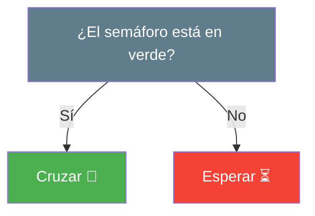
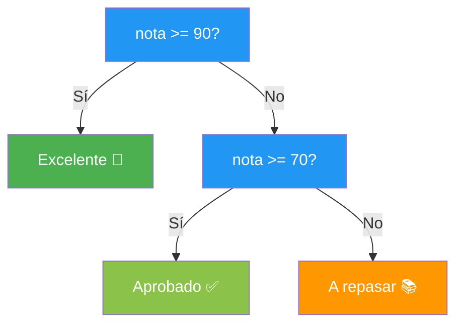
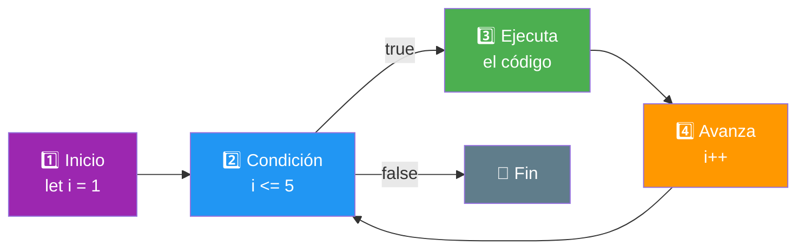
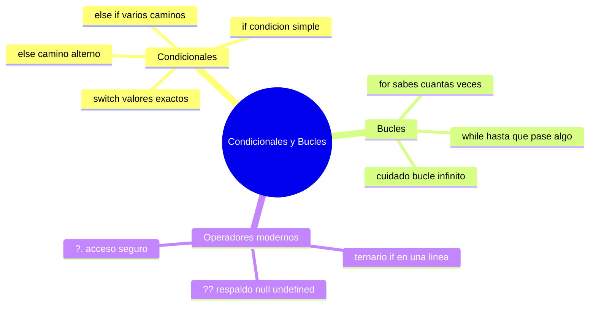

# 🧩 Módulo 3 — Condicionales y Bucles

> 💡 **Antes de empezar:** Hasta ahora tu código se ejecutaba línea por línea, de arriba abajo, sin desviarse. Hoy le damos _poder de decisión_ y _capacidad de repetir tareas_. Es como pasar de leer una receta fija a tener un cocinero que decide qué hacer según los ingredientes que tenga y que puede repetir un paso las veces necesarias. 👨‍🍳

---

## 🎯 ¿Qué aprenderás en este módulo?

Al terminar serás capaz de:

- Hacer que tu código **tome decisiones** con `if`, `else` y `switch`.
- Repetir tareas automáticamente con bucles `for` y `while`.
- Usar atajos modernos y elegantes: el operador ternario, `??` y `?.`.
- Escribir programas que reaccionan a diferentes situaciones.

---

## 1. Condicionales: hacer que el código decida

Un **condicional** permite que tu programa elija qué hacer según se cumpla o no una condición.

### 🚦 La metáfora del semáforo

Tú no cruzas la calle de forma automática: _miras el semáforo y decides_. Si está en verde, cruzas; si no, esperas. Los condicionales le dan esa misma capacidad de decisión a tu código.



---

### `if`: "si pasa esto, haz aquello"

`if` ejecuta un bloque de código **solo si** la condición es verdadera (truthy).

```javascript
let edad = 20;

if (edad >= 18) {
  console.log("Puedes entrar 🎉");
}
```

Si `edad >= 18` es `true`, muestra el mensaje. Si es `false`, simplemente no pasa nada.

> 🧠 **Idea clave:** Lo que va entre paréntesis `( )` es la _pregunta_, y lo que va entre llaves `{ }` es lo que se hace _si la respuesta es sí_.

---

### `else`: "y si no, haz otra cosa"

`else` define qué hacer cuando la condición **no** se cumple.

```javascript
let edad = 15;

if (edad >= 18) {
  console.log("Puedes entrar 🎉");
} else {
  console.log("Lo siento, eres menor de edad 🚫");
}
```

¿Y si hay más de dos caminos? Usamos `else if` para encadenar varias preguntas:

```javascript
let nota = 85;

if (nota >= 90) {
  console.log("Excelente 🌟");
} else if (nota >= 70) {
  console.log("Aprobado ✅");
} else {
  console.log("A repasar 📚");
}
```

> 🍴 **Metáfora:** Es como elegir en un menú. "¿Quieres pizza? Si no, ¿pasta? Si no, ensalada." JavaScript revisa cada opción _en orden_ y se queda con la primera que sea verdadera.



---

### `switch`: cuando hay muchas opciones exactas

Cuando comparas **una sola variable** contra muchos valores posibles, encadenar `else if` se vuelve cansado. `switch` es más limpio para esos casos.

```javascript
let dia = "martes";

switch (dia) {
  case "lunes":
    console.log("Inicio de semana 😪");
    break;
  case "martes":
    console.log("Día productivo 💪");
    break;
  case "viernes":
    console.log("¡Casi finde! 🎉");
    break;
  default:
    console.log("Un día más");
}
```

Tres detalles importantes:

- Cada `case` es una opción posible.
- `break` significa "ya encontré mi respuesta, salgo del switch". **Sin él, sigue ejecutando los siguientes casos por error.**
- `default` es el "ninguna de las anteriores", como el `else`.

> 🎰 **Metáfora:** `switch` es como una máquina expendedora. Presionas el botón A1 y sale _exactamente_ ese producto. Cada `case` es un botón con una respuesta exacta.

> 💡 **¿if o switch?** Usa `if/else` cuando evalúas _rangos o condiciones complejas_ (mayor que, combinaciones). Usa `switch` cuando comparas _una variable contra valores exactos_.

---

## 2. Bucles: repetir sin escribir mil veces lo mismo

Un **bucle** repite un bloque de código varias veces. Es una de las cosas que mejor hacen las computadoras: tareas repetitivas, sin cansarse ni quejarse.

### 🔁 La metáfora de las flexiones

Imagina que tu entrenador te dice: "haz 10 flexiones". No te da 10 órdenes separadas; te da _una instrucción que se repite 10 veces_. Eso es un bucle.

```javascript
// ❌ Sin bucle: tedioso y repetitivo
console.log("Flexión 1");
console.log("Flexión 2");
console.log("Flexión 3");
// ... y así hasta 10 😩

// ✅ Con bucle: una sola instrucción
for (let i = 1; i <= 10; i++) {
  console.log("Flexión " + i);
}
```

---

### `for`: cuando sabes cuántas veces repetir

El bucle `for` es ideal cuando conoces **el número de repeticiones**. Tiene tres partes dentro de los paréntesis:

```javascript
for (let i = 1; i <= 5; i++) {
  console.log("Vuelta número " + i);
}
```



Desglose de las tres partes:

1. **Inicio** (`let i = 1`): desde dónde empieza el contador.
2. **Condición** (`i <= 5`): mientras esto sea verdadero, sigue repitiendo.
3. **Avance** (`i++`): qué pasa al final de cada vuelta (`i++` suma 1 al contador).

> 🪜 **Metáfora:** El `for` es como subir una escalera contando escalones: empiezas en el 1, sigues mientras no llegues al último, y subes un escalón en cada paso.

---

### `while`: cuando repites "mientras" se cumpla algo

El bucle `while` repite **mientras** una condición sea verdadera, sin saber de antemano cuántas veces será.

```javascript
let energia = 5;

while (energia > 0) {
  console.log("Sigo trabajando, energía: " + energia);
  energia = energia - 1;
}
console.log("Necesito descansar 😴");
```

> 🎮 **Metáfora:** El `while` es como jugar _mientras_ te queden vidas. No sabes cuántas partidas jugarás; sigues jugando hasta que se acaben.

> ⚠️ **¡Cuidado con el bucle infinito!** Si la condición _nunca_ se vuelve falsa, el bucle se repite por siempre y congela el programa. Asegúrate de que algo cambie en cada vuelta para que el bucle pueda terminar (en el ejemplo, `energia` baja de 1 en 1).

> 💡 **¿for o while?** Usa `for` cuando _sabes cuántas veces_ (recorrer una lista de 10 elementos). Usa `while` cuando repites _hasta que pase algo_ (hasta que el usuario adivine la contraseña).

---

## 3. Operadores modernos: atajos elegantes

JavaScript moderno trae herramientas que hacen tu código más corto y limpio. No son obligatorias, pero te encantará usarlas.

### El operador ternario: un `if/else` en una línea

Cuando solo necesitas elegir entre dos opciones, el ternario lo resuelve en una sola línea.

```javascript
// Forma larga
let mensaje;
if (edad >= 18) {
  mensaje = "Adulto";
} else {
  mensaje = "Menor";
}

// Forma corta con ternario (¡lo mismo en una línea!)
let mensaje = edad >= 18 ? "Adulto" : "Menor";
```

La estructura se lee así:

```
condición ? valorSiEsVerdadero : valorSiEsFalso
```

> ⚖️ **Metáfora:** El ternario es como una balanza con dos platos. La pregunta (`?`) decide hacia qué lado caer, y los dos posibles resultados están separados por dos puntos (`:`).

> 💡 **Tip:** Úsalo para decisiones _simples_. Si la lógica es complicada, mejor un `if/else` normal que se lea claro.

---

### `??` (Nullish Coalescing): un valor de respaldo

El operador `??` significa: "usa este valor, **pero si es `null` o `undefined`, usa este otro de respaldo**".

```javascript
let nombreUsuario = null;
let nombre = nombreUsuario ?? "Invitado";
console.log(nombre);  // Muestra: "Invitado"
```

### 🛟 La metáfora del plan B

`??` es como tener un plan de respaldo. "Voy a usar mi auto, pero _si no tengo auto_, tomo el bus." Si lo de la izquierda está vacío (`null`/`undefined`), entra el plan B de la derecha.

> ⚠️ **Diferencia con `||`:** El operador `||` también da respaldo, pero salta con _cualquier_ valor falsy (incluyendo `0` o `""`). En cambio `??` _solo_ salta con `null` y `undefined`. Esto importa:

```javascript
let cantidad = 0;

console.log(cantidad || 10);  // 10  ❌ (pensó que 0 estaba "vacío")
console.log(cantidad ?? 10);  // 0   ✅ (respeta el 0 como valor válido)
```

---

### `?.` (Optional Chaining): preguntar sin que truene

El operador `?.` te permite acceder a información que _quizás no exista_, sin que el programa se rompa con un error.

```javascript
let usuario = {
  nombre: "Ana"
  // no tiene "direccion"
};

// ❌ Sin ?. esto da error y rompe el programa
// console.log(usuario.direccion.ciudad);

// ✅ Con ?. simplemente devuelve undefined, sin romperse
console.log(usuario.direccion?.ciudad);  // undefined
```

### 🚪 La metáfora de tocar la puerta con cuidado

`?.` es como tocar una puerta antes de entrar. Si la habitación existe, entras y miras dentro. Si no existe, te das media vuelta tranquilamente en vez de estrellarte contra una pared.

> 💡 **Para qué sirve:** Es muy útil cuando trabajas con datos que vienen de internet o de un usuario, donde no siempre sabes si toda la información estará completa.

> 🎁 **Combo poderoso:** `?.` y `??` son grandes aliados. `usuario.direccion?.ciudad ?? "Sin ciudad"` significa: "dame la ciudad si existe, y si no, di 'Sin ciudad'".

---

## 🛠️ Mini práctica: ¡tu turno!

Abre la consola (`F12` → **Console**) y prueba estos retos. Recuerda: cada error es una pista, no un fracaso. 🧭

### Ejercicio 1 — Clasificador de edad

```javascript
let edad = 25;

if (edad < 13) {
  console.log("Niño 🧒");
} else if (edad < 18) {
  console.log("Adolescente 🧑");
} else {
  console.log("Adulto 🧓");
}
```

Cambia el valor de `edad` y observa qué mensaje aparece cada vez.

### Ejercicio 2 — Cuenta regresiva con bucle

```javascript
for (let i = 5; i >= 1; i--) {
  console.log(i);
}
console.log("¡Despegue! 🚀");
```

Modifícalo para que cuente del 1 al 10 hacia arriba.

### Ejercicio 3 — El día de la semana con switch

```javascript
let dia = "sabado";

switch (dia) {
  case "sabado":
  case "domingo":
    console.log("¡Fin de semana! 🎉");
    break;
  default:
    console.log("Día laboral 💼");
}
```

> 🔍 **Observa:** Dos `case` juntos (sin `break` entre ellos) comparten la misma respuesta. ¡Es un truco útil!

### Ejercicio 4 — Atajos modernos

```javascript
let puntos = 0;
let mensaje = puntos > 0 ? "Tienes puntos" : "Sin puntos aún";
console.log(mensaje);

let apodo = null;
console.log(apodo ?? "Anónimo");  // ¿qué muestra?
```

Predice los resultados antes de ejecutar. ✨

---

## 🧭 Resumen visual del módulo



---

## ✅ Checklist: ¿lo lograste?

- [ ] Uso `if`, `else` y `else if` para tomar decisiones.
- [ ] Sé cuándo conviene usar `switch` en vez de muchos `if`.
- [ ] Repito tareas con `for` cuando sé cuántas veces.
- [ ] Uso `while` para repetir hasta que algo cambie, evitando bucles infinitos.
- [ ] Escribo decisiones simples con el operador ternario.
- [ ] Doy valores de respaldo con `??` y entiendo su diferencia con `||`.
- [ ] Accedo a datos que quizás no existan con `?.` sin que truene.

Si marcaste la mayoría, **felicidades**: tu código ya piensa y actúa por sí mismo. 💪

---

## 🌱 Reflexión final

Este módulo es un salto enorme. Hasta ahora tus programas eran como un tren en una sola vía; ahora tienen _intersecciones_ (condicionales) y _vueltas_ (bucles). Con estas dos herramientas ya puedes construir lógica de verdad: juegos sencillos, validaciones, menús, calculadoras y mucho más.

No te frustres si al principio confundes una llave `{ }` o se te olvida un `break`. A todos nos pasa, _siempre_. La diferencia entre un principiante y un experto no es que el experto no cometa errores, sino que ya sabe encontrarlos y reírse de ellos.

> 🎯 **El secreto sigue intacto:** un pasito a la vez. Escribe, ejecuta, rómpelo, arréglalo. Ahí, justo en ese ciclo, es donde de verdad se aprende a programar.

**¡Nos vemos en el Módulo 4!**