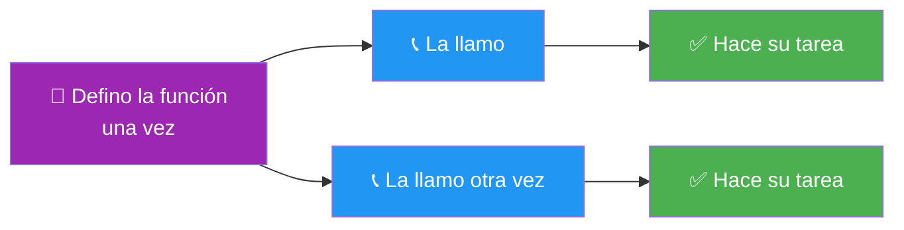
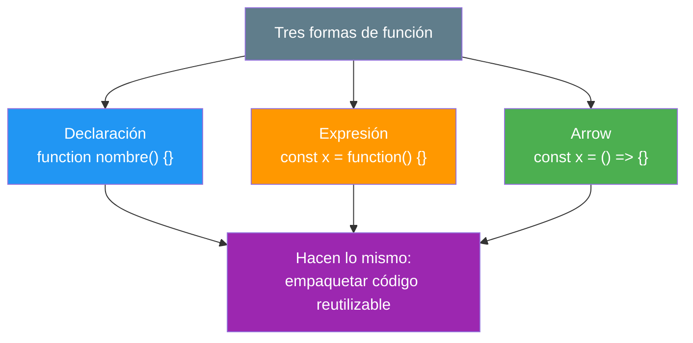
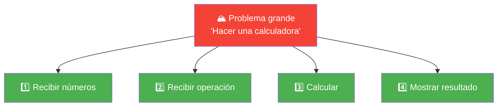
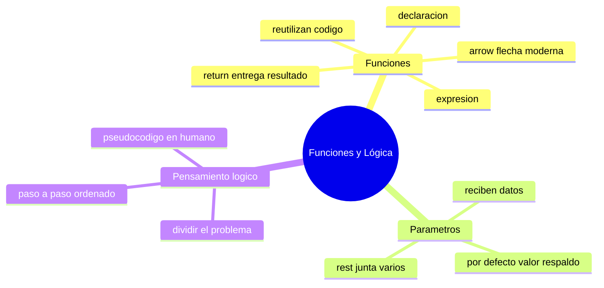

# 🧩 Módulo 4 — Funciones y Pensamiento Lógico

> 💡 **Antes de empezar:** Hasta ahora escribías instrucciones sueltas. Hoy aprenderás a _empaquetar_ esas instrucciones en bloques reutilizables llamados funciones, y —lo más importante— a _pensar como programador_ para resolver cualquier problema. Es como pasar de cocinar improvisando a tener tus propias recetas guardadas que puedes preparar cuando quieras. 📖

---

## 🎯 ¿Qué aprenderás en este módulo?

Al terminar serás capaz de:

- Crear **funciones** para reutilizar código sin repetirte.
- Conocer las tres formas de escribirlas: declaración, expresión y _arrow_.
- Pasarle información a tus funciones con parámetros (incluso valores por defecto).
- Resolver problemas grandes dividiéndolos en pasos pequeños.
- Pensar de forma lógica y ordenada antes de escribir una sola línea.

---

## 1. Funciones: tus recetas reutilizables

Una **función** es un bloque de código que hace una tarea específica y al que le pones nombre para _usarlo cuando quieras_, las veces que quieras.

### 🍳 La metáfora de la receta

Una receta es una lista de pasos con nombre ("Tortilla de papa"). La escribes _una vez_ y la sigues _cuantas veces quieras_. No reinventas la receta cada vez que cocinas. Una función es exactamente eso: escribes los pasos una vez y los "llamas" por su nombre cuando los necesitas.

```javascript
// Defino la receta (función) una sola vez
function saludar() {
  console.log("¡Hola! Bienvenido 👋");
}

// La uso (la "llamo") cuantas veces quiera
saludar();
saludar();
saludar();
```



> 🧠 **Idea clave:** Si te encuentras escribiendo lo mismo varias veces, probablemente eso debería ser una función. "No te repitas" es uno de los mantras de la programación.

---

### El `return`: lo que la función te entrega

Muchas funciones no solo _hacen_ algo, sino que te _devuelven_ un resultado con la palabra `return`.

```javascript
function sumar(a, b) {
  return a + b;
}

let resultado = sumar(3, 4);
console.log(resultado);  // Muestra: 7
```

> 🏭 **Metáfora:** Una función con `return` es como una máquina de jugos: metes naranjas (los datos de entrada) y te _devuelve_ jugo (el resultado). El `return` es la abertura por donde sale el producto terminado.

> ⚠️ **Ojo:** Cuando JavaScript llega a un `return`, la función _termina ahí mismo_. Cualquier línea después del `return` no se ejecuta.

---

### Las tres formas de crear funciones

Existen tres maneras de escribir funciones. Hacen lo mismo, pero se escriben distinto. No te abrumes: las verás las tres en código real, así que conviene reconocerlas.

#### 1. Declaración de función

La forma "clásica". Empieza con la palabra `function` seguida del nombre.

```javascript
function multiplicar(a, b) {
  return a * b;
}
```

> 🪧 **Su superpoder:** Puedes llamarla incluso _antes_ de escribirla en el código (JavaScript la "sube" automáticamente). Es la más fácil de leer para principiantes.

#### 2. Expresión de función

Aquí guardas una función _dentro de una variable_, como si fuera un valor más.

```javascript
const multiplicar = function (a, b) {
  return a * b;
};
```

> 📦 **Metáfora:** Es como guardar la receta en una caja etiquetada. La función vive _dentro_ de la variable `multiplicar`.

#### 3. Arrow function (función flecha)

La forma _moderna_ y más corta. Usa una flecha `=>` y omite la palabra `function`.

```javascript
const multiplicar = (a, b) => {
  return a * b;
};

// Y si solo tiene una línea de return, aún más corta:
const multiplicar = (a, b) => a * b;
```

> 🏹 **Metáfora:** La flecha `=>` literalmente "apunta" hacia lo que la función devuelve. Es directa y elegante, por eso es la favorita en el JavaScript moderno.



> 💡 **¿Cuál uso?** Para empezar, usa **declaraciones** (más legibles) o **arrow functions** (más modernas). Las tres son válidas; con la práctica sabrás cuándo conviene cada una.

---

## 2. Parámetros: la información que le das a la función

Los **parámetros** son los "huecos" que la función deja para recibir datos. Cuando la llamas, rellenas esos huecos con valores reales (llamados _argumentos_).

### 🎰 La metáfora de la máquina de café

Una máquina de café tiene botones: tipo de café, cantidad de azúcar, tamaño. Esos botones son los _parámetros_. Cuando tú eliges "capuchino, sin azúcar, grande", esos son los _argumentos_ concretos que entregas.

```javascript
function presentarse(nombre, edad) {
  console.log(`Hola, soy ${nombre} y tengo ${edad} años.`);
}

presentarse("Marta", 30);  // Hola, soy Marta y tengo 30 años.
presentarse("Luis", 45);   // Hola, soy Luis y tengo 45 años.
```

> 🧠 **Idea clave:** Los parámetros hacen que tu función sea _flexible_. La misma receta funciona con distintos ingredientes.

---

### Parámetros por defecto: un valor de respaldo

A veces quieres que un parámetro tenga un valor "por si acaso" no le pasan nada.

```javascript
function saludar(nombre = "amigo") {
  console.log(`¡Hola, ${nombre}!`);
}

saludar("Sofía");  // ¡Hola, Sofía!
saludar();         // ¡Hola, amigo!  (usó el valor por defecto)
```

> ☕ **Metáfora:** Es como una cafetería donde, si no especificas el tamaño, te dan el mediano por defecto. Nadie se queda sin café.

---

### Rest parameters: cuando no sabes cuántos datos llegarán

¿Y si tu función debe recibir una cantidad _indefinida_ de valores? Los **rest parameters** (con `...`) recogen todos los argumentos en una lista.

```javascript
function sumarTodo(...numeros) {
  let total = 0;
  for (let n of numeros) {
    total = total + n;
  }
  return total;
}

console.log(sumarTodo(1, 2, 3));        // 6
console.log(sumarTodo(10, 20, 30, 40)); // 100
```

> 🛒 **Metáfora:** Los `...numeros` son como un carrito de compras. No importa si metes 3 o 30 productos; el carrito los recoge todos y luego los procesas juntos.

> 💡 **Truco para recordar:** Los tres puntitos `...` "juntan" todo lo que llegue en una sola bolsa (un array). Lo verás mucho en código profesional.

---

## 3. Resolución de problemas: pensar como programador

Aquí está el verdadero corazón de la programación. **Programar no es escribir código: es pensar bien y luego traducir ese pensamiento a código.** El lenguaje (JavaScript) es solo la herramienta; lo valioso es tu forma de razonar.

### 🧩 La metáfora del rompecabezas

Nadie arma un rompecabezas de 1000 piezas de un solo golpe. Lo armas por partes: primero los bordes, luego por colores, después las secciones. Los problemas de programación se resuelven igual: **dividiéndolos en pedazos manejables**.

---

### Paso 1 — Dividir el problema (descomposición)

Antes de programar, parte el problema grande en problemas pequeños. Cada pieza pequeña es mucho más fácil de resolver.

> 🎯 **Ejemplo:** "Hacer una calculadora" suena enorme. Pero divídelo:
> 
> - Pieza 1: recibir dos números.
> - Pieza 2: recibir la operación (+, -, ×, ÷).
> - Pieza 3: calcular el resultado.
> - Pieza 4: mostrar el resultado.
> 
> De repente, ya no es un monstruo: son cuatro tareas pequeñas y claras.



---

### Paso 2 — Escribir pseudocódigo

El **pseudocódigo** es escribir tu solución en _lenguaje humano_, paso a paso, antes de traducirlo a código real. No tiene reglas estrictas: es para ordenar tus ideas.

> 📝 **Pseudocódigo de "saludar según la hora":**
> 
> ```
> PEDIR la hora actual
> SI la hora es menor a 12
>     DECIR "Buenos días"
> SI NO, SI la hora es menor a 19
>     DECIR "Buenas tardes"
> SI NO
>     DECIR "Buenas noches"
> ```

Y luego, traducirlo a JavaScript es casi automático:

```javascript
let hora = 15;

if (hora < 12) {
  console.log("Buenos días ☀️");
} else if (hora < 19) {
  console.log("Buenas tardes 🌤️");
} else {
  console.log("Buenas noches 🌙");
}
```

> 🗺️ **Metáfora:** El pseudocódigo es como hacer un boceto antes de pintar el cuadro. Te aseguras de que la idea funcione _antes_ de invertir esfuerzo en los detalles.

---

### Paso 3 — Pensamiento paso a paso

La computadora es **literal y obediente**: hace _exactamente_ lo que le dices, en el orden que se lo dices, ni más ni menos. Por eso debes pensar en pasos pequeños y ordenados.

### 🥪 La metáfora del sándwich

Imagina que le explicas a un robot cómo hacer un sándwich. No basta con decir "haz un sándwich". Tienes que detallar cada paso:

```
1. Tomar dos rebanadas de pan
2. Abrir el frasco de mantequilla
3. Untar la mantequilla en una rebanada
4. Colocar el jamón encima
5. Tapar con la otra rebanada
```

Si te saltas un paso o cambias el orden, el resultado falla. **Programar es ese mismo nivel de detalle y orden.** Esta forma de pensar —pequeño, ordenado, sin saltos— es lo que de verdad te convierte en programador.

> 🧠 **Idea clave:** Cuando un programa "no funciona", casi siempre es porque faltó un paso o el orden estaba mal. Piensa como el robot del sándwich: revisa paso por paso.

---

## 🛠️ Mini práctica: ¡tu turno!

Abre la consola (`F12` → **Console**) y practica. Recuerda: primero _piensa_ el problema, luego escríbelo. 🧠

### Ejercicio 1 — Tu primera función con return

```javascript
function calcularArea(base, altura) {
  return base * altura;
}

console.log(calcularArea(5, 3));   // 15
console.log(calcularArea(10, 2));  // 20
```

Crea ahora una función `calcularPerimetro` que sume los cuatro lados de un rectángulo.

### Ejercicio 2 — Parámetro por defecto

```javascript
function bienvenida(nombre = "visitante") {
  return `Bienvenido, ${nombre} 🎉`;
}

console.log(bienvenida("Carlos"));  // Bienvenido, Carlos
console.log(bienvenida());          // Bienvenido, visitante
```

### Ejercicio 3 — Arrow function

Convierte esta función a una arrow function:

```javascript
// Versión clásica
function alCuadrado(numero) {
  return numero * numero;
}

// Tu versión arrow aquí... 👇
const alCuadrado = (numero) => numero * numero;
console.log(alCuadrado(4));  // 16
```

### Ejercicio 4 — Piensa antes de programar

Sin escribir código todavía, escribe en pseudocódigo cómo resolverías esto:

> "Dado un número, decir si es par o impar."

> 💡 **Pista:** Recuerda el operador `%` del Módulo 2. Un número es par si el resto de dividirlo entre 2 es 0.

Luego, tradúcelo a JavaScript:

```javascript
function esPar(numero) {
  return numero % 2 === 0 ? "Par" : "Impar";
}

console.log(esPar(8));  // Par
console.log(esPar(7));  // Impar
```

---

## 🧭 Resumen visual del módulo



---

## ✅ Checklist: ¿lo lograste?

- [ ] Sé crear funciones y entiendo para qué sirve `return`.
- [ ] Reconozco las tres formas: declaración, expresión y arrow.
- [ ] Le paso datos a mis funciones usando parámetros.
- [ ] Uso parámetros por defecto y rest parameters (`...`).
- [ ] Divido problemas grandes en pasos pequeños.
- [ ] Escribo pseudocódigo antes de programar.
- [ ] Pienso de forma ordenada y literal, como "el robot del sándwich".

Si marcaste la mayoría, **acabas de dar el paso más importante**: ya no solo escribes código, _piensas_ como programador. 💪

---

## 🌱 Reflexión final

Este módulo tiene dos almas. La primera, técnica: las funciones, que son los "ladrillos reutilizables" con los que se construyen programas enteros. La segunda, y la más valiosa: el **pensamiento lógico**.

Aquí está el secreto que pocos te dicen al empezar: _la sintaxis se aprende en semanas, pero pensar como programador se cultiva con cada problema que resuelves_. No te frustres si una solución no aparece al instante. Respira, divide el problema, escribe pseudocódigo, y avanza paso a paso. Esa habilidad de descomponer lo complejo en simple te servirá no solo programando, sino en toda tu vida.

> 🎯 **El secreto sigue siendo el mismo:** un pasito a la vez. El mejor programador no es el que sabe más comandos de memoria, sino el que sabe partir un problema enorme en piececitas que puede resolver una por una.

**¡Nos vemos en el Módulo 5!**