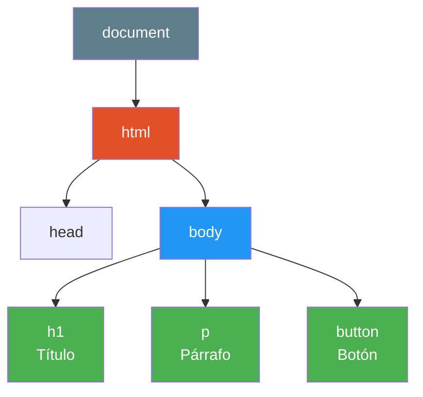
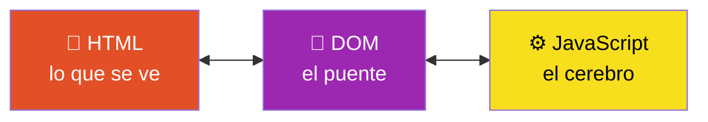
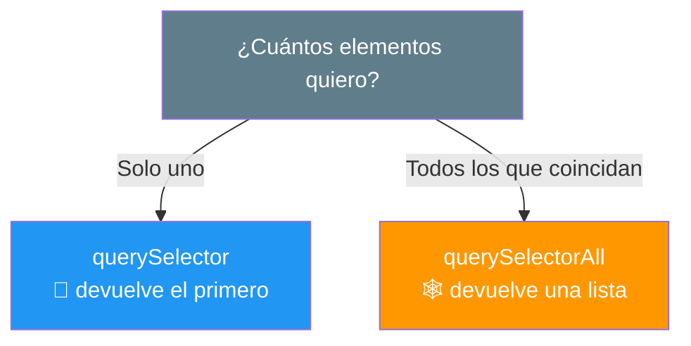
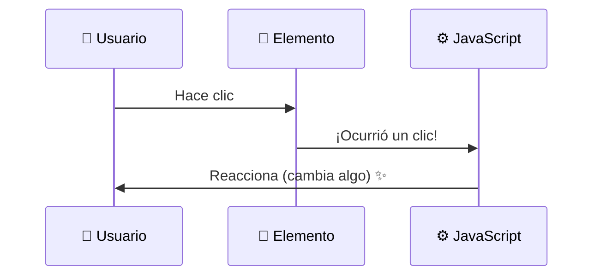
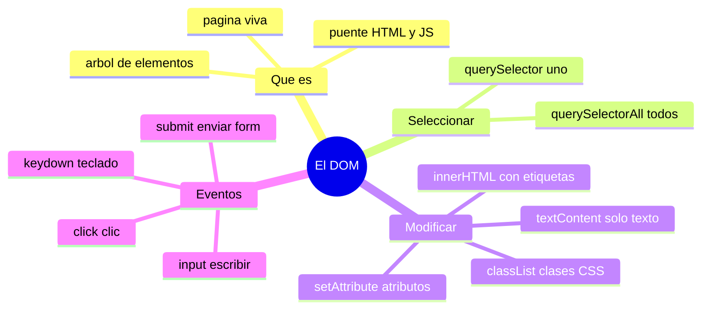

# 🧩 Módulo 5 — Introducción al DOM

> 💡 **Antes de empezar:** Hasta ahora todo tu código vivía en la consola, hablando solo contigo. ¡Hoy cambia todo! Vas a aprender a hacer que JavaScript _toque y modifique la página web de verdad_: cambiar textos, colores, reaccionar a clics... Es el momento en que tu código sale de la cocina y empieza a servir platos en la mesa. 🍽️✨

---

## 🎯 ¿Qué aprenderás en este módulo?

Al terminar serás capaz de:

- Entender qué es el DOM y por qué es el puente entre HTML y JavaScript.
- Seleccionar cualquier elemento de una página para trabajar con él.
- Cambiar textos, HTML, clases y atributos desde JavaScript.
- Hacer que la página reaccione a clics, escritura y otras acciones del usuario.

---

## 1. ¿Qué es el DOM?

**DOM** significa _Document Object Model_ (Modelo de Objetos del Documento). Suena complicado, pero la idea es simple: es la **representación viva de tu página web** que JavaScript puede leer y modificar.

### 🌳 La metáfora del árbol genealógico

Cuando el navegador carga tu HTML, no lo guarda como texto plano. Lo convierte en un **árbol** de elementos, donde cada etiqueta es una "rama" conectada a otras. Hay padres, hijos y hermanos, igual que en un árbol genealógico.



### 🌉 El DOM es un puente

Imagina que el HTML es una orilla del río (lo que se ve) y JavaScript es la otra orilla (el cerebro que decide). **El DOM es el puente que los conecta.** Sin ese puente, JavaScript no podría tocar nada de lo que ves en pantalla.



> 🧠 **Idea clave:** Gracias al DOM, JavaScript puede "agarrar" cualquier parte de la página y cambiarla en tiempo real, sin recargar nada. Eso es lo que hace que las webs se sientan vivas.

---

## 2. Seleccionar elementos: encontrar lo que quieres tocar

Antes de modificar algo, primero hay que **encontrarlo y agarrarlo**. Para eso usamos selectores.

### 🎯 La metáfora del control remoto

Imagina que la página es una habitación llena de aparatos. Para controlar uno, primero tienes que _apuntarle_ con el control remoto. Seleccionar un elemento es exactamente eso: apuntarle a JavaScript para decirle "este, este es el que quiero".

Supongamos este HTML de ejemplo:

```html
<h1 id="titulo">Hola Mundo</h1>
<p class="texto">Primer párrafo</p>
<p class="texto">Segundo párrafo</p>
<button>Haz clic</button>
```

### `querySelector`: agarra el primer elemento que coincida

Devuelve **el primer** elemento que encuentre según el selector que le des. Usa la misma sintaxis que CSS.

```javascript
// Por id (con #)
const titulo = document.querySelector("#titulo");

// Por clase (con .)
const parrafo = document.querySelector(".texto");

// Por etiqueta (sin símbolo)
const boton = document.querySelector("button");
```

> 🔑 **Cómo recordar los símbolos:** `#` para id, `.` para clase, y nada para etiquetas. Son los mismos que ya usa CSS, así que matas dos pájaros de un tiro.

### `querySelectorAll`: agarra TODOS los que coincidan

Cuando hay varios elementos iguales y quieres todos, usa `querySelectorAll`. Te devuelve una _lista_ con todos ellos.

```javascript
const parrafos = document.querySelectorAll(".texto");

// Recorremos la lista con un bucle (¡como en el Módulo 3!)
parrafos.forEach(function (p) {
  console.log(p.textContent);
});
```

> 🎣 **Metáfora:** `querySelector` es como pescar _un_ pez (el primero que pica). `querySelectorAll` es lanzar una red y atrapar _todos_ los peces que coincidan.



---

## 3. Modificar contenido: cambiar la página a tu gusto

Ya que tienes el elemento "agarrado", puedes transformarlo. Estas son las herramientas más usadas.

### `textContent`: cambiar el texto

Cambia _solo el texto_ de un elemento, de forma segura y sencilla.

```javascript
const titulo = document.querySelector("#titulo");
titulo.textContent = "¡Texto cambiado desde JavaScript! 🎉";
```

> ✏️ **Metáfora:** `textContent` es como borrar con goma lo que decía un cartel y escribir algo nuevo encima. Solo cambia las letras, nada más.

---

### `innerHTML`: cambiar el HTML interno

Similar a `textContent`, pero permite insertar _etiquetas HTML_, no solo texto.

```javascript
const caja = document.querySelector("#titulo");
caja.innerHTML = "<strong>Texto en negrita</strong> y normal";
```

> ⚠️ **Precaución:** `innerHTML` es más poderoso pero más delicado. Si insertas texto que viene de un usuario, puede abrir la puerta a problemas de seguridad. **Regla simple para empezar:** si solo cambias texto, usa `textContent`; reserva `innerHTML` para cuando _realmente_ necesites meter etiquetas HTML.

||`textContent`|`innerHTML`|
|---|---|---|
|**Qué cambia**|Solo el texto|Texto **y** etiquetas HTML|
|**Seguridad**|✅ Seguro siempre|⚠️ Cuidado con datos externos|
|**Cuándo usar**|La mayoría de las veces|Cuando necesitas insertar HTML|

---

### `classList`: añadir y quitar clases CSS

Recuerda que las clases CSS definen el aspecto (color, tamaño, etc.). Con `classList` puedes activar o desactivar esos estilos desde JavaScript.

```javascript
const caja = document.querySelector("#titulo");

caja.classList.add("resaltado");      // Añade la clase
caja.classList.remove("resaltado");   // La quita
caja.classList.toggle("resaltado");   // La pone si no está, la quita si está
```

> 💡 **Metáfora:** `classList` es como ponerle o quitarle un sticker a algo. El sticker (la clase CSS) trae consigo todo un estilo predefinido. `toggle` es el más mágico: actúa como un interruptor de encender/apagar.

> 🎯 **Por qué es la mejor práctica:** En vez de cambiar colores y tamaños uno por uno desde JavaScript, defines un "look" completo en CSS (una clase) y solo lo activas o desactivas. Más limpio y ordenado.

---

### `setAttribute`: cambiar atributos

Los elementos HTML tienen _atributos_ (como `src` en una imagen o `href` en un enlace). `setAttribute` te deja modificarlos.

```javascript
const imagen = document.querySelector("img");
imagen.setAttribute("src", "gato.jpg");
imagen.setAttribute("alt", "Un gato dormido");
```

> 🏷️ **Metáfora:** Los atributos son como las características de un producto en su etiqueta. `setAttribute` te permite reescribir esa etiqueta para cambiar, por ejemplo, qué imagen se muestra o a dónde lleva un enlace.

---

## 4. Eventos: hacer que la página reaccione

Aquí ocurre la verdadera magia de la interactividad. Un **evento** es algo que sucede en la página: un clic, una tecla presionada, un formulario enviado. JavaScript puede _escuchar_ esos eventos y reaccionar.

### 👂 La metáfora del oído atento

Imagina que JavaScript tiene una oreja pegada a cada elemento, esperando atento. Cuando algo sucede ("¡me hicieron clic!"), reacciona. A esa oreja la llamamos `addEventListener` (escuchador de eventos).

```javascript
elemento.addEventListener("tipo de evento", función_que_reacciona);
```



---

### Evento `click`: reaccionar a un clic

El más común de todos. Ejecuta código cuando el usuario hace clic en algo.

```javascript
const boton = document.querySelector("button");

boton.addEventListener("click", function () {
  console.log("¡Me hiciste clic! 🖱️");
});
```

Un ejemplo completo que cambia un texto al hacer clic:

```javascript
const boton = document.querySelector("button");
const titulo = document.querySelector("#titulo");

boton.addEventListener("click", function () {
  titulo.textContent = "¡Cambiaste el título! 🎉";
});
```

> 🎉 **¡Felicidades de antemano!** Cuando ejecutes esto y veas el título cambiar al hacer clic, habrás creado tu primera interacción real. Ese es _exactamente_ el momento en que muchos se enamoran de la programación.

---

### Evento `input`: reaccionar mientras se escribe

Se dispara cada vez que el usuario escribe en un campo de texto. Perfecto para respuestas en tiempo real.

```javascript
const campo = document.querySelector("input");

campo.addEventListener("input", function (evento) {
  console.log("Estás escribiendo: " + evento.target.value);
});
```

> 🔍 **Detalle nuevo:** El `evento` que llega contiene información útil. `evento.target` es el elemento donde pasó la acción, y `.value` es lo que el usuario escribió. Lo usarás muchísimo.

---

### Evento `submit`: reaccionar al enviar un formulario

Se dispara cuando se envía un formulario. Casi siempre se usa con `preventDefault()` para evitar que la página se recargue.

```javascript
const formulario = document.querySelector("form");

formulario.addEventListener("submit", function (evento) {
  evento.preventDefault();  // Evita que la página se recargue
  console.log("Formulario enviado sin recargar ✅");
});
```

> 🛑 **¿Por qué `preventDefault()`?** Por defecto, enviar un formulario recarga la página entera (comportamiento antiguo). Con `preventDefault()` le dices "espera, yo me encargo con JavaScript", y así controlas todo sin recargas molestas.

---

### Eventos de teclado: reaccionar a las teclas

Puedes detectar cuándo se presiona una tecla con `keydown`.

```javascript
document.addEventListener("keydown", function (evento) {
  console.log("Presionaste la tecla: " + evento.key);

  if (evento.key === "Enter") {
    console.log("¡Presionaste Enter! ⏎");
  }
});
```

> ⌨️ **Para qué sirve:** Atajos de teclado, controles de un juego, validaciones al presionar Enter... abre muchísimas posibilidades.

---

## 🛠️ Mini práctica: ¡tu turno!

> 📌 **Importante:** Estos ejercicios necesitan un archivo HTML, no solo la consola. Crea un archivo `index.html`, pega el código y ábrelo en tu navegador. Si te animas, abre las DevTools para ver los mensajes de la consola.

### Ejercicio 1 — El botón que cuenta clics

```html
<!DOCTYPE html>
<html>
<body>
  <h1 id="contador">0</h1>
  <button id="boton">Sumar 1</button>

  <script>
    let cuenta = 0;
    const boton = document.querySelector("#boton");
    const contador = document.querySelector("#contador");

    boton.addEventListener("click", function () {
      cuenta = cuenta + 1;
      contador.textContent = cuenta;
    });
  </script>
</body>
</html>
```

✅ Cada clic suma 1 al contador en pantalla. ¡Tu primera app interactiva!

### Ejercicio 2 — Saludo en tiempo real

```html
<!DOCTYPE html>
<html>
<body>
  <input type="text" id="nombre" placeholder="Escribe tu nombre">
  <h2 id="saludo">Hola...</h2>

  <script>
    const campo = document.querySelector("#nombre");
    const saludo = document.querySelector("#saludo");

    campo.addEventListener("input", function (e) {
      saludo.textContent = "Hola, " + e.target.value + " 👋";
    });
  </script>
</body>
</html>
```

✅ El saludo cambia _mientras escribes_. ¡Magia en tiempo real!

### Ejercicio 3 — Cambiar estilo con toggle

```html
<!DOCTYPE html>
<html>
<head>
  <style>
    .oscuro { background: #222; color: white; }
  </style>
</head>
<body>
  <button id="boton">Cambiar tema</button>

  <script>
    const boton = document.querySelector("#boton");
    boton.addEventListener("click", function () {
      document.body.classList.toggle("oscuro");
    });
  </script>
</body>
</html>
```

✅ Cada clic enciende y apaga el "modo oscuro". Combinaste eventos + classList. 🌙

---

## 🧭 Resumen visual del módulo



---

## ✅ Checklist: ¿lo lograste?

- [ ] Entiendo que el DOM es el puente entre HTML y JavaScript.
- [ ] Selecciono elementos con `querySelector` y `querySelectorAll`.
- [ ] Cambio textos con `textContent` y sé cuándo usar `innerHTML`.
- [ ] Añado y quito estilos con `classList` (¡y conozco `toggle`!).
- [ ] Modifico atributos con `setAttribute`.
- [ ] Hago que la página reaccione con `addEventListener`.
- [ ] Manejo eventos de clic, escritura, formularios y teclado.

Si marcaste la mayoría, **acabas de cruzar una frontera enorme**: tu código ya no habla solo contigo, _interactúa con personas reales_. 💪

---

## 🌱 Reflexión final

Este es, para muchos, el módulo _mágico_. Hasta ahora la programación podía sentirse abstracta: números en una consola, lógica invisible. Pero hoy viste tu código **cambiar la pantalla, reaccionar a tus clics, responder mientras escribes**. Eso es tangible, visible, emocionante.

No te preocupes si al principio confundes un selector o se te olvida el `addEventListener`. Equivocarse aquí es especialmente divertido, porque ves el error _en pantalla_ y arreglarlo se siente como resolver un pequeño misterio. Experimenta sin miedo: cambia textos, rompe cosas, ponle colores ridículos a la página. Nada se daña, y cada experimento te enseña.

> 🎯 **El secreto sigue siendo el mismo:** un pasito a la vez. Selecciona, modifica, escucha un evento. Con esos tres verbos —seleccionar, modificar, escuchar— puedes construir casi cualquier interacción que veas en la web.

**¡Nos vemos en el Módulo 6!**