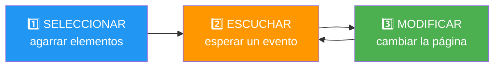
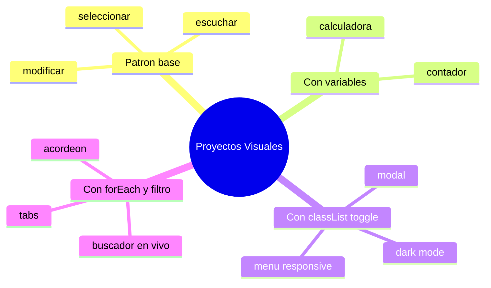

# 🧩 Módulo 6 — Proyectos Visuales Básicos

> 💡 **Antes de empezar:** ¡Llegó el momento más divertido! Ya tienes todas las piezas: variables, condicionales, bucles, funciones y el DOM. Hoy las juntamos para construir **8 mini proyectos reales** que verás en webs de todo el mundo. Es como cuando aprendiste los acordes de una guitarra por separado y por fin tocas tu primera canción completa. 🎸

---

## 🎯 ¿Qué aprenderás en este módulo?

En lugar de teoría nueva, hoy _aplicarás_ todo lo aprendido construyendo:

- Un contador, un modo oscuro y una calculadora.
- Un buscador en vivo y un acordeón.
- Pestañas (tabs), una ventana modal y un menú responsive.

> 🧠 **Cómo aprovechar este módulo:** No solo copies el código. Escríbelo tú mismo, ejecútalo, **rómpelo a propósito** y arréglalo. Ahí ocurre el aprendizaje real. Cada proyecto trae un desglose de _por qué_ funciona.

> 📌 **Cómo probar cada proyecto:** Crea un archivo `index.html`, pega el código completo y ábrelo en tu navegador. ¡Eso es todo!

---

## 🗺️ El patrón mental de todo proyecto

Antes de empezar, graba esta idea. **Casi todos los proyectos siguen el mismo ritmo de tres pasos**, como aprendiste al final del Módulo 5:



> 🔑 **El mantra:** _Seleccionar → Escuchar → Modificar._ Si lo tienes claro, ningún proyecto te dará miedo. Vamos a verlo repetirse una y otra vez.

---

## 🟦 Proyecto 1 — Contador

**Qué hace:** muestra un número que sube, baja o se reinicia con botones.

### 🎚️ La metáfora del marcador deportivo

Es como el marcador de un partido: empieza en cero y va cambiando según lo que pase. Una variable guarda el número, y los botones la modifican.

```html
<!DOCTYPE html>
<html>
<body>
  <h1 id="numero">0</h1>
  <button id="menos">➖</button>
  <button id="reset">🔄</button>
  <button id="mas">➕</button>

  <script>
    let cuenta = 0;
    const numero = document.querySelector("#numero");

    document.querySelector("#mas").addEventListener("click", () => {
      cuenta++;
      numero.textContent = cuenta;
    });

    document.querySelector("#menos").addEventListener("click", () => {
      cuenta--;
      numero.textContent = cuenta;
    });

    document.querySelector("#reset").addEventListener("click", () => {
      cuenta = 0;
      numero.textContent = cuenta;
    });
  </script>
</body>
</html>
```

> 🔍 **Desglose:** Una variable (`cuenta`) guarda el estado. Cada botón _escucha_ un clic y _modifica_ esa variable, luego actualiza el texto en pantalla. ¡El patrón de tres pasos en acción!

---

## 🌙 Proyecto 2 — Dark Mode Toggle

**Qué hace:** cambia entre modo claro y oscuro con un solo botón.

### 💡 La metáfora del interruptor de luz

Es literalmente un interruptor: enciendes o apagas el "modo oscuro". La clave es `classList.toggle`, que pone o quita una clase CSS como si fuera un switch.

```html
<!DOCTYPE html>
<html>
<head>
  <style>
    body { transition: 0.3s; }
    .oscuro { background: #1a1a1a; color: #f0f0f0; }
  </style>
</head>
<body>
  <h1>Mi página</h1>
  <button id="boton">🌙 Cambiar tema</button>

  <script>
    const boton = document.querySelector("#boton");
    boton.addEventListener("click", () => {
      document.body.classList.toggle("oscuro");
    });
  </script>
</body>
</html>
```

> 🔍 **Desglose:** Toda la apariencia oscura vive en CSS (la clase `.oscuro`). JavaScript solo la _activa o desactiva_. Esto es buena práctica: el estilo en CSS, el comportamiento en JS.

---

## 🔢 Proyecto 3 — Calculadora básica

**Qué hace:** suma, resta, multiplica y divide dos números.

### 🧮 La metáfora de la receta con ingredientes

Recibes dos "ingredientes" (números) y una "instrucción" (la operación), y devuelves un plato (el resultado). Aquí brillan las funciones del Módulo 4.

```html
<!DOCTYPE html>
<html>
<body>
  <input type="number" id="a" placeholder="Número 1">
  <input type="number" id="b" placeholder="Número 2">
  <br>
  <button data-op="+">➕</button>
  <button data-op="-">➖</button>
  <button data-op="*">✖️</button>
  <button data-op="/">➗</button>
  <h2 id="resultado">Resultado: —</h2>

  <script>
    const inputA = document.querySelector("#a");
    const inputB = document.querySelector("#b");
    const resultado = document.querySelector("#resultado");
    const botones = document.querySelectorAll("button");

    function calcular(a, b, op) {
      switch (op) {
        case "+": return a + b;
        case "-": return a - b;
        case "*": return a * b;
        case "/": return b !== 0 ? a / b : "Error";
      }
    }

    botones.forEach((boton) => {
      boton.addEventListener("click", () => {
        const a = Number(inputA.value);
        const b = Number(inputB.value);
        const op = boton.dataset.op;
        resultado.textContent = "Resultado: " + calcular(a, b, op);
      });
    });
  </script>
</body>
</html>
```

> 🔍 **Desglose:** Usamos `switch` (Módulo 3) dentro de una función (Módulo 4), `Number()` para convertir el texto del input en número (Módulo 2), y `forEach` para darle un escuchador a cada botón. ¡Todo conectado! Fíjate en `data-op`: es un atributo personalizado que guarda qué operación hace cada botón.

---

## 🔎 Proyecto 4 — Buscador en vivo

**Qué hace:** filtra una lista mientras escribes, en tiempo real.

### 🗂️ La metáfora del archivador inteligente

Imagina un archivador que, mientras tecleas, va escondiendo las carpetas que no coinciden y dejando solo las que sí. Eso hace el evento `input` combinado con un filtro.

```html
<!DOCTYPE html>
<html>
<body>
  <input type="text" id="buscar" placeholder="Buscar fruta...">
  <ul id="lista">
    <li>Manzana</li>
    <li>Banana</li>
    <li>Naranja</li>
    <li>Pera</li>
    <li>Mango</li>
  </ul>

  <script>
    const buscar = document.querySelector("#buscar");
    const items = document.querySelectorAll("#lista li");

    buscar.addEventListener("input", () => {
      const texto = buscar.value.toLowerCase();
      items.forEach((item) => {
        const coincide = item.textContent.toLowerCase().includes(texto);
        item.style.display = coincide ? "block" : "none";
      });
    });
  </script>
</body>
</html>
```

> 🔍 **Desglose:** El evento `input` se dispara con cada tecla. Convertimos todo a minúsculas con `toLowerCase()` para que la búsqueda no distinga mayúsculas, y `includes()` revisa si el texto está contenido. El operador ternario (Módulo 3) decide si mostrar u ocultar cada elemento.

---

## 📂 Proyecto 5 — Acordeón

**Qué hace:** muestra y oculta secciones de contenido al hacer clic en su título.

### 🪗 La metáfora del acordeón musical

Como el instrumento: cada sección se "expande" o "se cierra" al tocarla. Solo se ve el contenido de la que abriste.

```html
<!DOCTYPE html>
<html>
<head>
  <style>
    .contenido { display: none; padding: 10px; background: #f0f0f0; }
    .titulo { cursor: pointer; padding: 10px; background: #ddd; }
  </style>
</head>
<body>
  <div class="titulo">¿Qué es JavaScript? ▾</div>
  <div class="contenido">Un lenguaje que da vida a las webs.</div>

  <div class="titulo">¿Qué es el DOM? ▾</div>
  <div class="contenido">El puente entre HTML y JavaScript.</div>

  <script>
    const titulos = document.querySelectorAll(".titulo");

    titulos.forEach((titulo) => {
      titulo.addEventListener("click", () => {
        const contenido = titulo.nextElementSibling;
        contenido.style.display =
          contenido.style.display === "block" ? "none" : "block";
      });
    });
  </script>
</body>
</html>
```

> 🔍 **Desglose:** `nextElementSibling` agarra el elemento que está _justo después_ del título (su contenido). El ternario alterna entre mostrar (`block`) y ocultar (`none`). Recorremos todos los títulos con `forEach`.

---

## 🗂️ Proyecto 6 — Tabs (pestañas)

**Qué hace:** muestra distintos paneles según la pestaña que selecciones.

### 🗄️ La metáfora de las carpetas con lengüeta

Como las carpetas de un archivador con pestañas de colores: clicas una lengüeta y ves solo _su_ contenido, mientras las demás se ocultan.

```html
<!DOCTYPE html>
<html>
<head>
  <style>
    .panel { display: none; padding: 20px; }
    .panel.activo { display: block; }
    .tab.activo { font-weight: bold; background: #cce; }
  </style>
</head>
<body>
  <button class="tab activo" data-tab="1">Inicio</button>
  <button class="tab" data-tab="2">Perfil</button>

  <div class="panel activo" data-panel="1">Bienvenido al inicio 🏠</div>
  <div class="panel" data-panel="2">Este es tu perfil 👤</div>

  <script>
    const tabs = document.querySelectorAll(".tab");
    const paneles = document.querySelectorAll(".panel");

    tabs.forEach((tab) => {
      tab.addEventListener("click", () => {
        // Quitamos "activo" de todos
        tabs.forEach((t) => t.classList.remove("activo"));
        paneles.forEach((p) => p.classList.remove("activo"));

        // Se lo damos solo al seleccionado
        tab.classList.add("activo");
        const id = tab.dataset.tab;
        document.querySelector(`.panel[data-panel="${id}"]`).classList.add("activo");
      });
    });
  </script>
</body>
</html>
```

> 🔍 **Desglose:** La estrategia es: _primero quitar "activo" de todos, luego dárselo solo al elegido_. Es un patrón clásico que verás en mil lugares. Usamos `dataset` para conectar cada pestaña con su panel.

---

## 🪟 Proyecto 7 — Modal (ventana emergente)

**Qué hace:** abre una ventana flotante sobre la página y la cierra.

### 🎭 La metáfora del telón del teatro

El modal es como un telón que baja sobre el escenario para mostrar algo importante, y se levanta cuando terminas. Se abre y se cierra mostrando u ocultando una capa.

```html
<!DOCTYPE html>
<html>
<head>
  <style>
    .modal {
      display: none; position: fixed; top: 0; left: 0;
      width: 100%; height: 100%;
      background: rgba(0,0,0,0.5);
      justify-content: center; align-items: center;
    }
    .modal.abierto { display: flex; }
    .caja { background: white; padding: 30px; border-radius: 10px; }
  </style>
</head>
<body>
  <button id="abrir">Abrir ventana</button>

  <div class="modal" id="modal">
    <div class="caja">
      <h2>¡Hola! 👋</h2>
      <p>Soy una ventana modal.</p>
      <button id="cerrar">Cerrar</button>
    </div>
  </div>

  <script>
    const modal = document.querySelector("#modal");
    document.querySelector("#abrir").addEventListener("click", () => {
      modal.classList.add("abierto");
    });
    document.querySelector("#cerrar").addEventListener("click", () => {
      modal.classList.remove("abierto");
    });
  </script>
</body>
</html>
```

> 🔍 **Desglose:** Mismo principio que el dark mode: una clase (`.abierto`) controla la visibilidad. Un botón la añade (abrir) y otro la quita (cerrar). El fondo semitransparente da el efecto de "capa flotante".

---

## 📱 Proyecto 8 — Menú responsive

**Qué hace:** un menú de navegación que se abre y cierra con un botón de hamburguesa (☰), típico de móviles.

### 🍔 La metáfora del menú de hamburguesa

Ese ícono de tres líneas (☰) se llama "hamburguesa" y es el estándar mundial para menús en móvil. Al tocarlo, despliega las opciones; al volver a tocarlo, las esconde.

```html
<!DOCTYPE html>
<html>
<head>
  <style>
    .menu { display: none; list-style: none; padding: 0; }
    .menu.abierto { display: block; }
    .menu li { padding: 10px; background: #eee; margin: 2px 0; }
  </style>
</head>
<body>
  <button id="hamburguesa">☰ Menú</button>
  <ul class="menu" id="menu">
    <li>Inicio</li>
    <li>Servicios</li>
    <li>Contacto</li>
  </ul>

  <script>
    const boton = document.querySelector("#hamburguesa");
    const menu = document.querySelector("#menu");

    boton.addEventListener("click", () => {
      menu.classList.toggle("abierto");
    });
  </script>
</body>
</html>
```

> 🔍 **Desglose:** Otra vez `classList.toggle`, el héroe de este módulo. Un solo botón abre y cierra el menú alternando una clase. En proyectos reales, CSS se encarga de que esto solo aparezca en pantallas pequeñas.

---

## 🧭 Resumen visual del módulo



---

## 💡 El patrón que se repite (lección clave)

Si miras los 8 proyectos con atención, notarás que casi todos usan **las mismas herramientas combinadas de formas distintas**:

|Herramienta|Proyectos donde aparece|
|---|---|
|`querySelector` / `querySelectorAll`|**Todos**|
|`addEventListener`|**Todos**|
|`classList.toggle`|Dark mode, modal, menú, acordeón|
|`forEach`|Calculadora, buscador, acordeón, tabs|
|Variables de estado|Contador, calculadora|
|Operador ternario|Buscador, acordeón|

> 🧠 **La gran revelación:** No necesitas memorizar 8 soluciones distintas. Dominas _unas pocas herramientas_ y las combinas como piezas de LEGO. Eso es programar.

---

## ✅ Checklist: ¿lo lograste?

- [ ] Construí un contador que sube, baja y se reinicia.
- [ ] Hice un toggle de modo oscuro.
- [ ] Programé una calculadora con las cuatro operaciones.
- [ ] Creé un buscador que filtra en tiempo real.
- [ ] Hice un acordeón que abre y cierra secciones.
- [ ] Programé un sistema de pestañas (tabs).
- [ ] Construí una ventana modal.
- [ ] Hice un menú responsive con botón hamburguesa.
- [ ] Reconozco el patrón "seleccionar → escuchar → modificar".

Si marcaste la mayoría, **ya no eres principiante**: eres alguien que _construye cosas_. 🚀

---

## 🌱 Reflexión final

Mira hacia atrás un segundo. En el Módulo 1 te mostrábamos un `console.log`. Hoy construiste _ocho aplicaciones interactivas reales_. Eso es un viaje enorme, y lo lograste paso a paso, exactamente como prometimos.

El secreto que descubriste hoy es el más importante de toda la programación: **los proyectos complejos no son más que combinaciones de cosas simples**. Una calculadora es solo variables, funciones y eventos juntos. Un menú es un `toggle`. Cuando veas una web impresionante, recuerda que por dentro está hecha de estas mismas piececitas que ya dominas.

No te preocupes si un proyecto no te salió a la primera. _A nadie_ le sale a la primera. Programar es un baile constante de "probar, fallar, ajustar, lograr". Cada bug que resuelves te hace mejor.

> 🎯 **El secreto sigue siendo el mismo, hasta el final:** un pasito a la vez. Ahora ya no le tienes miedo al código: lo usas para _crear_. Y eso, justamente eso, es ser programador.

**¡Felicidades por completar el curso! 🎉👏**