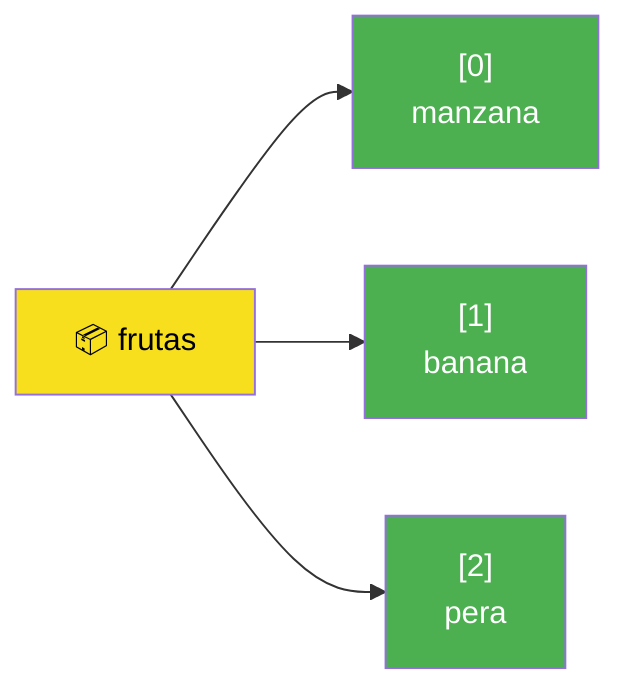
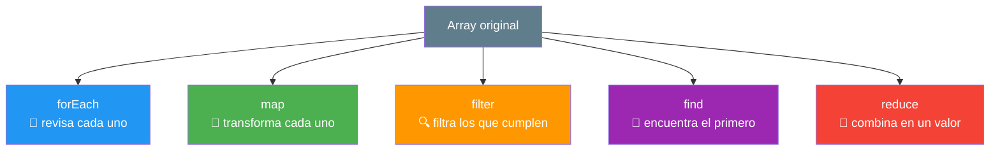
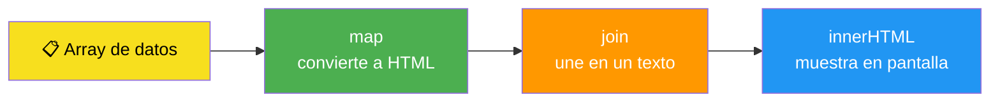
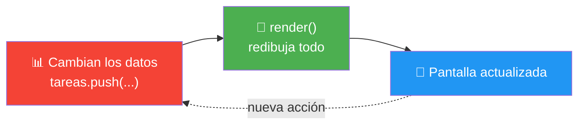
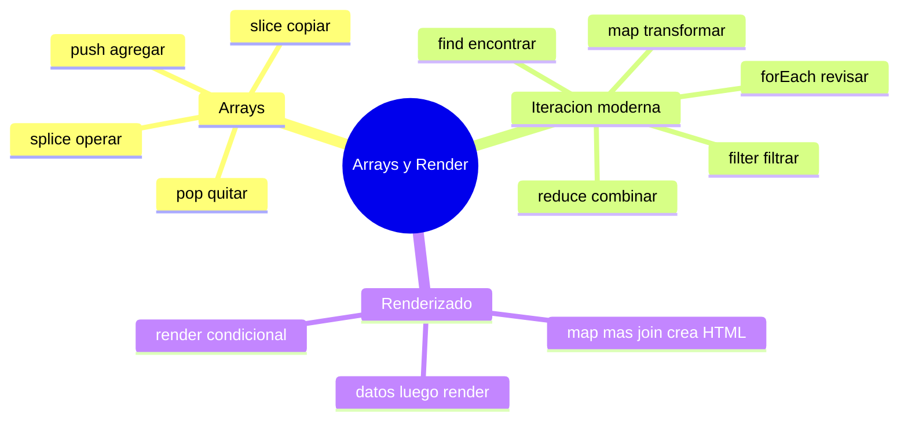

# 🧩 Módulo 7 — Arrays y Renderizado Dinámico

> 💡 **Antes de empezar:** Hasta ahora cada variable guardaba _una sola cosa_: un nombre, un número. Pero la vida real está llena de _listas_: tus contactos, tus tareas, los productos de una tienda. Hoy aprenderás a guardar y manejar colecciones de datos, y —lo más emocionante— a convertir esos datos en HTML que aparece solo en pantalla. Es como pasar de cocinar un plato a manejar todo un buffet. 🍱

---

## 🎯 ¿Qué aprenderás en este módulo?

Al terminar serás capaz de:

- Guardar listas de datos en **arrays** y modificarlas.
- Recorrer y transformar esas listas con métodos modernos y elegantes.
- Generar HTML automáticamente a partir de tus datos (renderizado dinámico).
- Mostrar u ocultar contenido según condiciones y mantener la pantalla actualizada.

---

## 1. Arrays: listas de datos

Un **array** es una variable que guarda _varios valores_ en orden, dentro de corchetes `[ ]`.

### 🥚 La metáfora del cartón de huevos

Una variable normal es como un vaso: guarda _una_ cosa. Un array es como un _cartón de huevos_: una sola estructura con muchos compartimentos numerados. Cada compartimento tiene una posición.

```javascript
let frutas = ["manzana", "banana", "pera"];
```

> ⚠️ **Detalle clave:** Las posiciones empiezan en **0**, no en 1. Así que la primera fruta es la posición `0`.

```javascript
console.log(frutas[0]);  // "manzana" (la primera)
console.log(frutas[1]);  // "banana"
console.log(frutas[2]);  // "pera"
console.log(frutas.length);  // 3 (cuántos elementos hay)
```



> 🧠 **Idea clave:** Un array mantiene tus datos _ordenados y numerados_, lo que te permite encontrar, agregar o quitar elementos por su posición.

---

### Métodos para modificar arrays

Estos cuatro métodos son los más usados para cambiar el contenido de un array.

#### `push`: agregar al final

```javascript
let frutas = ["manzana", "banana"];
frutas.push("naranja");
console.log(frutas);  // ["manzana", "banana", "naranja"]
```

> ➕ **Metáfora:** `push` es como poner un plato _encima_ de una pila. Va al final.

#### `pop`: quitar el último

```javascript
let frutas = ["manzana", "banana", "naranja"];
frutas.pop();
console.log(frutas);  // ["manzana", "banana"]
```

> ➖ **Metáfora:** `pop` es quitar el plato de _arriba_ de la pila. Saca el último.

#### `slice`: copiar un trozo (sin dañar el original)

`slice` toma una "rebanada" del array y devuelve una _copia_, dejando el original intacto.

```javascript
let numeros = [10, 20, 30, 40, 50];
let trozo = numeros.slice(1, 3);  // desde la posición 1 hasta antes de la 3
console.log(trozo);    // [20, 30]
console.log(numeros);  // [10, 20, 30, 40, 50] (¡intacto!)
```

> 🔪 **Metáfora:** `slice` es como cortar una _rebanada_ de pan sin tocar el resto de la barra. El original no se modifica.

#### `splice`: cortar y modificar (sí cambia el original)

`splice` es más poderoso: puede quitar elementos y/o insertar nuevos _dentro_ del array, modificándolo.

```javascript
let colores = ["rojo", "verde", "azul"];
colores.splice(1, 1);  // desde la posición 1, elimina 1 elemento
console.log(colores);  // ["rojo", "azul"]
```

> ✂️ **Metáfora:** `splice` es como una cirugía: entra al array y _modifica el original_ quitando o agregando elementos en una posición exacta.

> 🔑 **No los confundas:** `slice` (con C) **copia** sin dañar. `splice` (con P) **opera** modificando el original. Truco: _sP_lice = oPera.

|Método|¿Qué hace?|¿Modifica el original?|
|---|---|---|
|`push`|Agrega al final|✅ Sí|
|`pop`|Quita el último|✅ Sí|
|`slice`|Copia un trozo|❌ No|
|`splice`|Corta/inserta|✅ Sí|

---

## 2. Iteración moderna: recorrer y transformar listas

Aquí está lo _verdaderamente moderno_ de JavaScript. En lugar de usar bucles `for` complicados, tenemos métodos elegantes que recorren arrays con una sola línea. Cada uno tiene un _propósito_ distinto.

### 🏭 La metáfora de la cinta transportadora

Imagina una fábrica con una cinta transportadora donde pasan los productos uno por uno. Cada método es una _máquina_ distinta colocada sobre la cinta:

- Una **revisa** cada producto (`forEach`).
- Otra **transforma** cada producto (`map`).
- Otra **descarta** los que no cumplen (`filter`).
- Otra **encuentra** uno específico y para (`find`).
- Otra **combina** todo en un solo resultado (`reduce`).



---

### `forEach`: hacer algo con cada elemento

Recorre el array y ejecuta una acción por cada elemento. **No crea nada nuevo**, solo actúa.

```javascript
let nombres = ["Ana", "Luis", "Sara"];
nombres.forEach((nombre) => {
  console.log("Hola, " + nombre);
});
// Hola, Ana / Hola, Luis / Hola, Sara
```

> 👀 **Cuándo usarlo:** Cuando solo quieres _hacer algo_ con cada elemento (mostrarlo, por ejemplo) sin generar una nueva lista.

---

### `map`: transformar cada elemento en uno nuevo

Crea un **array nuevo** aplicando una transformación a cada elemento. El original no cambia.

```javascript
let numeros = [1, 2, 3];
let dobles = numeros.map((n) => n * 2);
console.log(dobles);   // [2, 4, 6]
console.log(numeros);  // [1, 2, 3] (intacto)
```

> 🔄 **Metáfora:** `map` es como una fotocopiadora con filtro: por cada hoja original sale una hoja nueva transformada. **Es el método estrella para crear HTML**, como verás más adelante.

---

### `filter`: quedarte solo con los que cumplen

Crea un array nuevo con _solo_ los elementos que pasan una condición.

```javascript
let edades = [15, 22, 8, 40, 17];
let adultos = edades.filter((edad) => edad >= 18);
console.log(adultos);  // [22, 40]
```

> 🔍 **Metáfora:** `filter` es como un colador: deja pasar solo lo que cumple la condición y descarta el resto.

---

### `find`: encontrar el primero que cumple

Devuelve **el primer elemento** que cumple la condición (no una lista, sino _un_ elemento). Si no encuentra nada, devuelve `undefined`.

```javascript
let usuarios = [
  { nombre: "Ana", edad: 25 },
  { nombre: "Luis", edad: 30 }
];
let encontrado = usuarios.find((u) => u.nombre === "Luis");
console.log(encontrado);  // { nombre: "Luis", edad: 30 }
```

> 🎯 **Metáfora:** `find` es como buscar una persona en una fila por su nombre. En cuanto la encuentra, se detiene y te la entrega. No sigue buscando.

> 💡 **`filter` vs `find`:** `filter` devuelve _todos_ los que cumplen (una lista). `find` devuelve _solo el primero_ (un elemento).

---

### `reduce`: combinar todo en un solo valor

Recorre el array y va _acumulando_ un resultado único: una suma, un total, un promedio.

```javascript
let precios = [10, 20, 30];
let total = precios.reduce((acumulado, precio) => acumulado + precio, 0);
console.log(total);  // 60
```

> 🧮 **Metáfora:** `reduce` es como una bola de nieve rodando cuesta abajo: va sumando todo lo que encuentra hasta formar un solo resultado grande. El `0` al final es el punto de partida (la bola vacía).

> 😌 **No te asustes con `reduce`:** Es el que más cuesta al principio, ¡y es totalmente normal! Empieza por `forEach`, `map` y `filter`, que usarás muchísimo más. `reduce` lo dominarás con el tiempo.

---

### Tabla rápida: ¿cuál uso?

|Quiero...|Método|Devuelve|
|---|---|---|
|Hacer algo con cada uno|`forEach`|Nada|
|Transformar cada uno|`map`|Array nuevo (mismo tamaño)|
|Quedarme con algunos|`filter`|Array nuevo (más pequeño)|
|Encontrar uno específico|`find`|Un solo elemento|
|Calcular un total|`reduce`|Un solo valor|

---

## 3. Renderizado dinámico: datos que se vuelven HTML

Aquí se juntan los arrays con el DOM del Módulo 5, y ocurre la magia profesional: **convertir datos en elementos visibles en pantalla, automáticamente**.

### 🖨️ La metáfora de la imprenta

Tienes una lista de datos (los manuscritos) y una plantilla (el molde). El renderizado es como una imprenta que toma cada dato y produce su versión visual en la página. Si cambian los datos, vuelves a imprimir y la pantalla se actualiza.

---

### Crear listas HTML desde arrays

El patrón más común: usar `map` para convertir cada dato en HTML y mostrarlo.

```html
<!DOCTYPE html>
<html>
<body>
  <ul id="lista"></ul>

  <script>
    const tareas = ["Estudiar", "Hacer ejercicio", "Leer"];
    const lista = document.querySelector("#lista");

    lista.innerHTML = tareas.map((tarea) => `<li>${tarea}</li>`).join("");
  </script>
</body>
</html>
```

> 🔍 **Desglose paso a paso:**
> 
> 1. `map` convierte cada tarea en un texto `<li>...</li>`.
> 2. `join("")` une todos esos textos en uno solo (sin comas entre ellos).
> 3. `innerHTML` lo inserta en la página.
> 
> ¡Tres líneas y tu lista aparece sola en pantalla!



---

### Render condicional: mostrar según condiciones

A veces quieres mostrar algo _solo si_ se cumple una condición. Combinamos el renderizado con los condicionales del Módulo 3.

```javascript
const tareas = [];
const lista = document.querySelector("#lista");

// Si hay tareas las muestra; si no, un mensaje
if (tareas.length === 0) {
  lista.innerHTML = "<p>No hay tareas todavía 🎉</p>";
} else {
  lista.innerHTML = tareas.map((t) => `<li>${t}</li>`).join("");
}
```

> 🎭 **Metáfora:** Es como un cartel de "Cerrado / Abierto". Según la situación, muestras una cara u otra. Aquí, si la lista está vacía, muestras un mensaje amable en vez de una lista en blanco.

---

### Actualizar la UI: la pantalla que se redibuja sola

El patrón profesional: una **función que dibuja todo**, y la llamas cada vez que los datos cambian. Así la pantalla siempre refleja el estado real.

```html
<!DOCTYPE html>
<html>
<body>
  <input type="text" id="campo" placeholder="Nueva tarea">
  <button id="agregar">Agregar</button>
  <ul id="lista"></ul>

  <script>
    let tareas = ["Estudiar JavaScript"];
    const lista = document.querySelector("#lista");
    const campo = document.querySelector("#campo");

    // 🎨 Una sola función que dibuja TODO
    function render() {
      if (tareas.length === 0) {
        lista.innerHTML = "<p>Sin tareas 🎉</p>";
      } else {
        lista.innerHTML = tareas.map((t) => `<li>${t}</li>`).join("");
      }
    }

    document.querySelector("#agregar").addEventListener("click", () => {
      if (campo.value !== "") {
        tareas.push(campo.value);  // 1. cambio los datos
        campo.value = "";
        render();                  // 2. redibujo la pantalla
      }
    });

    render();  // dibujo inicial
  </script>
</body>
</html>
```

> 🧠 **La gran idea (¡esto es oro!):** _No modifiques la pantalla a mano cada vez._ En su lugar: **(1) cambias los datos, (2) llamas a `render()`**. La función se encarga de dibujar todo de nuevo según el estado actual. Este patrón —datos → render— es la base de frameworks modernos como React.



---

## 🛠️ Mini práctica: ¡tu turno!

Los primeros ejercicios funcionan en la consola; el último necesita un archivo HTML. 🧪

### Ejercicio 1 — Domina los métodos de array

```javascript
let numeros = [5, 12, 8, 130, 44];

console.log(numeros.filter((n) => n > 10));      // mayores a 10
console.log(numeros.map((n) => n + 1));          // cada uno +1
console.log(numeros.find((n) => n > 100));       // el primero > 100
console.log(numeros.reduce((a, b) => a + b, 0)); // la suma total
```

Predice cada resultado _antes_ de ejecutar.

### Ejercicio 2 — Filtra y transforma juntos

```javascript
let productos = [
  { nombre: "Pan", precio: 2 },
  { nombre: "Leche", precio: 5 },
  { nombre: "Queso", precio: 12 }
];

// Nombres de productos que cuestan más de 4
let caros = productos
  .filter((p) => p.precio > 4)
  .map((p) => p.nombre);

console.log(caros);  // ["Leche", "Queso"]
```

> 🔗 **Observa:** ¡Puedes encadenar métodos! Primero `filter`, luego `map` sobre el resultado. Esto es muy potente.

### Ejercicio 3 — Tu lista dinámica

Copia el ejemplo de "Actualizar la UI" en un archivo HTML, ábrelo y agrega varias tareas. Luego, como reto, **añade un botón para borrar la última tarea** usando `pop()` y `render()`.

> 💡 **Pista:** El botón de borrar haría `tareas.pop()` y luego `render()`. ¡El patrón datos → render otra vez!

---

## 🧭 Resumen visual del módulo



---

## ✅ Checklist: ¿lo lograste?

- [ ] Guardo listas en arrays y accedo por posición (empezando en 0).
- [ ] Uso `push`, `pop`, `slice` y `splice`, y sé cuáles modifican el original.
- [ ] Recorro listas con `forEach`.
- [ ] Transformo con `map` y filtro con `filter`.
- [ ] Encuentro elementos con `find` y combino con `reduce`.
- [ ] Genero HTML desde un array con `map` + `join`.
- [ ] Muestro contenido condicionalmente según los datos.
- [ ] Entiendo el patrón "cambiar datos → llamar render()".

Si marcaste la mayoría, **acabas de aprender lo que hace funcionar a las apps modernas**. 💪

---

## 🌱 Reflexión final

Este módulo es un puente hacia el "siguiente nivel". Los arrays y sus métodos modernos (`map`, `filter`, `reduce`) son el pan de cada día de cualquier programador profesional: los usarás _todos los días_ de tu carrera. Y el patrón de renderizado que viste al final —**datos → render**— es exactamente la idea sobre la que se construyeron herramientas gigantes como React, Vue o Angular. Sin saberlo, ya estás pensando como los profesionales.

No te preocupes si `reduce` o el encadenamiento de métodos todavía se sienten resbalosos. Eso es completamente normal y le pasa a _todo el mundo_. Estos conceptos se vuelven naturales con la repetición, no con la memorización. Vuelve a estos ejemplos cuando los necesites; no hay premio por aprenderlos de memoria de un solo golpe.

> 🎯 **El secreto sigue siendo el mismo:** un pasito a la vez. Hoy aprendiste a manejar _muchos_ datos a la vez y a convertirlos en interfaz viva. Eso es, literalmente, de lo que están hechas las aplicaciones que usas todos los días.

**¡Nos vemos en el Módulo 8!**