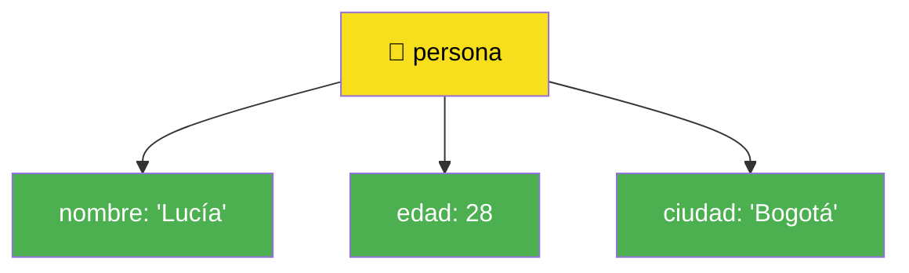
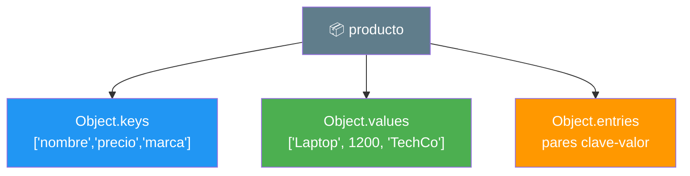
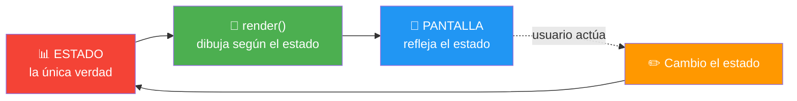
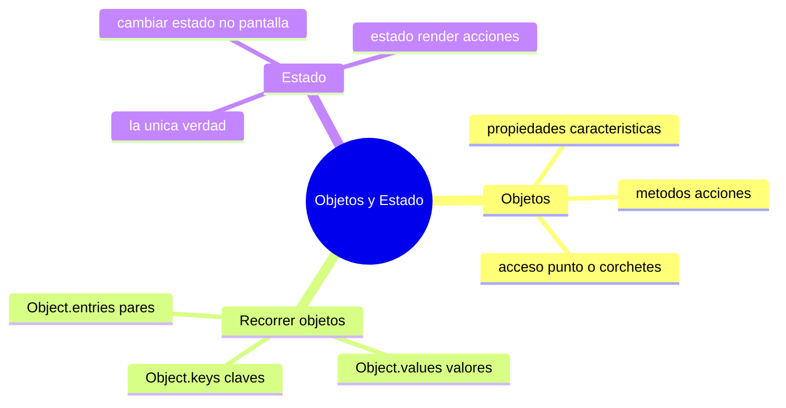

# 🧩 Módulo 8 — Objetos y Estado

> 💡 **Antes de empezar:** En el Módulo 7 aprendiste a guardar _listas_ de cosas con arrays. Pero ¿cómo guardas información sobre _una_ cosa con muchas características? Un usuario tiene nombre, edad, email, foto... Para eso existen los objetos. Y al final, juntaremos todo bajo una idea poderosa que mueve a todas las apps modernas: el **estado**. Es como pasar de tener ingredientes sueltos a tener una ficha completa de cada platillo. 📇

---

## 🎯 ¿Qué aprenderás en este módulo?

Al terminar serás capaz de:

- Agrupar datos relacionados en **objetos** con propiedades y métodos.
- Acceder y modificar la información de un objeto.
- Recorrer objetos con `Object.keys`, `Object.values` y `Object.entries`.
- Entender qué es el **estado** y por qué es el corazón de toda app.
- Mantener la pantalla siempre sincronizada con tus datos.

---

## 1. Objetos: agrupar información relacionada

Un **objeto** guarda varios datos relacionados bajo un mismo nombre, usando _pares de clave y valor_ dentro de llaves `{ }`.

### 🪪 La metáfora de la ficha de identidad

Un array es una _lista numerada_ (posición 0, 1, 2...). Un objeto es una _ficha con etiquetas_: en vez de "el dato en la posición 0", dices "el dato llamado `nombre`". Es como tu documento de identidad: tiene campos con nombre (nombre, fecha de nacimiento, número) y un valor en cada uno.

```javascript
let persona = {
  nombre: "Lucía",
  edad: 28,
  ciudad: "Bogotá"
};
```



> 🔑 **Array vs Objeto:** Usa un **array** cuando tienes una _lista de cosas del mismo tipo_ (frutas, tareas). Usa un **objeto** cuando describes _una cosa con varias características_ (una persona, un producto).

---

### Propiedades: los datos del objeto

Cada par "clave: valor" es una **propiedad**. La clave es la etiqueta; el valor es la información.

```javascript
let libro = {
  titulo: "El Quijote",   // propiedad "titulo"
  paginas: 863,           // propiedad "paginas"
  disponible: true        // propiedad "disponible"
};
```

---

### Acceso a propiedades: leer y cambiar datos

Hay dos formas de acceder a una propiedad: con punto `.` o con corchetes `[ ]`.

```javascript
let persona = { nombre: "Lucía", edad: 28 };

// Notación de punto (la más común y limpia)
console.log(persona.nombre);  // "Lucía"

// Notación de corchetes (útil con variables o nombres raros)
console.log(persona["edad"]); // 28

// Cambiar un valor
persona.edad = 29;
console.log(persona.edad);    // 29

// Agregar una propiedad nueva
persona.email = "lucia@mail.com";
```

> ✏️ **Metáfora:** El punto `.` es como señalar directamente un campo de la ficha: "dame el `nombre`". Y puedes tachar y reescribir cualquier campo cuando quieras.

> 💡 **¿Punto o corchetes?** Usa el punto casi siempre, es más legible. Los corchetes son para casos especiales: cuando el nombre de la propiedad está guardado en una variable, o cuando tiene espacios o caracteres raros.

---

### Métodos: cuando un objeto sabe _hacer_ cosas

Una propiedad puede contener una **función**. A esa función dentro de un objeto la llamamos **método**: es algo que el objeto _sabe hacer_.

```javascript
let perro = {
  nombre: "Toby",
  ladrar: function () {
    console.log("¡Guau guau! 🐶");
  }
};

perro.ladrar();  // ¡Guau guau!
```

> 🤖 **Metáfora:** Si las propiedades son las _características_ de un objeto (un robot es azul, mide 2 metros), los métodos son sus _acciones_ (el robot puede caminar, hablar). `perro.nombre` es lo que _es_; `perro.ladrar()` es lo que _hace_.

> 🔍 **Cómo distinguirlos:** Un método siempre lleva paréntesis `()` al usarse, porque es una función que se ejecuta. Una propiedad no.

---

### Objetos dentro de arrays: la combinación poderosa

En la vida real casi siempre combinarás ambos: una _lista_ (array) de _fichas_ (objetos). Esto es lo que usan todas las apps.

```javascript
let usuarios = [
  { nombre: "Ana", edad: 25 },
  { nombre: "Luis", edad: 30 },
  { nombre: "Sara", edad: 22 }
];

console.log(usuarios[0].nombre);  // "Ana"
console.log(usuarios[1].edad);    // 30
```

> 🧠 **Idea clave:** Un array de objetos es la estructura más común en programación real. Tus contactos, tus mensajes, los productos de una tienda: todos son listas de fichas. ¡Y ya sabes recorrerlas con `map`, `filter` y compañía del Módulo 7!

---

## 2. Métodos útiles para recorrer objetos

A diferencia de los arrays, los objetos no se recorren directamente con `forEach`. Para eso, JavaScript nos da tres ayudantes que _convierten_ el objeto en algo recorrible.

### 🗝️ La metáfora del llavero

Imagina un objeto como un mueble con cajones etiquetados. Estos tres métodos te dan distintas vistas del mueble:

- `Object.keys` → las **etiquetas** de los cajones (las claves).
- `Object.values` → el **contenido** de los cajones (los valores).
- `Object.entries` → **etiqueta + contenido** juntos (pares).

```javascript
let producto = {
  nombre: "Laptop",
  precio: 1200,
  marca: "TechCo"
};
```



### `Object.keys`: las claves

```javascript
console.log(Object.keys(producto));
// ["nombre", "precio", "marca"]
```

### `Object.values`: los valores

```javascript
console.log(Object.values(producto));
// ["Laptop", 1200, "TechCo"]
```

### `Object.entries`: pares clave-valor

Devuelve una lista de parejas `[clave, valor]`, perfecta para recorrer todo con un bucle.

```javascript
console.log(Object.entries(producto));
// [["nombre", "Laptop"], ["precio", 1200], ["marca", "TechCo"]]

// Recorrerlo todo de forma elegante:
Object.entries(producto).forEach(([clave, valor]) => {
  console.log(`${clave}: ${valor}`);
});
// nombre: Laptop
// precio: 1200
// marca: TechCo
```

> 💡 **Truco profesional:** Estos tres métodos convierten un objeto en un array, y entonces puedes usar todo lo que aprendiste en el Módulo 7 (`map`, `filter`, `forEach`). ¡Los conocimientos se conectan!

|Método|Te da...|Útil para...|
|---|---|---|
|`Object.keys`|Las claves|Saber qué propiedades existen|
|`Object.values`|Los valores|Trabajar solo con los datos|
|`Object.entries`|Pares clave-valor|Recorrer todo a la vez|

---

## 3. Estado: el corazón de toda aplicación

Llegamos al concepto más importante de la programación moderna de interfaces. Tómalo con calma, porque entenderlo bien cambia tu forma de programar para siempre.

### ¿Qué es el estado?

El **estado** son _los datos que describen cómo está tu aplicación en este momento_. Es la "verdad" de tu app: qué tareas hay, qué usuario inició sesión, si el menú está abierto o cerrado.

### 🎮 La metáfora del videojuego

Piensa en un videojuego pausado. En ese instante congelado, hay datos que describen _todo_: tu vida (80%), tu puntaje (1500), tu nivel (3), los enemigos en pantalla. **Eso es el estado**: una foto de todos los datos en un momento dado. Cuando algo cambia (recibes daño), el estado cambia, y la pantalla debe reflejarlo.

```javascript
// El estado de una app de tareas podría ser:
let estado = {
  usuario: "Ana",
  tareas: ["Estudiar", "Correr"],
  modoOscuro: false
};
```

> 🧠 **Idea clave:** Tu pantalla es solo un _reflejo_ del estado. Si el estado dice "modo oscuro: true", la pantalla debe verse oscura. El estado manda; la pantalla obedece.

---

### Sincronizar datos con pantalla

El gran error de los principiantes es cambiar la pantalla _y_ los datos por separado, hasta que dejan de coincidir. La regla de oro evita ese caos:

> 🏆 **REGLA DE ORO:** Nunca cambies la pantalla directamente. **Cambia el estado, y deja que la pantalla se redibuje a partir de él.**



### 🌡️ La metáfora del termostato

El estado es la _temperatura real_ de la casa. La pantalla es el _número que muestra el termostato_. No pintas el número a mano; el termostato lee la temperatura real y muestra el número correcto. Si cambias la temperatura, el número se actualiza solo. Así debe funcionar tu app: el estado es la realidad, la pantalla solo la muestra.

---

### Renderizado manual: poniéndolo todo junto

"Renderizado manual" significa que _tú_ escribes la función `render()` que toma el estado y dibuja la pantalla. Aquí está el patrón completo, el más importante de todo el curso:

```html
<!DOCTYPE html>
<html>
<body>
  <h2 id="saludo"></h2>
  <p>Tareas pendientes: <span id="conteo"></span></p>
  <input type="text" id="campo" placeholder="Nueva tarea">
  <button id="agregar">Agregar</button>
  <ul id="lista"></ul>

  <script>
    // 1️⃣ EL ESTADO: la única fuente de verdad
    let estado = {
      usuario: "Ana",
      tareas: ["Estudiar JavaScript"]
    };

    // 2️⃣ EL RENDER: dibuja la pantalla SEGÚN el estado
    function render() {
      document.querySelector("#saludo").textContent = `Hola, ${estado.usuario} 👋`;
      document.querySelector("#conteo").textContent = estado.tareas.length;
      document.querySelector("#lista").innerHTML =
        estado.tareas.map((t) => `<li>${t}</li>`).join("");
    }

    // 3️⃣ LAS ACCIONES: cambian el estado y luego renderizan
    document.querySelector("#agregar").addEventListener("click", () => {
      const campo = document.querySelector("#campo");
      if (campo.value !== "") {
        estado.tareas.push(campo.value);  // cambio el ESTADO
        campo.value = "";
        render();                          // redibujo
      }
    });

    // 4️⃣ Dibujo inicial
    render();
  </script>
</body>
</html>
```

> 🔍 **Desglose del patrón (grábatelo):**
> 
> 1. **Estado:** un objeto con toda la verdad de la app.
> 2. **Render:** una función que dibuja la pantalla leyendo el estado.
> 3. **Acciones:** los eventos _solo_ cambian el estado y llaman a `render()`.
> 4. **Nunca** tocas la pantalla por fuera de `render()`.

> 🚀 **Por qué esto importa tanto:** Este patrón —estado, render, acciones— es _exactamente_ la idea sobre la que se construyó React, la herramienta más usada del mundo para crear interfaces. Si entiendes esto, ya tienes la mentalidad de un desarrollador moderno. ¡En serio!

---

## 🛠️ Mini práctica: ¡tu turno!

Los primeros ejercicios van en la consola; el último necesita un archivo HTML. 🧪

### Ejercicio 1 — Crea tu ficha

```javascript
let yo = {
  nombre: "TU NOMBRE",
  edad: 25,
  hobbies: ["leer", "programar"],
  saludar: function () {
    return `Hola, soy ${this.nombre}`;
  }
};

console.log(yo.nombre);
console.log(yo.hobbies[0]);
console.log(yo.saludar());
```

> 🔍 **Nota:** Dentro de un método, `this` se refiere al _propio objeto_. `this.nombre` significa "el nombre de este objeto". Lo verás mucho más adelante; por ahora basta con reconocerlo.

### Ejercicio 2 — Recorre un objeto

```javascript
let coche = { marca: "Toyota", modelo: "Corolla", año: 2022 };

Object.entries(coche).forEach(([clave, valor]) => {
  console.log(`${clave} → ${valor}`);
});
```

Predice qué imprime antes de ejecutarlo.

### Ejercicio 3 — Array de objetos + filter

```javascript
let estudiantes = [
  { nombre: "Ana", nota: 85 },
  { nombre: "Luis", nota: 60 },
  { nombre: "Sara", nota: 95 }
];

// Nombres de quienes aprobaron (nota >= 70)
let aprobados = estudiantes
  .filter((e) => e.nota >= 70)
  .map((e) => e.nombre);

console.log(aprobados);  // ["Ana", "Sara"]
```

### Ejercicio 4 — Practica el patrón de estado

Copia el ejemplo de "Renderizado manual" en un archivo HTML. Luego, como reto, **añade un botón "Cambiar usuario"** que modifique `estado.usuario` y llame a `render()`. Observa cómo el saludo se actualiza solo. ✨

> 💡 **Pista:** El botón solo hace dos cosas: `estado.usuario = "Carlos"` y luego `render()`. ¡Esa es toda la lógica!

---

## 🧭 Resumen visual del módulo



---

## ✅ Checklist: ¿lo lograste?

- [ ] Creo objetos con propiedades y accedo con punto o corchetes.
- [ ] Distingo una propiedad (lo que _es_) de un método (lo que _hace_).
- [ ] Sé cuándo usar un array y cuándo un objeto.
- [ ] Recorro objetos con `Object.keys`, `Object.values` y `Object.entries`.
- [ ] Entiendo qué es el estado: la única fuente de verdad.
- [ ] Sigo la regla de oro: cambiar el estado, no la pantalla.
- [ ] Aplico el patrón estado → render → acciones.

Si marcaste la mayoría, **acabas de aprender la mentalidad de un desarrollador profesional**. 💪

---

## 🌱 Reflexión final

Este módulo cierra un círculo importante. Los objetos te dieron una forma natural de modelar el mundo real (personas, productos, cualquier "cosa" con características). Y el estado te dio algo aún más profundo: _una forma de pensar_.

Esa regla de oro —"cambia el estado, no la pantalla"— parece simple, pero es la diferencia entre código que se vuelve un caos imposible de mantener y código limpio que escala. Es la idea que sostiene a React, Vue, Angular y prácticamente todas las apps que usas a diario. Tú la entendiste con un `render()` hecho a mano, que es la mejor forma de entenderla _de verdad_, sin magia escondida.

No te preocupes si `this`, o la idea de estado, todavía se sienten un poco abstractos. Son conceptos que maduran con la práctica y con cada pequeño proyecto que construyes. Vuelve aquí cuando lo necesites; este módulo es de los que se releen.

> 🎯 **El secreto sigue siendo el mismo:** un pasito a la vez. Hoy aprendiste a _organizar_ datos (objetos) y a _gobernarlos_ (estado). Con eso, tienes la base mental sobre la que se construye el desarrollo web moderno.

**¡Nos vemos en el Módulo 9!**