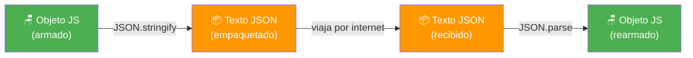
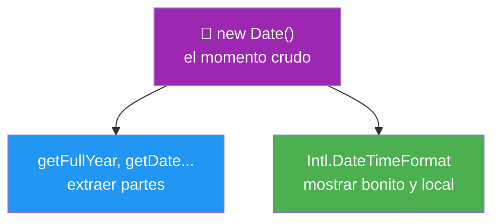
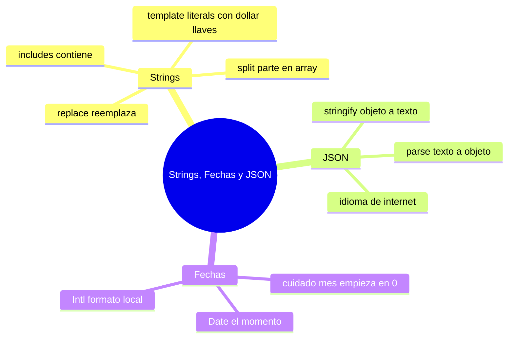

# 🧩 Módulo 9 — Strings, Fechas y JSON

> 💡 **Antes de empezar:** Hoy dominamos tres herramientas que usarás _constantemente_ en proyectos reales. Aprenderás a manipular texto como un escultor (strings), a manejar fechas y horas (algo más tramposo de lo que parece), y a hablar el "idioma universal" con el que las apps intercambian datos por internet (JSON). Es como aprender a leer las etiquetas, el reloj y el idioma común de la cocina internacional. 🌍

---

## 🎯 ¿Qué aprenderás en este módulo?

Al terminar serás capaz de:

- Buscar, reemplazar y partir texto con métodos de strings.
- Construir textos elegantes con template literals.
- Convertir datos a texto y de vuelta con JSON (el idioma de internet).
- Trabajar con fechas y mostrarlas en formato amigable según el país.

---

## 1. Strings: manipular texto como un experto

Ya conoces los strings (texto entre comillas). Ahora aprenderás a _transformarlos_. JavaScript trae métodos muy útiles para trabajar con texto.

### 🧱 La metáfora de los bloques de letras

Un string es como una fila de bloques de letras, cada uno en su posición. Estos métodos te permiten buscar un bloque, reemplazarlo o partir la fila en pedazos.

---

### `includes`: ¿contiene este texto?

Revisa si un texto contiene cierta palabra o frase. Devuelve `true` o `false`.

```javascript
let frase = "Hoy aprendo JavaScript";

console.log(frase.includes("Java"));   // true
console.log(frase.includes("Python")); // false
```

> 🔍 **Metáfora:** `includes` es como usar Ctrl+F en un documento: pregunta "¿está esta palabra por aquí?" y te responde sí o no. Súper útil para buscadores y filtros (¡como el del Módulo 6!).

---

### `replace`: reemplazar texto

Cambia una parte del texto por otra y devuelve un texto nuevo.

```javascript
let mensaje = "Hola Juan";
let nuevo = mensaje.replace("Juan", "María");
console.log(nuevo);     // "Hola María"
console.log(mensaje);   // "Hola Juan" (el original no cambia)
```

> ✏️ **Metáfora:** `replace` es como la función "buscar y reemplazar" de un procesador de texto. Encuentra algo y pone otra cosa en su lugar.

> 💡 **Detalle:** `replace` cambia solo la _primera_ coincidencia. Para cambiar todas, existe `replaceAll`. Y como los strings no se modifican, siempre devuelve un texto nuevo (por eso lo guardamos en una variable).

---

### `split`: partir en pedazos

Divide un texto en un _array_ de partes, usando un separador que tú eliges.

```javascript
let nombres = "Ana,Luis,Sara";
let lista = nombres.split(",");
console.log(lista);  // ["Ana", "Luis", "Sara"]

let frase = "Me gusta programar";
let palabras = frase.split(" ");
console.log(palabras);  // ["Me", "gusta", "programar"]
```

> 🔪 **Metáfora:** `split` es como cortar una salchicha en rodajas. Le dices por dónde cortar (el separador) y te entrega los pedazos en un array.

> 🔗 **Dato curioso:** `split` es lo _opuesto_ a `join` (que viste en el Módulo 7). `split` parte un texto en array; `join` une un array en texto. Son hermanos inversos.

---

### Template literals: construir texto con variables

Ya los has visto a lo largo del curso (las comillas invertidas `` ` ``). Aquí los formalizamos porque son la _mejor_ forma de construir texto.

```javascript
let nombre = "Lucía";
let edad = 28;

// ❌ Forma antigua: pegar trozos con +
let viejo = "Hola, soy " + nombre + " y tengo " + edad + " años";

// ✅ Forma moderna con template literals
let nuevo = `Hola, soy ${nombre} y tengo ${edad} años`;
```

Sus dos superpoderes:

```javascript
// 1. Insertar variables y hasta operaciones con ${ }
let precio = 100;
console.log(`El total con IVA es ${precio * 1.19}`);

// 2. Escribir en varias líneas sin trucos raros
let carta = `Estimado cliente,

Gracias por su compra.
Saludos.`;
```

> 📝 **Metáfora:** Los template literals son como rellenar los espacios en blanco de un formulario: escribes el texto fijo y dejas huecos `${ }` donde van tus datos. Mucho más claro que pegar trozos con `+`.

---

## 2. JSON: el idioma universal de los datos

**JSON** (JavaScript Object Notation) es un formato de texto para guardar e intercambiar datos. Es _el_ idioma que usan las apps para hablar entre sí por internet.

### 📦 La metáfora del paquete para enviar

Imagina que quieres enviar un mueble por correo. No lo mandas armado: lo _desarmas_, lo metes en una caja plana (texto), y quien lo recibe lo _vuelve a armar_. JSON es esa caja: convierte tus objetos en texto para poder enviarlos, y luego los reconstruye al llegar.



> 🧠 **¿Por qué es necesario?** Por internet solo se puede enviar _texto_. Un objeto de JavaScript no se puede enviar tal cual; primero hay que convertirlo en texto (JSON) y, al recibirlo, volver a convertirlo en objeto.

---

### `JSON.stringify`: de objeto a texto

Convierte un objeto (o array) de JavaScript en un texto JSON.

```javascript
let usuario = {
  nombre: "Ana",
  edad: 25,
  activo: true
};

let texto = JSON.stringify(usuario);
console.log(texto);
// '{"nombre":"Ana","edad":25,"activo":true}'
console.log(typeof texto);  // "string" (¡ahora es texto!)
```

> 📤 **Metáfora:** `stringify` es _empaquetar_: toma tu objeto armado y lo aplana en una caja de texto lista para enviar o guardar.

---

### `JSON.parse`: de texto a objeto

Hace lo contrario: toma un texto JSON y lo convierte de vuelta en un objeto usable.

```javascript
let texto = '{"nombre":"Ana","edad":25,"activo":true}';

let usuario = JSON.parse(texto);
console.log(usuario.nombre);  // "Ana" (¡ya puedo usar el punto!)
console.log(usuario.edad);    // 25
```

> 📥 **Metáfora:** `parse` es _desempaquetar_: toma la caja de texto y rearma el objeto para que puedas volver a usar sus propiedades con el punto.

> 🔑 **Truco para no confundirlos:** `stringify` convierte a **string** (el nombre lo dice). `parse` lo _interpreta_ de vuelta a objeto. Empaquetar vs desempaquetar.

|Método|Convierte|Para...|
|---|---|---|
|`JSON.stringify`|Objeto → Texto|Enviar o guardar datos|
|`JSON.parse`|Texto → Objeto|Usar datos recibidos|

> 💡 **Dónde lo verás:** Cada vez que una app pide datos a internet (clima, noticias, productos), los recibe como JSON y usa `parse` para usarlos. Es pan de cada día del desarrollo web.

---

## 3. Fechas: manejar el tiempo

Trabajar con fechas es más delicado de lo que parece (zonas horarias, formatos por país...). JavaScript nos da herramientas para manejarlo.

### `Date`: el objeto del tiempo

`Date` representa un momento concreto: una fecha y hora.

```javascript
// La fecha y hora de AHORA
let ahora = new Date();
console.log(ahora);  // muestra la fecha y hora actuales

// Una fecha específica (¡ojo con el mes!)
let cumple = new Date(2025, 0, 15);  // 15 de enero de 2025
```

> ⚠️ **La trampa clásica de los meses:** En `Date`, los meses empiezan en **0**, no en 1. Así que enero es `0`, febrero es `1`... y diciembre es `11`. _A todos_ nos ha confundido esto alguna vez. ¡No te sientas mal cuando te pase!

Puedes extraer partes de una fecha:

```javascript
let hoy = new Date();
console.log(hoy.getFullYear());  // el año, ej: 2026
console.log(hoy.getDate());      // el día del mes, ej: 25
console.log(hoy.getHours());     // la hora, ej: 14
```

> 🕰️ **Metáfora:** Un objeto `Date` es como una foto de un reloj y un calendario juntos en un instante. Con los métodos `get...` le preguntas "¿qué año marca?", "¿qué día?", "¿qué hora?".

---

### `Intl`: mostrar fechas de forma amigable

El problema: una fecha "cruda" se ve fea y, además, cada país escribe las fechas distinto (EE.UU. pone el mes primero; en Latinoamérica va el día primero). `Intl` resuelve esto formateando la fecha según el idioma y la región.

```javascript
let hoy = new Date();

// Formato para español (Colombia)
let formato = new Intl.DateTimeFormat("es-CO", {
  day: "numeric",
  month: "long",
  year: "numeric"
});

console.log(formato.format(hoy));  // ej: "25 de mayo de 2026"
```

> 🌎 **Metáfora:** `Intl` es como un traductor cultural. Le das una fecha y le dices "muéstrala como la escribiría alguien de Colombia" o "de Japón", y la adapta al formato local. Maneja idiomas, monedas y más.

> 💡 **Por qué importa:** Si tu app la usan personas de distintos países, `Intl` se encarga de que cada quien vea las fechas (y precios, y números) como está acostumbrado. Es la forma profesional de mostrar fechas.



---

## 🛠️ Mini práctica: ¡tu turno!

Estos ejercicios funcionan en la consola del navegador. 🧪

### Ejercicio 1 — Juega con strings

```javascript
let frase = "JavaScript es divertido";

console.log(frase.includes("divertido"));   // ¿true o false?
console.log(frase.replace("divertido", "poderoso"));
console.log(frase.split(" "));               // ¿qué array sale?
console.log(frase.split(" ").length);        // ¿cuántas palabras?
```

Predice cada resultado antes de ejecutar.

### Ejercicio 2 — Empaqueta y desempaqueta con JSON

```javascript
let producto = { nombre: "Café", precio: 8, organico: true };

// Empaquetar a texto
let texto = JSON.stringify(producto);
console.log(texto);
console.log(typeof texto);  // "string"

// Desempaquetar de vuelta
let recuperado = JSON.parse(texto);
console.log(recuperado.nombre);  // "Café"
```

### Ejercicio 3 — Construye un saludo dinámico

```javascript
let nombre = "Sofía";
let hora = new Date().getHours();

let saludo = hora < 12 ? "Buenos días" : hora < 19 ? "Buenas tardes" : "Buenas noches";
console.log(`${saludo}, ${nombre} 👋`);
```

> 🔗 **Observa:** Combina template literals, `Date` y el operador ternario del Módulo 3. ¡Todo se conecta!

### Ejercicio 4 — Fecha en formato local

```javascript
let hoy = new Date();
let formato = new Intl.DateTimeFormat("es-CO", {
  weekday: "long",
  day: "numeric",
  month: "long",
  year: "numeric"
});
console.log(formato.format(hoy));  // ej: "domingo, 25 de mayo de 2026"
```

Cambia `"es-CO"` por `"en-US"` o `"ja-JP"` y observa cómo cambia el formato. 🌍

---

## 🧭 Resumen visual del módulo



---

## ✅ Checklist: ¿lo lograste?

- [ ] Busco texto con `includes` y lo reemplazo con `replace`.
- [ ] Parto strings en arrays con `split` (el inverso de `join`).
- [ ] Construyo texto con template literals y `${ }`.
- [ ] Convierto objetos a texto con `JSON.stringify`.
- [ ] Convierto texto JSON de vuelta a objetos con `JSON.parse`.
- [ ] Creo y leo fechas con `Date` (¡recordando que el mes empieza en 0!).
- [ ] Muestro fechas en formato local con `Intl`.

Si marcaste la mayoría, **ya manejas las herramientas que usan las apps reales para comunicarse**. 💪

---

## 🌱 Reflexión final

Este módulo es muy _práctico_: estas tres herramientas aparecen en casi cualquier proyecto real. Manipularás texto para buscadores y mensajes, usarás JSON cada vez que tu app converse con internet, y manejarás fechas en calendarios, publicaciones, recibos y mil cosas más.

JSON merece una mención especial: cuando en el futuro tu app pida datos a un servidor (el clima, una lista de productos, mensajes), todo llegará en JSON. Hoy entendiste _qué es_ y _cómo desempaquetarlo_, así que cuando llegue ese momento no será un misterio, sino un viejo conocido.

Y no te frustres con las fechas: son notoriamente confusas (¡el mes que empieza en 0 ha hecho tropezar a millones de programadores!). Es totalmente normal tener que consultar la documentación cada vez. Nadie se sabe esto de memoria, ni los expertos.

> 🎯 **El secreto sigue siendo el mismo:** un pasito a la vez. Hoy sumaste tres herramientas muy prácticas a tu caja. Cada una resuelve un problema real que enfrentarás una y otra vez al construir cosas de verdad.

**¡Nos vemos en el Módulo 10!**