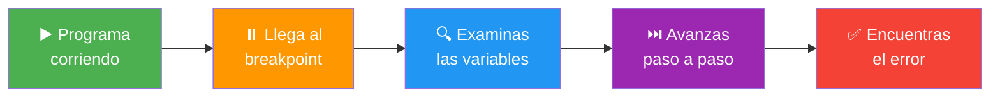
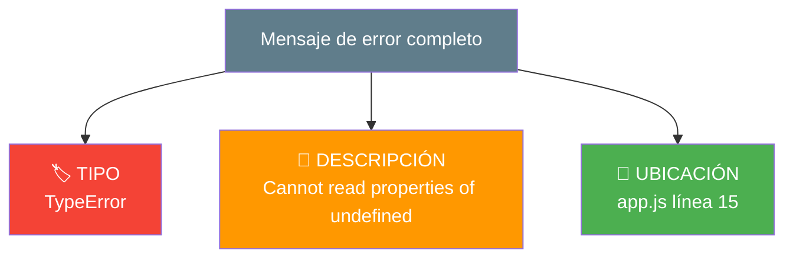
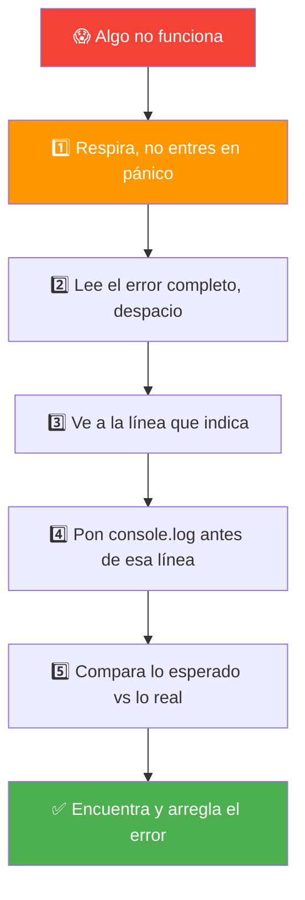
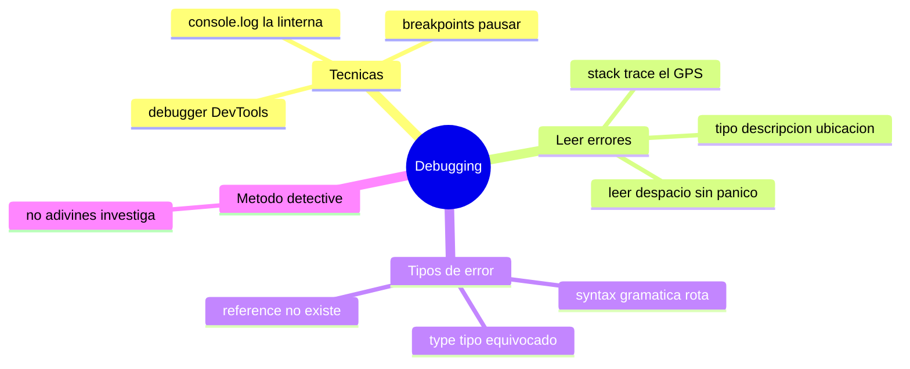

# 🧩 Módulo 10 — Debugging y Resolución de Errores

> 💡 **Antes de empezar:** Aquí va una verdad que nadie te dice al principio: _los programadores pasan más tiempo arreglando errores que escribiendo código nuevo_. Y eso no es malo, ¡es normal y hasta divertido! Hoy aprenderás a ver los errores no como enemigos, sino como pistas que te guían a la solución. Es como ser un detective: cada error es una huella que te acerca al culpable. 🕵️

---

## 🎯 ¿Qué aprenderás en este módulo?

Al terminar serás capaz de:

- Encontrar errores en tu código usando técnicas de _debugging_.
- Pausar tu programa para examinarlo por dentro con breakpoints.
- Leer y entender los mensajes de error (¡que en realidad te están ayudando!).
- Reconocer los tres tipos de errores más comunes y cómo resolverlos.

---

## 🐛 ¿Qué es "debugging"?

La palabra **bug** significa "bicho" en inglés, y en programación es un _error_ en el código. _Debugging_ es el proceso de **encontrar y eliminar esos bichos**.

### 🔦 La metáfora del detective con linterna

Cuando algo no funciona, no sabes _dónde_ está el problema. El debugging es como ser un detective con una linterna: vas iluminando partes de tu código, buscando pistas, hasta encontrar el lugar exacto donde las cosas salen mal.

> 🧠 **Cambio de mentalidad (¡el más importante del curso!):** Un error no significa que seas malo programando. _Todos_ los programadores, desde el primer día hasta los más expertos del mundo, conviven con errores cada día. La diferencia no es cometer menos errores, sino saber _encontrarlos y arreglarlos_ con calma.

---

## 1. Técnicas de debugging

### `console.log`: tu linterna de bolsillo

Ya conoces a `console.log` desde el Módulo 1. Resulta que también es la herramienta de debugging _más usada del mundo_, por principiantes y expertos por igual. Sirve para "asomarte" y ver qué valores tiene tu código en cualquier punto.

```javascript
function calcularTotal(precio, cantidad) {
  console.log("precio es:", precio);      // ¿qué llegó aquí?
  console.log("cantidad es:", cantidad);  // ¿y aquí?
  let total = precio * cantidad;
  console.log("total calculado:", total); // ¿el resultado es correcto?
  return total;
}

calcularTotal(10, 5);
```

> 💡 **Metáfora:** `console.log` es como abrir una ventanita en una pared para espiar lo que pasa dentro de una habitación cerrada. Pones ventanitas en los puntos sospechosos y ves qué valores hay realmente (que a veces _no_ son los que creías).

> 🎯 **Truco profesional:** Pon un texto antes del valor (`"precio es:"`) para saber _cuál_ `console.log` te está hablando. Si pones diez sin etiqueta, te perderás entre números sueltos.

---

### Breakpoints: pausar el tiempo

Un **breakpoint** (punto de interrupción) es una marca que le pones a una línea para que el programa se _congele_ justo ahí. Entonces puedes mirar el estado de todo con calma, como pausar una película en una escena.

### ⏸️ La metáfora de pausar la película

Imagina que tu código es una película que pasa demasiado rápido para ver el detalle. Un breakpoint es como pausarla en el fotograma exacto que quieres examinar: ahora puedes mirar tranquilamente qué valores tiene cada variable en ese instante.

**Cómo poner un breakpoint:**

1. Abre las DevTools (`F12`).
2. Ve a la pestaña **Sources** (Fuentes).
3. Busca tu archivo y haz clic en el _número_ de una línea. Aparece un marcador azul.
4. Recarga o ejecuta: el programa se detendrá ahí.



---

### El debugger de las DevTools

Cuando el programa está pausado en un breakpoint, las DevTools te dan controles para avanzar:

- **Step over (⤵️):** ejecuta la línea actual y pasa a la siguiente.
- **Resume (▶️):** continúa la ejecución normal hasta el siguiente breakpoint.
- **Panel de Scope:** te muestra _todas las variables_ y sus valores en ese momento.

> 🎮 **Metáfora:** Es como tener los controles de un reproductor de video sobre tu código: pausa, avanza fotograma a fotograma, reanuda. Mientras tanto, ves "tras bambalinas" el valor real de cada variable.

> 💡 **¿console.log o breakpoints?** `console.log` es rápido y perfecto para empezar (úsalo sin culpa, todos lo hacemos). Los breakpoints son más potentes para problemas complejos donde necesitas examinar muchas variables a la vez. Aprende ambos; usarás los dos toda tu vida.

---

## 2. Leer errores: los mensajes son tus amigos

Cuando algo falla, JavaScript te muestra un _mensaje de error_ en rojo en la consola. La reacción natural del principiante es asustarse. Pero esos mensajes no te están regañando: **te están diciendo exactamente qué pasó y dónde.**

### 📖 El stack trace: el mapa del error

El **stack trace** (rastro de la pila) es la información que acompaña a un error. Se ve intimidante, pero tiene una estructura clara:

```
Uncaught TypeError: Cannot read properties of undefined (reading 'nombre')
    at mostrarUsuario (app.js:15)
    at app.js:23
```

Desglosémoslo como un detective:



- **El tipo** (`TypeError`): qué clase de error es.
- **La descripción**: qué salió mal, en palabras.
- **La ubicación** (`app.js:15`): el archivo y la _línea exacta_ donde ocurrió. ¡Esto es oro!

> 🗺️ **Metáfora:** El stack trace es como el GPS de tu error. Te dice el _tipo_ de problema, _qué_ pasó y el _kilómetro exacto_ (línea) donde ocurrió. En vez de buscar a ciegas, vas directo al lugar.

> 🧠 **Consejo clave:** _Lee siempre el mensaje de error completo, despacio._ Suena obvio, pero el error #1 de los principiantes es entrar en pánico y _no leer_ lo que dice. El mensaje casi siempre contiene la respuesta. Empieza por la primera línea y la ubicación.

---

### Errores comunes (y cómo no entrar en pánico)

Algunos errores aparecen una y otra vez. Reconocerlos te ahorra muchísimo tiempo:

- Olvidar un paréntesis, llave o comilla de cierre.
- Escribir mal el nombre de una variable (`nombre` vs `Nombre`).
- Usar una variable que aún no existe.
- Intentar acceder a algo que es `undefined`.

> 😌 **Tranquilo:** Estos errores le pasan a _todo el mundo_, todos los días. Con la práctica, los reconocerás de un vistazo y los arreglarás en segundos.

---

## 3. Los tres tipos de errores más comunes

Conocer estos tres tipos te permite diagnosticar rápido qué tipo de problema tienes.

### 🔴 Syntax Error (error de sintaxis)

Un error de _gramática_: escribiste algo que JavaScript no puede ni leer. Suele ser un símbolo que falta o sobra.

```javascript
// ❌ Falta el paréntesis de cierre
console.log("Hola"

// ❌ Falta una llave
function saludar() {
  console.log("Hola");
// (falta la } de cierre)
```

> ✍️ **Metáfora:** Es como escribir una frase sin cerrar las comillas o sin punto final. El lector (JavaScript) se queda esperando y dice "no entiendo, esto está incompleto". **Buena noticia:** suele ser el más fácil de arreglar; el error te apunta a la línea y solo falta cerrar algo.

---

### 🟠 Reference Error (error de referencia)

Intentas usar algo que _no existe_. Casi siempre: una variable mal escrita o que no se ha definido.

```javascript
console.log(nombre);  // ❌ ReferenceError: nombre is not defined
// (nunca creamos la variable "nombre")

let saludo = "Hola";
console.log(saludL);  // ❌ ReferenceError (escribimos "saludL" por error)
```

> 🔍 **Metáfora:** Es como llamar a alguien por un nombre que no existe en la sala. Gritas "¡Pedro!" pero no hay ningún Pedro: nadie responde. JavaScript busca esa variable, no la encuentra, y te avisa.

> 💡 **Cómo arreglarlo:** Revisa que la variable _exista_ y que esté _bien escrita_. La mayoría de las veces es un simple error de tipeo (mayúsculas, una letra cambiada).

---

### 🟡 Type Error (error de tipo)

Intentas hacer algo con un dato que _no permite esa operación_. Por ejemplo, usar una función sobre algo que no es del tipo correcto, o acceder a una propiedad de `undefined`.

```javascript
let numero = 5;
numero.toUpperCase();  // ❌ TypeError: los números no tienen ese método (es de texto)

let usuario;  // está undefined
console.log(usuario.nombre);  // ❌ TypeError: no se puede leer "nombre" de undefined
```

> 🔧 **Metáfora:** Es como intentar usar un destornillador para clavar un clavo. La herramienta existe, pero no sirve para _esa_ tarea. El dato existe, pero no es del _tipo_ adecuado para lo que intentas hacer.

> 💡 **Cómo arreglarlo:** Verifica que el dato sea del tipo que esperas. El operador `?.` del Módulo 3 ayuda a evitar el típico "no se puede leer de undefined".

---

### Tabla de diagnóstico rápido

|Error|Significa...|Causa típica|Pista mental|
|---|---|---|---|
|🔴 **Syntax**|"No puedo leer esto"|Falta `)`, `}`, `"`|Gramática rota|
|🟠 **Reference**|"Eso no existe"|Variable mal escrita o sin definir|Nombre fantasma|
|🟡 **Type**|"Eso no se puede hacer con esto"|Operación sobre el tipo equivocado|Herramienta incorrecta|

---

## 🧭 El método del detective: pasos para resolver cualquier error

Cuando algo falle, sigue esta rutina con calma. Te servirá _siempre_:



> 🕵️ **El mantra del detective:** _No adivines, investiga._ En vez de cambiar cosas al azar esperando que funcione, usa `console.log` para _ver_ qué está pasando realmente. Los datos no mienten.

---

## 🛠️ Mini práctica: ¡tu turno!

Estos ejercicios son distintos: aquí _buscarás_ errores. ¡Conviértete en detective! 🔍

### Ejercicio 1 — Encuentra el error de sintaxis

Este código tiene un error. ¿Lo ves? Pégalo en la consola y lee el mensaje.

```javascript
function saludar(nombre {
  console.log("Hola " + nombre);
}
```

> 💡 **Pista:** Falta un símbolo en la primera línea. El error te dirá la línea.

### Ejercicio 2 — Encuentra el error de referencia

```javascript
let mensaje = "Buen día";
console.log(mensage);  // 👀 mira con atención
```

> 💡 **Pista:** Lee _muy_ despacio el nombre de la variable en cada línea. ¿Son idénticos?

### Ejercicio 3 — Encuentra el error de tipo

```javascript
let edad = 30;
console.log(edad.toUpperCase());
```

> 💡 **Pista:** `toUpperCase()` convierte texto a mayúsculas. ¿Es `edad` un texto?

### Ejercicio 4 — Practica con console.log

Este código da un resultado incorrecto (debería dar 30, pero da algo raro). Usa `console.log` para descubrir por qué:

```javascript
let precio = "10";  // 🤔 ¿esto es número o texto?
let cantidad = 3;
let total = precio * cantidad;
console.log("Total:", total);

// Añade console.log para investigar:
console.log("tipo de precio:", typeof precio);
```

> 🔍 **Reto:** Una vez que descubras el problema, arréglalo usando `Number()` (del Módulo 2).

---

## 🧭 Resumen visual del módulo



---

## ✅ Checklist: ¿lo lograste?

- [ ] Uso `console.log` para espiar valores dentro de mi código.
- [ ] Sé poner breakpoints y examinar variables pausando el programa.
- [ ] Leo el stack trace y encuentro el tipo, la descripción y la línea.
- [ ] Reconozco un Syntax Error (gramática rota).
- [ ] Reconozco un Reference Error (algo que no existe).
- [ ] Reconozco un Type Error (operación sobre el tipo equivocado).
- [ ] Sigo el método del detective: no adivino, investigo.

Si marcaste la mayoría, **acabas de adquirir una de las habilidades más valiosas de todo programador**. 💪

---

## 🌱 Reflexión final

Este módulo es especial, porque va directo al corazón del miedo que muchos sienten al programar: _el miedo a equivocarse_. Y la gran lección es esta: **equivocarse no solo es normal, es parte esencial del proceso.** Los errores no son señales de que no sirves para esto; son la forma en que el código se comunica contigo y te enseña.

Piénsalo así: un mensaje de error en rojo no es un regaño, es un _mensaje de ayuda muy específico_. Te dice qué pasó y dónde. Con el tiempo, dejarás de temerles y empezarás a _agradecerlos_, porque te ahorran horas de búsqueda a ciegas.

Los mejores programadores del mundo no son los que nunca se equivocan —eso no existe—, sino los que se equivocan con tranquilidad, leen el error, investigan con calma y arreglan. Esa serenidad ante el error es, quizás, la marca más clara de la madurez como programador. Y ahora ya la estás cultivando.

> 🎯 **El secreto sigue siendo el mismo:** un pasito a la vez. Cuando algo falle —y fallará, a todos nos pasa—, respira, lee el error, y conviértete en detective. No hay bug que se resista a la paciencia y al `console.log`.

**¡Nos vemos en el Módulo 11!**