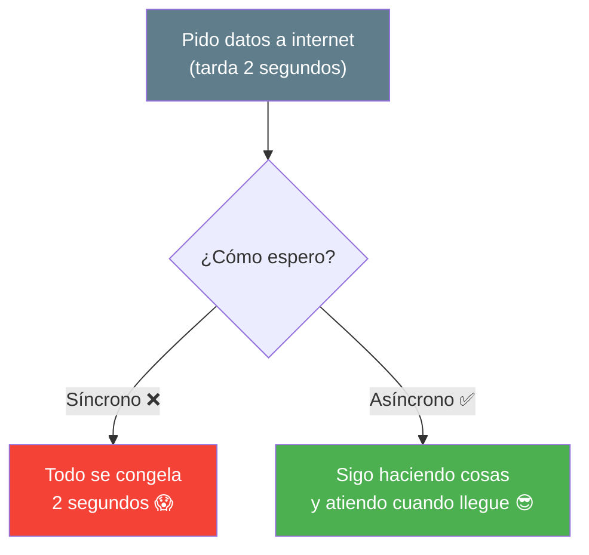
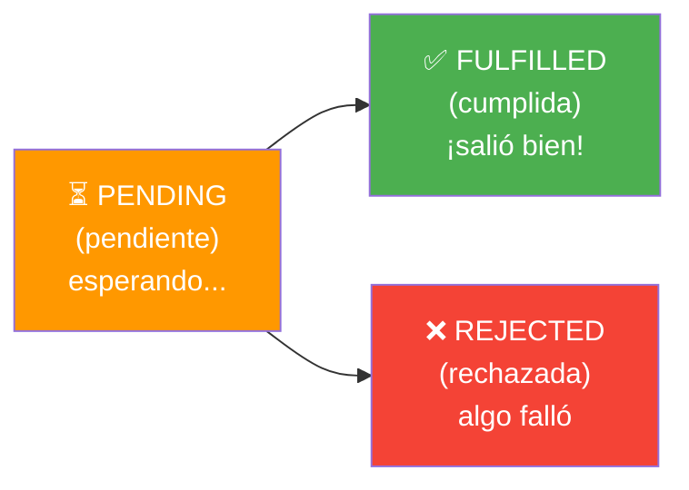
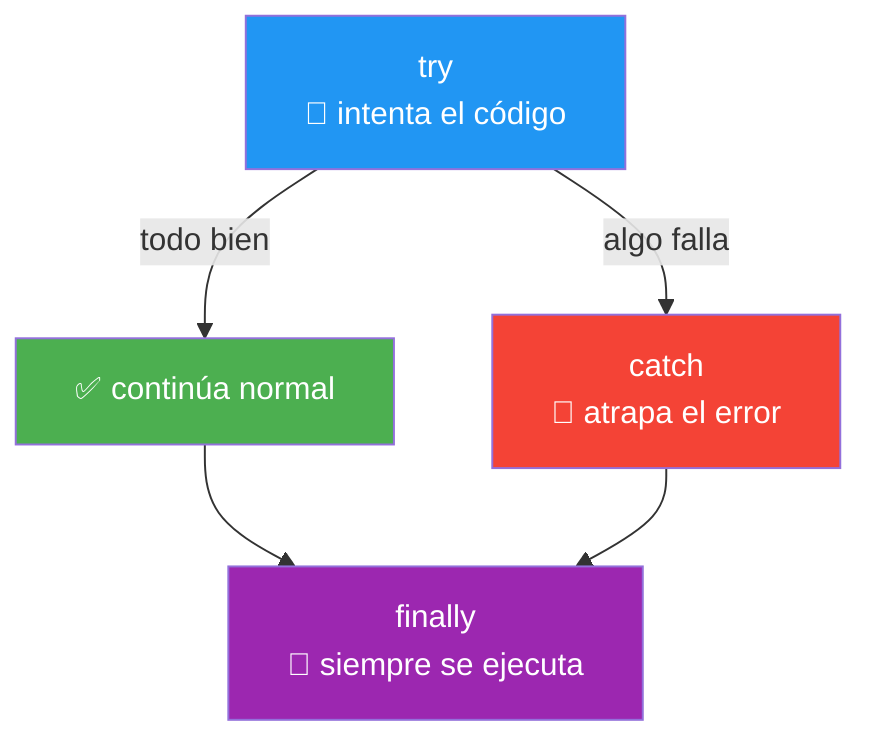
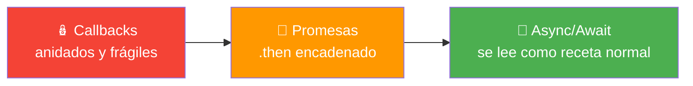
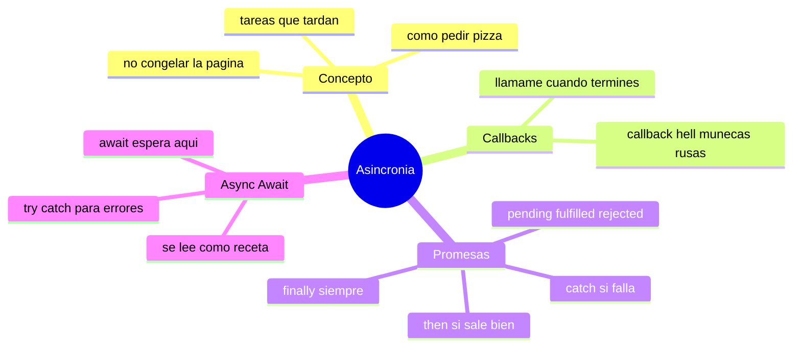

# 🧩 Módulo 11 — Asincronía Moderna

> 💡 **Antes de empezar:** Hasta ahora tu código se ejecutaba en orden, una línea tras otra, sin esperas. Pero en la vida real, algunas tareas _toman tiempo_: pedir datos a internet, leer un archivo, esperar una respuesta. La **asincronía** es cómo JavaScript maneja esas esperas sin congelar todo. Suena intimidante, pero con las metáforas correctas verás que es muy intuitivo. Es como aprender a cocinar varios platos a la vez en lugar de uno por uno. 🍳⏱️

---

## 🎯 ¿Qué aprenderás en este módulo?

Al terminar serás capaz de:

- Entender qué es la asincronía y por qué es necesaria.
- Reconocer los callbacks y el famoso "callback hell".
- Manejar tareas que tardan con **promesas** (`.then`, `.catch`, `.finally`).
- Escribir código asíncrono limpio y legible con **async/await**.

---

## ⏱️ ¿Qué es la asincronía? El concepto base

Imagina que pides una pizza por teléfono. Tienes dos formas de esperar:

- **Síncrono (bloqueante):** te quedas parado junto a la puerta, sin hacer _nada_ más, hasta que llegue la pizza. Pierdes todo ese tiempo.
- **Asíncrono (no bloqueante):** cuelgas, sigues con tu vida (ves TV, limpias), y cuando suena el timbre, atiendes la pizza. No desperdicias el tiempo de espera.

### 🍕 La metáfora de la pizzería

JavaScript, por naturaleza, es como una persona que solo puede hacer una cosa a la vez. Si esperara _parado_ cada tarea lenta (como pedir datos a internet), la página entera se congelaría. La asincronía le permite "encargar" la tarea lenta, _seguir trabajando en otras cosas_, y atender el resultado cuando esté listo.



> 🧠 **Idea clave:** La asincronía evita que tu app se "congele" mientras espera tareas lentas. El usuario puede seguir interactuando mientras los datos llegan en segundo plano.

---

## 1. Callbacks: la primera solución (y su problema)

Un **callback** es simplemente una función que le pasas a otra para que la ejecute _cuando termine_ una tarea. "Llámame cuando esté listo".

### 📞 La metáfora de dejar tu número

Cuando encargas algo que tardará, dejas tu número de teléfono y dices: "cuando esté listo, llámame". Ese "llámame" es el callback: una función que se ejecutará _después_, cuando la tarea termine.

```javascript
// setTimeout simula una tarea que tarda (espera 2 segundos)
console.log("Pido los datos...");

setTimeout(() => {
  console.log("¡Datos listos! (2 segundos después)");
}, 2000);

console.log("Mientras tanto, sigo trabajando");
```

Fíjate en el orden de salida:

```
Pido los datos...
Mientras tanto, sigo trabajando
¡Datos listos! (2 segundos después)
```

> 🔍 **Observa:** El mensaje "sigo trabajando" aparece _antes_ que "datos listos", ¡aunque está escrito después! Eso es la asincronía en acción: JavaScript no se quedó esperando.

---

### Callback hell: cuando se complica

El problema aparece cuando una tarea depende de otra, que depende de otra, que depende de otra... Los callbacks se van anidando y el código se convierte en una pirámide ilegible.

```javascript
// 😱 El temido "callback hell"
pedirUsuario((usuario) => {
  pedirPedidos(usuario, (pedidos) => {
    pedirDetalles(pedidos, (detalles) => {
      pedirEnvio(detalles, (envio) => {
        console.log("Por fin... pero esto es ilegible 😵");
      });
    });
  });
});
```

### 🪆 La metáfora de las muñecas rusas

El callback hell es como abrir muñecas rusas (matrioshkas): una dentro de otra, dentro de otra, dentro de otra. Cada nivel te hunde más, el código se desplaza hacia la derecha en una "pirámide de la perdición", y se vuelve muy difícil de leer y mantener.

> ⚠️ **El problema:** No es que no funcione, sino que es _frágil y confuso_. Difícil de leer, difícil de arreglar errores, fácil de romper. Por eso se inventaron las promesas.

---

## 2. Promesas: una forma más ordenada

Una **promesa** (Promise) es un objeto que representa un resultado que _llegará en el futuro_. Es la respuesta moderna al callback hell.

### 🎫 La metáfora del ticket del restaurante

Cuando pides comida en un restaurante de comida rápida, no te quedas en la caja esperando. Te dan un _ticket con número_. Ese ticket es una **promesa**: "te prometo que tu comida llegará". Puede pasar una de dos cosas: tu pedido se cumple (te llaman) o algo sale mal (se acabó el ingrediente). La promesa representa ese "resultado pendiente".

---

### Los tres estados de una promesa

Una promesa siempre está en uno de tres estados:



- **Pending (pendiente):** la tarea está en proceso, aún no hay resultado.
- **Fulfilled (cumplida):** la tarea terminó _bien_, hay un resultado.
- **Rejected (rechazada):** la tarea _falló_ (no hay internet, error del servidor, etc.).

> 🎫 **Con el ticket:** _Pending_ es esperar tu número. _Fulfilled_ es que te entreguen tu comida. _Rejected_ es que te digan "lo sentimos, se acabó".

---

### `.then`, `.catch`, `.finally`: reaccionar a la promesa

Estos tres métodos te dejan decir qué hacer en cada caso:

```javascript
pedirDatos()
  .then((datos) => {
    console.log("✅ Llegaron los datos:", datos);
  })
  .catch((error) => {
    console.log("❌ Algo salió mal:", error);
  })
  .finally(() => {
    console.log("🏁 Terminó (haya salido bien o mal)");
  });
```

- **`.then`** → se ejecuta si la promesa se _cumple_. Recibe el resultado.
- **`.catch`** → se ejecuta si la promesa es _rechazada_. Recibe el error.
- **`.finally`** → se ejecuta _siempre_ al final, pase lo que pase.

> 🎯 **Metáfora:** Imagina que dejas instrucciones al restaurante: _"si todo sale bien (`.then`), tráeme la comida; si algo falla (`.catch`), avísame; y en cualquier caso (`.finally`), recoge la mesa al terminar."_

> 💡 **La gran mejora:** En lugar de anidar callbacks como muñecas rusas, ahora _encadenas_ `.then` en una columna ordenada que se lee de arriba abajo. ¡Adiós a la pirámide!

```javascript
// En lugar del callback hell, ahora se lee en cadena, de arriba a abajo:
pedirUsuario()
  .then((usuario) => pedirPedidos(usuario))
  .then((pedidos) => pedirDetalles(pedidos))
  .then((detalles) => console.log("Mucho más legible 😌"))
  .catch((error) => console.log("Si algo falla, lo atrapo aquí"));
```

---

## 3. Async/Await: lo más moderno y legible

`async/await` es la forma _más nueva y limpia_ de manejar promesas. Hace que el código asíncrono se _lea_ casi como código normal, línea por línea. Por debajo sigue usando promesas, pero se ve muchísimo más natural.

### 📖 La metáfora de leer una receta normal

Con `.then` encadenado, el código aún se siente un poco "técnico". Con `async/await`, el código se lee como una receta de cocina normal: "haz esto, _espera_ a que termine, luego haz lo siguiente". Es la forma más cercana a cómo pensamos los humanos.

```javascript
async function mostrarUsuario() {
  const usuario = await pedirUsuario();      // espera aquí...
  const pedidos = await pedirPedidos(usuario); // luego aquí...
  console.log(usuario, pedidos);             // y sigue
}
```

Dos palabras clave:

- **`async`** → se pone antes de una función para indicar que es asíncrona (que usará esperas).
- **`await`** → significa "espera aquí a que esta promesa termine antes de seguir". Solo se usa dentro de funciones `async`.

> 🧠 **La magia de `await`:** Pausa la función en esa línea hasta que el resultado llegue, _sin congelar_ el resto de la página. Luego continúa con el valor ya listo. Es como poner un "espera a que esto termine" en medio de tu receta.

---

### `try/catch`: manejar errores en async/await

¿Recuerdas el `.catch` de las promesas? Con async/await usamos `try/catch` (que viste de pasada en el Módulo 10) para atrapar errores. Es elegante y claro.

```javascript
async function cargarDatos() {
  try {
    const datos = await pedirDatos();   // intentamos esto
    console.log("✅ Datos:", datos);
  } catch (error) {
    console.log("❌ Hubo un error:", error);  // si algo falla, cae aquí
  } finally {
    console.log("🏁 Proceso terminado");      // siempre se ejecuta
  }
}
```

> 🛡️ **Metáfora:** `try` es como decir "_intenta_ hacer esto". `catch` es la red de seguridad debajo del trapecista: si algo cae (falla), la red lo atrapa sin que el programa se estrelle. `finally` limpia al final, pase lo que pase.



---

### La evolución completa: de callbacks a async/await

Mira cómo la _misma idea_ se fue volviendo más clara con el tiempo:



> 🎯 **Lo que debes recordar:** Las tres formas manejan lo mismo (tareas que tardan). Hoy, **async/await es la forma preferida** por ser la más legible. Pero entender la evolución te ayuda a leer código de cualquier época.

---

## 🛠️ Mini práctica: ¡tu turno!

Estos ejercicios funcionan en la consola. Usaremos `setTimeout` para _simular_ tareas que tardan. 🧪

### Ejercicio 1 — Observa la asincronía

```javascript
console.log("1. Empiezo");

setTimeout(() => {
  console.log("3. Esto llega después (1 segundo)");
}, 1000);

console.log("2. Sigo sin esperar");
```

> 🔍 **Predice:** ¿En qué orden aparecen los números? Ejecuta y compruébalo. (Pista: no es 1, 2, 3 como esperarías).

### Ejercicio 2 — Crea y usa una promesa

```javascript
// Una promesa que se cumple después de 1 segundo
function pedirCafe() {
  return new Promise((resolve) => {
    setTimeout(() => resolve("☕ Café listo"), 1000);
  });
}

pedirCafe()
  .then((resultado) => console.log(resultado))
  .finally(() => console.log("Gracias por esperar"));
```

### Ejercicio 3 — Convierte a async/await

Aquí está el mismo café, pero con async/await. Compáralo con el ejercicio anterior:

```javascript
function pedirCafe() {
  return new Promise((resolve) => {
    setTimeout(() => resolve("☕ Café listo"), 1000);
  });
}

async function servir() {
  const cafe = await pedirCafe();
  console.log(cafe);
  console.log("¡Mucho más legible!");
}

servir();
```

> 🔗 **Observa:** Hace exactamente lo mismo que el ejercicio 2, pero se lee de arriba a abajo, como una receta. ¿Cuál te parece más claro?

### Ejercicio 4 — Maneja un error con try/catch

```javascript
function tareaRiesgosa() {
  return new Promise((resolve, reject) => {
    setTimeout(() => reject("💥 La tarea falló"), 1000);
  });
}

async function intentar() {
  try {
    const resultado = await tareaRiesgosa();
    console.log(resultado);
  } catch (error) {
    console.log("Atrapé el error:", error);  // aquí cae
  }
}

intentar();
```

---

## 🧭 Resumen visual del módulo



---

## ✅ Checklist: ¿lo lograste?

- [ ] Entiendo qué es la asincronía y por qué evita que la app se congele.
- [ ] Sé qué es un callback y por qué el "callback hell" es un problema.
- [ ] Conozco los tres estados de una promesa: pending, fulfilled, rejected.
- [ ] Uso `.then`, `.catch` y `.finally` para reaccionar a una promesa.
- [ ] Escribo código asíncrono legible con `async` y `await`.
- [ ] Manejo errores asíncronos con `try/catch`.

Si marcaste la mayoría, **acabas de dominar uno de los temas que más intimidan a los principiantes**. 💪

---

## 🌱 Reflexión final

Respira hondo: acabas de aprender el tema que _más_ asusta a quienes empiezan en JavaScript. Y mira, no era para tanto, ¿verdad? La clave fue entender el _porqué_ antes del _cómo_: las tareas que tardan necesitan una forma de esperar sin congelar todo, y la solución fue evolucionando de callbacks confusos a promesas ordenadas, hasta llegar al elegante async/await.

Es totalmente normal que la asincronía no se asiente del todo en la primera lectura. Es un concepto que da un "clic" mental que a veces tarda en llegar. No te frustres: vuelve a la metáfora de la pizza, escribe los ejercicios, y poco a poco lo verás con naturalidad. Cuando empieces a pedir datos reales a internet (que es justo lo que viene), todo esto cobrará pleno sentido.

> 🎯 **El secreto sigue siendo el mismo:** un pasito a la vez. Hoy le perdiste el miedo a uno de los "monstruos" de JavaScript. Y descubriste que, con la metáfora correcta, hasta los monstruos resultan ser bastante amigables.

**¡Nos vemos en el Módulo 12!**