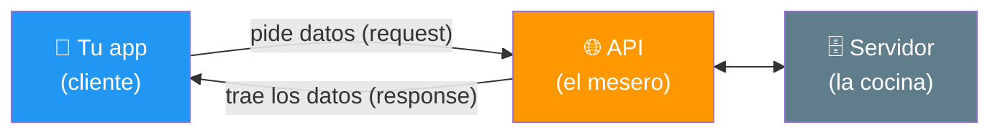
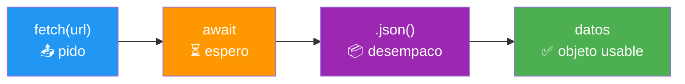
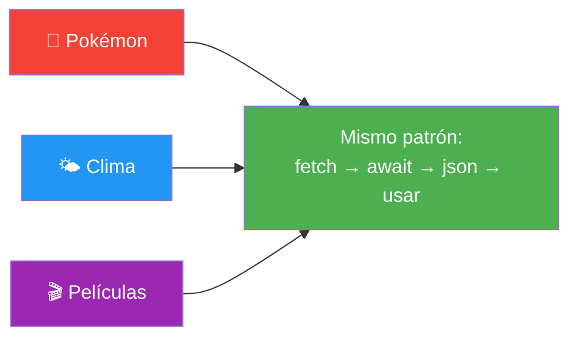
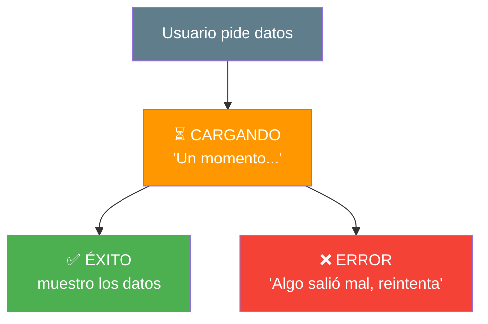
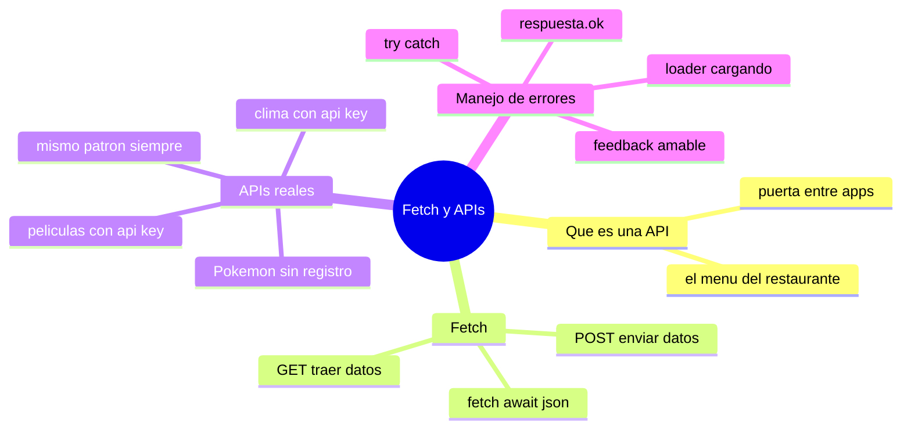

# 🧩 Módulo 12 — Fetch API y APIs Reales

> 💡 **Antes de empezar:** ¡Este es el módulo que conecta tu código con el mundo entero! Hasta ahora tus datos los inventabas tú. Hoy aprenderás a _pedir datos reales a internet_: información de Pokémon, el clima de tu ciudad, películas... todo lo que ves en las apps profesionales. Aquí cobra sentido todo lo que aprendiste sobre asincronía y JSON. Es como pasar de cocinar solo con lo que tienes en casa a tener acceso al mercado mundial de ingredientes. 🌍🛒

---

## 🎯 ¿Qué aprenderás en este módulo?

Al terminar serás capaz de:

- Pedir datos a internet con `fetch` (peticiones GET).
- Enviar datos a un servidor (peticiones POST).
- Consumir APIs reales y gratuitas (Pokémon, clima, películas).
- Mostrar cargadores ("loaders") y manejar errores con buen feedback al usuario.

---

## 🌐 ¿Qué es una API? El concepto base

**API** significa _Application Programming Interface_. En palabras simples: es una _puerta_ por la que tu app puede pedirle datos o servicios a otra.

### 🍔 La metáfora del menú del restaurante

Imagina que entras a un restaurante. No vas directo a la cocina a cocinar tú mismo; usas el **menú** para pedir, y un mesero te trae el plato. No necesitas saber _cómo_ se cocina, solo _qué pedir_.

Una API es ese menú: una lista de cosas que puedes pedirle a un servicio. Tú haces el pedido (la petición), y te llega la respuesta (los datos), sin saber qué pasa dentro de la "cocina" del servidor.



> 🧠 **Idea clave:** Casi todas las apps que usas (clima, redes sociales, mapas) obtienen sus datos pidiéndolos a APIs. Aprender esto te abre la puerta a construir apps _de verdad_.

---

## 1. Fetch: pedir datos a internet

`fetch` es la herramienta de JavaScript para hacer peticiones a una API. Y como pedir datos a internet _tarda_, `fetch` devuelve una **promesa** (¡justo lo que aprendiste en el Módulo 11!).

### Petición GET: traer datos

**GET** es el tipo de petición para _obtener_ información. Es el más común: "dame estos datos".

```javascript
async function obtenerDatos() {
  const respuesta = await fetch("https://pokeapi.co/api/v2/pokemon/pikachu");
  const datos = await respuesta.json();  // convertimos la respuesta a objeto
  console.log(datos.name);  // "pikachu"
}

obtenerDatos();
```

> 🔍 **Desglose paso a paso:**
> 
> 1. `fetch(url)` hace la petición y devuelve una promesa → por eso usamos `await`.
> 2. `respuesta.json()` convierte la respuesta (que viene en JSON) en un objeto usable → _también_ es una promesa, por eso _otro_ `await`.
> 3. Ya tienes `datos` como un objeto normal, ¡listo para usar con el punto!

> 📦 **Conexión con módulos previos:** ¿Ves cómo todo se junta? `fetch` usa **promesas** (Módulo 11), los datos llegan en **JSON** (Módulo 9), y los recorres como **objetos** (Módulo 8). ¡El curso entero confluye aquí!



---

### Petición POST: enviar datos

**POST** es para _enviar_ información a un servidor (crear una cuenta, publicar un comentario, guardar algo). En lugar de solo pedir, mandas datos.

```javascript
async function enviarDatos() {
  const respuesta = await fetch("https://jsonplaceholder.typicode.com/posts", {
    method: "POST",                              // tipo de petición
    headers: { "Content-Type": "application/json" }, // qué tipo de datos envío
    body: JSON.stringify({                       // los datos, empaquetados a texto
      titulo: "Mi primer post",
      contenido: "Hola mundo"
    })
  });
  const resultado = await respuesta.json();
  console.log("Servidor respondió:", resultado);
}
```

> 📮 **Metáfora GET vs POST:** GET es como _consultar_ el menú (solo miras/pides). POST es como _entregar_ un formulario al mesero con tu pedido escrito. GET trae, POST manda.

> 🔑 **Detalle clave:** Al enviar (POST), empaquetas tus datos con `JSON.stringify` (Módulo 9). El servidor recibe ese texto y lo desempaqueta de su lado. ¡Por eso JSON es tan importante!

||GET|POST|
|---|---|---|
|**Para qué**|Obtener datos|Enviar datos|
|**Ejemplo**|Ver pokémon, leer noticias|Crear cuenta, publicar comentario|
|**¿Envía body?**|No|Sí (los datos)|

---

## 2. APIs reales: ¡a jugar con datos del mundo!

Existen muchas APIs _gratuitas_ perfectas para practicar. Aquí tienes tres clásicas, con ejemplos completos que puedes ejecutar.

### 🔴 PokéAPI (sin necesidad de registro)

La favorita para aprender, porque no requiere clave ni registro. Trae información de cualquier Pokémon.

```html
<!DOCTYPE html>
<html>
<body>
  <input type="text" id="campo" placeholder="Nombre de pokémon (ej: charizard)">
  <button id="buscar">Buscar</button>
  <div id="resultado"></div>

  <script>
    const boton = document.querySelector("#buscar");
    const campo = document.querySelector("#campo");
    const resultado = document.querySelector("#resultado");

    boton.addEventListener("click", async () => {
      const nombre = campo.value.toLowerCase();
      const respuesta = await fetch(`https://pokeapi.co/api/v2/pokemon/${nombre}`);
      const pokemon = await respuesta.json();

      resultado.innerHTML = `
        <h2>${pokemon.name}</h2>
        
        <p>Altura: ${pokemon.height} | Peso: ${pokemon.weight}</p>
      `;
    });
  </script>
</body>
</html>
```

> 🎮 **¡Pruébalo!** Escribe "pikachu", "charizard" o "mewtwo" y verás aparecer su imagen y datos. Aquí se combina _todo_: eventos (Módulo 5), template literals (Módulo 9), async/await (Módulo 11) y fetch. ¡Es tu primera app conectada al mundo real!

---

### 🌤️ API del clima

Las APIs de clima (como OpenWeatherMap) suelen requerir una **clave gratuita** (API key) que obtienes registrándote. La clave identifica quién hace la petición.

```javascript
async function obtenerClima(ciudad) {
  const clave = "TU_API_KEY";  // la obtienes registrándote gratis
  const url = `https://api.openweathermap.org/data/2.5/weather?q=${ciudad}&appid=${clave}&units=metric&lang=es`;

  const respuesta = await fetch(url);
  const datos = await respuesta.json();
  console.log(`En ${ciudad} hay ${datos.main.temp}°C`);
}

obtenerClima("Bucaramanga");
```

> 🔑 **Sobre las API keys:** Muchas APIs piden una clave para controlar quién las usa. Es como un carnet de socio: te registras gratis, te dan tu clave, y la incluyes en tus peticiones. Guárdala con cuidado y no la compartas públicamente.

---

### 🎬 API de películas

APIs como TMDB (The Movie Database) también usan clave gratuita y traen información de miles de películas.

```javascript
async function buscarPelicula(titulo) {
  const clave = "TU_API_KEY";
  const url = `https://api.themoviedb.org/3/search/movie?query=${titulo}&api_key=${clave}&language=es`;

  const respuesta = await fetch(url);
  const datos = await respuesta.json();

  datos.results.forEach((peli) => {
    console.log(`${peli.title} (${peli.release_date})`);
  });
}

buscarPelicula("Matrix");
```

> 🔗 **El patrón es SIEMPRE el mismo:** fetch → await → .json() → usar los datos. No importa si es Pokémon, clima o películas: la estructura no cambia. ¡Aprende una vez, úsala para cualquier API!



---

## 3. Manejo de errores y feedback al usuario

Aquí está lo que separa una app _amateur_ de una _profesional_. Pedir datos a internet puede fallar (no hay conexión, el servidor cae, el dato no existe). Una buena app _cuida al usuario_ en cada momento: le avisa que algo está cargando, y le explica con amabilidad si algo falla.

### 🚦 La metáfora de los tres momentos

Toda petición a internet tiene tres momentos posibles, y debes preparar a tu usuario para cada uno:



---

### Loaders: avisar que está cargando

Un **loader** (cargador) es ese mensaje o animación de "Cargando..." que aparece mientras llegan los datos. Sin él, el usuario cree que la app se trabó.

> ⏳ **Metáfora:** Es como la barra de "preparando tu pedido" de una app de comida. Sin ella, pensarías que la app está rota. El loader le dice al usuario "tranquilo, estamos en eso".

---

### El patrón completo: loader + éxito + error

Aquí está la forma profesional de hacer una petición, cuidando los tres momentos con `try/catch` (Módulo 11):

```html
<!DOCTYPE html>
<html>
<body>
  <button id="cargar">Cargar Pokémon</button>
  <div id="estado"></div>

  <script>
    const boton = document.querySelector("#cargar");
    const estado = document.querySelector("#estado");

    boton.addEventListener("click", async () => {
      // 1️⃣ MOMENTO CARGANDO: avisamos al usuario
      estado.innerHTML = "⏳ Cargando...";

      try {
        const respuesta = await fetch("https://pokeapi.co/api/v2/pokemon/ditto");

        // Si el servidor respondió con error (ej: 404)
        if (!respuesta.ok) {
          throw new Error("No se encontró el Pokémon");
        }

        const datos = await respuesta.json();

        // 2️⃣ MOMENTO ÉXITO: mostramos los datos
        estado.innerHTML = `✅ ${datos.name} cargado correctamente`;

      } catch (error) {
        // 3️⃣ MOMENTO ERROR: avisamos con amabilidad
        estado.innerHTML = "❌ Ups, algo salió mal. Intenta de nuevo.";
        console.log("Detalle del error:", error);
      }
    });
  </script>
</body>
</html>
```

> 🔍 **Desglose de los tres momentos:**
> 
> 1. _Antes_ de pedir: mostramos "Cargando...".
> 2. Dentro del `try`: si todo va bien, mostramos los datos.
> 3. Dentro del `catch`: si algo falla, mostramos un mensaje amable (no el error técnico crudo).

> 🛡️ **Detalle profesional — `respuesta.ok`:** A veces el servidor responde, pero con un error (como "404 no encontrado"). `fetch` no lo considera un fallo por sí solo, así que revisamos `respuesta.ok`: si es `false`, lanzamos nuestro propio error con `throw` para que el `catch` lo atrape.

---

### Feedback al usuario: el toque humano

> 💚 **La gran lección de UX (experiencia de usuario):** Nunca dejes al usuario adivinando. Un buen mensaje de error _no_ dice "TypeError: undefined"; dice "No pudimos cargar los datos, revisa tu conexión e intenta de nuevo". La diferencia entre una app que frustra y una que se siente cuidada está en estos pequeños detalles de comunicación.

|❌ App amateur|✅ App profesional|
|---|---|
|Pantalla en blanco mientras carga|Loader "Cargando..."|
|Se rompe sin avisar|Mensaje amable de error|
|Muestra errores técnicos crudos|Explica en lenguaje humano|
|El usuario no sabe qué pasa|El usuario siempre está informado|

---

## 🛠️ Mini práctica: ¡tu turno!

> 📌 **Nota:** Estos ejercicios necesitan un archivo HTML y conexión a internet. La PokéAPI es ideal porque no requiere registro.

### Ejercicio 1 — Tu primer fetch

```html
<!DOCTYPE html>
<html>
<body>
  <button id="boton">Traer un Pokémon</button>
  <div id="salida"></div>
  <script>
    document.querySelector("#boton").addEventListener("click", async () => {
      const res = await fetch("https://pokeapi.co/api/v2/pokemon/bulbasaur");
      const data = await res.json();
      document.querySelector("#salida").innerHTML =
        `<h3>${data.name}</h3>`;
    });
  </script>
</body>
</html>
```

### Ejercicio 2 — Añade un loader

Modifica el ejercicio 1 para que muestre "⏳ Cargando..." _antes_ del fetch. Pista: pon `salida.innerHTML = "⏳ Cargando..."` justo al inicio del evento.

### Ejercicio 3 — Maneja el error

Envuelve el fetch en un `try/catch`. Luego prueba a buscar un pokémon que no existe (como "xyz123") y observa cómo cae en el `catch`.

> 💡 **Reto integrador:** Combina los tres ejercicios en una mini-app que tenga un input para escribir el nombre, un loader mientras busca, muestre la imagen si lo encuentra, y un mensaje amable si no. ¡Eso es una app real!

---

## 🧭 Resumen visual del módulo



---

## ✅ Checklist: ¿lo lograste?

- [ ] Entiendo qué es una API (la puerta entre apps).
- [ ] Hago peticiones GET con `fetch` para traer datos.
- [ ] Sé que `fetch` devuelve una promesa y uso `await` + `.json()`.
- [ ] Entiendo cómo enviar datos con POST.
- [ ] Consumí al menos una API real (¡la PokéAPI!).
- [ ] Muestro un loader mientras los datos cargan.
- [ ] Manejo errores con `try/catch` y reviso `respuesta.ok`.
- [ ] Doy feedback amable al usuario en cada momento.

Si marcaste la mayoría, **acabas de construir apps que se conectan con el mundo real**. Esto es lo que hacen las aplicaciones profesionales. 🚀

---

## 🌱 Reflexión final

Detente a apreciar lo lejos que has llegado. En este módulo, _todo_ el curso confluye: usaste eventos del DOM, template literals, JSON, objetos, promesas y async/await, **todo junto**, para construir algo que se conecta con servidores reales en cualquier parte del planeta. Eso ya no es un ejercicio: es desarrollo web de verdad.

Y aprendiste algo que va más allá de la técnica: _cuidar al usuario_. Los loaders y los mensajes de error amables no son detalles menores; son lo que hace que una app se sienta humana y confiable. Un programador que piensa en cómo se siente la persona del otro lado de la pantalla es un programador completo.

No te preocupes si al principio una API no responde como esperabas o si te equivocas con una clave. Trabajar con datos externos siempre tiene su parte de "prueba y ajuste", incluso para los profesionales. Lee el error (¡ya sabes hacerlo, del Módulo 10!), revisa la URL, y sigue adelante con paciencia.

> 🎯 **El secreto sigue siendo el mismo:** un pasito a la vez. Hoy tu código dejó de hablar solo consigo mismo y empezó a conversar con el mundo entero. Esa es una de las sensaciones más emocionantes de programar, y apenas estás comenzando a explorarla.

**¡Nos vemos en el Módulo 13!**