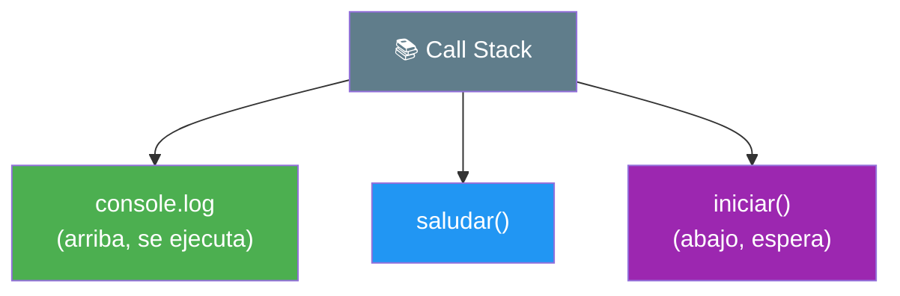
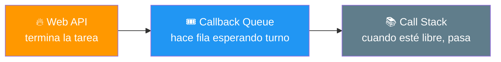
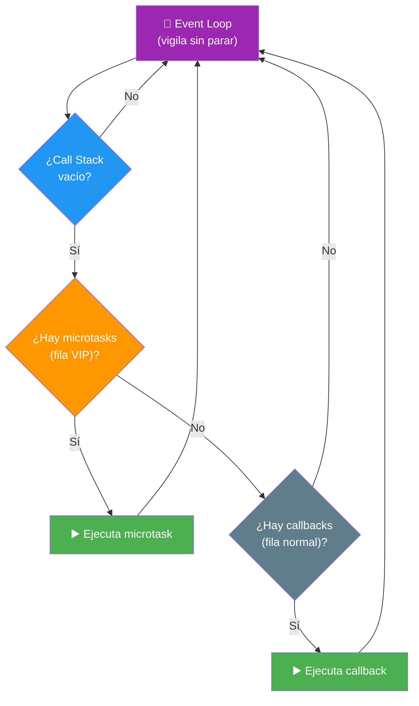
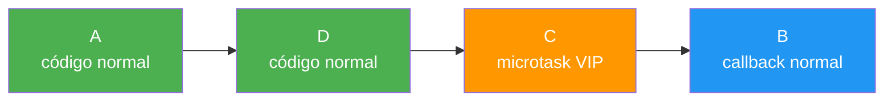
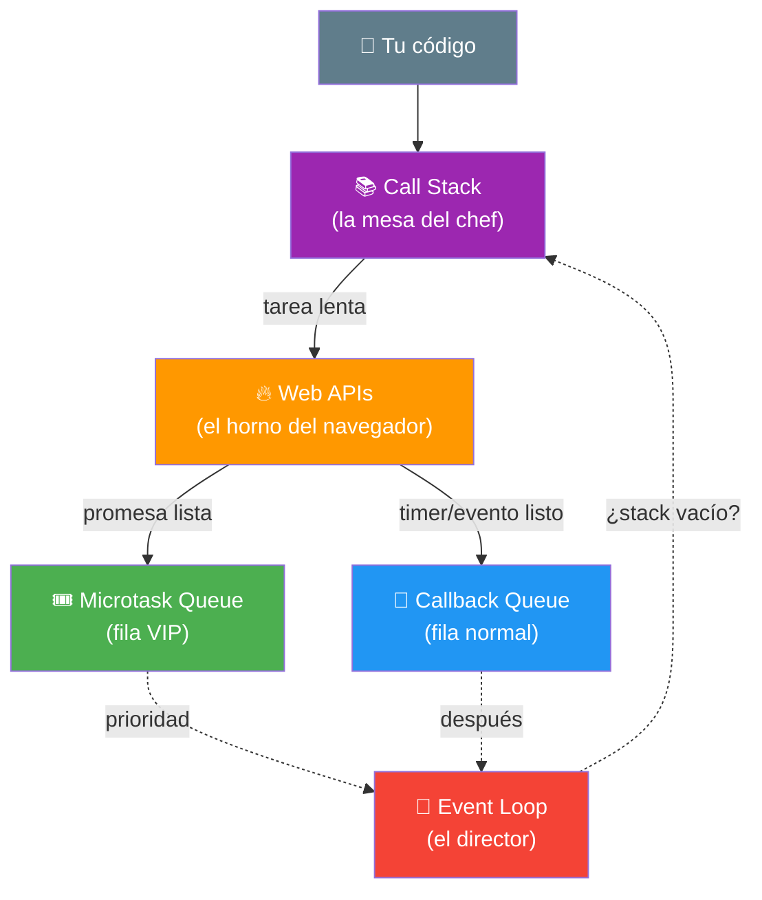
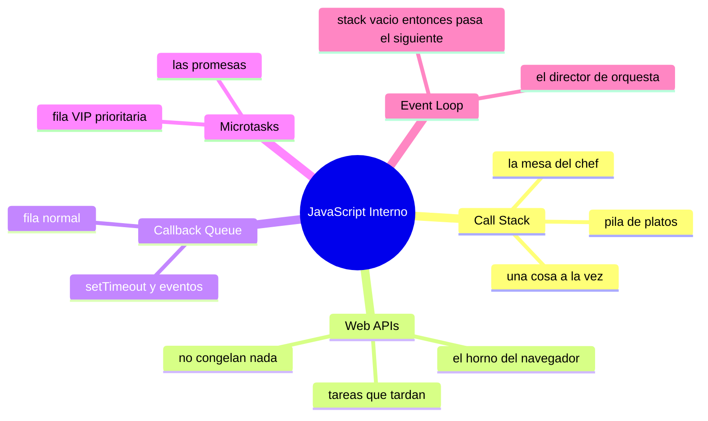

# 🧩 Módulo 13 — Event Loop y JavaScript Interno

> 💡 **Antes de empezar:** Este módulo es distinto: aquí no aprenderás comandos nuevos, sino _cómo funciona JavaScript por dentro_. ¿Recuerdas cuando en el Módulo 11 vimos que un mensaje aparecía "fuera de orden"? Hoy descubrirás exactamente _por qué_ pasa eso. Entender esto te dará superpoderes para predecir cómo se comporta tu código. Es como un mecánico que por fin entiende el motor que ha estado conduciendo. 🔧⚙️

---

## 🎯 ¿Qué aprenderás en este módulo?

Al terminar serás capaz de:

- Entender cómo JavaScript ejecuta tu código por dentro (el Call Stack).
- Comprender dónde van las tareas que tardan (Web APIs).
- Saber cómo regresan esas tareas (Callback Queue y Microtasks).
- Entender el Event Loop, el "director de orquesta" que coordina todo.

> 🌱 **Tranquilidad ante todo:** Este es el módulo más _teórico_ del curso. No necesitas memorizarlo para programar bien, pero entenderlo te hará un programador mucho más consciente. Léelo con calma y disfruta el "¡ahá!" cuando las piezas encajen.

---

## 🤹 El gran misterio: ¿cómo hace JavaScript tantas cosas?

Aquí va un dato sorprendente: **JavaScript solo puede hacer una cosa a la vez.** Se dice que es _single-threaded_ (de un solo hilo), como una persona con una sola mano.

Entonces... ¿cómo logra manejar clics, animaciones, peticiones a internet y temporizadores _al mismo tiempo_ sin congelarse? La respuesta es una orquesta de varias piezas trabajando juntas. Vamos a conocerlas una por una.

### 🍽️ La metáfora del chef en la cocina

Imagina un único chef (JavaScript) en una cocina. Solo tiene dos manos, así que cocina _un plato a la vez_. Pero es muy listo: cuando algo necesita tiempo de horno, _no se queda mirando el horno_. Pone un temporizador, sigue cocinando otros platos, y cuando suena el timbre, atiende lo que estaba en el horno.

Esa es, en esencia, toda la magia que aprenderás hoy. Ahora veamos quién es quién en esta cocina.

---

## 1. El Call Stack: la pila de tareas actuales

El **Call Stack** (pila de llamadas) es donde JavaScript apila las tareas que está ejecutando _en este preciso momento_. Funciona apilando y desapilando, como una pila de platos.

### 🍽️ La metáfora de la pila de platos

Imagina una pila de platos: solo puedes poner o quitar el de _arriba_. Cuando una función se ejecuta, se "apila" encima. Cuando termina, se "desapila". El último que entra es el primero que sale.

```javascript
function saludar() {
  console.log("Hola");
}

function iniciar() {
  saludar();  // se apila saludar() encima de iniciar()
}

iniciar();  // se apila iniciar()
```



> 🧠 **Idea clave:** El Call Stack es el "escritorio" donde JavaScript trabaja. Solo puede tener una pila, y procesa de arriba hacia abajo. Si una tarea tarda mucho aquí, _todo lo demás espera_ (la página se congela).

> ⚠️ **¿Has oído "stack overflow"?** Es cuando la pila se llena demasiado (por ejemplo, una función que se llama a sí misma sin parar). Es como apilar tantos platos que la torre se desploma.

---

## 2. Web APIs: donde van las tareas que tardan

Aquí está el truco. Cuando JavaScript encuentra una tarea lenta (un temporizador, una petición `fetch`, un evento de clic), **no la procesa en el Call Stack**. La entrega a las **Web APIs**, capacidades que el _navegador_ le presta.

### 🔔 La metáfora del horno con temporizador

Recuerda al chef: cuando algo va al horno, el chef no se queda esperando. El horno (la Web API) se encarga de "vigilar" esa tarea por su cuenta, mientras el chef (JavaScript) sigue cocinando otras cosas en su mesa (el Call Stack).

```javascript
console.log("1. Empiezo");

setTimeout(() => {
  console.log("3. El temporizador terminó");
}, 2000);

console.log("2. Sigo sin esperar");
```

> 🔍 **Qué pasa por dentro:** El `setTimeout` se va a las Web APIs (el horno), que cuentan los 2 segundos _aparte_. Mientras tanto, JavaScript sigue y ejecuta el "2. Sigo sin esperar". Por eso el "3" aparece al final, ¡aunque su tarea empezó antes!

> 🧠 **Idea clave:** Las Web APIs son la razón por la que JavaScript no se congela con tareas lentas. Las "subcontrata" al navegador y sigue trabajando. Esto es lo que hacía posible toda la asincronía del Módulo 11.

---

## 3. La Callback Queue: la sala de espera

Cuando una Web API termina su tarea (el temporizador llegó a cero, los datos llegaron), el resultado _no_ salta directamente al Call Stack. Primero hace fila en la **Callback Queue** (cola de callbacks).

### 🎟️ La metáfora de la sala de espera

La tarea terminada es como un paciente que ya está listo, pero debe _esperar su turno_ en la sala de espera hasta que el doctor (el Call Stack) esté libre. No puede colarse: respeta la fila, primero en llegar, primero en pasar.



> 🧠 **Idea clave:** La tarea terminada espera pacientemente en la cola hasta que el Call Stack esté completamente vacío. Solo entonces podrá ejecutarse. Por eso el código asíncrono _siempre_ corre después del código normal.

---

## 4. Microtasks: la fila VIP

No todas las filas son iguales. Las **promesas** (del Módulo 11) usan una cola especial y _prioritaria_ llamada **Microtask Queue**. Es como una fila VIP que pasa _antes_ que la cola normal.

### 🎟️ La metáfora de la fila VIP

Imagina dos filas para entrar al doctor: una normal (Callback Queue, para `setTimeout` y eventos) y una VIP (Microtask Queue, para promesas). Cada vez que el doctor se desocupa, _primero_ atiende a _toda_ la fila VIP, y solo después llama a la fila normal.

```javascript
console.log("1. Normal");

setTimeout(() => console.log("4. setTimeout (fila normal)"), 0);

Promise.resolve().then(() => console.log("3. Promesa (fila VIP)"));

console.log("2. Normal");
```

El resultado sorprendente:

```
1. Normal
2. Normal
3. Promesa (fila VIP)      ← ¡la promesa pasa antes!
4. setTimeout (fila normal)
```

> 🤯 **El dato que vuela cabezas:** Aunque el `setTimeout` tiene `0` milisegundos (¡cero espera!), la promesa se ejecuta _antes_. ¿Por qué? Porque las microtasks (promesas) tienen prioridad sobre la callback queue normal. Este es un clásico de las entrevistas de trabajo.

> 💡 **Para recordar:** Promesas = fila VIP (microtasks, prioritarias). setTimeout y eventos = fila normal (callback queue). Lo VIP siempre pasa primero.

---

## 5. El Event Loop: el director de orquesta

Por fin, la pieza que conecta todo: el **Event Loop** (bucle de eventos). Es un vigilante incansable que hace _una sola pregunta_, una y otra vez:

> _"¿Está vacío el Call Stack? Si sí, ¿hay algo esperando en las colas para pasar?"_

### 🎻 La metáfora del director de orquesta

El Event Loop es como un director de orquesta que coordina cuándo entra cada músico. Vigila constantemente: cuando el escenario (Call Stack) queda libre, le hace una señal al siguiente músico en fila (primero los VIP, luego los normales) para que suba a tocar. Nunca para; gira sin cesar.



> 🧠 **Idea clave:** El Event Loop es el coordinador que hace posible la asincronía. Gracias a él, JavaScript (que solo hace una cosa a la vez) puede _parecer_ que hace muchas, atendiendo cada tarea terminada en cuanto tiene un hueco libre.

---

## 🎬 Todo junto: la película completa

Veamos cómo cooperan las cinco piezas con un ejemplo, paso a paso:

```javascript
console.log("A");
setTimeout(() => console.log("B"), 0);
Promise.resolve().then(() => console.log("C"));
console.log("D");
```

**Lo que ocurre, momento a momento:**

1. `console.log("A")` entra al Call Stack, se ejecuta → imprime **A**.
2. `setTimeout` manda su callback a las Web APIs; el callback termina en la _cola normal_.
3. La promesa manda su callback a la _cola VIP_ (microtasks).
4. `console.log("D")` se ejecuta → imprime **D**.
5. El Call Stack queda vacío. El Event Loop revisa: ¿microtasks? ¡Sí! → imprime **C**.
6. Ya no hay microtasks. ¿Cola normal? Sí → imprime **B**.

**Resultado final:** `A, D, C, B`



> 🎯 **Si entendiste por qué el orden es A-D-C-B, ¡felicidades!** Acabas de comprender uno de los conceptos que separan a quienes "usan" JavaScript de quienes lo _entienden de verdad_.

---

## 🗺️ El mapa completo de la cocina

Aquí está todo el sistema en un solo diagrama. Ahora que conoces cada pieza, míralo con ojos nuevos:



---

## 🛠️ Mini práctica: ¡predice el resultado!

Este módulo no es de escribir código nuevo, sino de _predecir_ cómo se comporta. Eso demuestra que entendiste. Piensa tu respuesta _antes_ de ejecutar en la consola. 🧠

### Ejercicio 1 — El orden básico

```javascript
console.log("Inicio");
setTimeout(() => console.log("Timeout"), 0);
console.log("Fin");
```

> 💡 **Predice:** ¿En qué orden aparecen? (Pista: el código normal va primero, el `setTimeout` espera su turno aunque sea de 0ms).

### Ejercicio 2 — La fila VIP en acción

```javascript
console.log("1");
Promise.resolve().then(() => console.log("2"));
console.log("3");
```

> 💡 **Predice:** ¿La promesa (2) aparece antes o después del "3"? Piensa en quién es código normal y quién es microtask.

### Ejercicio 3 — La carrera completa

```javascript
console.log("Uno");
setTimeout(() => console.log("Dos"), 0);
Promise.resolve().then(() => console.log("Tres"));
console.log("Cuatro");
```

> 💡 **Reto:** Predice el orden completo. Si aciertas, ¡dominas el Event Loop! (Recuerda: normal primero, luego VIP, luego cola normal).

> ✅ **Respuestas:** Ej.1 → Inicio, Fin, Timeout. Ej.2 → 1, 3, 2. Ej.3 → Uno, Cuatro, Tres, Dos.

---

## 🧭 Resumen visual del módulo



---

## ✅ Checklist: ¿lo lograste?

- [ ] Entiendo que JavaScript hace una sola cosa a la vez (single-threaded).
- [ ] Sé que el Call Stack es donde se ejecuta el código actual.
- [ ] Comprendo que las tareas lentas van a las Web APIs (el navegador).
- [ ] Sé que las tareas terminadas esperan en la Callback Queue.
- [ ] Entiendo que las promesas usan la fila VIP (Microtasks), con prioridad.
- [ ] Comprendo que el Event Loop coordina todo cuando el Call Stack se vacía.
- [ ] Puedo predecir el orden de ejecución de código asíncrono simple.

Si marcaste la mayoría, **acabas de mirar dentro del motor de JavaScript**. Pocos principiantes llegan a entender esto. 💪

---

## 🌱 Reflexión final

Este módulo es especial porque no te enseñó _qué_ escribir, sino _cómo piensa_ la máquina que ejecuta tu código. Es un cambio de perspectiva: pasaste de ser conductor a entender el motor. Y aunque no uses este conocimiento todos los días, te volverá un programador mucho más consciente y seguro. Cuando algo asíncrono se comporte "raro", ya no será magia: sabrás exactamente qué está pasando.

Si sentiste que este módulo fue más difícil, es completamente normal y esperado. Es de los temas más abstractos de toda la programación, y _muchos_ desarrolladores con años de experiencia siguen repasándolo. No te exijas dominarlo de memoria; basta con que te quede la _intuición_: JavaScript subcontrata lo lento, y el Event Loop reparte los turnos cuando hay espacio, dando prioridad a las promesas.

> 🎯 **El secreto sigue siendo el mismo:** un pasito a la vez. Hoy abriste el capó y miraste el motor. No tienes que entender cada tornillo de inmediato; con el tiempo y la práctica, esta intuición se volverá parte natural de cómo piensas el código.

**¡Nos vemos en el Módulo 14!**