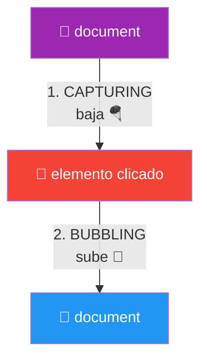
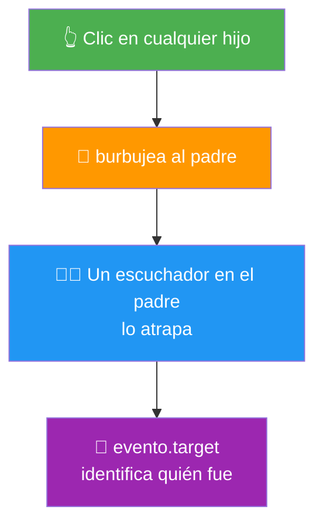
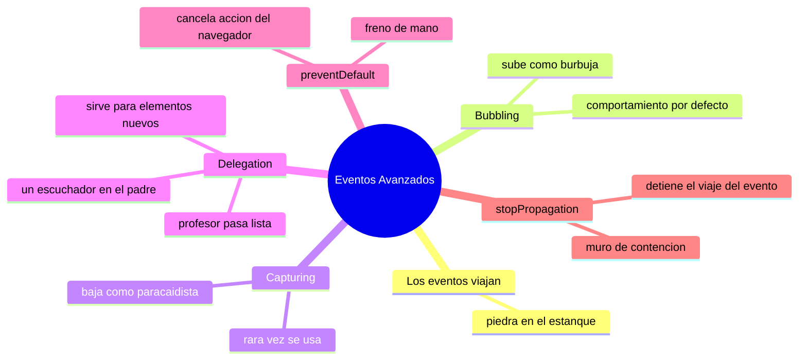

# 🧩 Módulo 14 — Eventos Avanzados

> 💡 **Antes de empezar:** En el Módulo 5 aprendiste a escuchar eventos con `addEventListener`. Hoy vamos más profundo: descubrirás _cómo viajan_ los eventos por la página, un comportamiento invisible que, una vez que lo entiendes, te da control total sobre la interactividad. Es como pasar de saber encender la luz a entender cómo viaja la electricidad por los cables de la casa. ⚡

---

## 🎯 ¿Qué aprenderás en este módulo?

Al terminar serás capaz de:

- Entender cómo un evento "viaja" por la página (bubbling y capturing).
- Manejar muchos elementos con un solo escuchador (delegation).
- Cancelar el comportamiento por defecto del navegador (`preventDefault`).
- Detener la propagación de un evento (`stopPropagation`).

---

## 🌊 El gran concepto: los eventos viajan

Aquí está la idea que lo cambia todo: cuando haces clic en un elemento, el evento _no_ afecta solo a ese elemento. **El evento viaja por toda la cadena de ancestros**, como una onda.

### 💧 La metáfora de la piedra en el estanque

Imagina que el clic es una piedra que cae en un estanque. No genera una sola salpicadura puntual: crea _ondas_ que se expanden. En el DOM, un clic en un botón también "se expande" hacia sus elementos padres. Entender la dirección de esas ondas es la clave de este módulo.

Supongamos esta estructura anidada (un botón dentro de un div, dentro del body):

```html
<div id="abuelo">
  <div id="padre">
    <button id="hijo">Haz clic</button>
  </div>
</div>
```

Cuando haces clic en el botón, el evento _recorre_ toda esta cadena. Pero, ¿en qué dirección? Ahí entran el bubbling y el capturing.

---

## 1. Bubbling: el evento sube como una burbuja

El **bubbling** (burbujeo) es el comportamiento _por defecto_: el evento empieza en el elemento donde hiciste clic y _sube_ hacia sus ancestros, uno por uno, como una burbuja que asciende en el agua.

### 🫧 La metáfora de la burbuja que sube

Una burbuja nace en el fondo del vaso (el elemento clicado) y sube hasta la superficie (el documento). El clic empieza en el botón (`hijo`), luego avisa al `padre`, luego al `abuelo`, y así hasta arriba.

```javascript
document.querySelector("#hijo").addEventListener("click", () => {
  console.log("1. Clic en el HIJO (botón)");
});
document.querySelector("#padre").addEventListener("click", () => {
  console.log("2. El evento subió al PADRE");
});
document.querySelector("#abuelo").addEventListener("click", () => {
  console.log("3. Y siguió subiendo al ABUELO");
});
```

Al hacer clic _solo_ en el botón, verás:

```
1. Clic en el HIJO (botón)
2. El evento subió al PADRE
3. Y siguió subiendo al ABUELO
```

```mermaid
graph Bto
    A["🫧 button #hijo<br/>(aquí empieza)"] --> B["div #padre"]
    B --> C["div #abuelo"]
    C --> D["⬆️ sigue subiendo<br/>hasta document"]
    style A fill:#4caf50,color:#fff
    style B fill:#2196f3,color:#fff
    style C fill:#ff9800,color:#fff
    style D fill:#9c27b0,color:#fff
```

> 🧠 **Idea clave:** Aunque solo clicaste el botón, _los tres_ escuchadores se activaron, de adentro hacia afuera. El evento "burbujeó" hacia arriba. Este es el comportamiento normal que verás siempre.

---

## 2. Capturing: el evento baja primero

El **capturing** (captura) es la dirección _opuesta_: el evento desciende desde arriba hacia el elemento clicado, antes de burbujear. Es menos común, pero conviene conocerlo para entender el panorama completo.

### 🪂 La metáfora del paracaidista

Si el bubbling es una burbuja que sube, el capturing es un paracaidista que _baja_: el evento parte de arriba (el documento) y desciende hasta el elemento exacto donde hiciste clic.

Para activar la fase de captura, se pasa `true` como tercer argumento:

```javascript
document.querySelector("#abuelo").addEventListener("click", () => {
  console.log("Capturing: voy bajando desde el abuelo");
}, true);  // 👈 el true activa la fase de captura
```

> 📊 **El viaje completo de un evento:** En realidad, todo evento hace _dos viajes_: primero **baja** (capturing) desde el documento hasta el objetivo, y luego **sube** (bubbling) de vuelta. Por defecto, tus escuchadores reaccionan en la subida (bubbling).



> 💡 **No te abrumes:** En el 95% de los casos usarás bubbling (el comportamiento por defecto). El capturing existe y es bueno saber que está ahí, pero rara vez lo necesitarás al principio.

---

## 3. Event Delegation: un escuchador para gobernarlos a todos

Aquí está la _aplicación práctica más útil_ del bubbling. La **delegación de eventos** aprovecha que los eventos suben para manejar muchos elementos con _un solo_ escuchador en el padre.

### 👨‍🏫 La metáfora del profesor que pasa lista

Imagina una clase con 30 estudiantes. En lugar de poner un micrófono a cada estudiante (30 escuchadores), el profesor (el elemento padre) escucha a _toda_ la clase. Cuando un estudiante levanta la mano, el profesor sabe _quién_ fue. Un solo "oído" gestiona a todos.

**El problema sin delegación:**

```javascript
// 😩 Tedioso: un escuchador por cada elemento
document.querySelectorAll("li").forEach((item) => {
  item.addEventListener("click", () => console.log("Clic en un item"));
});
// ¿Y si agregas items nuevos después? No tendrán escuchador. 😱
```

**La solución con delegación:**

```javascript
// 😎 Un solo escuchador en el padre
document.querySelector("#lista").addEventListener("click", (evento) => {
  if (evento.target.tagName === "LI") {
    console.log("Clic en:", evento.target.textContent);
  }
});
```

> 🔍 **Cómo funciona:** El clic en cualquier `<li>` _burbujea_ hasta la lista padre. Ahí lo atrapamos y usamos `evento.target` (el elemento _exacto_ que recibió el clic) para saber cuál fue. ¿Recuerdas `evento.target` del Módulo 5? ¡Aquí brilla!

> 🎯 **Las dos grandes ventajas:**
> 
> 1. **Eficiencia:** un escuchador en lugar de cientos.
> 2. **Elementos dinámicos:** funciona incluso con elementos que agregues _después_ (los nuevos también burbujean al padre). Esto es clave para listas que cambian, como las del patrón "render" del Módulo 8.



---

## 4. preventDefault: cancelar lo que el navegador haría

Algunos elementos tienen comportamientos _automáticos_: un enlace navega a otra página, un formulario recarga al enviarse. **`preventDefault`** cancela ese comportamiento por defecto para que tú tomes el control.

### ✋ La metáfora del freno de mano

El navegador tiene "reflejos automáticos" (al clicar un enlace, te lleva a otro sitio). `preventDefault` es como poner el freno de mano: detiene ese reflejo automático para que _tú_ decidas qué hacer en su lugar.

```javascript
const enlace = document.querySelector("a");

enlace.addEventListener("click", (evento) => {
  evento.preventDefault();  // ✋ cancela la navegación automática
  console.log("No navegué a ningún lado; yo decido qué hacer");
});
```

> 🔗 **Ya lo viste:** En el Módulo 5 usamos `preventDefault` para evitar que un formulario recargara la página. Ese es su uso más común: tomar el control de formularios y enlaces para manejarlos con JavaScript.

> 💡 **Cuándo usarlo:** Formularios que quieres procesar con JavaScript (sin recargar), enlaces que deben hacer algo personalizado, o cualquier comportamiento automático que quieras reemplazar por el tuyo.

---

## 5. stopPropagation: detener el viaje del evento

**`stopPropagation`** detiene el burbujeo: evita que el evento siga subiendo a los elementos padres. El evento "muere" donde tú digas.

### 🛑 La metáfora del muro de contención

Si el bubbling es una burbuja que sube, `stopPropagation` es un techo que le pones: la burbuja sube hasta ahí y _no pasa_ de ese punto. El evento se detiene y los ancestros nunca se enteran.

```javascript
document.querySelector("#hijo").addEventListener("click", (evento) => {
  evento.stopPropagation();  // 🛑 el evento muere aquí
  console.log("Clic en el hijo (y no subirá al padre)");
});

document.querySelector("#padre").addEventListener("click", () => {
  console.log("Esto YA NO se ejecutará 🚫");  // nunca se entera
});
```

> 🧠 **Idea clave:** Sin `stopPropagation`, el clic en el hijo activaría también al padre (por bubbling). Con él, el evento se queda en el hijo. Útil cuando un clic interno _no_ debe disparar acciones de elementos externos.

> ⚠️ **No los confundas:**
> 
> - `preventDefault` cancela la **acción automática del navegador** (navegar, recargar).
> - `stopPropagation` detiene el **viaje del evento** hacia los padres. Son cosas distintas y a veces se usan juntas, pero resuelven problemas diferentes.

---

### Tabla resumen de los dos "frenos"

|Método|Qué detiene|Ejemplo de uso|
|---|---|---|
|`preventDefault`|El comportamiento por defecto del navegador|Evitar que un form recargue la página|
|`stopPropagation`|La propagación del evento a los padres|Que un botón dentro de un modal no cierre el modal|

---

## 🛠️ Mini práctica: ¡tu turno!

Estos ejercicios necesitan un archivo HTML. Abre la consola para ver los mensajes. 🧪

### Ejercicio 1 — Observa el bubbling

```html
<!DOCTYPE html>
<html>
<body>
  <div id="abuelo" style="padding:40px; background:#fdd">ABUELO
    <div id="padre" style="padding:40px; background:#dfd">PADRE
      <button id="hijo">HIJO (clic aquí)</button>
    </div>
  </div>

  <script>
    ["abuelo", "padre", "hijo"].forEach((id) => {
      document.querySelector("#" + id).addEventListener("click", () => {
        console.log("Evento en:", id);
      });
    });
  </script>
</body>
</html>
```

> 🔍 **Observa:** Haz clic en el botón HIJO y mira cómo se imprimen los tres, de adentro hacia afuera. ¡Eso es bubbling!

### Ejercicio 2 — Detén el bubbling

Al ejercicio anterior, agrega `evento.stopPropagation()` dentro del escuchador del hijo (recibe `(evento)` como parámetro). Vuelve a hacer clic: ahora solo se imprime "hijo". 🛑

### Ejercicio 3 — Delegación de eventos

```html
<!DOCTYPE html>
<html>
<body>
  <ul id="lista">
    <li>Manzana</li>
    <li>Banana</li>
    <li>Pera</li>
  </ul>

  <script>
    document.querySelector("#lista").addEventListener("click", (e) => {
      if (e.target.tagName === "LI") {
        console.log("Elegiste:", e.target.textContent);
      }
    });
  </script>
</body>
</html>
```

> 🎯 **Reto:** Un solo escuchador maneja los tres items. Como bonus, añade un `<li>` nuevo desde la consola (`lista.innerHTML += "<li>Uva</li>"`) y comprueba que _también_ funciona, ¡sin escuchador propio!

### Ejercicio 4 — preventDefault

```html
<!DOCTYPE html>
<html>
<body>
  <a href="https://google.com" id="enlace">Ir a Google</a>

  <script>
    document.querySelector("#enlace").addEventListener("click", (e) => {
      e.preventDefault();
      console.log("Cancelé la navegación. ¡No fui a Google!");
    });
  </script>
</body>
</html>
```

---

## 🧭 Resumen visual del módulo



---

## ✅ Checklist: ¿lo lograste?

- [ ] Entiendo que los eventos viajan por la cadena de elementos.
- [ ] Sé qué es el bubbling (sube) y que es el comportamiento por defecto.
- [ ] Conozco el capturing (baja) aunque rara vez lo use.
- [ ] Uso event delegation: un escuchador en el padre para muchos hijos.
- [ ] Cancelo comportamientos automáticos con `preventDefault`.
- [ ] Detengo la propagación con `stopPropagation`.
- [ ] Distingo claramente entre `preventDefault` y `stopPropagation`.

Si marcaste la mayoría, **ya tienes control profesional sobre los eventos**. 💪

---

## 🌱 Reflexión final

Este módulo reveló algo que estuvo ahí todo el tiempo pero era invisible: los eventos no son puntuales, _viajan_. Una vez que ves ese "movimiento" oculto, muchos comportamientos misteriosos de las páginas web cobran sentido. ¿Por qué un clic en un botón dentro de un modal a veces cierra el modal sin querer? Bubbling. ¿Cómo manejan las apps listas enormes sin miles de escuchadores? Delegación. Acabas de adquirir las herramientas para diagnosticar y resolver estos casos.

La estrella práctica del módulo es la **delegación de eventos**: es elegante, eficiente y la usarás constantemente en proyectos reales, sobre todo combinada con el patrón "estado → render" del Módulo 8, donde los elementos aparecen y desaparecen dinámicamente.

No te preocupes si el capturing o el viaje completo del evento todavía se sienten un poco abstractos. Lo esencial es la intuición: _los eventos suben (bubbling) por defecto, y eso lo puedes aprovechar (delegación) o detener (`stopPropagation`)_. Con eso ya estás muy por encima del promedio.

> 🎯 **El secreto sigue siendo el mismo:** un pasito a la vez. Hoy viste lo invisible: cómo se mueven los eventos por debajo de la superficie. Y con ese conocimiento, la interactividad de cualquier página dejó de ser un misterio.

**¡Nos vemos en el Módulo 15!**