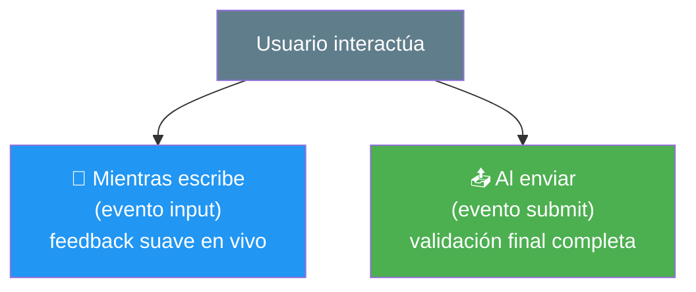
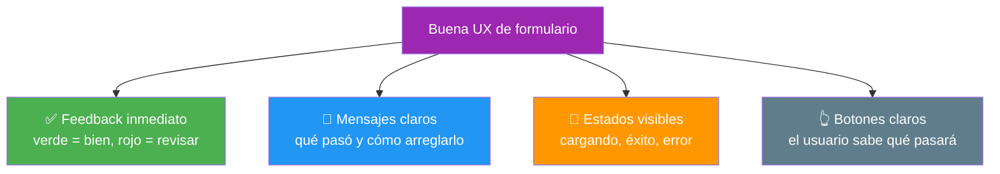
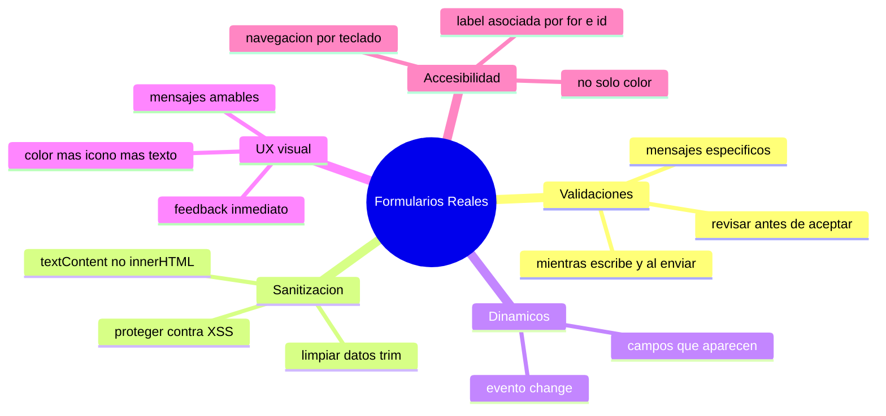

# 🧩 Módulo 15 — Formularios Reales

> 💡 **Antes de empezar:** Los formularios están en _todas partes_: registros, logins, búsquedas, contactos, pagos. Son la principal forma en que los usuarios "hablan" con tu app. Hoy aprenderás a construirlos como un profesional: que validen datos, que sean seguros, que se sientan amables y que _todas_ las personas puedan usarlos. Es como pasar de poner un buzón cualquiera a diseñar una recepción acogedora donde cada visitante se siente bien atendido. 📮✨

---

## 🎯 ¿Qué aprenderás en este módulo?

Al terminar serás capaz de:

- Validar los datos que el usuario escribe, con mensajes claros.
- Limpiar y proteger esos datos (sanitización) para mayor seguridad.
- Crear formularios que cambian dinámicamente según el contexto.
- Diseñar una buena experiencia visual (UX) en tus formularios.
- Hacer formularios accesibles para _todas_ las personas.

---

## 📋 El formulario como una conversación

Antes de entrar en técnica, cambia tu forma de ver los formularios. Un formulario no es una lista fría de cajas; es una **conversación** entre tu app y la persona. Una buena conversación es clara, paciente y respetuosa. Una mala frustra y aleja.

### 💬 La metáfora del recepcionista amable

Imagina dos recepcionistas. Uno te grita "¡DATO INVÁLIDO!" sin explicar nada. El otro te dice con calma: "Parece que falta la @ en tu correo, ¿lo revisas?". El segundo te hace sentir acompañado. Hoy aprenderás a programar el recepcionista amable.

---

## 1. Validaciones: comprobar que los datos tienen sentido

**Validar** es revisar que lo que el usuario escribió cumple las reglas _antes_ de aceptarlo: que el email tenga formato de email, que la contraseña no esté vacía, que la edad sea un número.

### 🛂 La metáfora del control de seguridad del aeropuerto

La validación es como el control de un aeropuerto: revisa que todo esté en orden _antes_ de dejar pasar. Si algo falta o está mal, lo detecta a tiempo y avisa con amabilidad, en vez de dejar pasar un problema.

```html
<!DOCTYPE html>
<html>
<body>
  <input type="email" id="email" placeholder="Tu correo">
  <button id="enviar">Enviar</button>
  <p id="mensaje"></p>

  <script>
    const email = document.querySelector("#email");
    const mensaje = document.querySelector("#mensaje");

    document.querySelector("#enviar").addEventListener("click", () => {
      const valor = email.value.trim();  // quita espacios sobrantes

      if (valor === "") {
        mensaje.textContent = "⚠️ El correo no puede estar vacío";
      } else if (!valor.includes("@")) {
        mensaje.textContent = "⚠️ Parece que falta la @ en tu correo";
      } else {
        mensaje.textContent = "✅ ¡Correo válido!";
      }
    });
  </script>
</body>
</html>
```

> 🔍 **Desglose:** Usamos `.trim()` para limpiar espacios, `includes("@")` (Módulo 9) para una comprobación simple, y condicionales (Módulo 3) para dar el mensaje adecuado. Cada caso tiene su mensaje _específico y amable_.

> 💡 **Tipos de validación que harás seguido:** campo vacío, formato de email, longitud mínima de contraseña, que dos contraseñas coincidan, que un número esté en un rango. Casi todo se reduce a condicionales bien pensados.

> 🎯 **Regla de oro de validación:** Sé _específico_. No digas "error en el formulario"; di "la contraseña debe tener al menos 8 caracteres". El usuario necesita saber _qué_ arreglar y _cómo_.

---

### Validar mientras escribe vs al enviar

Hay dos momentos para validar, y los mejores formularios combinan ambos:



> 💡 **Buena práctica:** Validar _mientras escribe_ (con el evento `input` del Módulo 5) da feedback inmediato y amable. Validar _al enviar_ (evento `submit`) hace la comprobación final antes de procesar. Juntos crean una experiencia fluida.

---

## 2. Sanitización: limpiar y proteger los datos

**Sanitizar** es limpiar los datos del usuario para que sean seguros y consistentes. Validar pregunta "¿es correcto?"; sanitizar dice "lo dejo limpio y seguro".

### 🧼 La metáfora de lavar los ingredientes

Antes de cocinar, lavas las verduras: quitas tierra, hojas malas, lo que no sirve. Sanitizar es lo mismo con los datos: quitas espacios sobrantes, normalizas el formato, y _neutralizas_ cualquier cosa potencialmente peligrosa antes de usarla o guardarla.

```javascript
let entrada = "   Juan PÉREZ  ";

// Limpieza básica
let limpio = entrada.trim();          // quita espacios: "Juan PÉREZ"
limpio = limpio.toLowerCase();        // normaliza: "juan pérez"

console.log(limpio);  // "juan pérez"
```

### ⚠️ El peligro real: cuando el texto del usuario se vuelve código

Aquí una lección de seguridad importante. ¿Recuerdas `innerHTML` del Módulo 5? Si insertas texto del usuario _directamente_ con `innerHTML`, alguien malicioso podría escribir código en lugar de texto, y ese código se ejecutaría. A esto se le llama **XSS** (Cross-Site Scripting).

```javascript
// ❌ PELIGROSO: si el usuario escribe código, se ejecuta
contenedor.innerHTML = entradaDelUsuario;

// ✅ SEGURO: textContent trata todo como texto plano, nunca como código
contenedor.textContent = entradaDelUsuario;
```

> 🛡️ **Regla de seguridad simple para empezar:** Cuando muestres algo que escribió un usuario, usa **`textContent`**, no `innerHTML`. Así, aunque alguien escriba código malicioso, se mostrará como texto inofensivo en vez de ejecutarse. Esta sola regla te protege de la mayoría de problemas comunes.

> 🧠 **Validar y sanitizar van juntos:** Validar comprueba que el dato sirve; sanitizar lo deja limpio y seguro. Un formulario profesional hace _ambas_ cosas: revisa que el email tenga formato válido (validar) _y_ lo limpia de espacios y caracteres raros (sanitizar).

---

## 3. Formularios dinámicos: que cambian según el contexto

Un **formulario dinámico** se adapta a lo que el usuario hace: muestra u oculta campos, agrega filas, cambia opciones. Aquí aplicas el render condicional del Módulo 7.

### 🎚️ La metáfora del formulario que escucha

Es como un formulario en papel que _mágicamente_ hace aparecer nuevas preguntas según lo que respondes. ¿Marcaste "¿Tienes mascota?" → Sí? Entonces aparece "¿Qué tipo de mascota?". El formulario reacciona a ti.

```html
<!DOCTYPE html>
<html>
<body>
  <label>
    <input type="checkbox" id="tieneMascota"> ¿Tienes mascota?
  </label>
  <div id="campoExtra" style="display:none;">
    <input type="text" placeholder="¿Qué tipo de mascota?">
  </div>

  <script>
    const checkbox = document.querySelector("#tieneMascota");
    const campoExtra = document.querySelector("#campoExtra");

    checkbox.addEventListener("change", () => {
      campoExtra.style.display = checkbox.checked ? "block" : "none";
    });
  </script>
</body>
</html>
```

> 🔍 **Desglose:** El evento `change` detecta cuando se marca el checkbox. `checkbox.checked` es `true` o `false`. Con el ternario (Módulo 3) mostramos u ocultamos el campo extra. ¡Solo aparece cuando hace falta!

> 💡 **Otros usos comunes:** mostrar campos de envío solo si se marca "envío a domicilio", agregar más filas a una lista con un botón "+", cambiar las opciones de un menú según otra selección.

---

## 4. UX visual: que se sienta bien usarlo

**UX** (experiencia de usuario) es cómo se _siente_ usar tu formulario. Los mismos campos pueden frustrar o deleitar según cómo los presentes.

### 🎨 La metáfora de la señalización clara

Un buen formulario es como un edificio con buena señalización: sabes a dónde ir, qué hacer y cuándo algo sale mal, sin esfuerzo. Pequeños detalles visuales marcan una diferencia enorme.



Un ejemplo de feedback visual con color:

```html
<!DOCTYPE html>
<html>
<head>
  <style>
    .valido { border: 2px solid green; }
    .invalido { border: 2px solid red; }
  </style>
</head>
<body>
  <input type="text" id="usuario" placeholder="Mínimo 3 caracteres">

  <script>
    const usuario = document.querySelector("#usuario");
    usuario.addEventListener("input", () => {
      if (usuario.value.length >= 3) {
        usuario.className = "valido";
      } else {
        usuario.className = "invalido";
      }
    });
  </script>
</body>
</html>
```

> 💚 **Principios clave de UX en formularios:**
> 
> - **No castigues:** muestra el error con amabilidad, no con tono de regaño.
> - **Sé inmediato:** valida mientras escribe, no solo al final.
> - **Sé visible:** usa color, íconos y texto juntos (no solo color, por accesibilidad).
> - **Sé claro:** el usuario siempre debe saber qué pasa y qué sigue.

---

## 5. Accesibilidad: formularios para _todas_ las personas

La **accesibilidad** (a veces abreviada _a11y_) significa que tu formulario lo pueda usar _cualquier persona_, incluyendo quienes navegan con teclado, lectores de pantalla, o tienen baja visión. No es opcional: es parte de hacer las cosas bien.

### 🌍 La metáfora de la rampa en la entrada

Un edificio con escaleras _y_ rampa puede recibir a todo el mundo. La accesibilidad es esa rampa: pequeños cuidados que abren tu app a millones de personas que de otro modo quedarían fuera. Y lo mejor: lo que ayuda a unos, mejora la experiencia de _todos_.

### La práctica más importante: las etiquetas `<label>`

Cada campo debe tener una etiqueta `<label>` _asociada_. Esto permite que los lectores de pantalla anuncien qué es cada campo, y que al tocar la etiqueta se active el campo.

```html
<!-- ❌ Sin label: un lector de pantalla no sabe qué pedir -->
<input type="text" placeholder="Nombre">

<!-- ✅ Con label asociada por el "for" y el "id" -->
<label for="nombre">Nombre completo</label>
<input type="text" id="nombre">
```

> 🔑 **La conexión clave:** el `for` del label debe coincidir con el `id` del input. Así quedan "emparejados" y la tecnología de asistencia los entiende.

**Otras buenas prácticas de accesibilidad:**

- **No uses solo color** para indicar errores: acompaña el rojo con un ícono o texto ("⚠️ Revisa este campo"). Quien no distingue colores también debe entender.
- **Navegación por teclado:** asegúrate de que se pueda recorrer el formulario con la tecla Tab y enviar con Enter.
- **Mensajes de error asociados** al campo, cerca de él, para que se entienda a qué se refieren.
- **Textos claros y contraste suficiente** entre el texto y el fondo.

> 🧠 **Idea clave:** La accesibilidad no es "un extra para algunos". Los subtítulos ayudan en lugares ruidosos, las rampas ayudan con carritos, y los formularios accesibles son más claros _para todos_. Diseñar para los casos difíciles mejora la experiencia general.

---

## 🛠️ Mini práctica: ¡tu turno!

Estos ejercicios necesitan un archivo HTML. 🧪

### Ejercicio 1 — Validación con mensajes amables

```html
<!DOCTYPE html>
<html>
<body>
  <label for="pass">Contraseña</label>
  <input type="password" id="pass">
  <p id="aviso"></p>

  <script>
    const pass = document.querySelector("#pass");
    const aviso = document.querySelector("#aviso");

    pass.addEventListener("input", () => {
      if (pass.value.length < 8) {
        aviso.textContent = `Faltan ${8 - pass.value.length} caracteres para llegar a 8`;
      } else {
        aviso.textContent = "✅ Contraseña con buena longitud";
      }
    });
  </script>
</body>
</html>
```

### Ejercicio 2 — Formulario dinámico

Crea un `<select>` con opciones "Estudiante" y "Trabajador". Si elige "Estudiante", muestra un campo "Universidad"; si elige "Trabajador", muestra "Empresa".

> 💡 **Pista:** Usa el evento `change` en el select y compara `select.value` para decidir qué campo mostrar (como el ejemplo de la mascota).

### Ejercicio 3 — Feedback visual seguro

```html
<!DOCTYPE html>
<html>
<body>
  <label for="comentario">Tu comentario</label>
  <input type="text" id="comentario">
  <button id="mostrar">Mostrar</button>
  <p>Vista previa: <span id="vista"></span></p>

  <script>
    document.querySelector("#mostrar").addEventListener("click", () => {
      const texto = document.querySelector("#comentario").value.trim();
      // ✅ textContent: seguro contra código malicioso
      document.querySelector("#vista").textContent = texto;
    });
  </script>
</body>
</html>
```

> 🛡️ **Observa:** Usamos `textContent` (no `innerHTML`) para mostrar el comentario. Prueba escribir `<b>hola</b>` y verás que aparece como texto, no en negrita. ¡Eso es protección contra XSS!

---

## 🧭 Resumen visual del módulo



---

## ✅ Checklist: ¿lo lograste?

- [ ] Valido los datos del usuario con mensajes claros y específicos.
- [ ] Limpio los datos con `.trim()` y técnicas de sanitización.
- [ ] Sé que usar `textContent` protege contra código malicioso (XSS).
- [ ] Creo formularios dinámicos que muestran campos según el contexto.
- [ ] Diseño una buena UX: feedback inmediato, claro y amable.
- [ ] Asocio cada campo con su `<label>` usando `for` e `id`.
- [ ] No dependo solo del color para comunicar errores.

Si marcaste la mayoría, **sabes construir formularios dignos de una app profesional**. 💪

---

## 🌱 Reflexión final

Los formularios parecen lo más aburrido de la web, pero en realidad son donde más se nota el cuidado de un buen programador. Cualquiera puede poner una caja de texto; pocos hacen que validar se sienta amable, que los datos estén seguros, y que _todas_ las personas puedan usar su formulario sin barreras. Esa diferencia es lo que separa una app que la gente abandona de una que disfruta usar.

Hay dos ideas de este módulo que llevarás contigo siempre. La primera, de seguridad: _nunca confíes ciegamente en lo que el usuario escribe_; valida y sanitiza. La segunda, más humana: _la accesibilidad no es un extra, es justicia y buen diseño a la vez_. Cuando programas pensando en quien usa lectores de pantalla o navega con teclado, te conviertes en un programador más completo y más consciente.

No te abrumes si parece mucho que cuidar. Empieza por lo esencial: valida con mensajes claros, usa `textContent` para mostrar texto del usuario, y pon `<label>` a cada campo. Con esos tres hábitos ya estás muy por encima del promedio. El resto se pule con la práctica.

> 🎯 **El secreto sigue siendo el mismo:** un pasito a la vez. Hoy aprendiste que un formulario no es solo código: es una conversación con una persona. Y programar pensando en esa persona es, quizás, la habilidad más valiosa de todas.

**¡Nos vemos en el Módulo 16!**