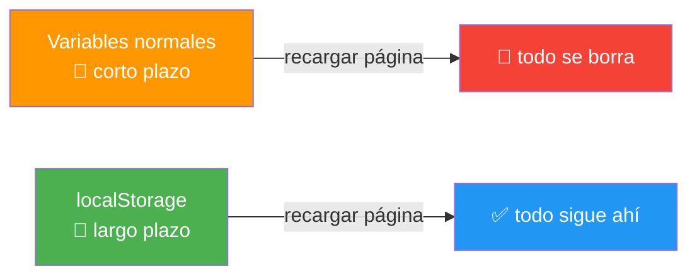
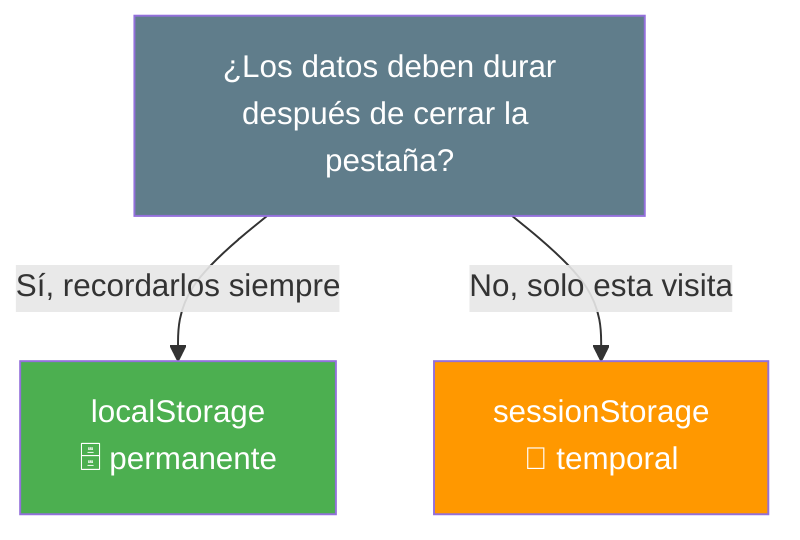
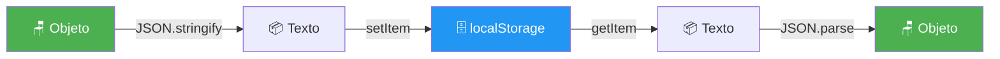
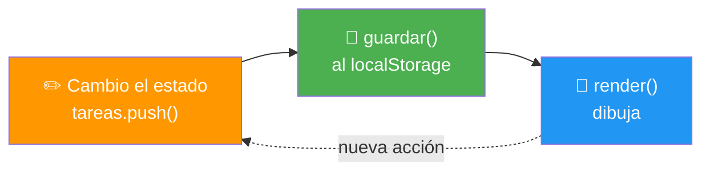
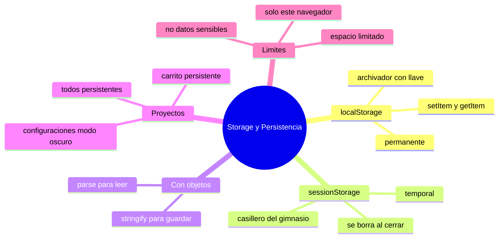

# 🧩 Módulo 16 — Storage y Persistencia

> 💡 **Antes de empezar:** ¿Has notado que algunas webs "te recuerdan"? Mantienen tu modo oscuro, tu carrito lleno o tu sesión iniciada aunque cierres la pestaña. Eso es **persistencia**: guardar datos en el navegador para que no se pierdan. Hasta ahora, todo lo que tu código guardaba desaparecía al recargar la página. Hoy aprenderás a darle _memoria_ a tus apps. Es como pasar de escribir en una pizarra que se borra a tener un cuaderno donde todo queda anotado. 📓

---

## 🎯 ¿Qué aprenderás en este módulo?

Al terminar serás capaz de:

- Guardar datos en el navegador con `localStorage` y `sessionStorage`.
- Entender la diferencia entre ambos y cuándo usar cada uno.
- Guardar configuraciones del usuario (como el modo oscuro).
- Crear una lista de tareas (TODOs) que sobrevive a recargas.
- Construir un carrito de compras persistente.

---

## 💾 El problema que resuelve la persistencia

Hasta ahora, tus variables vivían solo _mientras la página estaba abierta_. Al recargar o cerrar, todo se reiniciaba a cero. El contador volvía a 0, las tareas desaparecían, el modo oscuro se olvidaba.

### 🧠 La metáfora de la memoria a corto y largo plazo

Las variables normales son como la **memoria a corto plazo**: recuerdas un número de teléfono justo para marcarlo, pero lo olvidas enseguida. La persistencia es la **memoria a largo plazo**: lo anotas en una agenda y sigue ahí mañana, la semana que viene, el año que viene.



> 🧠 **Idea clave:** El navegador te ofrece un pequeño "cajón" donde guardar datos que sobreviven a las recargas. Ese cajón es el _storage_.

---

## 1. localStorage: el cajón permanente

`localStorage` guarda datos en el navegador _de forma permanente_: siguen ahí aunque cierres la pestaña, el navegador, o apagues el computador. Solo se borran si tú (o el usuario) los eliminas.

### 🗄️ La metáfora del archivador de la oficina

`localStorage` es como un archivador con llave en tu oficina: lo que guardas ahí sigue estando cuando vuelves al día siguiente. Funciona con un sistema sencillo de _clave y valor_, como etiquetar carpetas.

Tiene cuatro operaciones básicas:

```javascript
// GUARDAR un dato (clave, valor)
localStorage.setItem("nombre", "Lucía");

// LEER un dato (por su clave)
let nombre = localStorage.getItem("nombre");
console.log(nombre);  // "Lucía"

// BORRAR un dato específico
localStorage.removeItem("nombre");

// BORRAR todo
localStorage.clear();
```

> 🔑 **Lo esencial son dos métodos:** `setItem` para guardar y `getItem` para leer. Con esos dos haces el 90% del trabajo. Piensa en ellos como "anotar" y "consultar" en tu cuaderno.

> ⚠️ **Regla importante:** `localStorage` solo guarda **texto** (strings). Si intentas guardar un número, lo convierte en texto. Y si quieres guardar objetos o arrays, necesitas JSON (¡lo veremos enseguida!).

---

## 2. sessionStorage: el cajón temporal

`sessionStorage` funciona _exactamente igual_ que `localStorage` (mismos métodos), con una diferencia clave: sus datos duran **solo mientras la pestaña está abierta**. Al cerrar la pestaña, se borran.

### 🎫 La metáfora del casillero del gimnasio

`sessionStorage` es como un casillero del gimnasio: guardas tus cosas mientras estás ahí (la sesión), pero al irte, lo vacías. Perfecto para datos temporales que _no_ quieres conservar a largo plazo.

```javascript
// Misma sintaxis que localStorage
sessionStorage.setItem("pasoActual", "3");
let paso = sessionStorage.getItem("pasoActual");
```

### Comparación: ¿cuál uso?



||localStorage|sessionStorage|
|---|---|---|
|**Duración**|Permanente (hasta borrarlo)|Solo la pestaña actual|
|**Sobrevive al cerrar pestaña**|✅ Sí|❌ No|
|**Ejemplo de uso**|Modo oscuro, carrito, preferencias|Pasos de un formulario largo, datos de una sola visita|

> 💡 **Regla práctica:** Si dudas, usa `localStorage` (lo más común). Reserva `sessionStorage` para datos que _no_ deben quedar guardados, como información sensible temporal.

---

## 3. Guardar objetos y arrays: el puente con JSON

Como el storage solo guarda texto, para guardar objetos o arrays usamos JSON (¡del Módulo 9!). Este es el patrón _más importante_ del módulo.

### 📦 El patrón empaquetar/desempaquetar

Recuerda: `JSON.stringify` empaqueta (objeto → texto) y `JSON.parse` desempaqueta (texto → objeto). Para el storage:

```javascript
let usuario = { nombre: "Ana", edad: 25 };

// GUARDAR: empaquetar a texto con stringify
localStorage.setItem("usuario", JSON.stringify(usuario));

// LEER: desempaquetar de vuelta con parse
let recuperado = JSON.parse(localStorage.getItem("usuario"));
console.log(recuperado.nombre);  // "Ana"
```



> 🔑 **Grábate este patrón:** Para _guardar_ objetos/arrays → `stringify` antes de `setItem`. Para _leer_ → `parse` después de `getItem`. Lo usarás en cada proyecto de este módulo.

---

## 4. Proyecto: guardar configuraciones (modo oscuro persistente)

Mejoremos el dark mode del Módulo 6 para que _recuerde_ la preferencia del usuario entre visitas.

```html
<!DOCTYPE html>
<html>
<head>
  <style>
    body { transition: 0.3s; }
    .oscuro { background: #1a1a1a; color: #f0f0f0; }
  </style>
</head>
<body>
  <button id="boton">🌙 Cambiar tema</button>

  <script>
    const boton = document.querySelector("#boton");

    // 1️⃣ Al cargar: revisar si había una preferencia guardada
    if (localStorage.getItem("tema") === "oscuro") {
      document.body.classList.add("oscuro");
    }

    // 2️⃣ Al hacer clic: cambiar y GUARDAR la preferencia
    boton.addEventListener("click", () => {
      document.body.classList.toggle("oscuro");
      const esOscuro = document.body.classList.contains("oscuro");
      localStorage.setItem("tema", esOscuro ? "oscuro" : "claro");
    });
  </script>
</body>
</html>
```

> 🔍 **La clave está en dos momentos:**
> 
> 1. **Al cargar la página:** leemos el storage para aplicar la preferencia guardada.
> 2. **Al cambiar:** guardamos la nueva preferencia.
> 
> ¡Prueba activar el modo oscuro, recargar la página, y verás que se mantiene! Esa es la magia de la persistencia. ✨

---

## 5. Proyecto: lista de TODOs persistente

Ahora el clásico: una lista de tareas que _sobrevive_ a las recargas. Aquí combinamos todo: el patrón estado→render del Módulo 8, arrays del Módulo 7, JSON del Módulo 9 y el storage de hoy.

```html
<!DOCTYPE html>
<html>
<body>
  <input type="text" id="campo" placeholder="Nueva tarea">
  <button id="agregar">Agregar</button>
  <ul id="lista"></ul>

  <script>
    // 1️⃣ ESTADO: cargamos las tareas guardadas (o un array vacío)
    let tareas = JSON.parse(localStorage.getItem("tareas")) || [];

    const lista = document.querySelector("#lista");
    const campo = document.querySelector("#campo");

    // 2️⃣ GUARDAR: empaqueta y guarda el estado actual
    function guardar() {
      localStorage.setItem("tareas", JSON.stringify(tareas));
    }

    // 3️⃣ RENDER: dibuja según el estado
    function render() {
      lista.innerHTML = tareas.map((t) => `<li>${t}</li>`).join("");
    }

    // 4️⃣ ACCIÓN: cambia estado → guarda → renderiza
    document.querySelector("#agregar").addEventListener("click", () => {
      if (campo.value.trim() !== "") {
        tareas.push(campo.value.trim());
        campo.value = "";
        guardar();
        render();
      }
    });

    render();  // dibujo inicial con lo que había guardado
  </script>
</body>
</html>
```

> 🔍 **El truco del `|| []`:** Si es la primera visita, `getItem("tareas")` devuelve `null`, y `JSON.parse(null)` da `null`. El `|| []` (del Módulo 3) dice: "si no hay nada guardado, empieza con un array vacío". ¡Elegante y a prueba de errores!

> 🧠 **El patrón ampliado:** Antes era _cambiar estado → render_. Ahora es _cambiar estado → guardar → render_. Solo agregamos un paso: persistir el estado. Prueba agregar tareas y recargar: ¡siguen ahí!



---

## 6. Proyecto: carrito de compras persistente

El mismo patrón, aplicado a un carrito que guarda objetos (productos con nombre y precio). Aquí el storage guarda un _array de objetos_.

```html
<!DOCTYPE html>
<html>
<body>
  <button data-nombre="Café" data-precio="8">Agregar Café ($8)</button>
  <button data-nombre="Pan" data-precio="3">Agregar Pan ($3)</button>
  <h3>🛒 Carrito:</h3>
  <ul id="carrito"></ul>
  <p>Total: $<span id="total">0</span></p>

  <script>
    // ESTADO: cargamos el carrito guardado (o vacío)
    let carrito = JSON.parse(localStorage.getItem("carrito")) || [];

    const ulCarrito = document.querySelector("#carrito");
    const spanTotal = document.querySelector("#total");

    function guardar() {
      localStorage.setItem("carrito", JSON.stringify(carrito));
    }

    function render() {
      ulCarrito.innerHTML = carrito
        .map((item) => `<li>${item.nombre} - $${item.precio}</li>`)
        .join("");
      // El total con reduce (¡del Módulo 7!)
      const total = carrito.reduce((suma, item) => suma + item.precio, 0);
      spanTotal.textContent = total;
    }

    // Cada botón agrega su producto al carrito
    document.querySelectorAll("button").forEach((boton) => {
      boton.addEventListener("click", () => {
        carrito.push({
          nombre: boton.dataset.nombre,
          precio: Number(boton.dataset.precio)
        });
        guardar();
        render();
      });
    });

    render();
  </script>
</body>
</html>
```

> 🔍 **Lo que se junta aquí:** un array de objetos (Módulo 8), `reduce` para el total (Módulo 7), `dataset` para leer datos del botón (Módulo 6), JSON para guardar (Módulo 9) y storage para persistir (hoy). ¡Agrega productos, recarga, y tu carrito sigue lleno! Justo como en una tienda real.

> 💚 **Por qué esto importa:** Imagina que un cliente llena su carrito y se le cierra la pestaña por accidente. Sin persistencia, pierde todo y probablemente se va frustrado. Con persistencia, vuelve y su carrito lo espera. Ese pequeño detalle puede ser la diferencia entre una venta y un cliente perdido.

---

## ⚠️ Cosas que conviene saber del storage

Antes de los ejercicios, tres detalles prácticos:

- **Es solo para este navegador y dispositivo.** Lo guardado en tu Chrome no aparece en tu teléfono ni en Firefox. Para datos compartidos entre dispositivos, se necesita un servidor (eso vendrá más adelante).
- **Tiene un límite de espacio** (unos 5-10 MB). Suficiente para preferencias y listas, pero no para archivos grandes o imágenes.
- **No guardes datos sensibles** (contraseñas, tarjetas) en el storage: cualquiera con acceso al navegador puede leerlos. Es para comodidad, no para secretos.

> 🧠 **En resumen:** el storage es perfecto para _preferencias y datos de conveniencia_. Para datos importantes, privados o compartidos entre dispositivos, hará falta un servidor con base de datos.

---

## 🛠️ Mini práctica: ¡tu turno!

Estos ejercicios necesitan un archivo HTML. ¡Prueba siempre recargar para ver la persistencia! 🧪

### Ejercicio 1 — Tu primer dato persistente

```html
<!DOCTYPE html>
<html>
<body>
  <input type="text" id="nombre" placeholder="Tu nombre">
  <button id="guardar">Guardar</button>
  <p id="saludo"></p>

  <script>
    const input = document.querySelector("#nombre");
    const saludo = document.querySelector("#saludo");

    // Al cargar: mostrar el nombre guardado si existe
    const guardado = localStorage.getItem("miNombre");
    if (guardado) saludo.textContent = "Hola de nuevo, " + guardado;

    document.querySelector("#guardar").addEventListener("click", () => {
      localStorage.setItem("miNombre", input.value);
      saludo.textContent = "Guardado: " + input.value;
    });
  </script>
</body>
</html>
```

> 🔍 **Prueba:** Escribe tu nombre, guarda, y _recarga la página_. Te saludará por tu nombre. ¡Te recordó!

### Ejercicio 2 — Contador persistente

Toma el contador del Módulo 6 y haz que recuerde su valor al recargar.

> 💡 **Pista:** Al cargar, lee el valor con `Number(localStorage.getItem("cuenta")) || 0`. Cada vez que cambie, guárdalo con `setItem`. (Recuerda: el storage guarda texto, por eso usamos `Number()` al leer).

### Ejercicio 3 — Explora tu storage

Abre las DevTools (`F12`) → pestaña **Application** (o **Almacenamiento**) → **Local Storage**. Ahí verás _todo_ lo que tus apps han guardado, como un cajón transparente. Agrega tareas en el proyecto de TODOs y míralas aparecer ahí en tiempo real.

> 🔍 **Útil para debugging:** Cuando algo del storage no funcione, este panel te muestra exactamente qué hay guardado. ¡Es tu ventana al cajón!

---

## 🧭 Resumen visual del módulo



---

## ✅ Checklist: ¿lo lograste?

- [ ] Guardo y leo datos con `setItem` y `getItem`.
- [ ] Distingo `localStorage` (permanente) de `sessionStorage` (temporal).
- [ ] Guardo objetos y arrays usando `JSON.stringify` y `JSON.parse`.
- [ ] Hice una configuración (modo oscuro) que se recuerda entre visitas.
- [ ] Creé una lista de TODOs que sobrevive a las recargas.
- [ ] Construí un carrito persistente con array de objetos.
- [ ] Sé qué NO guardar en el storage (datos sensibles) y sus límites.

Si marcaste la mayoría, **tus apps ya tienen memoria de verdad**. 💪

---

## 🌱 Reflexión final

Este módulo le dio algo profundo a tus apps: _memoria_. Hasta hoy, tus programas sufrían de "amnesia" total con cada recarga. Ahora pueden recordar, y eso cambia por completo la experiencia. Una app que te recuerda se siente cuidada, personal, profesional. Es la diferencia entre un desconocido que te pregunta tu nombre cada vez y un amigo que ya lo sabe.

Fíjate en algo hermoso que pasó aquí: no aprendiste tantas herramientas _nuevas_. `localStorage` tiene apenas un par de métodos. La verdadera riqueza estuvo en _combinar_ lo que ya sabías —estado, render, arrays, objetos, JSON— y sumarle un paso de "guardar". Así funciona la programación real: pocas piezas nuevas, muchas combinaciones poderosas. Cada módulo que avanzas, tus combinaciones se vuelven más capaces.

No te preocupes si al principio olvidas hacer el `stringify`/`parse` o el paso de "guardar". Es un error clásico y se arregla rápido (¡y ahora sabes mirar el panel Application para diagnosticarlo!). Con la práctica, persistir datos se volverá un reflejo natural.

> 🎯 **El secreto sigue siendo el mismo:** un pasito a la vez. Hoy tus apps dejaron de olvidar. Y darle memoria a algo que construiste tú mismo es una de esas pequeñas magias que hacen que valga la pena programar.

**¡Nos vemos en el Módulo 17!**