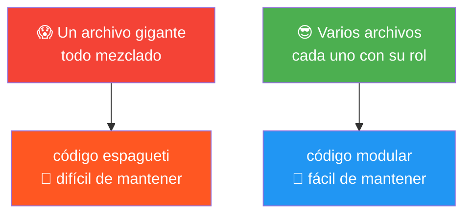
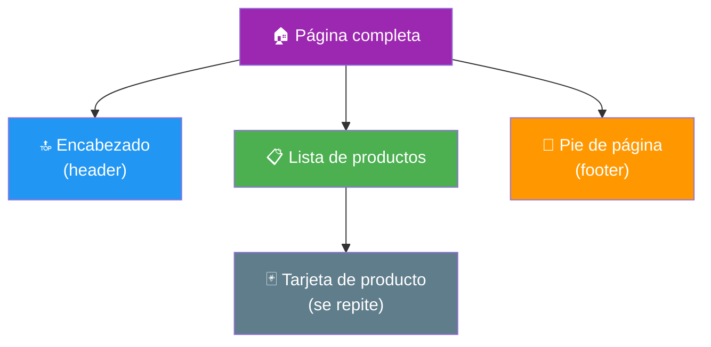
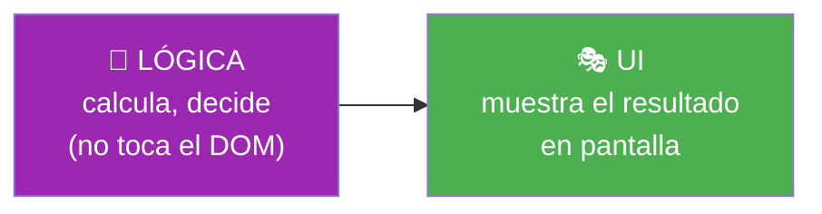
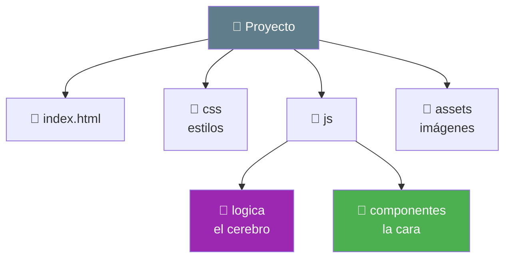
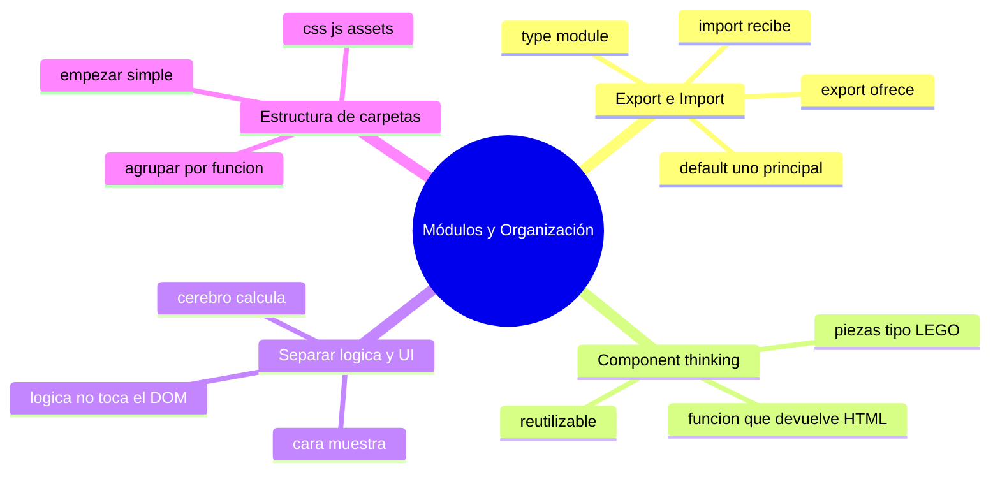

# 🧩 Módulo 17 — Módulos y Organización

> 💡 **Antes de empezar:** Hasta ahora todo tu código vivía en un solo archivo. Funciona para proyectos pequeños, pero a medida que crecen se vuelve un caos: cientos de líneas mezcladas, imposible de encontrar nada. Hoy aprenderás a _organizar_ tu código en piezas ordenadas y reutilizables, como lo hacen los profesionales. Es como pasar de una caja donde tiras todas tus herramientas a un taller con cada cosa en su lugar. 🧰

---

## 🎯 ¿Qué aprenderás en este módulo?

Al terminar serás capaz de:

- Dividir tu código en archivos separados con `export` e `import`.
- Pensar en "componentes": piezas independientes y reutilizables.
- Separar la lógica (el cerebro) de la UI (lo visible).
- Organizar tus proyectos en una estructura de carpetas clara.

> 🌱 **Nota:** Este módulo es más sobre _cómo pensar y organizar_ que sobre comandos nuevos. La organización es una habilidad que distingue al programador profesional del principiante.

---

## 🏗️ El problema: el archivo gigante

Imagina un proyecto con todo en un solo `script.js` de 2000 líneas: funciones, eventos, datos, todo mezclado. Encontrar algo es una pesadilla, y cambiar una cosa puede romper otra sin que te des cuenta.

### 🍝 La metáfora del código espagueti

A ese desorden se le llama "código espagueti": todo enredado, donde tiras de un fideo y se mueve todo el plato. La solución es separar ese plato en porciones ordenadas, cada una con su propósito claro.



> 🧠 **Idea clave:** Dividir el código en piezas pequeñas y enfocadas no es solo "más bonito": hace que sea más fácil de entender, arreglar y reutilizar. Tu yo del futuro te lo agradecerá enormemente.

---

## 1. Export e Import: compartir código entre archivos

Los **módulos** te permiten dividir tu código en varios archivos que se "pasan" cosas entre sí. `export` _ofrece_ algo desde un archivo; `import` lo _trae_ a otro.

### 📤📥 La metáfora de los paquetes entre vecinos

Imagina dos casas vecinas. Una hornea pan y lo _ofrece_ en la ventana (`export`). La otra va y lo _recoge_ (`import`). Así, cada casa hace lo suyo y comparte lo necesario, sin tener todo amontonado en una sola.

**Archivo que ofrece (`matematicas.js`):**

```javascript
// Exportamos funciones para que otros archivos las usen
export function sumar(a, b) {
  return a + b;
}

export function restar(a, b) {
  return a - b;
}
```

**Archivo que recibe (`app.js`):**

```javascript
// Importamos lo que necesitamos del otro archivo
import { sumar, restar } from "./matematicas.js";

console.log(sumar(5, 3));   // 8
console.log(restar(10, 4)); // 6
```

> 🔍 **Desglose:** En `matematicas.js`, `export` marca qué funciones quedan _disponibles_ para otros. En `app.js`, `import { ... } from "..."` trae _justo lo que necesita_, indicando de qué archivo. ¡Cada archivo se concentra en una tarea!


---

### Export por defecto (default)

Hay dos formas de exportar. Ya viste la _con nombre_ (`export function...`). También existe el **export default**, para cuando un archivo exporta _una sola cosa principal_.

```javascript
// saludo.js — exporta una sola cosa principal
export default function saludar(nombre) {
  return `Hola, ${nombre}`;
}

// app.js — al importar default, le pones el nombre que quieras (sin llaves)
import saludar from "./saludo.js";
console.log(saludar("Ana"));
```

> 🔑 **La diferencia clave:**
> 
> - **Export con nombre** (`{ sumar }`): usa llaves al importar, y varios por archivo. Para cuando un archivo ofrece _varias_ cosas.
> - **Export default**: sin llaves al importar, y _uno solo_ por archivo. Para la "estrella" del archivo.

> 💡 **Detalle técnico:** Para usar módulos en el navegador, el `<script>` debe llevar `type="module"`: `<script type="module" src="app.js"></script>`. Esto le dice al navegador "este archivo usa import/export".

---

## 2. Component Thinking: pensar en piezas

El **pensamiento en componentes** es una forma de ver tu app: no como un bloque único, sino como un conjunto de _piezas independientes_ que se combinan. Cada componente hace _una cosa_ y la hace bien.

### 🧱 La metáfora de los bloques de LEGO

Una construcción de LEGO no es una sola pieza gigante: son muchos bloques pequeños que encajan. Cada bloque es simple, pero combinándolos creas cosas enormes. Y si uno se rompe, lo cambias sin desarmar todo. Así son los componentes.

Piensa en una página web cualquiera. Mentalmente, divídela en piezas:



> 🧠 **Idea clave:** En lugar de "una página", piensas en "un encabezado + una lista + tarjetas que se repiten + un pie". Cada pieza es un componente: una función que crea _un_ trozo de interfaz. Esto es _exactamente_ cómo piensan React, Vue y todas las herramientas modernas.

**Un componente en JavaScript puro** es simplemente una función que devuelve HTML:

```javascript
// Un "componente" tarjeta: recibe datos, devuelve su HTML
function TarjetaProducto(producto) {
  return `
    <div class="tarjeta">
      <h3>${producto.nombre}</h3>
      <p>$${producto.precio}</p>
    </div>
  `;
}

// Lo reutilizamos para cada producto (¡combinado con map del Módulo 7!)
const productos = [
  { nombre: "Café", precio: 8 },
  { nombre: "Pan", precio: 3 }
];

const html = productos.map(TarjetaProducto).join("");
```

> 🎯 **Lo bonito:** Escribes la "tarjeta" _una vez_ y la reutilizas para cada producto. Si quieres cambiar cómo se ven _todas_ las tarjetas, modificas _un solo_ lugar. Eso es el poder de pensar en componentes.

---

## 3. Separar lógica de UI: el cerebro y la cara

Una de las distinciones más importantes en programación: separar la **lógica** (los cálculos, las reglas, los datos: el "cerebro") de la **UI** (lo que se ve y se toca: la "cara").

### 🧠🎭 La metáfora del cerebro y el rostro

Tu cerebro _piensa_ y _decide_ (la lógica). Tu rostro _muestra_ esas decisiones con expresiones (la UI). Son cosas distintas que colaboran. Si mezclas ambas en el mismo lugar, todo se enreda. Separadas, cada una es clara y puede cambiar sin afectar a la otra.

```javascript
// ❌ Todo mezclado: lógica y UI juntas, difícil de probar y cambiar
boton.addEventListener("click", () => {
  let total = precio * cantidad * 1.19;  // lógica de cálculo
  document.querySelector("#total").textContent = "$" + total;  // UI
});

// ✅ Separado: la lógica es una función independiente
function calcularTotalConIVA(precio, cantidad) {
  return precio * cantidad * 1.19;  // solo cálculo, sin tocar la página
}

boton.addEventListener("click", () => {
  const total = calcularTotalConIVA(precio, cantidad);  // uso la lógica
  document.querySelector("#total").textContent = "$" + total;  // UI aparte
});
```

> 🔍 **Por qué importa:** La función `calcularTotalConIVA` no sabe _nada_ de la página: solo calcula. Puedes probarla, reutilizarla en otro lugar, o cambiar el diseño visual sin tocar el cálculo. Cerebro y cara, cada uno en lo suyo.

> 💡 **Regla práctica:** Las funciones de lógica _no deberían_ tocar el DOM. Reciben datos, devuelven resultados. La parte de UI se encarga de mostrar esos resultados. Esta separación hace tu código mucho más limpio y robusto.



---

## 4. Estructura de carpetas: cada cosa en su lugar

A medida que el proyecto crece, no basta con separar archivos: hay que _organizarlos en carpetas_ con sentido. No existe una única forma correcta, pero hay convenciones claras y útiles.

### 🗂️ La metáfora del archivador organizado

Una oficina organizada tiene cajones etiquetados: "Facturas", "Contratos", "Personal". No mezclas todo en un cajón. Tu proyecto igual: una carpeta para la lógica, otra para los componentes, otra para los estilos.

Una estructura típica y sencilla para empezar:

```
mi-proyecto/
├── index.html          ← la página principal
├── css/
│   └── estilos.css     ← todos los estilos
├── js/
│   ├── app.js          ← el punto de entrada
│   ├── logica/         ← funciones de cálculo y reglas (el cerebro)
│   │   └── calculos.js
│   └── componentes/    ← piezas de UI reutilizables (la cara)
│       └── tarjeta.js
└── assets/             ← imágenes, íconos, fuentes
    └── logo.png
```

> 🔍 **La idea detrás:** Agrupar por _función_. Los estilos juntos, la lógica junta, los componentes juntos. Cuando buscas algo, sabes exactamente en qué cajón mirar. Y cuando alguien más (o tu yo del futuro) abre el proyecto, lo entiende de un vistazo.

> 💡 **Consejo para empezar:** No te obsesiones con la estructura "perfecta" desde el día uno. Empieza simple (separa por css/js) y reorganiza a medida que el proyecto crece. La organización es un proceso vivo, no una regla rígida.



---

## 🛠️ Mini práctica: ¡tu turno!

> 📌 **Nota:** Los módulos (`import`/`export`) necesitan varios archivos y el `type="module"` en el script. Crea los archivos en la misma carpeta y abre el HTML en el navegador.

### Ejercicio 1 — Tu primer módulo

Crea dos archivos en la misma carpeta:

**`utilidades.js`:**

```javascript
export function saludar(nombre) {
  return `¡Hola, ${nombre}!`;
}

export function despedir(nombre) {
  return `¡Adiós, ${nombre}!`;
}
```

**`index.html`:**

```html
<!DOCTYPE html>
<html>
<body>
  <script type="module">
    import { saludar, despedir } from "./utilidades.js";
    console.log(saludar("Ana"));
    console.log(despedir("Luis"));
  </script>
</body>
</html>
```

> 🔍 **Importante:** Fíjate en el `type="module"`. Sin él, los import no funcionan.

### Ejercicio 2 — Separa la lógica

Toma esta función mezclada y _sepárala_: crea una función de lógica pura `esPar(numero)` que solo devuelva `true`/`false`, y deja que la parte de UI muestre el resultado.

```javascript
// Antes: mezclado
boton.addEventListener("click", () => {
  const n = Number(input.value);
  resultado.textContent = n % 2 === 0 ? "Par" : "Impar";
});

// Tu reto: extrae la lógica a una función esPar(n) separada
```

### Ejercicio 3 — Piensa en componentes

Sin escribir código todavía, toma una web que uses a diario (una tienda, una red social) y, en papel, divídela en componentes. Identifica: ¿qué piezas se repiten? ¿cuáles son únicas? Este ejercicio mental es _clave_ para pensar como desarrollador moderno.

> 💡 **Pista:** Busca lo que se repite (tarjetas, items de lista, botones) — esos son tus componentes reutilizables más claros.

---

## 🧭 Resumen visual del módulo



---

## ✅ Checklist: ¿lo lograste?

- [ ] Divido código en archivos con `export` e `import`.
- [ ] Distingo export con nombre (con llaves) de export default (sin llaves).
- [ ] Sé que el script necesita `type="module"` para usar import/export.
- [ ] Pienso en componentes: piezas independientes y reutilizables.
- [ ] Separo la lógica (cálculos) de la UI (lo visible).
- [ ] Mis funciones de lógica no tocan el DOM directamente.
- [ ] Organizo proyectos en carpetas claras por función.

Si marcaste la mayoría, **ya piensas en la organización como un profesional**. 💪

---

## 🌱 Reflexión final

Este módulo no te dio "poderes nuevos" como pedir datos o guardar información. Te dio algo más sutil pero igual de valioso: _la capacidad de mantener el orden cuando las cosas crecen_. Y créeme, esto es lo que separa a quienes hacen proyectitos de juguete de quienes construyen aplicaciones reales que duran años y crecen con el tiempo.

La gran lección es que **el código no se escribe solo para que funcione, sino para que se pueda entender y cambiar después**. Un código que funciona pero es un caos es una bomba de tiempo; un código ordenado es un placer de mantener. Pensar en componentes, separar la lógica de la UI, organizar carpetas... todo apunta a lo mismo: claridad. Y la claridad es generosidad con tu yo del futuro y con cualquiera que toque tu código.

No te preocupes si al principio no sabes dónde poner cada cosa. La organización "perfecta" no existe, y todos los programadores reorganizan sus proyectos constantemente. Empieza simple, observa qué se vuelve confuso, y ordena sobre la marcha. Es una habilidad que se afina con cada proyecto.

> 🎯 **El secreto sigue siendo el mismo:** un pasito a la vez. Hoy aprendiste que programar bien no es solo hacer que algo funcione, sino dejarlo ordenado para el futuro. Y esa mentalidad de orden y claridad es la marca de un programador maduro.

**¡Nos vemos en el Módulo 18!**