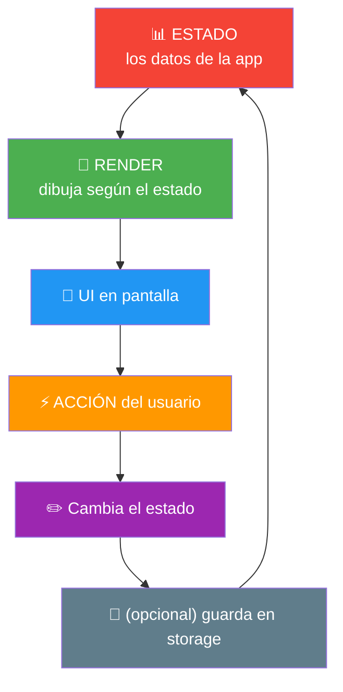
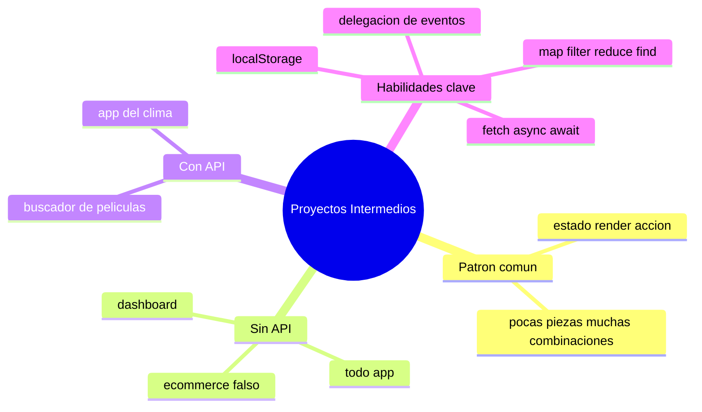

# 🧩 Módulo 18 — Proyectos Intermedios

> 💡 **Antes de empezar:** ¡Este es un módulo de celebración! Ya tienes un arsenal completo: DOM, eventos, arrays, objetos, estado, fetch, storage, módulos... Hoy juntamos _todo_ en 5 proyectos que combinan muchas habilidades a la vez, como las apps reales. No son ejercicios de juguete: son versiones simplificadas de aplicaciones que la gente usa de verdad. Es como cuando un músico que ya domina los acordes por fin toca un concierto completo. 🎵

---

## 🎯 ¿Qué construirás en este módulo?

Cinco proyectos que integran lo aprendido:

- Una **TODO app** completa con persistencia.
- Un **buscador de películas** que consume una API real.
- Un **ecommerce falso** con carrito funcional.
- Un **dashboard** simple con datos y visualización.
- Una **app del clima** conectada a internet.

> 🧠 **Cómo aprovechar este módulo:** No copies y pegues sin pensar. Construye cada proyecto, _entiende cada parte_, y luego intenta mejorarlo con las ideas de "siguiente nivel" que doy al final de cada uno. Ahí es donde de verdad creces.

---

## 🗺️ El mapa mental de un proyecto intermedio

Antes de empezar, recuerda la arquitectura que aprendiste. _Todos_ estos proyectos siguen la misma columna vertebral:



> 🔑 **El mantra de este módulo:** _Estado → Render → Acción → (guardar) → repetir._ Si reconoces este patrón en cada proyecto, verás que no hay nada nuevo que temer: solo combinaciones de lo que ya sabes.

---

## 🟦 Proyecto 1 — TODO App completa

**Qué integra:** estado, render, arrays, objetos, eventos, localStorage, delegación.

Una lista de tareas donde puedes agregar, marcar como completadas y borrar, ¡y todo persiste!

```html
<!DOCTYPE html>
<html>
<head>
  <style>
    .completada { text-decoration: line-through; color: gray; }
    li { cursor: pointer; padding: 5px; }
  </style>
</head>
<body>
  <h1>Mis Tareas</h1>
  <input type="text" id="campo" placeholder="Nueva tarea">
  <button id="agregar">Agregar</button>
  <ul id="lista"></ul>

  <script>
    // ESTADO: cargamos del storage o array vacío
    let tareas = JSON.parse(localStorage.getItem("tareas")) || [];

    const lista = document.querySelector("#lista");
    const campo = document.querySelector("#campo");

    function guardar() {
      localStorage.setItem("tareas", JSON.stringify(tareas));
    }

    function render() {
      lista.innerHTML = tareas.map((tarea, i) => `
        <li data-index="${i}" class="${tarea.hecha ? "completada" : ""}">
          ${tarea.texto} <span data-borrar="${i}">❌</span>
        </li>
      `).join("");
    }

    // Agregar tarea
    document.querySelector("#agregar").addEventListener("click", () => {
      if (campo.value.trim() !== "") {
        tareas.push({ texto: campo.value.trim(), hecha: false });
        campo.value = "";
        guardar();
        render();
      }
    });

    // DELEGACIÓN: un solo escuchador para marcar y borrar (Módulo 14)
    lista.addEventListener("click", (e) => {
      if (e.target.dataset.borrar !== undefined) {
        tareas.splice(e.target.dataset.borrar, 1);  // borrar
      } else if (e.target.dataset.index !== undefined) {
        tareas[e.target.dataset.index].hecha = !tareas[e.target.dataset.index].hecha;  // marcar
      }
      guardar();
      render();
    });

    render();
  </script>
</body>
</html>
```

> 🔍 **Lo que se junta:** array de objetos (cada tarea es `{texto, hecha}`), el patrón estado→render→guardar (Módulos 8 y 16), delegación de eventos (Módulo 14) y `splice` para borrar (Módulo 7).

> 🚀 **Siguiente nivel:** Añade un contador de "tareas pendientes", o filtros para ver solo las completadas / solo las pendientes (pista: `filter` del Módulo 7).

---

## 🎬 Proyecto 2 — Buscador de películas

**Qué integra:** fetch, async/await, APIs, eventos, render dinámico, manejo de errores.

Busca películas en una API real y muestra sus pósters. (Usa TMDB con una API key gratuita; el patrón sirve para cualquier API).

```html
<!DOCTYPE html>
<html>
<body>
  <input type="text" id="busqueda" placeholder="Buscar película...">
  <button id="buscar">Buscar</button>
  <div id="resultados"></div>

  <script>
    const CLAVE = "TU_API_KEY";  // regístrate gratis en themoviedb.org
    const resultados = document.querySelector("#resultados");

    document.querySelector("#buscar").addEventListener("click", async () => {
      const query = document.querySelector("#busqueda").value.trim();
      if (query === "") return;

      resultados.innerHTML = "⏳ Buscando...";  // loader (Módulo 12)

      try {
        const url = `https://api.themoviedb.org/3/search/movie?query=${query}&api_key=${CLAVE}&language=es`;
        const respuesta = await fetch(url);
        if (!respuesta.ok) throw new Error("Error en la búsqueda");
        const datos = await respuesta.json();

        if (datos.results.length === 0) {
          resultados.innerHTML = "No se encontraron películas 🎬";
          return;
        }

        // Render con map (Módulo 7) + template literals (Módulo 9)
        resultados.innerHTML = datos.results.map((peli) => `
          <div class="peli">
            <h3>${peli.title}</h3>
            <p>${peli.release_date || "Fecha desconocida"}</p>
          </div>
        `).join("");

      } catch (error) {
        resultados.innerHTML = "❌ Algo salió mal. Intenta de nuevo.";
      }
    });
  </script>
</body>
</html>
```

> 🔍 **Lo que se junta:** fetch + async/await (Módulos 11 y 12), los tres momentos (cargando/éxito/error con try/catch), render condicional (si no hay resultados), y `map` para dibujar la lista.

> 🚀 **Siguiente nivel:** Muestra los pósters reales (las imágenes vienen en `peli.poster_path`), o busca _mientras escribes_ con el evento `input` y un pequeño retraso.

---

## 🛒 Proyecto 3 — Ecommerce falso

**Qué integra:** array de objetos, carrito, reduce, storage, render, eventos.

Una tienda con productos, donde agregas al carrito y ves el total, todo persistente.

```html
<!DOCTYPE html>
<html>
<body>
  <h1>🛍️ Tienda</h1>
  <div id="productos"></div>
  <h2>🛒 Carrito (<span id="total">0</span> total)</h2>
  <ul id="carrito"></ul>

  <script>
    // Catálogo (en una app real vendría de una API)
    const catalogo = [
      { id: 1, nombre: "Camiseta", precio: 25 },
      { id: 2, nombre: "Gorra", precio: 15 },
      { id: 3, nombre: "Zapatos", precio: 60 }
    ];

    // ESTADO del carrito (persistente)
    let carrito = JSON.parse(localStorage.getItem("carrito")) || [];

    const divProductos = document.querySelector("#productos");
    const ulCarrito = document.querySelector("#carrito");
    const spanTotal = document.querySelector("#total");

    function guardar() {
      localStorage.setItem("carrito", JSON.stringify(carrito));
    }

    function render() {
      // Catálogo
      divProductos.innerHTML = catalogo.map((p) => `
        <div>${p.nombre} - $${p.precio}
          <button data-id="${p.id}">Agregar</button>
        </div>
      `).join("");

      // Carrito
      ulCarrito.innerHTML = carrito.map((item) =>
        `<li>${item.nombre} - $${item.precio}</li>`
      ).join("");

      // Total con reduce (Módulo 7)
      spanTotal.textContent = "$" + carrito.reduce((s, i) => s + i.precio, 0);
    }

    // Delegación para los botones "Agregar"
    divProductos.addEventListener("click", (e) => {
      const id = Number(e.target.dataset.id);
      if (id) {
        const producto = catalogo.find((p) => p.id === id);  // find (Módulo 7)
        carrito.push(producto);
        guardar();
        render();
      }
    });

    render();
  </script>
</body>
</html>
```

> 🔍 **Lo que se junta:** `find` para localizar el producto, `reduce` para el total, `map` para renderizar catálogo y carrito, delegación de eventos, y storage para persistir.

> 🚀 **Siguiente nivel:** Agrupa productos repetidos mostrando cantidad ("Camiseta x3"), o añade un botón para vaciar el carrito.

---

## 📊 Proyecto 4 — Dashboard simple

**Qué integra:** objetos, métodos de array, render, cálculos, separación lógica/UI.

Un panel que muestra estadísticas calculadas a partir de datos. Aquí brilla la separación entre _calcular_ (lógica) y _mostrar_ (UI) del Módulo 17.

```html
<!DOCTYPE html>
<html>
<body>
  <h1>📊 Dashboard de Ventas</h1>
  <div id="panel"></div>

  <script>
    // DATOS (en una app real vendrían de una API)
    const ventas = [
      { producto: "A", monto: 120 },
      { producto: "B", monto: 340 },
      { producto: "C", monto: 80 },
      { producto: "D", monto: 200 }
    ];

    // 🧠 LÓGICA: funciones puras que solo calculan (no tocan el DOM)
    function calcularTotal(datos) {
      return datos.reduce((s, v) => s + v.monto, 0);
    }
    function calcularPromedio(datos) {
      return Math.round(calcularTotal(datos) / datos.length);
    }
    function encontrarMayor(datos) {
      return datos.reduce((max, v) => v.monto > max.monto ? v : max);
    }

    // 🎭 UI: toma los cálculos y los muestra
    function render() {
      const mayor = encontrarMayor(ventas);
      document.querySelector("#panel").innerHTML = `
        <div>💰 Total: $${calcularTotal(ventas)}</div>
        <div>📈 Promedio: $${calcularPromedio(ventas)}</div>
        <div>🏆 Mayor venta: ${mayor.producto} ($${mayor.monto})</div>
      `;
    }

    render();
  </script>
</body>
</html>
```

> 🔍 **Lo que se junta:** la separación lógica/UI del Módulo 17 (las funciones de cálculo no saben nada del DOM), `reduce` para varias estadísticas, y render desde datos.

> 🚀 **Siguiente nivel:** Añade barras visuales simples con divs de ancho proporcional al monto, o un selector para ordenar los datos de mayor a menor.

---

## 🌤️ Proyecto 5 — App del clima

**Qué integra:** fetch, async/await, API key, geolocalización opcional, manejo de errores, UX.

Consulta el clima de cualquier ciudad. (Usa OpenWeatherMap con clave gratuita).

```html
<!DOCTYPE html>
<html>
<body>
  <input type="text" id="ciudad" placeholder="Escribe una ciudad">
  <button id="buscar">Ver clima</button>
  <div id="clima"></div>

  <script>
    const CLAVE = "TU_API_KEY";  // regístrate gratis en openweathermap.org
    const divClima = document.querySelector("#clima");

    document.querySelector("#buscar").addEventListener("click", async () => {
      const ciudad = document.querySelector("#ciudad").value.trim();
      if (ciudad === "") return;

      divClima.innerHTML = "⏳ Consultando el clima...";

      try {
        const url = `https://api.openweathermap.org/data/2.5/weather?q=${ciudad}&appid=${CLAVE}&units=metric&lang=es`;
        const respuesta = await fetch(url);
        if (!respuesta.ok) throw new Error("Ciudad no encontrada");
        const datos = await respuesta.json();

        // Mostramos los datos con buen formato
        divClima.innerHTML = `
          <h2>${datos.name}</h2>
          <p>🌡️ ${Math.round(datos.main.temp)}°C</p>
          <p>☁️ ${datos.weather[0].description}</p>
          <p>💧 Humedad: ${datos.main.humidity}%</p>
        `;
      } catch (error) {
        divClima.innerHTML = "❌ No encontramos esa ciudad. Revisa el nombre.";
      }
    });
  </script>
</body>
</html>
```

> 🔍 **Lo que se junta:** fetch + async/await, manejo de los tres momentos, `Math.round` para limpiar decimales, acceso a objetos anidados (`datos.weather[0].description`), y mensajes de error amables (UX del Módulo 15).

> 🚀 **Siguiente nivel:** Añade un ícono del clima según la condición, o guarda la última ciudad buscada en localStorage para mostrarla al volver.

---

## 🧠 La gran lección de este módulo

Mira los cinco proyectos juntos. ¿Notas el patrón? **Todos usan las mismas herramientas, combinadas de formas distintas.**

|Habilidad|Proyectos donde aparece|
|---|---|
|Estado + render|**Todos**|
|`map` para dibujar listas|TODO, películas, ecommerce, dashboard|
|fetch + async/await|Películas, clima|
|localStorage|TODO, ecommerce|
|`reduce`|Ecommerce, dashboard|
|`find` / `filter`|Ecommerce, dashboard|
|Delegación de eventos|TODO, ecommerce|
|try/catch + loaders|Películas, clima|

> 🎯 **La revelación:** No existen "proyectos difíciles", solo _combinaciones_ de piezas que ya dominas. Cuando veas una app que te parezca imposible, recuerda: por dentro es esto mismo, combinado. Lo que cambia es la _cantidad_ de piezas, no su naturaleza.

---

## 🛠️ Tu turno: construye y mejora

No hay ejercicios separados aquí: **los proyectos SON el ejercicio**. Tu misión:

1. **Construye** al menos dos de estos proyectos desde cero, escribiéndolos tú (no copiando).
2. **Entiende** cada línea: si algo no te queda claro, vuelve al módulo correspondiente.
3. **Mejora** uno con su idea de "siguiente nivel".
4. **Combina:** como reto final, intenta fusionar ideas (ej: un dashboard que use datos _reales_ de una API).

> 💡 **Consejo de oro:** Cuando algo falle (y fallará), no entres en pánico. Abre la consola, lee el error (Módulo 10), pon `console.log` para investigar, y avanza paso a paso. Eso es, literalmente, programar.

---

## 🧭 Resumen visual del módulo



---

## ✅ Checklist: ¿lo lograste?

- [ ] Construí una TODO app con persistencia y delegación.
- [ ] Hice un buscador que consume una API real con manejo de errores.
- [ ] Programé un ecommerce con carrito persistente.
- [ ] Creé un dashboard separando lógica de UI.
- [ ] Construí una app del clima conectada a internet.
- [ ] Reconozco que todos comparten el patrón estado → render → acción.
- [ ] Entiendo que los proyectos complejos son combinaciones de cosas simples.

Si marcaste la mayoría, **ya no construyes ejercicios: construyes aplicaciones**. 🚀

---

## 🌱 Reflexión final

Detente y mira lo que acabas de lograr. Cinco aplicaciones que se parecen muchísimo a cosas que usas a diario: una lista de tareas, un buscador como el de los servicios de streaming, una tienda online, un panel de estadísticas, una app del clima. Hace 18 módulos, todo esto te habría parecido magia inalcanzable. Hoy lo construyes tú.

La lección más importante de este módulo —y quizás de todo el curso— es esta: **lo complejo es solo lo simple, combinado.** No hay una "habilidad secreta" que separe a los programadores buenos de los principiantes. Hay las mismas piezas (variables, funciones, arrays, objetos, eventos, fetch...) combinadas con más práctica y más confianza. Cada app impresionante del mundo está hecha de estos mismos ladrillos.

Y si algo no te salió a la primera, perfecto: así es como se aprende de verdad. Los errores de estos proyectos te enseñaron más que cualquier teoría. Cada bug que resolviste te hizo un poco más programador. Esa es la receta, y ya la conoces.

> 🎯 **El secreto sigue siendo el mismo:** un pasito a la vez. Hoy dejaste de "aprender a programar" para empezar a "programar de verdad". Y esa transición —de estudiante a creador— es una de las más satisfactorias que existen.

**¡Nos vemos en el Módulo 19!**