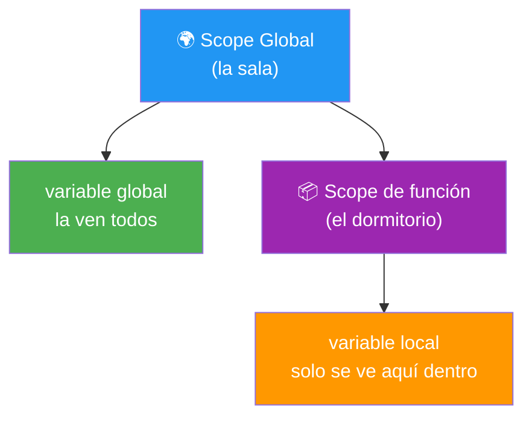
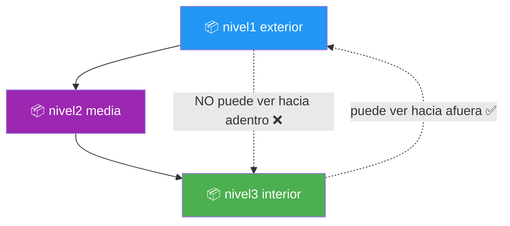
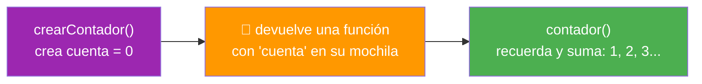
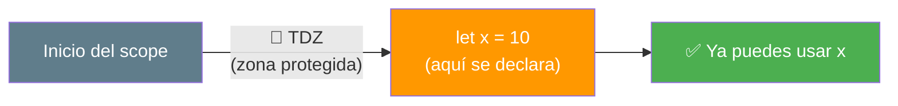
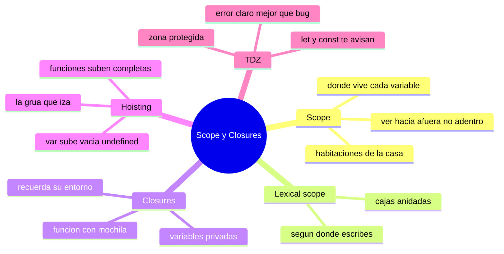

# 🧩 Módulo 19 — Scope y Closures

> 💡 **Antes de empezar:** Hoy entramos en uno de los temas más "míticos" de JavaScript: los closures. Tienen fama de difíciles, y muchos los evitan. Pero con las metáforas correctas, verás que son sorprendentemente lógicos e incluso elegantes. Entender esto te dará un control profundo sobre _dónde viven_ tus variables y _quién puede verlas_. Es como entender qué habitaciones de una casa son privadas y cuáles compartidas. 🏠

---

## 🎯 ¿Qué aprenderás en este módulo?

Al terminar serás capaz de:

- Entender el _scope_ (alcance): dónde "vive" y quién puede ver cada variable.
- Comprender los _closures_: funciones que "recuerdan" su entorno.
- Saber qué es el _hoisting_ y por qué a veces el código se comporta raro.
- Conocer la _TDZ_ y por qué `let` y `const` son más seguros que `var`.

> 🌱 **Tranquilidad ante todo:** Este módulo es teórico y profundo. No necesitas dominarlo de memoria para programar, pero entenderlo te hará mucho más consciente. Léelo sin prisa y disfruta los momentos "¡ahá!".

---

## 1. Scope: dónde vive cada variable

El **scope** (alcance) determina _desde dónde_ se puede ver y usar una variable. No todas las variables son visibles desde todas partes; cada una tiene su "zona de influencia".

### 🏠 La metáfora de las habitaciones de una casa

Imagina una casa con habitaciones. Algo que dejas en la _sala_ (espacio común) lo ve todo el mundo. Algo que guardas en tu _dormitorio_ (espacio privado) solo lo ves tú. El scope funciona igual: las variables tienen su "habitación", y solo se ven desde dentro de ella o desde habitaciones más internas.

```javascript
let global = "Me ve todo el mundo";  // en la "sala" (scope global)

function miFuncion() {
  let local = "Solo me ven dentro de la función";  // en un "dormitorio"
  console.log(global);  // ✅ desde aquí veo la sala
  console.log(local);   // ✅ y veo lo mío
}

miFuncion();
console.log(global);  // ✅ la sala se ve desde fuera
console.log(local);   // ❌ Error: "local" vive en el dormitorio, no se ve aquí
```



> 🧠 **Idea clave:** Una función puede ver hacia _afuera_ (las variables de la sala), pero desde afuera _no_ se ve hacia adentro de la función. Es una vista de adentro hacia afuera, nunca al revés.

---

### Lexical Scope: el alcance según dónde escribes el código

El **lexical scope** (alcance léxico) significa que el alcance de una variable se define por _dónde la escribes_ en el código, no por dónde se ejecuta. Las funciones "heredan" acceso a las variables del lugar donde _fueron escritas_.

### 🪆 La metáfora de las cajas anidadas

Imagina cajas dentro de cajas. Una caja interna puede meter la mano y tomar cosas de las cajas que la envuelven (las externas), pero una caja externa _no_ puede meter la mano dentro de las internas.

```javascript
let nivel1 = "exterior";

function externa() {
  let nivel2 = "media";

  function interna() {
    let nivel3 = "interior";
    // La función interna ve TODO lo de afuera:
    console.log(nivel1);  // ✅ "exterior"
    console.log(nivel2);  // ✅ "media"
    console.log(nivel3);  // ✅ "interior"
  }

  interna();
  console.log(nivel3);  // ❌ Error: la externa no puede ver dentro de la interna
}
```



> 🔑 **Para recordar:** Las funciones internas ven hacia afuera, como mirar a través de ventanas hacia las habitaciones que las contienen. Esta capacidad de "ver hacia afuera" es la base de lo que viene ahora: los closures.

---

## 2. Closures: funciones con memoria

Un **closure** (clausura) ocurre cuando una función "recuerda" las variables del lugar donde fue creada, _incluso después_ de que ese lugar haya terminado de ejecutarse. Es una de las características más poderosas de JavaScript.

### 🎒 La metáfora de la mochila

Imagina que cada función, al ser creada, empaca una **mochila** con las variables que tenía a su alrededor. Aunque la función se vaya a otro lado y el lugar original desaparezca, _se lleva su mochila consigo_ y puede seguir usando lo que guardó. Eso es un closure: una función que carga su entorno en la espalda.

```javascript
function crearContador() {
  let cuenta = 0;  // esta variable queda "en la mochila"

  return function () {
    cuenta++;  // la función recuerda y modifica "cuenta"
    return cuenta;
  };
}

const contador = crearContador();
console.log(contador());  // 1
console.log(contador());  // 2
console.log(contador());  // 3
```

> 🤯 **Lo sorprendente:** Aunque `crearContador()` ya _terminó_ de ejecutarse, la función que devolvió _sigue recordando_ la variable `cuenta`. No se reinicia a 0; va guardando su valor entre llamadas. ¡Eso es la magia de la mochila!



> 💡 **¿Para qué sirven en la vida real?** Los closures permiten crear variables "privadas" (que nadie de afuera puede tocar directamente), recordar estado entre llamadas, y son la base de muchos patrones avanzados. De hecho, ¡ya usaste closures sin saberlo cada vez que un `addEventListener` recordaba variables de su alrededor!

> 😌 **Si no hace clic a la primera, es NORMAL.** Los closures son famosos por necesitar varias lecturas para "encajar" en la mente. No te frustres. Vuelve al ejemplo del contador, ejecútalo, y poco a poco el concepto se asienta.

---

## 3. Hoisting: el "izado" de declaraciones

El **hoisting** (izado) es un comportamiento de JavaScript donde las _declaraciones_ de variables y funciones parecen "subir" al inicio de su scope antes de ejecutarse. Esto explica algunos comportamientos que parecen mágicos o confusos.

### 🏗️ La metáfora de la grúa que iza

Imagina que, antes de ejecutar tu código, JavaScript pasa una _grúa_ que "iza" (sube) las declaraciones al principio. Por eso a veces puedes usar una función _antes_ de escribirla.

```javascript
// Esto FUNCIONA, aunque saludar() se llama antes de definirse:
saludar();  // ✅ "¡Hola!"

function saludar() {
  console.log("¡Hola!");
}
```

> 🔍 **Por qué funciona:** Las _declaraciones de función_ se izan completas. Es como si JavaScript las leyera primero y las moviera arriba antes de ejecutar. Por eso puedes llamarlas antes en el código.

**Pero ojo con las variables:**

```javascript
console.log(miVar);  // undefined (no da error, pero tampoco el valor)
var miVar = 5;
console.log(miVar);  // 5
```

> ⚠️ **El comportamiento confuso de `var`:** Con `var`, la _declaración_ se iza pero _no su valor_. Es como si la grúa subiera la caja vacía (la variable existe, vale `undefined`) pero el contenido se queda donde estaba. Esto causa errores difíciles de rastrear, y es una de las razones por las que evitamos `var` (¿recuerdas el Módulo 2?).

---

## 4. TDZ: la zona donde let y const te protegen

La **TDZ** (Temporal Dead Zone, "zona muerta temporal") es el periodo entre que un scope empieza y el momento en que una variable `let` o `const` es declarada. Si intentas usar la variable _antes_ de declararla, JavaScript te detiene con un error claro.

### 🚧 La metáfora de la zona en construcción

Imagina una habitación con una cinta de "zona en construcción" hasta que se termina de instalar. Si intentas usarla antes, te topas con la cinta y un cartel de "¡aún no!". La TDZ es esa protección: `let` y `const` no te dejan usar una variable antes de declararla.

```javascript
// Con let/const: la TDZ te protege con un error claro
console.log(miLet);  // ❌ ReferenceError: no puedes usarla antes de declararla
let miLet = 10;

// Compara con var (sin protección, comportamiento confuso):
console.log(miVar);  // undefined (silencioso, esconde el error)
var miVar = 10;
```

> 🛡️ **Por qué la TDZ es algo BUENO:** Puede sonar molesto que dé error, pero en realidad te _protege_. En vez de un `undefined` silencioso que esconde un bug (como hace `var`), `let` y `const` te avisan claramente: "estás usando esto antes de tiempo". Un error claro es mucho mejor que un comportamiento misterioso.



> 🔑 **La conexión con el Módulo 2:** ¿Recuerdas que dijimos "usa `let` y `const`, evita `var`"? Ahora entiendes _por qué_ a un nivel profundo: `var` tiene hoisting confuso y no tiene TDZ que te proteja. `let` y `const` se comportan de forma predecible y segura.

---

## 🛠️ Mini práctica: ¡tu turno!

Estos ejercicios funcionan en la consola. Como en el Módulo 13, mucho es _predecir_ el comportamiento. 🧠

### Ejercicio 1 — Explora el scope

```javascript
let fuera = "soy global";

function prueba() {
  let dentro = "soy local";
  console.log(fuera);   // ¿funciona?
  console.log(dentro);  // ¿funciona?
}

prueba();
console.log(dentro);  // ¿funciona o da error?
```

> 💡 **Predice:** ¿Cuáles líneas funcionan y cuál da error? Piensa en las "habitaciones".

### Ejercicio 2 — Crea tu propio closure

```javascript
function crearSaludador(saludo) {
  // "saludo" queda en la mochila
  return function (nombre) {
    return `${saludo}, ${nombre}!`;
  };
}

const saludarEspanol = crearSaludador("Hola");
const saludarIngles = crearSaludador("Hello");

console.log(saludarEspanol("Ana"));   // ¿qué imprime?
console.log(saludarIngles("John"));   // ¿qué imprime?
```

> 🔍 **Observa:** Cada saludador _recuerda_ su propio `saludo`. Dos mochilas distintas, dos comportamientos distintos. ¡Eso es el poder de los closures!

### Ejercicio 3 — Siente la diferencia de la TDZ

```javascript
// Prueba esto:
try {
  console.log(conLet);
  let conLet = 5;
} catch (e) {
  console.log("Error con let:", e.message);
}

// Compara con var:
console.log(conVar);  // no da error, pero...
var conVar = 5;
```

> 🛡️ **Reflexiona:** ¿Ves cómo `let` te avisa del problema y `var` lo esconde? Por eso preferimos `let` y `const`.

---

## 🧭 Resumen visual del módulo



---

## ✅ Checklist: ¿lo lograste?

- [ ] Entiendo qué es el scope: dónde vive y quién ve cada variable.
- [ ] Sé que las funciones ven hacia afuera, pero no al revés (lexical scope).
- [ ] Comprendo que un closure es una función que "recuerda" su entorno.
- [ ] Entiendo el hoisting y por qué `var` se comporta de forma confusa.
- [ ] Sé qué es la TDZ y por qué protege con `let` y `const`.
- [ ] Conecto todo esto con el consejo del Módulo 2 (usar `let`/`const`).

Si marcaste la mayoría, **entiendes JavaScript a un nivel que muchos nunca alcanzan**. 💪

---

## 🌱 Reflexión final

Acabas de explorar el "mundo invisible" de JavaScript: dónde viven las variables, cómo las funciones recuerdan su entorno, y por qué el lenguaje a veces se comporta de formas que parecían misteriosas. Estos conceptos —especialmente los closures— tienen fama de difíciles, y el solo hecho de haberlos enfrentado ya te pone por delante de muchos.

Aquí va una verdad reconfortante: _no necesitas dominar estos conceptos a la perfección para construir cosas geniales_. De hecho, ya construiste 18 módulos de proyectos usando closures y scope sin siquiera saber sus nombres. Lo que hiciste hoy fue ponerle nombre y entendimiento a algo que ya estabas usando intuitivamente. Eso es madurar como programador: pasar de "funciona y no sé por qué" a "funciona y entiendo por qué".

Si los closures todavía se sienten resbaladizos, estás en excelente compañía: es uno de los temas que _todo_ programador de JavaScript ha tenido que releer varias veces. Dale tiempo. Vuelve al ejemplo de la mochila y del contador cuando lo necesites. El "clic" llegará, y cuando lo haga, será uno de los momentos más satisfactorios de tu camino.

> 🎯 **El secreto sigue siendo el mismo:** un pasito a la vez. Hoy miraste el mecanismo profundo del lenguaje. No tienes que entender cada engranaje de inmediato; con cada relectura y cada proyecto, esta comprensión se volverá parte natural de cómo piensas el código.

**¡Nos vemos en el Módulo 20!**