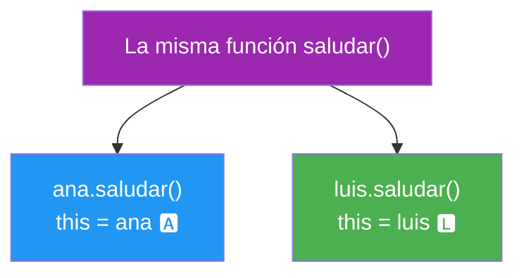
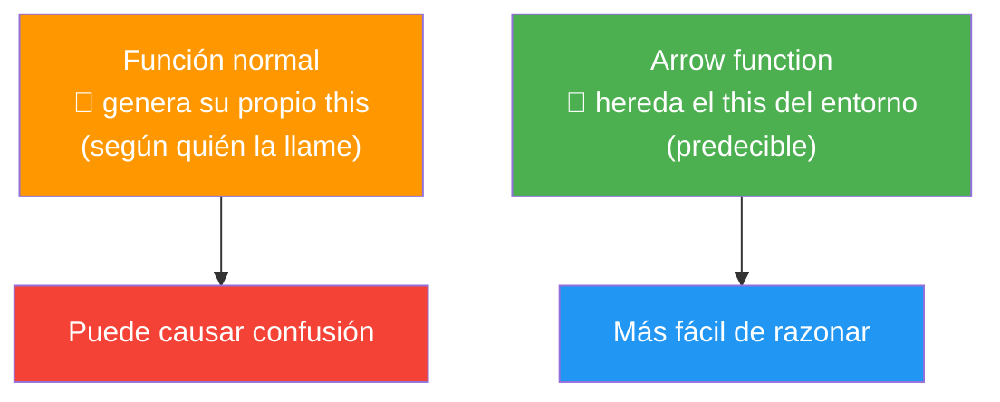
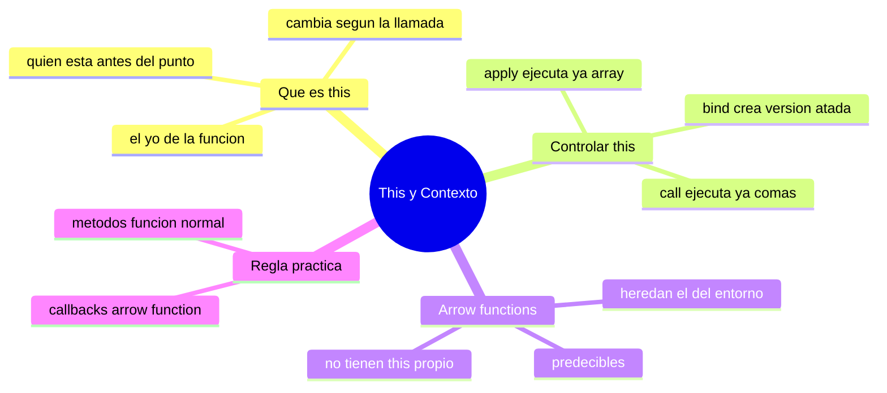

# 🧩 Módulo 20 — This y Contexto

> 💡 **Antes de empezar:** En el Módulo 8 viste `this` de pasada, y prometimos volver a él. Hoy cumplimos. `this` es famoso por confundir incluso a programadores con experiencia, porque su valor _cambia_ según cómo se llama la función. Pero hay una clave que lo desbloquea todo: entender que `this` responde a una pregunta simple: "¿quién me está llamando?". Con las metáforas correctas, este "monstruo" se vuelve manejable. 🪞

---

## 🎯 ¿Qué aprenderás en este módulo?

Al terminar serás capaz de:

- Entender qué es `this` y cómo cambia según el contexto.
- Controlar `this` manualmente con `bind`, `call` y `apply`.
- Saber por qué las arrow functions tratan `this` de forma especial.
- Reconocer y evitar los errores más comunes con `this`.

> 🌱 **Tranquilidad ante todo:** `this` confunde a _todo el mundo_ al principio. Si algo no encaja a la primera, es completamente normal. Léelo con calma; las metáforas están aquí para ayudarte.

---

## 1. ¿Qué es `this`?

`this` es una palabra especial que se refiere a _quién está ejecutando la función en este momento_. Su valor no es fijo: depende de _cómo_ y _desde dónde_ se llama la función.

### 🪞 La metáfora del "yo" en una conversación

La palabra "yo" no significa siempre la misma persona: depende de _quién la dice_. Si yo digo "yo", me refiero a mí; si tú dices "yo", te refieres a ti. `this` es exactamente como la palabra "yo": su significado cambia según quién esté "hablando" (ejecutando) en ese momento.

```javascript
const persona = {
  nombre: "Ana",
  saludar: function () {
    console.log(`Hola, soy ${this.nombre}`);
  }
};

persona.saludar();  // "Hola, soy Ana"
// Aquí "this" es "persona", porque persona llamó a la función
```

> 🧠 **La pregunta clave:** Para saber qué es `this`, pregúntate: _"¿quién está a la izquierda del punto al llamar la función?"_. En `persona.saludar()`, `persona` está a la izquierda del punto, así que `this` es `persona`.

---

### Cómo cambia `this` según el contexto

Aquí está lo que confunde: la _misma_ función puede tener distintos `this` según cómo se llame.

```javascript
const ana = {
  nombre: "Ana",
  saludar: function () {
    console.log(this.nombre);
  }
};

const luis = {
  nombre: "Luis",
  saludar: ana.saludar  // ¡la misma función!
};

ana.saludar();   // "Ana"  → this es ana
luis.saludar();  // "Luis" → this es luis (misma función, distinto llamador)
```



> 🔑 **Idea clave:** `this` no depende de _dónde se escribió_ la función, sino de _cómo se llama_. Quien está antes del punto en el momento de la llamada es el `this`. Es como el "yo": cambia según quién hable.

> ⚠️ **El error clásico:** Si tomas una función "suelta" (sin nada a la izquierda del punto), `this` puede perderse y volverse `undefined` o el objeto global. Esto causa muchos bugs, y por eso existen las herramientas que veremos ahora.

---

## 2. bind, call y apply: controlar `this` manualmente

A veces necesitas _forzar_ qué será `this`. JavaScript te da tres herramientas para eso. Las tres hacen algo parecido, con pequeñas diferencias.

### 🎯 La metáfora de asignar el protagonista

Imagina que una función es una escena de película, y `this` es el actor protagonista. Normalmente el protagonista se decide solo (quien llama la función). Pero `bind`, `call` y `apply` son como un director que dice: _"en esta escena, el protagonista será este, sí o sí"_.

```javascript
function presentarse() {
  console.log(`Soy ${this.nombre}`);
}

const persona = { nombre: "Carla" };
```

### `call`: ejecuta ahora, con este `this`

`call` ejecuta la función _inmediatamente_, diciéndole quién es `this`.

```javascript
presentarse.call(persona);  // "Soy Carla" (se ejecuta ya)
```

### `apply`: igual que call, pero con argumentos en array

`apply` es idéntico a `call`, solo que si la función recibe argumentos, se los pasas en un _array_.

```javascript
function saludar(saludo, signo) {
  console.log(`${saludo}, soy ${this.nombre}${signo}`);
}

saludar.call(persona, "Hola", "!");      // argumentos sueltos
saludar.apply(persona, ["Hola", "!"]);   // argumentos en array
// Ambos: "Hola, soy Carla!"
```

> 🔑 **Truco para recordar:** **A**pply usa **A**rray. **C**all usa argumentos por **C**oma. Esa única letra es toda la diferencia.

### `bind`: crea una nueva función con `this` fijado

`bind` _no_ ejecuta de inmediato. En su lugar, crea una _nueva versión_ de la función con `this` permanentemente fijado, lista para usar después.

```javascript
const presentarCarla = presentarse.bind(persona);
// No se ejecutó todavía. Creamos una función "atada" a persona.

presentarCarla();  // "Soy Carla" (cuando queramos, this siempre será persona)
```

> 📌 **Metáfora:** `bind` es como contratar a un actor para _siempre_ hacer ese papel. Le "atas" el rol de protagonista de forma permanente, y luego lo llamas cuando lo necesites.

### Tabla comparativa

|Método|¿Ejecuta ya?|Argumentos|Metáfora|
|---|---|---|---|
|`call`|✅ Sí, ahora|Sueltos (comas)|"Actúa ya, con este protagonista"|
|`apply`|✅ Sí, ahora|En array|"Actúa ya" (con guion en lista)|
|`bind`|❌ No, después|Sueltos (comas)|"Te contrato para siempre con este papel"|

> 💡 **¿Cuándo lo usarás?** `bind` es el más común en la práctica, sobre todo para asegurar que `this` no se pierda en callbacks y eventos. `call` y `apply` aparecen menos, pero conviene reconocerlos.

---

## 3. Arrow functions: el `this` que no cambia

Aquí está la herramienta _moderna_ que simplifica casi todos los problemas con `this`. Las **arrow functions** (que viste en el Módulo 4) tratan `this` de forma especial: **no tienen su propio `this`**. En su lugar, "heredan" el `this` del lugar donde fueron escritas.

### 🧲 La metáfora del eco del entorno

Una función normal "genera su propio yo" según quién la llame. Una arrow function, en cambio, no genera nada propio: hace _eco_ del `this` que la rodea. Mira hacia afuera y dice "uso el mismo `this` que mi entorno". Esto la hace mucho más predecible.

```javascript
const equipo = {
  nombre: "Tigres",
  jugadores: ["Ana", "Luis"],

  mostrar: function () {
    // Arrow function: hereda el "this" de mostrar(), que es "equipo"
    this.jugadores.forEach((jugador) => {
      console.log(`${jugador} juega en ${this.nombre}`);
    });
  }
};

equipo.mostrar();
// "Ana juega en Tigres"
// "Luis juega en Tigres"
```

> 🔍 **El problema que resuelve:** Si usaras una función _normal_ dentro del `forEach`, su `this` se perdería (no sería `equipo`) y `this.nombre` fallaría. La arrow function hereda el `this` correcto automáticamente. ¡Por eso son tan populares en código moderno!



> 🔑 **Regla práctica moderna:** Dentro de métodos de objetos, usa funciones normales (para que `this` sea el objeto). Dentro de callbacks (como `forEach`, eventos, `setTimeout`), usa arrow functions (para heredar el `this` correcto). Esta combinación evita la mayoría de los líos.

---

## 4. `this` en el mundo real: eventos del DOM

Un lugar donde `this` aparece mucho es en los eventos. Veamos el caso típico y cómo las arrow functions ayudan.

```javascript
const boton = document.querySelector("button");

// En una función normal de evento, "this" es el elemento del DOM
boton.addEventListener("click", function () {
  console.log(this);  // el botón mismo
  this.textContent = "Clicado";  // funciona: this es el botón
});
```

Pero dentro de un objeto, suele convenir una arrow function para no perder el `this` del objeto:

```javascript
const app = {
  mensaje: "¡Hola!",
  iniciar: function () {
    const boton = document.querySelector("button");
    // Arrow function: this sigue siendo "app", no el botón
    boton.addEventListener("click", () => {
      console.log(this.mensaje);  // "¡Hola!" (this es app)
    });
  }
};
```

> 💡 **La lección:** Saber _qué `this` quieres_ (el elemento o el objeto) te dice qué tipo de función usar. Esa decisión consciente es la marca de alguien que entiende `this` de verdad.

---

## 🛠️ Mini práctica: ¡tu turno!

Estos ejercicios funcionan en la consola. Mucho es _predecir_ qué será `this`. 🧠

### Ejercicio 1 — ¿Quién es this?

```javascript
const gato = {
  nombre: "Michi",
  hablar: function () {
    console.log(`Soy ${this.nombre}`);
  }
};

gato.hablar();  // ¿qué imprime?

const hablarSuelto = gato.hablar;
hablarSuelto();  // 🤔 ¿qué pasa aquí? (pista: this se perdió)
```

> 💡 **Predice:** La primera línea es clara. La segunda demuestra el "error clásico": al sacar la función del objeto, `this` se pierde.

### Ejercicio 2 — Arregla con bind

```javascript
const perro = { nombre: "Rex" };

function ladrar() {
  console.log(`${this.nombre} dice guau`);
}

// Crea una versión "atada" a perro usando bind:
const ladrarRex = ladrar.bind(perro);
ladrarRex();  // "Rex dice guau"
```

### Ejercicio 3 — Arrow function al rescate

```javascript
const persona = {
  nombre: "Sofía",
  hobbies: ["leer", "correr"],
  mostrar: function () {
    this.hobbies.forEach((hobby) => {
      console.log(`${this.nombre} disfruta ${hobby}`);
    });
  }
};

persona.mostrar();  // ¿qué imprime?
```

> 🔍 **Reto:** Cambia la arrow function por una función normal (`function(hobby) {...}`) y observa cómo `this.nombre` se rompe. ¡Así _sientes_ por qué las arrow functions ayudan!

---

## 🧭 Resumen visual del módulo



---

## ✅ Checklist: ¿lo lograste?

- [ ] Entiendo que `this` es "quién llama a la función".
- [ ] Sé mirar "quién está antes del punto" para saber qué es `this`.
- [ ] Uso `call` y `apply` para ejecutar con un `this` específico.
- [ ] Uso `bind` para crear una función con `this` fijado.
- [ ] Sé que las arrow functions heredan el `this` de su entorno.
- [ ] Aplico la regla: funciones normales en métodos, arrows en callbacks.

Si marcaste la mayoría, **acabas de domar a uno de los conceptos más escurridizos de JavaScript**. 💪

---

## 🌱 Reflexión final

`this` tiene reputación de ser el concepto que más quebraderos de cabeza da en JavaScript, y no es exageración. Pero si te quedas con una sola idea de este módulo, que sea esta: **`this` responde a "¿quién me llamó?", no a "¿dónde me escribieron?"**. Esa pregunta resuelve la gran mayoría de las confusiones.

Y aquí van buenas noticias para tu tranquilidad. Primero: en el JavaScript moderno, las arrow functions resuelven _muchísimos_ de los problemas históricos con `this`, así que en la práctica diaria sufrirás bastante menos de lo que sufrieron los programadores de hace unos años. Segundo: igual que los closures del módulo anterior, este es un tema que se asienta con la práctica y la repetición, no con la memorización. Está perfecto volver a leerlo varias veces.

No te midas por si dominas `this` a la perfección hoy. Mídete por algo más valioso: ya sabes _que existe esta sutileza_, sabes _qué preguntarte_ cuando algo raro pase, y conoces las herramientas para arreglarlo. Eso ya te coloca muy por delante de quien usa `this` a ciegas y se frustra sin saber por qué.

> 🎯 **El secreto sigue siendo el mismo:** un pasito a la vez. Hoy enfrentaste uno de los "jefes finales" conceptuales de JavaScript. No tienes que haberlo derrotado del todo; basta con que ya no te tome por sorpresa. Con cada proyecto, esta intuición se afila sola.

**¡Nos vemos en el Módulo 21!**