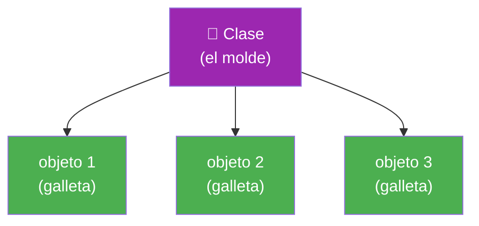
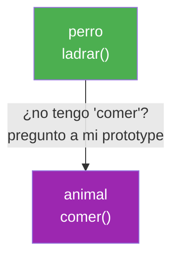
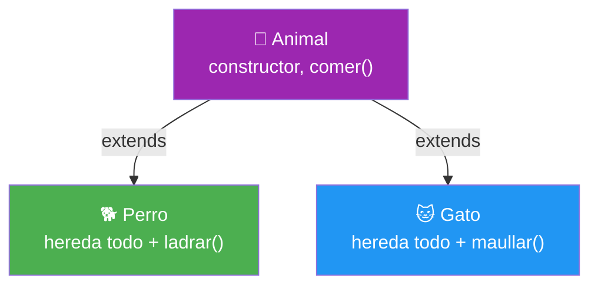
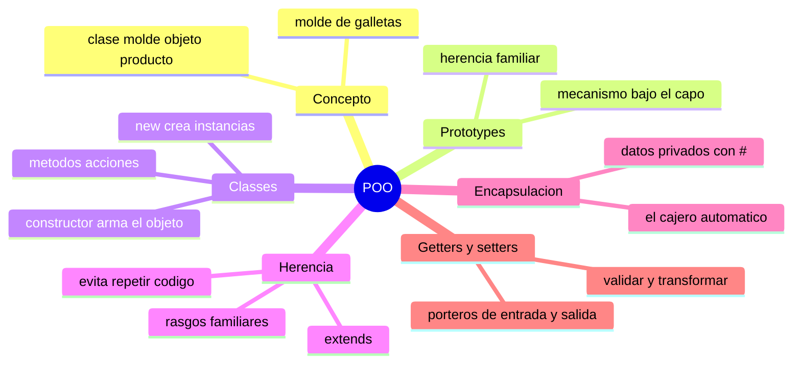

# 🧩 Módulo 21 — Programación Orientada a Objetos

> 💡 **Antes de empezar:** En el Módulo 8 aprendiste a crear objetos _uno por uno_. Pero ¿y si necesitas crear _cientos_ de objetos parecidos —cientos de usuarios, productos o enemigos en un juego—? Escribirlos a mano sería una locura. Hoy aprenderás a crear "moldes" que fabrican objetos en serie, y a organizarlos con una de las formas de pensar más influyentes de la programación: la POO. Es como pasar de tallar cada figura a mano a tener un molde que produce todas las que quieras. 🏭

---

## 🎯 ¿Qué aprenderás en este módulo?

Al terminar serás capaz de:

- Entender los prototypes, el mecanismo de herencia de JavaScript.
- Crear "moldes" de objetos con `class`.
- Reutilizar código mediante herencia entre clases.
- Proteger datos con encapsulación.
- Controlar el acceso a propiedades con getters y setters.

> 🌱 **Nota:** La POO es una _forma de organizar_ el código, no algo obligatorio. JavaScript te deja programar de varias maneras. Aprenderla te da otra herramienta poderosa en tu caja, y te prepara para entender muchísimo código profesional.

---

## 🏭 ¿Qué es la Programación Orientada a Objetos?

La **POO** es una forma de organizar tu código agrupando _datos_ y las _acciones_ sobre esos datos en unidades llamadas objetos, creados a partir de "moldes".

### 🍪 La metáfora del molde de galletas

Imagina que quieres hacer 100 galletas iguales. No moldeas cada una a mano: usas un _molde_ (cortador) y produces todas idénticas en forma, aunque cada una sea su propia galleta. En POO, ese molde es la **clase**, y cada galleta que sale es un **objeto** (o "instancia").



> 🧠 **Idea clave:** Una clase es el molde (se escribe una vez); los objetos son los productos (se crean los que quieras). Cada objeto tiene la misma "forma" pero sus propios valores.

---

## 1. Prototypes: el mecanismo bajo el capó

Antes de las clases modernas, JavaScript ya tenía una forma de compartir comportamiento entre objetos: los **prototypes** (prototipos). Es el mecanismo _real_ que funciona por debajo, incluso de las clases.

### 🧬 La metáfora de la herencia familiar

Un prototype es como un "pariente" del que un objeto hereda características. Si le pides algo a un objeto y él no lo tiene, _pregunta a su prototype_ (su pariente), y si ese tampoco, sigue subiendo por la "cadena familiar" hasta encontrarlo o rendirse.

```javascript
const animal = {
  comer: function () {
    console.log("Ñam ñam");
  }
};

// perro hereda de animal (animal es su prototype)
const perro = Object.create(animal);
perro.ladrar = function () {
  console.log("¡Guau!");
};

perro.ladrar();  // "¡Guau!" (lo tiene él mismo)
perro.comer();   // "Ñam ñam" (no lo tiene, lo hereda de animal)
```



> 💡 **No te abrumes con prototypes:** Hoy casi nunca los escribirás directamente; usarás `class` (que es más clara). Pero es bueno saber que las clases son, por dentro, "azúcar" sobre los prototypes. Entender que existen te ayuda a comprender JavaScript de verdad.

---

## 2. Classes: el molde moderno

Las **clases** (`class`) son la forma _moderna y clara_ de crear moldes de objetos. Por dentro usan prototypes, pero se leen mucho mejor.

### 🏗️ La metáfora del plano de construcción

Una clase es como el plano de un arquitecto. El plano no es una casa, es la _instrucción_ para construir casas. Con un plano construyes todas las casas que quieras, cada una real e independiente.

```javascript
class Persona {
  // El constructor: se ejecuta al crear cada objeto
  constructor(nombre, edad) {
    this.nombre = nombre;  // cada objeto tendrá su nombre
    this.edad = edad;
  }

  // Un método: una acción que todos los objetos pueden hacer
  saludar() {
    console.log(`Hola, soy ${this.nombre} y tengo ${this.edad} años`);
  }
}

// Crear objetos a partir del molde con "new"
const ana = new Persona("Ana", 25);
const luis = new Persona("Luis", 30);

ana.saludar();   // "Hola, soy Ana y tengo 25 años"
luis.saludar();  // "Hola, soy Luis y tengo 30 años"
```

> 🔍 **Desglose de las piezas:**
> 
> - `class Persona` → define el molde.
> - `constructor` → la función que arma cada objeto nuevo; recibe los datos iniciales.
> - `this.nombre = nombre` → guarda los datos _en este objeto particular_ (¡aquí brilla el `this` del Módulo 20!).
> - `new Persona(...)` → usa el molde para fabricar un objeto real.

> 🧠 **Conexión:** ¿Recuerdas `this` del Módulo 20? Dentro de una clase, `this` se refiere al _objeto que se está creando o usando_. Por eso `this.nombre` significa "el nombre de este objeto en particular".

---

## 3. Herencia: moldes que extienden otros moldes

La **herencia** permite crear una clase basada en otra, heredando todo lo suyo y agregando o cambiando cosas. Evita repetir código.

### 👨‍👧 La metáfora de los rasgos familiares

Un hijo hereda rasgos de sus padres (ojos, apellido) y además tiene los suyos propios. En POO, una clase "hija" hereda todo lo de la "madre" y puede añadir sus particularidades.

```javascript
// Clase base (madre)
class Animal {
  constructor(nombre) {
    this.nombre = nombre;
  }
  comer() {
    console.log(`${this.nombre} está comiendo`);
  }
}

// Clase hija que hereda de Animal con "extends"
class Perro extends Animal {
  ladrar() {
    console.log(`${this.nombre} dice ¡Guau!`);
  }
}

const rex = new Perro("Rex");
rex.comer();   // "Rex está comiendo" (heredado de Animal)
rex.ladrar();  // "Rex dice ¡Guau!" (propio de Perro)
```



> 🔑 **La palabra mágica `extends`:** Le dice a JavaScript "esta clase hereda de aquella". El `Perro` obtiene gratis el `constructor` y el método `comer()` de `Animal`, sin reescribirlos.

> 💡 **Por qué es útil:** Si tienes `Perro`, `Gato` y `Pájaro`, todos "comen". En vez de escribir `comer()` tres veces, lo escribes una vez en `Animal` y los tres lo heredan. Menos código, menos errores, más orden.

---

## 4. Encapsulación: proteger los datos

La **encapsulación** consiste en _proteger_ los datos internos de un objeto para que no se modifiquen de cualquier manera desde afuera. Algunos datos deben ser privados.

### 🔒 La metáfora del cajero automático

No puedes meter la mano dentro del cajero y cambiar tu saldo directamente. Solo puedes interactuar a través de operaciones controladas (depositar, retirar) que verifican las reglas. El saldo está _encapsulado_: protegido tras una interfaz segura.

En JavaScript moderno, las propiedades privadas se marcan con `#`:

```javascript
class CuentaBancaria {
  #saldo = 0;  // privado: el # lo hace inaccesible desde afuera

  depositar(cantidad) {
    if (cantidad > 0) {       // regla: solo cantidades positivas
      this.#saldo += cantidad;
    }
  }

  verSaldo() {
    return this.#saldo;
  }
}

const cuenta = new CuentaBancaria();
cuenta.depositar(100);
console.log(cuenta.verSaldo());  // 100
console.log(cuenta.#saldo);      // ❌ Error: es privado, no se accede así
```

> 🛡️ **Por qué importa:** Sin encapsulación, cualquiera podría poner `cuenta.saldo = 1000000` directamente, saltándose las reglas. Con el `#`, el saldo solo cambia a través de métodos controlados que validan. Protege la _integridad_ de tus datos.

> 🧠 **Idea clave:** Encapsular es decidir qué es "asunto interno" del objeto (privado, con `#`) y qué es su "interfaz pública" (los métodos que los demás pueden usar). Es como una cafetera: usas los botones (interfaz), no tocas los cables internos.

---

## 5. Getters y Setters: acceso controlado

Los **getters** y **setters** son métodos especiales que se _ven_ como propiedades pero ejecutan código por debajo. Permiten controlar cómo se lee y se modifica un dato.

### 🚪 La metáfora del portero

Un getter es un portero que controla la _salida_ de información (cómo se entrega un dato al pedirlo). Un setter es un portero que controla la _entrada_ (qué se acepta al intentar cambiar un dato). Ambos pueden aplicar reglas o transformaciones.

```javascript
class Persona {
  constructor(nombre) {
    this._nombre = nombre;  // el _ indica "uso interno" por convención
  }

  // GETTER: se ejecuta al LEER persona.nombre
  get nombre() {
    return this._nombre.toUpperCase();  // siempre lo devuelve en mayúsculas
  }

  // SETTER: se ejecuta al ASIGNAR persona.nombre = ...
  set nombre(valor) {
    if (valor.length > 0) {       // valida antes de aceptar
      this._nombre = valor;
    } else {
      console.log("El nombre no puede estar vacío");
    }
  }
}

const p = new Persona("ana");
console.log(p.nombre);   // "ANA" (el getter lo pasó a mayúsculas)
p.nombre = "luis";       // el setter lo acepta
console.log(p.nombre);   // "LUIS"
p.nombre = "";           // "El nombre no puede estar vacío" (el setter lo rechaza)
```

> 🔍 **Lo interesante:** Usas `p.nombre` como si fuera una propiedad normal (sin paréntesis), pero por debajo se ejecuta código que transforma o valida. El usuario de la clase ni se entera; solo recibe un comportamiento "inteligente".

> 💡 **Para qué sirven:** validar datos al asignarlos, transformar valores al leerlos (formato, mayúsculas), o calcular un valor al momento. Dan control fino sin complicar la forma de usarlos.

---

## 🛠️ Mini práctica: ¡tu turno!

Estos ejercicios funcionan en la consola. 🧪

### Ejercicio 1 — Tu primera clase

```javascript
class Coche {
  constructor(marca, color) {
    this.marca = marca;
    this.color = color;
  }
  describir() {
    return `Un ${this.marca} de color ${this.color}`;
  }
}

const miCoche = new Coche("Toyota", "rojo");
console.log(miCoche.describir());  // ¿qué imprime?
```

Crea ahora dos coches más con datos distintos y descríbelos.

### Ejercicio 2 — Herencia

```javascript
class Vehiculo {
  constructor(ruedas) {
    this.ruedas = ruedas;
  }
  info() {
    return `Tengo ${this.ruedas} ruedas`;
  }
}

class Moto extends Vehiculo {
  acelerar() {
    return "¡Brrrum!";
  }
}

const moto = new Moto(2);
console.log(moto.info());      // heredado
console.log(moto.acelerar());  // propio
```

> 🔍 **Observa:** `Moto` nunca define `info()`, pero lo tiene gracias a `extends`. ¡Eso es herencia!

### Ejercicio 3 — Encapsulación y validación

```javascript
class Termostato {
  #temperatura = 20;

  subir() {
    if (this.#temperatura < 30) this.#temperatura++;
  }
  bajar() {
    if (this.#temperatura > 10) this.#temperatura--;
  }
  ver() {
    return this.#temperatura;
  }
}

const t = new Termostato();
t.subir();
t.subir();
console.log(t.ver());  // 22
```

> 🎯 **Reto:** La temperatura no puede pasar de 30 ni bajar de 10. Intenta subirla 20 veces y comprueba que se detiene en 30. ¡La encapsulación protege las reglas!

---

## 🧭 Resumen visual del módulo



---

## ✅ Checklist: ¿lo lograste?

- [ ] Entiendo que una clase es un molde y los objetos son sus productos.
- [ ] Sé que los prototypes son el mecanismo de herencia por debajo.
- [ ] Creo clases con `constructor` y métodos, e instancias con `new`.
- [ ] Reutilizo código con herencia usando `extends`.
- [ ] Protejo datos privados con `#` (encapsulación).
- [ ] Controlo lectura y escritura con getters y setters.

Si marcaste la mayoría, **dominas una de las formas de pensar más influyentes de la programación**. 💪

---

## 🌱 Reflexión final

La POO es una de las grandes "filosofías" de la programación, y hoy le abriste la puerta. Pero quiero ser honesto contigo sobre algo importante: la POO _no_ es la única forma correcta de programar, ni siempre la mejor. JavaScript es flexible y te permite combinar estilos. Verás mucho código profesional con clases, y también mucho sin ellas. Tener la POO en tu caja de herramientas te hace más versátil, pero no te sientas obligado a usar clases para todo.

Lo verdaderamente valioso de este módulo no son los `class` y `extends` en sí, sino las _ideas_ detrás: agrupar datos con sus acciones, reutilizar mediante herencia, y proteger lo que debe estar protegido (encapsulación). Estas ideas trascienden a JavaScript; las encontrarás en casi todos los lenguajes. Son formas de pensar la organización del código que te servirán toda la vida.

Y como siempre, no te exijas dominarlo todo de inmediato. La POO tiene muchas sutilezas que se aprenden construyendo. Empieza creando clases simples para cosas que se repiten en tus proyectos (usuarios, productos), y deja que la intuición crezca con la práctica.

> 🎯 **El secreto sigue siendo el mismo:** un pasito a la vez. Hoy sumaste una forma poderosa de organizar y pensar tu código. No tienes que usarla siempre, pero saber que está ahí —y cómo funciona— te hace un programador más completo y consciente.

**¡Nos vemos en el Módulo 22!**