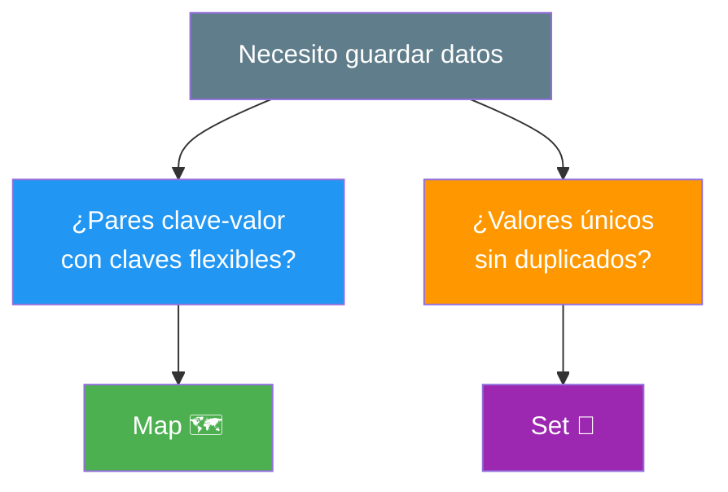
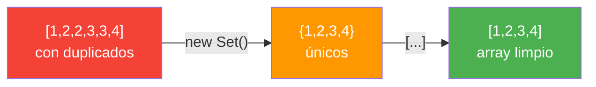
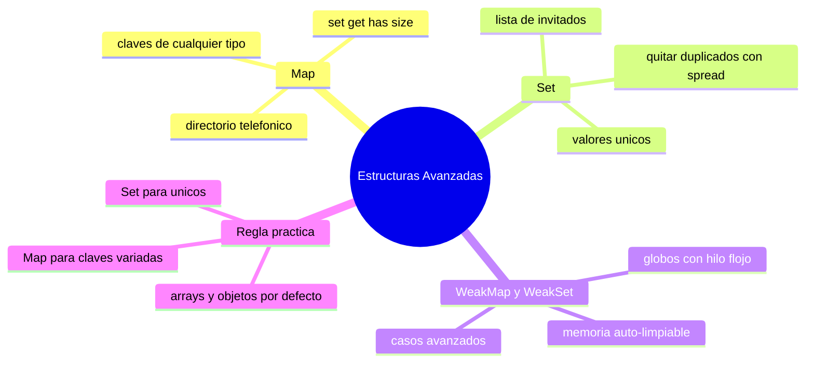

# 🧩 Módulo 22 — Estructuras Avanzadas

> 💡 **Antes de empezar:** Hasta ahora guardaste datos en arrays (listas) y objetos (fichas). Funcionan genial, pero JavaScript tiene _otras_ estructuras especializadas que resuelven problemas concretos de forma más elegante. Hoy conocerás cuatro: Map, Set, WeakMap y WeakSet. Cada una es como una herramienta especializada en tu caja: no las usas siempre, pero cuando encaja el problema, son perfectas. Es como tener, además del cuchillo de cocina común, un pelador y unas tijeras: cada uno brilla en su tarea. 🔪✂️

---

## 🎯 ¿Qué aprenderás en este módulo?

Al terminar serás capaz de:

- Usar `Map` para asociaciones clave-valor más flexibles que los objetos.
- Usar `Set` para guardar valores _sin duplicados_.
- Entender qué son `WeakMap` y `WeakSet` y por qué existen.
- Saber cuándo conviene cada estructura frente a arrays y objetos.

> 🌱 **Nota:** Estas estructuras son útiles pero _no_ esenciales para empezar. Con arrays y objetos puedes hacer casi todo. Considera este módulo como "ampliar tu vocabulario": te da opciones más precisas para ciertos casos.

---

## 🧰 ¿Por qué necesitamos más estructuras?

Los arrays y objetos son fantásticos, pero tienen pequeñas limitaciones para ciertas tareas. Por ejemplo:

- Un array _permite duplicados_, pero a veces quieres valores _únicos_.
- Un objeto solo acepta _texto_ como clave, pero a veces quieres usar otros tipos.

Las estructuras de hoy resuelven justo estos casos. No reemplazan a arrays y objetos; los _complementan_.



---

## 1. Map: un diccionario mejorado

Un **Map** guarda pares de _clave y valor_, parecido a un objeto. Pero tiene superpoderes: las claves pueden ser de _cualquier tipo_ (no solo texto), mantiene el _orden_ de inserción, y sabe su _tamaño_ fácilmente.

### 🗺️ La metáfora del directorio telefónico

Un Map es como un directorio donde asocias un nombre con un número. La diferencia con un objeto es que en el Map la "etiqueta" (clave) puede ser cualquier cosa: un texto, un número, ¡hasta otro objeto!

```javascript
const mapa = new Map();

// Guardar pares con .set(clave, valor)
mapa.set("nombre", "Ana");
mapa.set(1, "uno");          // clave numérica (¡un objeto no permite esto bien!)
mapa.set(true, "verdadero"); // clave booleana

// Leer con .get(clave)
console.log(mapa.get("nombre"));  // "Ana"
console.log(mapa.get(1));         // "uno"

// Otras operaciones útiles
console.log(mapa.size);           // 3 (cuántos pares hay)
console.log(mapa.has("nombre"));  // true (¿existe esta clave?)
mapa.delete(1);                   // borra ese par
```

> 🔑 **Las operaciones clave:** `.set()` para guardar, `.get()` para leer, `.has()` para comprobar, `.delete()` para borrar, y `.size` para contar. Más claras que las de un objeto normal.

**Recorrer un Map** es muy cómodo:

```javascript
const precios = new Map([
  ["café", 8],
  ["pan", 3]
]);

precios.forEach((valor, clave) => {
  console.log(`${clave} cuesta $${valor}`);
});
// café cuesta $8 / pan cuesta $3
```

> 💡 **¿Map u objeto?** Usa un **objeto** para datos con estructura fija (una ficha de persona). Usa un **Map** cuando las claves son dinámicas, de tipos variados, o cuando necesitas contar/recorrer mucho. En la práctica, los objetos siguen siendo lo más común; el Map brilla en casos específicos.

---

## 2. Set: una colección sin duplicados

Un **Set** es una colección de valores donde _cada valor es único_. Si intentas agregar algo que ya existe, simplemente lo ignora. Es la herramienta perfecta para eliminar duplicados.

### 🎯 La metáfora de la lista de invitados

Un Set es como una lista de invitados a una fiesta: cada persona aparece _una sola vez_. Aunque intentes anotar a "Ana" tres veces, en la lista figura una sola Ana. No hay repetidos.

```javascript
const conjunto = new Set();

conjunto.add("manzana");
conjunto.add("banana");
conjunto.add("manzana");  // ¡ignorado! ya existe

console.log(conjunto.size);          // 2 (no 3, el duplicado no entró)
console.log(conjunto.has("banana")); // true
conjunto.delete("banana");           // borra
```

> 🔑 **Las operaciones clave:** `.add()` para agregar, `.has()` para comprobar, `.delete()` para borrar, `.size` para contar. Fíjate que _no_ hay claves: un Set solo guarda valores.

### El truco más útil: eliminar duplicados de un array

Este es, de lejos, el uso más común y práctico de Set:

```javascript
const numeros = [1, 2, 2, 3, 3, 3, 4];

// Convertir a Set elimina duplicados, y de vuelta a array
const unicos = [...new Set(numeros)];
console.log(unicos);  // [1, 2, 3, 4]
```

> 🎯 **¡Guárdate este truco!** `[...new Set(array)]` elimina duplicados en una sola línea. El `...` (spread, del Módulo 4) convierte el Set de vuelta en array. Es elegante y lo usarás muchísimo.



---

## 3. WeakMap y WeakSet: las versiones "ligeras"

Estas dos son más avanzadas y se usan en casos específicos. Las explicamos de forma sencilla, sin que necesites dominarlas a fondo.

**WeakMap** y **WeakSet** son versiones "débiles" (weak = débil) de Map y Set. La diferencia principal: guardan sus elementos de forma que JavaScript pueda _eliminarlos automáticamente_ de la memoria cuando ya no se usan en ningún otro lado.

### 🎈 La metáfora del globo atado con hilo flojo

Un Map normal sujeta sus datos con una _cuerda firme_: mientras el Map exista, los datos no se van. Un WeakMap los sujeta con un _hilo muy flojo_: si nadie más sostiene ese dato, JavaScript lo deja "volar" (lo borra de memoria automáticamente). Esto ayuda a no acumular basura en la memoria.

```javascript
const weakMap = new WeakMap();

let usuario = { nombre: "Ana" };
weakMap.set(usuario, "datos extra");

console.log(weakMap.get(usuario));  // "datos extra"

// Si en algún momento "usuario" deja de usarse en todo el programa,
// JavaScript puede limpiar automáticamente su entrada del WeakMap.
```

> ⚠️ **Diferencias importantes (a grandes rasgos):**
> 
> - Las claves de un WeakMap _deben ser objetos_ (no texto ni números).
> - No se pueden recorrer (no tienen `.forEach` ni `.size`).
> - Sirven para asociar datos a objetos _sin impedir_ que la memoria se limpie.

> 😌 **No te preocupes por dominarlas ahora:** WeakMap y WeakSet son herramientas de optimización para casos avanzados (gestión fina de memoria, datos privados de objetos). Es muy probable que pases mucho tiempo programando sin necesitarlas. Basta con que sepas que _existen_ y para qué sirven a grandes rasgos. Cuando llegue el día de necesitarlas, lo sabrás.

---

## 📊 Comparación: ¿cuál uso y cuándo?

Aquí tienes el panorama completo para elegir la estructura correcta:

|Estructura|Guarda|Característica especial|Úsala para...|
|---|---|---|---|
|**Array**|Lista ordenada|Permite duplicados, indexada|La mayoría de listas|
|**Objeto**|Pares clave-valor|Claves de texto, estructura fija|Fichas, datos con forma|
|**Map**|Pares clave-valor|Claves de cualquier tipo, ordenado|Claves dinámicas o variadas|
|**Set**|Valores únicos|Sin duplicados|Eliminar repetidos, valores únicos|
|**WeakMap/WeakSet**|Igual que Map/Set|Memoria auto-limpiable|Casos avanzados de memoria|

> 🧠 **Regla práctica para principiantes:** Sigue usando arrays y objetos para casi todo. Echa mano de `Set` cuando necesites valores únicos (¡el truco de quitar duplicados es oro!), y de `Map` cuando las claves no sean simples textos. Deja WeakMap/WeakSet para más adelante.

---

## 🛠️ Mini práctica: ¡tu turno!

Estos ejercicios funcionan en la consola. 🧪

### Ejercicio 1 — Tu primer Map

```javascript
const edades = new Map();
edades.set("Ana", 25);
edades.set("Luis", 30);

console.log(edades.get("Ana"));   // ¿qué imprime?
console.log(edades.size);         // ¿cuántos?
console.log(edades.has("Sara"));  // ¿true o false?
```

### Ejercicio 2 — El truco estrella de Set

```javascript
const conRepetidos = ["rojo", "azul", "rojo", "verde", "azul", "rojo"];

// Elimina los duplicados en una línea:
const sinRepetidos = [...new Set(conRepetidos)];
console.log(sinRepetidos);  // ¿qué array sale?
```

> 🎯 **Reto:** Cuenta cuántos colores _únicos_ hay usando `new Set(conRepetidos).size`.

### Ejercicio 3 — Set para validar unicidad

```javascript
const emailsRegistrados = new Set();

function registrar(email) {
  if (emailsRegistrados.has(email)) {
    return "Ese email ya está registrado ❌";
  }
  emailsRegistrados.add(email);
  return "Registrado con éxito ✅";
}

console.log(registrar("ana@mail.com"));  // ✅
console.log(registrar("ana@mail.com"));  // ❌ (ya existe)
```

> 🔍 **Observa:** Set hace trivial comprobar si algo ya existe. ¡Perfecto para evitar duplicados en registros!

---

## 🧭 Resumen visual del módulo



---

## ✅ Checklist: ¿lo lograste?

- [ ] Uso `Map` con `.set()`, `.get()`, `.has()` y `.size`.
- [ ] Sé que las claves de un Map pueden ser de cualquier tipo.
- [ ] Uso `Set` para guardar valores sin duplicados.
- [ ] Conozco el truco `[...new Set(array)]` para eliminar duplicados.
- [ ] Entiendo a grandes rasgos qué son WeakMap y WeakSet.
- [ ] Sé elegir la estructura adecuada según el problema.

Si marcaste la mayoría, **ampliaste tu caja de herramientas con estructuras profesionales**. 💪

---

## 🌱 Reflexión final

Este módulo fue como visitar una tienda de herramientas especializadas. No necesitas todas para cada trabajo, pero conocerlas te hace más capaz: cuando aparezca el problema _exacto_ que una de ellas resuelve, sabrás reconocerlo y elegir la herramienta perfecta en vez de forzar un array o un objeto a hacer algo para lo que no son ideales.

De las cuatro, la que más usarás en la práctica real es **Set**, sobre todo por ese truco de eliminar duplicados que es elegante y aparece constantemente. **Map** te será útil en casos más puntuales. Y WeakMap/WeakSet probablemente queden guardadas en tu memoria como "esas que existen para casos avanzados" hasta que un día las necesites.

Lo bonito de aprender estas estructuras es lo que revelan sobre la programación en general: _no hay una sola forma de guardar datos_. Cada estructura encarna una decisión sobre qué priorizar (orden, unicidad, tipo de clave, memoria). Entender esas diferencias te convierte en un programador que _elige con criterio_ en lugar de usar siempre lo mismo por costumbre.

> 🎯 **El secreto sigue siendo el mismo:** un pasito a la vez. Hoy ampliaste tu vocabulario de estructuras de datos. No tienes que usarlas todas mañana; basta con saber que están ahí, esperando el problema perfecto donde brillarán.

**¡Nos vemos en el Módulo 23!**