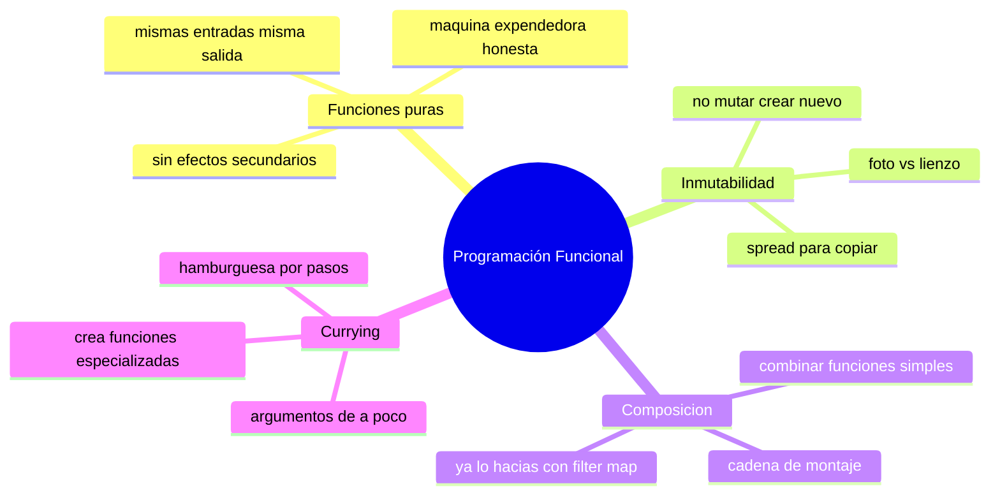

# 🧩 Módulo 23 — Programación Funcional

> 💡 **Antes de empezar:** En el Módulo 21 viste la POO, una forma de organizar el código con objetos. Hoy conoces _otra_ gran filosofía: la programación funcional (PF). En vez de objetos que guardan estado, la PF se centra en _funciones_ que transforman datos de forma limpia y predecible. No es mejor ni peor que la POO: es otra lente para ver el mismo problema. Es como aprender que un plato se puede cocinar al horno _o_ a la sartén; ambas sirven, y saber las dos te hace mejor cocinero. 🍳

---

## 🎯 ¿Qué aprenderás en este módulo?

Al terminar serás capaz de:

- Escribir funciones puras: predecibles y sin efectos sorpresa.
- Entender la inmutabilidad: no modificar datos, sino crear nuevos.
- Combinar funciones simples en otras más potentes (composición).
- Conocer el currying: transformar funciones para mayor flexibilidad.

> 🌱 **Nota:** La PF es una _forma de pensar_, no un conjunto de comandos nuevos. De hecho, ¡ya la has estado usando! `map`, `filter` y `reduce` (Módulo 7) son herramientas funcionales. Hoy le ponemos nombre y profundidad a algo que ya practicas.

---

## 🧮 ¿Qué es la programación funcional?

La **programación funcional** es un estilo donde construyes programas _combinando funciones_ que toman datos y devuelven datos nuevos, evitando cambiar cosas "por fuera". El ideal es que el código sea predecible: las mismas entradas siempre dan las mismas salidas.

### 🏭 La metáfora de la línea de producción

Imagina una fábrica con estaciones de trabajo en línea. En cada estación entra un producto, se le hace _una_ transformación, y sale para la siguiente estación. Cada estación es independiente, hace su tarea sin afectar a las demás. La PF ve el código así: datos que fluyen a través de funciones-estación, transformándose paso a paso.


> 🧠 **Idea clave:** En la PF, las funciones son como máquinas confiables: les das algo, te devuelven un resultado, y _no_ tocan nada más a su alrededor. Esa confiabilidad hace el código fácil de entender y de probar.

---

## 1. Funciones puras: las más confiables

Una **función pura** cumple dos reglas: (1) con las mismas entradas, siempre devuelve la misma salida; y (2) no causa "efectos secundarios" (no modifica nada fuera de sí misma).

### 🎰 La metáfora de la máquina expendedora honesta

Una función pura es como una máquina expendedora perfecta: metes la misma moneda y eliges el mismo botón (entrada), y _siempre_ sale el mismo producto (salida). No depende del clima, ni de la hora, ni cambia nada más en el mundo. Predecible y honesta.

```javascript
// ✅ PURA: mismas entradas → misma salida, no toca nada externo
function sumar(a, b) {
  return a + b;
}
sumar(2, 3);  // siempre 5, sin importar nada más

// ❌ IMPURA: depende de algo externo y/o lo modifica
let total = 0;
function sumarAlTotal(n) {
  total += n;  // modifica una variable de afuera (efecto secundario)
  return total;  // el resultado depende del estado externo
}
```

> 🔍 **Por qué la pureza es valiosa:**
> 
> - **Predecible:** sabes exactamente qué hará, siempre.
> - **Fácil de probar:** no necesitas preparar un "entorno", solo le das entradas y compruebas salidas.
> - **Sin sorpresas:** no rompe cosas en otros lugares del programa.

> ⚠️ **¿Y los "efectos secundarios"?** Son cosas que una función hace _además_ de devolver un valor: modificar una variable externa, escribir en pantalla, guardar en storage. No son malos —de hecho, son necesarios— pero la PF busca _aislarlos_ y mantener la mayor parte del código puro y predecible.

---

## 2. Inmutabilidad: no cambies, crea nuevo

La **inmutabilidad** es la práctica de _no modificar_ los datos existentes, sino crear _copias nuevas_ con los cambios. En lugar de "editar", "duplicas y ajustas".

### 📸 La metáfora de la foto vs el lienzo

Modificar datos directamente es como pintar encima de una foto: pierdes el original para siempre. La inmutabilidad es como hacer una _copia_ de la foto y pintar sobre ella: conservas el original intacto y tienes la versión nueva. Si algo sale mal, siempre puedes volver al original.

```javascript
// ❌ MUTAR: cambia el array original (puede causar bugs sorpresa)
const numeros = [1, 2, 3];
numeros.push(4);  // el original cambió

// ✅ INMUTABLE: crea un array nuevo, deja el original intacto
const numeros = [1, 2, 3];
const nuevos = [...numeros, 4];  // spread (Módulo 4): copia + agrega
console.log(numeros);  // [1, 2, 3] (intacto)
console.log(nuevos);   // [1, 2, 3, 4] (nuevo)
```

Lo mismo con objetos:

```javascript
const persona = { nombre: "Ana", edad: 25 };

// ✅ Crear copia con un cambio, sin tocar el original
const mayor = { ...persona, edad: 26 };
console.log(persona);  // { nombre: "Ana", edad: 25 } (intacto)
console.log(mayor);    // { nombre: "Ana", edad: 26 } (nuevo)
```

> 💡 **Conexión con el Módulo 7:** ¿Recuerdas que `map` y `filter` _no_ modificaban el array original, sino que devolvían uno nuevo? ¡Eso es inmutabilidad! Ya la usabas. En cambio, `push` y `splice` _sí_ mutan. La PF prefiere los primeros.

> 🛡️ **Por qué importa:** Cuando los datos no cambian "a tus espaldas", desaparece toda una categoría de bugs misteriosos. Es especialmente importante en apps grandes y es la base de cómo funcionan herramientas como React.

---

## 3. Composición: combinar funciones simples

La **composición** consiste en construir funciones complejas _combinando_ funciones simples, donde la salida de una se convierte en la entrada de la siguiente.

### 🧱 La metáfora de la cadena de montaje

Si tienes una función que "duplica" y otra que "suma 1", puedes _encadenarlas_: primero duplica, luego suma 1. Cada función hace una cosa pequeña y bien; juntas logran algo mayor. Es como conectar tuberías: el agua fluye de una a la siguiente.

```javascript
// Funciones pequeñas, cada una hace UNA cosa
const duplicar = (x) => x * 2;
const sumarUno = (x) => x + 1;

// Composición manual: la salida de una entra en la otra
const resultado = sumarUno(duplicar(5));  // duplica 5→10, luego +1 →11
console.log(resultado);  // 11
```


Puedes incluso crear una función que _componga_ automáticamente:

```javascript
// "compose" aplica las funciones de derecha a izquierda
const componer = (f, g) => (x) => f(g(x));

const duplicarYSumar = componer(sumarUno, duplicar);
console.log(duplicarYSumar(5));  // 11 (mismo resultado, más reutilizable)
```

> 🔗 **Ya lo hacías:** Cuando encadenaste `.filter().map()` en el Módulo 7, ¡estabas componiendo! La salida del filter entraba al map. La composición es, en esencia, "armar tuberías de transformación".

> 🎯 **La filosofía:** En vez de una función gigante que hace de todo, creas muchas funciones pequeñas que hacen _una_ cosa, y las combinas. Más fáciles de entender, probar y reutilizar.

---

## 4. Currying: funciones que piden ingredientes de a poco

El **currying** transforma una función que toma varios argumentos en una secuencia de funciones que toman _uno a la vez_. Suena raro, pero tiene usos muy prácticos.

### 🍔 La metáfora de armar la hamburguesa por pasos

En vez de pedir "una hamburguesa con queso, lechuga y tomate" todo de golpe, el currying es como un proceso por pasos: primero eliges el pan, _luego_ el queso, _luego_ la lechuga. Cada paso devuelve "la hamburguesa en construcción", lista para el siguiente ingrediente.

```javascript
// Función normal: pide todo de una vez
function multiplicar(a, b) {
  return a * b;
}

// Versión "curried": pide un argumento, devuelve función que pide el otro
function multiplicarCurried(a) {
  return function (b) {
    return a * b;
  };
}

// Uso
console.log(multiplicarCurried(3)(4));  // 12

// Lo útil: crear funciones especializadas reutilizables
const triplicar = multiplicarCurried(3);  // "fijamos" el 3
console.log(triplicar(5));   // 15
console.log(triplicar(10));  // 30
```

> 🔍 **La gran ventaja:** El currying te deja crear funciones _especializadas_ a partir de generales. `triplicar` es `multiplicar` con el primer número ya fijado. Es como tener un molde al que le pre-configuras una parte. ¿Te recuerda al `bind` del Módulo 20? ¡Son ideas parientes!

> 😌 **Si el currying se siente abstracto, es normal.** Es de los conceptos más "raros" al principio. No te preocupes por dominarlo ya; basta con reconocerlo cuando lo veas. Su utilidad se aprecia plenamente con la experiencia.

---

## 🎭 POO vs Funcional: ¿cuál uso?

Después de ver ambas filosofías (Módulo 21 y este), surge la pregunta natural. La respuesta tranquilizadora:

||POO (Módulo 21)|Funcional (este módulo)|
|---|---|---|
|**Organiza con**|Objetos que agrupan datos y acciones|Funciones que transforman datos|
|**El estado**|Vive dentro de los objetos|Se evita mutar; se crean copias|
|**Metáfora**|Moldes de galletas|Línea de producción|
|**Brilla en**|Modelar "cosas" (usuario, producto)|Transformar y procesar datos|

> 🧠 **La verdad liberadora:** _No tienes que elegir una sola._ El JavaScript moderno mezcla ambas todo el tiempo. Usas clases para modelar entidades _y_ funciones puras para transformar datos. Los mejores programadores toman lo mejor de cada estilo según el problema. No hay bando correcto; hay herramientas para cada situación.

---

## 🛠️ Mini práctica: ¡tu turno!

Estos ejercicios funcionan en la consola. 🧪

### Ejercicio 1 — Identifica funciones puras

¿Cuáles de estas son puras? Piénsalo antes de seguir:

```javascript
// A
const cuadrado = (x) => x * x;

// B
let contador = 0;
const incrementar = () => ++contador;

// C
const mayusculas = (texto) => texto.toUpperCase();
```

> 💡 **Respuesta:** A y C son puras (mismas entradas → mismas salidas, sin efectos externos). B es impura (depende y modifica `contador` externo).

### Ejercicio 2 — Practica la inmutabilidad

```javascript
const frutas = ["manzana", "banana"];

// Agrega "pera" SIN modificar el original (usa spread)
const masFrutas = [...frutas, "pera"];

console.log(frutas);     // ["manzana", "banana"] (intacto)
console.log(masFrutas);  // ["manzana", "banana", "pera"]
```

> 🎯 **Reto:** Dado `const usuario = { nombre: "Ana", activo: false }`, crea una copia `activado` que tenga `activo: true` sin modificar el original.

### Ejercicio 3 — Compón funciones

```javascript
const quitarEspacios = (texto) => texto.trim();
const aMayusculas = (texto) => texto.toUpperCase();

// Combínalas: primero quita espacios, luego pasa a mayúsculas
const limpiarYFormatear = (texto) => aMayusculas(quitarEspacios(texto));

console.log(limpiarYFormatear("  hola mundo  "));  // "HOLA MUNDO"
```

> 🔍 **Observa:** Dos funciones simples se combinan en una más útil. ¡Eso es composición!

---

## 🧭 Resumen visual del módulo



---

## ✅ Checklist: ¿lo lograste?

- [ ] Sé qué hace pura a una función (predecible, sin efectos externos).
- [ ] Entiendo la inmutabilidad: crear copias en vez de modificar.
- [ ] Uso el spread (`...`) para copiar arrays y objetos con cambios.
- [ ] Combino funciones simples mediante composición.
- [ ] Reconozco el currying y su utilidad para especializar funciones.
- [ ] Entiendo que POO y PF se complementan, no compiten.

Si marcaste la mayoría, **conoces las dos grandes filosofías de la programación**. 💪

---

## 🌱 Reflexión final

Hoy completaste una pareja poderosa: en el Módulo 21 viste la POO, y ahora la programación funcional. Tener ambas en tu mente te da algo valioso: _flexibilidad de pensamiento_. Ante un problema, puedes preguntarte "¿lo modelo como objetos o lo proceso como transformaciones de datos?". Esa capacidad de elegir el enfoque es una marca de madurez como programador.

Lo más bonito de este módulo es que, en gran parte, _ya practicabas programación funcional sin saberlo_. Cada `map`, cada `filter`, cada vez que usaste el spread para copiar en lugar de mutar... eso es PF. Hoy solo le pusiste nombre, contexto y profundidad. Pasar de "lo hago intuitivamente" a "sé por qué lo hago y cómo se llama" es exactamente cómo se construye la experticia.

Y si conceptos como el currying o la composición todavía se sienten abstractos, está perfecto. Son ideas que florecen con la práctica y que apreciarás más a medida que tus proyectos crezcan. Por ahora, queda con lo esencial y profundamente útil: _escribe funciones predecibles y evita mutar tus datos_. Con solo esos dos hábitos, tu código será notablemente más limpio y con menos bugs.

> 🎯 **El secreto sigue siendo el mismo:** un pasito a la vez. Hoy sumaste una filosofía entera de programación a tu forma de pensar. No tienes que volverte un purista funcional; basta con tomar sus mejores ideas y combinarlas con todo lo demás que ya sabes.

**¡Nos vemos en el Módulo 24!**