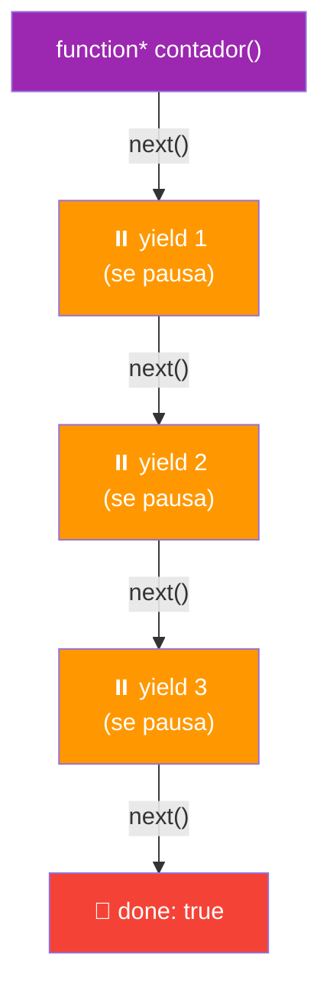
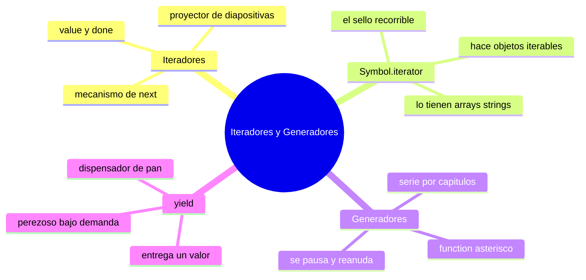

# 🧩 Módulo 24 — Iteradores y Generadores

> 💡 **Antes de empezar:** ¿Te has preguntado cómo hace un bucle `for...of` para recorrer un array elemento por elemento? Hay un mecanismo invisible que lo hace posible: los iteradores. Y hoy también conocerás los generadores, funciones especiales que pueden _pausarse_ y _reanudarse_, algo que parece imposible pero abre posibilidades fascinantes. Es como descubrir el motor que mueve los bucles, y aprender a fabricar tu propio "dispensador" de valores bajo demanda. ⚙️

---

## 🎯 ¿Qué aprenderás en este módulo?

Al terminar serás capaz de:

- Entender qué es un iterador y cómo permite recorrer datos.
- Conocer `Symbol.iterator`, la "regla secreta" de los objetos recorribles.
- Crear generadores: funciones que se pausan y reanudan.
- Usar `yield` para producir valores uno a uno, bajo demanda.

> 🌱 **Nota:** Este es un módulo _avanzado y especializado_. No lo necesitarás a diario, pero entenderlo revela cómo funciona JavaScript por dentro y te da herramientas elegantes para casos concretos. Léelo con curiosidad más que con presión.

---

## 🔄 El concepto base: recorrer paso a paso

Cuando usas `for...of` sobre un array, recorres sus elementos uno por uno. Pero, ¿cómo _sabe_ JavaScript cuál es el siguiente elemento y cuándo parar? La respuesta es un protocolo invisible: los **iteradores**.

### 🎞️ La metáfora del proyector de diapositivas

Imagina un proyector de diapositivas con un botón de "siguiente". Cada vez que lo pulsas, avanza una diapositiva y te dice cuál es. Cuando ya no quedan, te avisa "se acabó". Un iterador es justo eso: un mecanismo que, cada vez que le pides "el siguiente", te entrega un valor y te dice si quedan más.


> 🧠 **Idea clave:** Recorrer no es magia. Hay un "botón de siguiente" (`next()`) trabajando por debajo, entregando un valor a la vez y avisando cuándo terminó. Eso es un iterador.

---

## 1. Iteradores: el mecanismo de "siguiente"

Un **iterador** es un objeto con un método `next()` que, cada vez que se llama, devuelve el siguiente valor junto con un aviso de si la secuencia terminó.

Cada llamada a `next()` devuelve un objeto con dos cosas:

- `value`: el valor actual.
- `done`: `true` si ya no quedan más, `false` si todavía hay.

```javascript
// Un array tiene un iterador interno; lo pedimos así:
const array = ["a", "b", "c"];
const iterador = array[Symbol.iterator]();

console.log(iterador.next());  // { value: "a", done: false }
console.log(iterador.next());  // { value: "b", done: false }
console.log(iterador.next());  // { value: "c", done: false }
console.log(iterador.next());  // { value: undefined, done: true } ← se acabó
```

> 🔍 **Lo que pasa por debajo:** Cuando escribes `for...of`, JavaScript llama a `next()` repetidamente por ti, tomando cada `value`, hasta que `done` sea `true`. ¡Tú solo ves el resultado limpio, pero esto es lo que ocurre tras bambalinas!

---

## 2. Symbol.iterator: la regla para ser "recorrible"

`Symbol.iterator` es una "clave especial" que indica si un objeto se puede recorrer con `for...of`. Los arrays, strings, Maps y Sets ya la tienen incorporada. Pero también puedes _dársela a tus propios objetos_ para hacerlos recorribles.

### 🎫 La metáfora del sello "recorrible"

Imagina que para entrar a la fila del `for...of`, un objeto necesita un sello especial: `Symbol.iterator`. Los arrays y strings nacen con ese sello. Si quieres que tu propio objeto pueda recorrerse, le pones tú el sello, explicando cómo entregar sus valores uno a uno.

```javascript
// Un objeto normal NO es recorrible con for...of por defecto
const rango = {
  desde: 1,
  hasta: 3,

  // Le damos el "sello" Symbol.iterator
  [Symbol.iterator]() {
    let actual = this.desde;
    const fin = this.hasta;
    return {
      next() {
        if (actual <= fin) {
          return { value: actual++, done: false };
        }
        return { value: undefined, done: true };
      }
    };
  }
};

// ¡Ahora SÍ se puede recorrer!
for (const numero of rango) {
  console.log(numero);  // 1, 2, 3
}
```

> 💡 **Lo poderoso:** Acabas de crear un objeto personalizado que se comporta como recorrible, igual que un array. Esto te deja definir _exactamente_ cómo se recorren tus propias estructuras de datos. Es un poder avanzado, pero muestra hasta dónde llega tu control.

> 😌 **Si esto se ve complejo, tranquilo:** Escribir `Symbol.iterator` a mano es raro en el día a día. Lo importante es _entender que existe_ este mecanismo. Y por suerte, los generadores (que vienen ahora) hacen todo esto ¡muchísimo más fácil!

---

## 3. Generadores: funciones que se pausan

Un **generador** es un tipo especial de función que puede _pausarse_ a mitad de ejecución y _reanudarse_ después, justo donde lo dejó. Esto es algo que las funciones normales no pueden hacer, y abre posibilidades muy elegantes.

### ⏸️ La metáfora de la serie por capítulos

Una función normal es como una película: empieza, corre de principio a fin, y termina. Un generador es como una _serie por capítulos_: ves un episodio (un valor), se pausa, y cuando quieres, retomas en el siguiente episodio exactamente donde quedó. No tienes que ver todo de golpe.

Los generadores se escriben con un asterisco `function*` y usan la palabra `yield`:

```javascript
function* contador() {
  console.log("Inicio");
  yield 1;   // pausa aquí, entrega 1
  console.log("Reanudado");
  yield 2;   // pausa aquí, entrega 2
  yield 3;   // pausa aquí, entrega 3
  console.log("Fin");
}

const gen = contador();
console.log(gen.next());  // "Inicio" → { value: 1, done: false }
console.log(gen.next());  // "Reanudado" → { value: 2, done: false }
console.log(gen.next());  // { value: 3, done: false }
console.log(gen.next());  // "Fin" → { value: undefined, done: true }
```



> 🤯 **Lo asombroso:** La función _se detiene_ en cada `yield` y _recuerda_ dónde estaba. Cuando llamas `next()` otra vez, continúa desde ese punto exacto, con todas sus variables intactas. ¡Una función con "pausa" y "memoria"!

---

## 4. yield: producir valores uno a uno

La palabra **`yield`** (que significa "entregar/ceder") es el corazón del generador. Cada `yield` _entrega_ un valor y _pausa_ la función ahí mismo hasta el próximo `next()`.

### 🍞 La metáfora del dispensador de pan caliente

Un generador con `yield` es como un dispensador de pan que hornea _uno a la vez, bajo demanda_. No hornea 1000 panes de golpe (gastando energía y espacio); hornea uno cuando lo pides, y se queda listo para hornear el siguiente cuando vuelvas. Eficiente y a tu ritmo.

```javascript
// Generador que produce valores infinitos... ¡sin colapsar!
function* numerosInfinitos() {
  let n = 1;
  while (true) {     // bucle infinito, pero NO se cuelga
    yield n;         // entrega uno y se pausa
    n++;
  }
}

const gen = numerosInfinitos();
console.log(gen.next().value);  // 1
console.log(gen.next().value);  // 2
console.log(gen.next().value);  // 3
// Solo produce cuando lo pides; nunca intenta crear "todos" de golpe
```

> 🎯 **La gran ventaja — "perezoso" (lazy):** Un generador produce valores _solo cuando se los pides_. Esto permite secuencias gigantes o incluso "infinitas" sin agotar la memoria, porque nunca calcula todo de una vez. Es una idea preciosa: trabajo bajo demanda.

> 🔗 **Bonus:** Los generadores _ya tienen_ `Symbol.iterator` incorporado, así que puedes recorrerlos con `for...of` directamente (¡siempre que no sean infinitos!). Por eso decíamos que hacen todo más fácil que escribir iteradores a mano.

```javascript
function* colores() {
  yield "rojo";
  yield "verde";
  yield "azul";
}

for (const color of colores()) {
  console.log(color);  // rojo, verde, azul
}
```

---

## 🛠️ Mini práctica: ¡tu turno!

Estos ejercicios funcionan en la consola. 🧪

### Ejercicio 1 — Explora un iterador

```javascript
const texto = "abc";
const iter = texto[Symbol.iterator]();  // ¡los strings también son iterables!

console.log(iter.next());  // { value: "a", done: false }
console.log(iter.next());  // ¿qué devuelve?
console.log(iter.next());  // ¿y ahora?
console.log(iter.next());  // ¿qué pasa al acabarse?
```

### Ejercicio 2 — Tu primer generador

```javascript
function* saludos() {
  yield "Hola";
  yield "Hola de nuevo";
  yield "Última vez";
}

const gen = saludos();
console.log(gen.next().value);  // ¿qué imprime?
console.log(gen.next().value);
console.log(gen.next().value);
```

> 🔍 **Observa cómo se pausa:** Cada `next()` avanza un solo `yield`. La función "espera" entre llamadas.

### Ejercicio 3 — Generador con for...of

```javascript
function* tablaDel(n) {
  for (let i = 1; i <= 5; i++) {
    yield n * i;
  }
}

// Como tiene Symbol.iterator incorporado, se recorre directo:
for (const resultado of tablaDel(3)) {
  console.log(resultado);  // 3, 6, 9, 12, 15
}
```

> 🎯 **Reto:** Crea un generador `pares()` que entregue 2, 4, 6, 8... y úsalo para imprimir los primeros 5 pares con `next()`.

---

## 🧭 Resumen visual del módulo



---

## ✅ Checklist: ¿lo lograste?

- [ ] Entiendo que un iterador usa `next()` para recorrer paso a paso.
- [ ] Sé que `next()` devuelve `{ value, done }`.
- [ ] Comprendo que `Symbol.iterator` hace recorrible a un objeto.
- [ ] Creo generadores con `function*`.
- [ ] Uso `yield` para entregar valores y pausar la función.
- [ ] Entiendo la idea "perezosa": producir valores solo bajo demanda.

Si marcaste la mayoría, **entiendes el motor que mueve los bucles de JavaScript**. 💪

---

## 🌱 Reflexión final

Este módulo te llevó "bajo el capó" otra vez. Descubriste que el humilde `for...of` que usas sin pensar esconde un mecanismo elegante —los iteradores— y conociste los generadores, esas funciones casi mágicas que pueden pausarse y reanudarse. Son conceptos avanzados, y el solo hecho de explorarlos amplía tu comprensión del lenguaje.

Seré honesto sobre su utilidad práctica: en el desarrollo web cotidiano, _no_ escribirás generadores ni `Symbol.iterator` a menudo. Son herramientas especializadas que brillan en casos concretos: secuencias infinitas o muy grandes, procesamiento de datos bajo demanda, y ciertos patrones avanzados. Lo valioso de hoy no es que los uses mañana, sino que ahora _entiendes cómo funciona la iteración_ en JavaScript, lo cual te hace un programador más completo y consciente.

Si los generadores te parecieron raros o difíciles de imaginar, estás en buena compañía: la idea de una función que "se pausa" desafía la intuición al principio. No te exijas dominarla. Quédate con la imagen del dispensador de pan que produce uno a la vez bajo demanda; esa intuición es lo esencial, y el resto se afianza si algún día los necesitas de verdad.

> 🎯 **El secreto sigue siendo el mismo:** un pasito a la vez. Hoy exploraste un rincón avanzado y elegante de JavaScript. No tienes que usarlo a diario; basta con saber que existe y comprender la idea. Tu mapa mental del lenguaje es ahora más rico y completo.

**¡Nos vemos en el Módulo 25!**