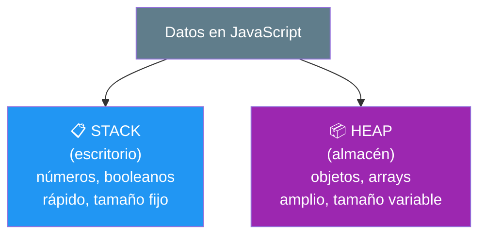
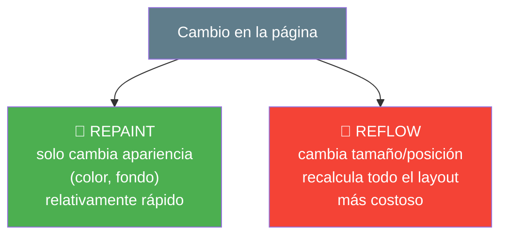
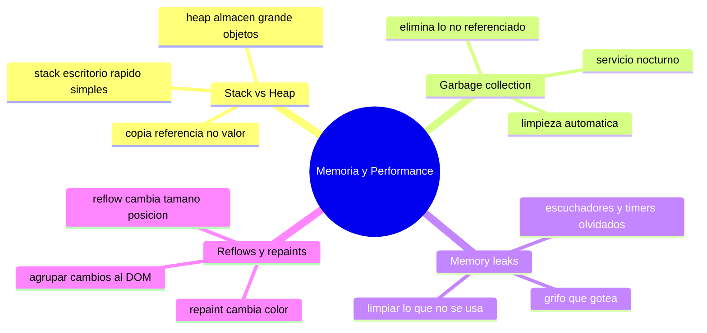

# 🧩 Módulo 25 — Memoria y Performance

> 💡 **Antes de empezar:** Hasta ahora te preocupaste de que tu código _funcione_. Hoy subimos un nivel: que funcione _bien_. Aprenderás cómo JavaScript guarda los datos en memoria, cómo se "limpia" sola, qué son las fugas de memoria, y por qué algunas páginas se sienten lentas o "trabadas". Entender esto te convierte en un programador que no solo hace cosas, sino que las hace _eficientes_. Es como pasar de saber conducir a entender por qué un coche gasta más o menos gasolina. 🚗⛽

---

## 🎯 ¿Qué aprenderás en este módulo?

Al terminar serás capaz de:

- Entender dónde y cómo se guardan los datos (stack vs heap).
- Comprender cómo JavaScript libera memoria automáticamente (garbage collection).
- Reconocer y evitar las "fugas de memoria" (memory leaks).
- Saber qué son reflows y repaints, y por qué afectan la fluidez visual.

> 🌱 **Nota:** Este módulo es _conceptual_ y orientado a la calidad. No necesitas optimizar todo desde el día uno (de hecho, optimizar demasiado pronto es un error común). Pero conocer estos fundamentos te ayudará a escribir código más sano y a diagnosticar problemas cuando aparezcan.

---

## 🧠 ¿Por qué importa la memoria?

Todo programa usa **memoria**: un espacio donde guarda los datos mientras trabaja. La memoria es limitada, así que usarla bien hace que tus apps sean rápidas y fluidas; usarla mal las vuelve lentas o las hace fallar.

### 🏢 La metáfora del espacio de oficina

Piensa en la memoria como el espacio de una oficina. Si organizas bien los escritorios y archivos, todos trabajan ágilmente. Si dejas cajas acumuladas que nadie usa, el espacio se llena, la gente tropieza, y al final no cabe nadie. Gestionar la memoria es mantener esa oficina ordenada.

---

## 1. Stack vs Heap: dos formas de guardar datos

JavaScript guarda los datos en dos lugares distintos según su tipo: el **stack** (pila) y el **heap** (montículo). Cada uno tiene su propósito.

### 🗂️ La metáfora del escritorio y el almacén

- El **stack** es como tu _escritorio_: pequeño, ordenado y rapidísimo de acceder. Ahí pones cosas simples y de tamaño fijo (un número, un booleano).
- El **heap** es como un _almacén grande_ detrás: ahí guardas cosas grandes o de tamaño variable (objetos, arrays). Es más amplio pero un poco más lento de acceder.

```javascript
// Valores simples → van al STACK (rápido, tamaño fijo)
let edad = 25;
let activo = true;

// Valores complejos → van al HEAP (objetos y arrays)
let persona = { nombre: "Ana", hobbies: ["leer", "correr"] };
```



> 🧠 **Idea clave:** Los valores simples (number, boolean, string) viven en el stack. Los complejos (objetos, arrays) viven en el heap, y en el stack queda solo una "referencia" (como una dirección que apunta al almacén). No necesitas memorizar esto, pero explica algunos comportamientos de JavaScript.

> 💡 **Por qué esto explica cosas:** ¿Recuerdas que copiar un objeto a veces "comparte" datos inesperadamente? Es porque se copia la _referencia_ (la dirección del almacén), no el objeto entero. Por eso la inmutabilidad del Módulo 23 (crear copias nuevas) es tan útil.

---

## 2. Garbage Collection: la limpieza automática

La buena noticia: en JavaScript _no_ tienes que liberar memoria manualmente. Un sistema llamado **garbage collector** (recolector de basura) se encarga de detectar y eliminar los datos que ya no se usan.

### 🗑️ La metáfora del servicio de limpieza nocturno

Imagina que cada noche viene un equipo de limpieza a tu oficina y se lleva todo lo que ya nadie necesita: papeles tirados, cajas vacías, lo que no tiene dueño. El garbage collector es ese equipo: revisa qué datos ya no están "conectados" a nada útil y los elimina para liberar espacio.

```javascript
let usuario = { nombre: "Ana" };

usuario = null;  // ya nada apunta al objeto { nombre: "Ana" }
// El garbage collector eventualmente lo eliminará de memoria automáticamente
```


> 🧠 **Idea clave:** Si un dato ya no es accesible desde ninguna parte de tu código (nadie lo "referencia"), el garbage collector lo considera basura y libera su espacio. Tú no controlas _cuándo_ exactamente lo hace, pero ocurre automáticamente.

> 🔗 **Conexión:** ¿Recuerdas WeakMap y WeakSet del Módulo 22, esos "globos con hilo flojo"? Existen precisamente para _ayudar_ al garbage collector, permitiéndole limpiar datos asociados cuando ya no se usan. Ahora cobra más sentido, ¿verdad?

---

## 3. Memory Leaks: cuando la basura no se limpia

Un **memory leak** (fuga de memoria) ocurre cuando datos que ya _deberían_ eliminarse siguen "conectados" a algo, así que el garbage collector no puede limpiarlos. Se acumulan, la memoria se llena, y la app se vuelve lenta o se cuelga.

### 🚰 La metáfora del grifo que gotea

Una fuga de memoria es como un grifo que gotea sin parar: cada gota es poca cosa, pero con el tiempo el balde se desborda. Los datos "olvidados" se acumulan poco a poco hasta saturar la memoria.

**Causas comunes de fugas (y cómo evitarlas):**

```javascript
// ⚠️ Causa común: escuchadores de eventos que nunca se quitan
const boton = document.querySelector("#boton");
boton.addEventListener("click", manejar);
// Si el botón se elimina del DOM pero el escuchador sigue, puede fugar

// ✅ Buena práctica: quitar el escuchador cuando ya no se necesita
boton.removeEventListener("click", manejar);
```

> ⚠️ **Las causas típicas de leaks:**
> 
> - Escuchadores de eventos que no se eliminan cuando ya no sirven.
> - Temporizadores (`setInterval`) que nunca se detienen con `clearInterval`.
> - Referencias guardadas en variables globales que nunca se limpian.

> 😌 **No te obsesiones (pero tenlo presente):** En apps pequeñas, los memory leaks rara vez son un problema notable. Se vuelven importantes en apps grandes y de larga duración. Por ahora, basta con conocer las causas comunes y adoptar el hábito de "limpiar lo que ya no usas" (quitar escuchadores, detener temporizadores).

---

## 4. Reflows y Repaints: la fluidez visual

Ahora pasamos del "qué pasa en memoria" al "qué pasa en pantalla". Cuando JavaScript modifica el DOM, el navegador tiene que _redibujar_ la página. Hacerlo demasiado o mal causa esa sensación de "trabado" o lento.

### 🎨 La metáfora del pintor de un mural

Imagina un pintor trabajando en un mural. Hay dos tipos de cambios:

- **Repaint (repintado):** cambiar solo el _color_ de algo. El pintor retoca, pero no mueve nada de lugar. Rápido.
- **Reflow (reajuste):** cambiar el _tamaño o posición_ de algo. Ahora el pintor debe _recalcular_ cómo se acomoda todo lo demás alrededor. Mucho más costoso.



> 🧠 **Idea clave:** Un _repaint_ es cambiar cómo se ve algo (su color). Un _reflow_ es cambiar cómo se _acomoda_ (su tamaño o posición), y obliga al navegador a recalcular la disposición de la página, lo cual es más pesado. Demasiados reflows seguidos causan lentitud visible.

**Buena práctica para minimizar reflows:**

```javascript
// ❌ Costoso: 1000 cambios al DOM, cada uno puede causar un reflow
for (let i = 0; i < 1000; i++) {
  lista.innerHTML += `<li>Item ${i}</li>`;  // toca el DOM en cada vuelta
}

// ✅ Mejor: construir todo en memoria y tocar el DOM UNA vez
let html = "";
for (let i = 0; i < 1000; i++) {
  html += `<li>Item ${i}</li>`;  // solo arma texto, no toca el DOM
}
lista.innerHTML = html;  // un solo cambio al DOM
```

> 🎯 **La lección práctica:** Tocar el DOM es "caro". En vez de modificarlo muchas veces seguidas, _agrupa_ los cambios y aplícalos de una sola vez. Esto reduce reflows/repaints y mantiene la app fluida. ¡Es justo lo que hace el patrón "render" del Módulo 8 cuando construye todo el HTML y lo asigna una vez!

---

## 🛠️ Mini práctica: ¡tu turno!

Estos ejercicios son más de _observar y reflexionar_ que de escribir mucho código. 🧪

### Ejercicio 1 — Stack vs Heap (predice)

```javascript
let a = 10;
let b = a;    // copia el VALOR (stack)
b = 20;
console.log(a);  // ¿10 o 20?

let obj1 = { x: 1 };
let obj2 = obj1;  // copia la REFERENCIA (heap)
obj2.x = 99;
console.log(obj1.x);  // ¿1 o 99?
```

> 💡 **Predice y reflexiona:** El primer caso copia un valor simple (stack), así que son independientes. El segundo copia una referencia (heap), ¡así que ambos apuntan al mismo objeto! Por eso `obj1.x` también cambia.

### Ejercicio 2 — Evita un memory leak

```javascript
// Este intervalo corre para siempre si no lo detenemos
const id = setInterval(() => {
  console.log("tic");
}, 1000);

// Buena práctica: detenerlo cuando ya no se necesita
clearInterval(id);  // ¡importante para no fugar!
```

> 🔍 **Observa:** `setInterval` sigue corriendo aunque ya no lo necesites. Guardar su `id` y usar `clearInterval` es el hábito que evita esta fuga.

### Ejercicio 3 — Compara el rendimiento del DOM

```html
<!DOCTYPE html>
<html>
<body>
  <ul id="lista"></ul>
  <script>
    const lista = document.querySelector("#lista");
    // Forma eficiente: construir el texto y asignar UNA vez
    let html = "";
    for (let i = 1; i <= 500; i++) {
      html += `<li>Elemento ${i}</li>`;
    }
    lista.innerHTML = html;  // un solo "toque" al DOM
  </script>
</body>
</html>
```

> 🎯 **Reto mental:** ¿Por qué esto es más rápido que poner `lista.innerHTML += ...` dentro del bucle? (Pista: número de veces que tocamos el DOM y reflows).

---

## 🧭 Resumen visual del módulo



---

## ✅ Checklist: ¿lo lograste?

- [ ] Sé que los datos simples van al stack y los complejos al heap.
- [ ] Entiendo que copiar objetos copia la referencia, no el valor.
- [ ] Comprendo que el garbage collector limpia datos no usados solo.
- [ ] Reconozco las causas comunes de memory leaks y cómo evitarlas.
- [ ] Distingo un repaint (color) de un reflow (tamaño/posición).
- [ ] Sé agrupar cambios al DOM para mantener la app fluida.

Si marcaste la mayoría, **ya piensas en la eficiencia, no solo en que funcione**. 💪

---

## 🌱 Reflexión final

Este módulo marcó un cambio de mentalidad: pasaste de "¿funciona?" a "¿funciona _bien_?". Entender la memoria y el rendimiento te da una conciencia nueva sobre el costo de las cosas: que copiar un objeto comparte referencias, que los datos olvidados se acumulan, que tocar el DOM tiene un precio. Esa conciencia es lo que separa al programador que hace cosas que _apenas_ funcionan del que hace cosas que funcionan _con elegancia_.

Pero quiero darte un consejo importante y muy repetido por los expertos: **no optimices antes de tiempo.** Es un error clásico obsesionarse con el rendimiento en proyectos pequeños donde no importa, complicando el código innecesariamente. La regla sabia es: primero haz que funcione y sea claro; optimiza _solo_ cuando detectes un problema real de lentitud. Estos conocimientos son tu "kit de diagnóstico" para _cuando_ lo necesites, no una checklist obligatoria para cada línea.

Y como siempre, no te abrumes. La gestión de memoria en JavaScript es en gran parte automática (gracias al garbage collector), y los problemas serios de rendimiento suelen aparecer solo en apps grandes. Quédate con los hábitos sanos: crea copias en vez de mutar, limpia escuchadores y temporizadores que ya no uses, y agrupa los cambios al DOM. Con eso ya escribes código notablemente más sano.

> 🎯 **El secreto sigue siendo el mismo:** un pasito a la vez. Hoy aprendiste a pensar en el _costo_ de tu código, no solo en su resultado. Esa mirada hacia la eficiencia es una señal clara de que estás madurando de aprendiz a profesional.

**¡Nos vemos en el Módulo 26!**