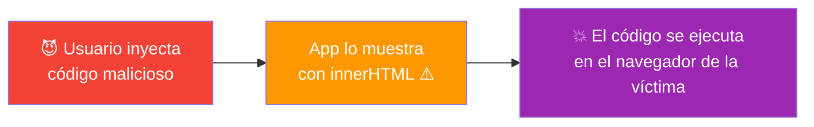
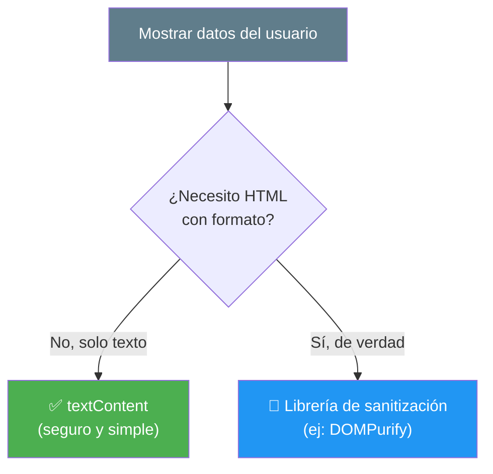
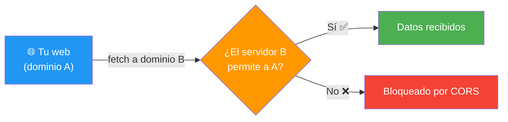
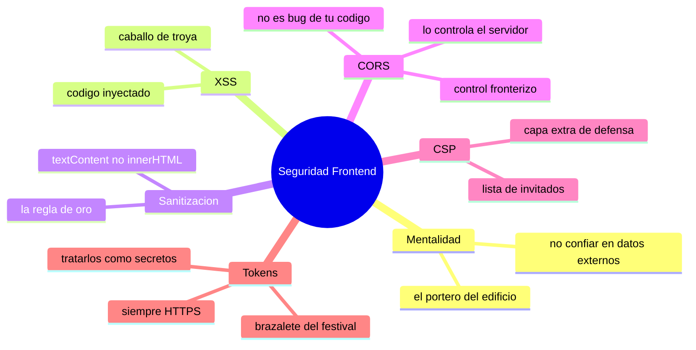

# 🧩 Módulo 26 — Seguridad Frontend

> 💡 **Antes de empezar:** Hasta ahora aprendiste a _construir_. Hoy aprendes a _proteger_ lo que construyes. La seguridad no es un tema opcional ni "para después": es parte de hacer las cosas bien desde el principio. La buena noticia es que con unos pocos conceptos y hábitos puedes evitar la gran mayoría de los problemas comunes. Es como aprender a cerrar bien las puertas y ventanas de la casa que acabas de construir. 🔒🏠

---

## 🎯 ¿Qué aprenderás en este módulo?

Al terminar serás capaz de:

- Entender el ataque más común del frontend: el XSS, y cómo prevenirlo.
- Limpiar datos del usuario de forma segura (sanitización).
- Comprender qué es CORS y por qué a veces "bloquea" peticiones.
- Conocer la CSP, una capa extra de protección del navegador.
- Manejar tokens de autenticación de forma responsable.

> 🌱 **Nota:** La seguridad es un campo enorme y en constante evolución. Este módulo te da los _fundamentos esenciales_ del frontend, no todo lo que existe. Lo importante es desarrollar una _mentalidad_ de seguridad: desconfiar de los datos externos y proteger a tus usuarios.

---

## 🛡️ La mentalidad de seguridad

Antes de la técnica, el cambio de mentalidad más importante: **nunca confíes ciegamente en datos que vienen de afuera** (de un usuario, de otra web, de una URL). Esa desconfianza sana es la base de toda la seguridad.

### 🚪 La metáfora del portero del edificio

Un buen portero no deja pasar a cualquiera solo porque dice ser quien dice. Verifica, controla, y ante la duda, no abre. Tu código debe ser ese portero con los datos que llegan: revisar, limpiar y validar _antes_ de confiar. La mayoría de los ataques aprovechan justamente la confianza ingenua.

---

## 1. XSS: el ataque más común del frontend

**XSS** (Cross-Site Scripting) es un ataque donde alguien malicioso logra _inyectar código_ en tu página, que luego se ejecuta en el navegador de otros usuarios. Es uno de los problemas de seguridad más frecuentes en la web.

### 🐴 La metáfora del caballo de Troya

El XSS es como el caballo de Troya: el atacante esconde código malicioso dentro de algo que _parece_ inofensivo (un comentario, un nombre de usuario). Si tu app lo muestra sin revisar, el "caballo" entra y libera su código dentro del navegador de la víctima, pudiendo robar datos o suplantar al usuario.

```javascript
// ⚠️ EL PELIGRO: mostrar texto del usuario con innerHTML
let comentario = entradaDelUsuario;  // ¿y si el usuario escribió código?
contenedor.innerHTML = comentario;   // si hay un <script>, ¡se ejecuta!
```

Si un usuario malicioso escribe algo como un `<script>` con código dañino en lugar de un comentario normal, y tu app lo inserta con `innerHTML`, ese código se ejecutaría en el navegador de quien vea el comentario.



> 🧠 **Idea clave:** El XSS ocurre cuando texto del usuario se trata como _código_ en lugar de como _texto_. La defensa principal es asegurarse de que el texto del usuario _siempre_ se trate como texto inofensivo.

---

## 2. Sanitización: la defensa contra XSS

**Sanitizar** es limpiar y neutralizar los datos del usuario para que no puedan hacer daño. Ya tocamos esto en el Módulo 15; aquí lo reforzamos como pilar de seguridad.

### 🧼 La metáfora del detector de metales

Sanitizar es como el detector de metales en la entrada de un evento: revisa lo que entra y neutraliza cualquier cosa peligrosa antes de dejarla pasar. No asume que la gente es buena; verifica.

### La regla de oro: `textContent` en lugar de `innerHTML`

```javascript
// ❌ PELIGROSO: interpreta el texto como HTML (puede ejecutar código)
contenedor.innerHTML = entradaDelUsuario;

// ✅ SEGURO: trata todo como texto plano, nunca como código
contenedor.textContent = entradaDelUsuario;
```

> 🛡️ **La regla más importante del módulo:** Cuando muestres datos que escribió un usuario, usa **`textContent`**, no `innerHTML`. Con `textContent`, aunque alguien escriba un `<script>`, aparecerá como texto visible e inofensivo en lugar de ejecutarse. Esta sola regla previene la mayoría de los XSS.

> 💡 **¿Y si NECESITO insertar HTML?** A veces de verdad necesitas `innerHTML` (por ejemplo, para mostrar contenido con formato). En esos casos, los proyectos profesionales usan librerías especializadas de sanitización (como DOMPurify) que limpian el HTML dejando solo lo seguro. Para empezar, la regla de `textContent` te cubre en la inmensa mayoría de casos.



---

## 3. CORS: el guardián entre dominios

**CORS** (Cross-Origin Resource Sharing) es un mecanismo de seguridad del navegador que controla si una web puede pedir datos a _otro dominio_ distinto al suyo. Es la causa #1 de un error confuso que _todos_ los principiantes encuentran al usar `fetch`.

### 🛂 La metáfora del control fronterizo

CORS es como el control fronterizo entre países (dominios). Por defecto, el navegador no deja que tu web (país A) tome recursos de otro servidor (país B) a menos que ese servidor diga explícitamente "sí, permito visitantes de A". Es una protección para que webs maliciosas no roben datos de otros sitios usando tu sesión.

```javascript
// Si haces fetch a otro dominio que NO permite tu origen,
// el navegador bloquea la respuesta con un error de CORS:
fetch("https://otro-dominio.com/datos")
  .then(res => res.json())
  .catch(err => console.log("Posible error de CORS"));
```

> ⚠️ **El error que TODOS ven alguna vez:** Al hacer `fetch` a una API, a veces aparece en consola algo como _"blocked by CORS policy"_. **No es un bug de tu código.** Significa que el servidor de destino no autoriza peticiones desde tu origen.

> 🔑 **Lo importante de entender:** CORS se controla en el _servidor_, no en tu frontend. Si controlas el servidor, configuras qué orígenes permites. Si usas una API de terceros, ellos deciden. Muchas APIs públicas (como la PokéAPI del Módulo 12) permiten CORS abiertamente, por eso funcionan sin problema. No puedes "desactivar" CORS desde el frontend (¡y menos mal, porque es una protección!).



---

## 4. CSP: una capa extra de defensa

**CSP** (Content Security Policy) es una regla que el sitio web le da al navegador para decirle _de dónde_ puede cargar recursos (scripts, imágenes, estilos) y de dónde no. Es como una lista blanca de fuentes confiables.

### 🎫 La metáfora de la lista de invitados del portero

Si el sitio es una fiesta, la CSP es la lista de invitados que le das al portero (el navegador): "solo deja entrar scripts de _estas_ fuentes confiables; rechaza todo lo demás". Así, aunque un atacante logre inyectar un script de una fuente externa, el navegador lo bloquea porque no está en la lista.

```html
<!-- Ejemplo de CSP: solo permite scripts del propio sitio -->
<meta http-equiv="Content-Security-Policy" content="script-src 'self'">
```

> 🛡️ **Por qué es valiosa:** La CSP es una "segunda línea de defensa". Aunque cometas un error y se cuele un intento de XSS, una buena CSP puede impedir que el código malicioso se ejecute, porque no proviene de una fuente autorizada. Es defensa en profundidad: varias capas de protección.

> 😌 **No te preocupes por configurarla ahora:** La CSP suele configurarse a nivel de servidor o en proyectos más maduros. Para empezar, basta con saber que _existe_ y que es una capa extra que complementa (no reemplaza) la sanitización. Tu primera defensa sigue siendo tratar bien los datos del usuario.

---

## 5. Seguridad con tokens: manejar la identidad

Cuando un usuario inicia sesión, el servidor suele darle un **token**: una especie de "pase" que demuestra quién es en cada petición siguiente, sin tener que escribir su contraseña una y otra vez.

### 🎟️ La metáfora del brazalete del festival

Un token es como el brazalete que te ponen al entrar a un festival. Pagaste y te identificaste _una vez_ en la entrada; después, el brazalete prueba que tienes derecho a estar ahí sin repetir el proceso. Pero ojo: si alguien te roba el brazalete, puede hacerse pasar por ti. Por eso hay que cuidarlo.

```javascript
// Tras iniciar sesión, el servidor devuelve un token
// que enviamos en las siguientes peticiones para identificarnos:
fetch("https://api.ejemplo.com/perfil", {
  headers: {
    "Authorization": `Bearer ${token}`  // el "brazalete" en cada petición
  }
});
```

> 🔑 **Reglas de oro con tokens:**
> 
> - **Trátalos como secretos:** quien tenga tu token puede hacerse pasar por ti.
> - **Usa siempre HTTPS:** así el token viaja cifrado y nadie lo intercepta.
> - **No los expongas:** no los pongas en URLs visibles ni los muestres en pantalla.
> - **Ten cuidado dónde los guardas:** guardarlos en el navegador tiene riesgos (un XSS podría robarlos), así que la seguridad de los tokens depende también de prevenir XSS. ¡Todo está conectado!

> 😌 **Para tu tranquilidad:** El manejo profundo de autenticación y tokens es un tema grande que involucra mucho al _backend_ (el servidor). Como desarrollador frontend que empieza, lo esencial es: entender qué es un token, enviarlo correctamente en las peticiones, y tratarlo con el cuidado de un secreto.

---

## 🛠️ Mini práctica: ¡tu turno!

### Ejercicio 1 — Siente el peligro del XSS (de forma segura)

```html
<!DOCTYPE html>
<html>
<body>
  <input type="text" id="entrada" placeholder="Escribe algo">
  <button id="inseguro">Mostrar con innerHTML</button>
  <button id="seguro">Mostrar con textContent</button>
  <div id="salida"></div>

  <script>
    const entrada = document.querySelector("#entrada");
    const salida = document.querySelector("#salida");

    document.querySelector("#inseguro").addEventListener("click", () => {
      salida.innerHTML = entrada.value;  // ⚠️ inseguro
    });
    document.querySelector("#seguro").addEventListener("click", () => {
      salida.textContent = entrada.value;  // ✅ seguro
    });
  </script>
</body>
</html>
```

> 🔍 **Experimenta:** Escribe `<b>hola</b>` y prueba ambos botones. Con `innerHTML` se ve en negrita (interpretó el HTML); con `textContent` se ve el texto tal cual. Ahora imagina que en vez de `<b>` fuera código dañino: ¡ahí ves por qué `textContent` protege!

### Ejercicio 2 — Reconoce un error de CORS

Haz un `fetch` a una API pública que permita CORS (como la PokéAPI) y verás que funciona. La idea es que, cuando algún día veas "blocked by CORS policy" en otra API, _reconozcas_ que no es culpa de tu código, sino de la política del servidor.

```javascript
fetch("https://pokeapi.co/api/v2/pokemon/pikachu")
  .then(res => res.json())
  .then(data => console.log("Funcionó (CORS permitido):", data.name));
```

### Ejercicio 3 — Reflexión de seguridad

Sin escribir código, revisa mentalmente un proyecto que hayas hecho (como la TODO app o el buscador). Pregúntate: _¿dónde muestro datos del usuario o de una API? ¿Uso `textContent` o `innerHTML` ahí?_ Este hábito de "auditar" tu propio código es oro puro.

---

## 🧭 Resumen visual del módulo



---

## ✅ Checklist: ¿lo lograste?

- [ ] Adopté la mentalidad de no confiar ciegamente en datos externos.
- [ ] Entiendo qué es un ataque XSS y cómo ocurre.
- [ ] Uso `textContent` para mostrar datos del usuario de forma segura.
- [ ] Sé que un error de CORS viene del servidor, no de mi código.
- [ ] Conozco la CSP como una capa extra de defensa.
- [ ] Manejo tokens con cuidado, tratándolos como secretos.

Si marcaste la mayoría, **ya proteges a tus usuarios, no solo construyes para ellos**. 💪

---

## 🌱 Reflexión final

La seguridad puede sonar intimidante, pero hoy descubriste que se reduce a una idea central muy humana: _cuidar a las personas que usan lo que construyes_. Cada técnica de este módulo —sanitizar, entender CORS, manejar tokens con cuidado— nace de esa misma intención: proteger los datos y la identidad de tus usuarios. Programar de forma segura no es paranoia; es responsabilidad y respeto.

Aquí va lo más importante para tu tranquilidad: _no necesitas ser un experto en seguridad para construir de forma responsable._ Con unos pocos hábitos —desconfiar de los datos externos, usar `textContent` para mostrar texto del usuario, tratar los tokens como secretos, y usar HTTPS— previenes la enorme mayoría de los problemas comunes. La seguridad avanzada es un campo profundo y especializado, pero los fundamentos que viste hoy ya te ponen muy por encima de quien ni siquiera piensa en estos temas.

Y nota algo hermoso: todo está _conectado_. La sanitización contra XSS protege también tus tokens; entender CORS te ahorra horas de frustración con `fetch`; la CSP refuerza tu sanitización. La seguridad no son reglas sueltas, sino una red de protección donde cada hilo refuerza a los demás. Pensar así te convierte en un desarrollador más completo y consciente.

> 🎯 **El secreto sigue siendo el mismo:** un pasito a la vez. Hoy aprendiste que construir bien también significa construir _seguro_. Y esa mentalidad de cuidado hacia tus usuarios es, quizás, una de las marcas más nobles de un buen programador.

**¡Nos vemos en el Módulo 27!**