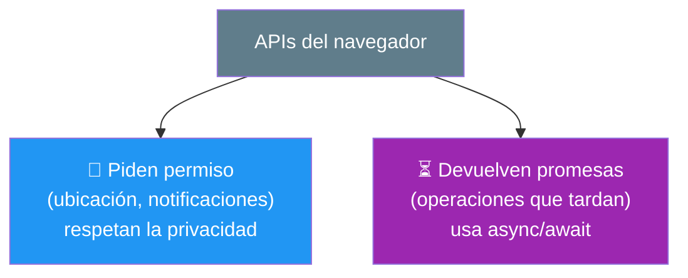
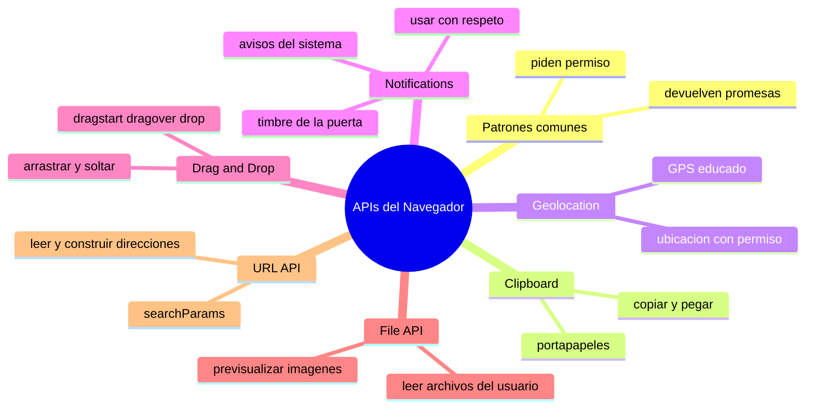

# 🧩 Módulo 27 — APIs Modernas del Navegador

> 💡 **Antes de empezar:** El navegador es mucho más que un visor de páginas: es una _plataforma_ repleta de capacidades listas para usar. Copiar al portapapeles, conocer la ubicación, enviar notificaciones, arrastrar archivos... todo eso ya está disponible en JavaScript, gratis y sin instalar nada. Hoy abrirás esa caja de herramientas del navegador. Es como descubrir que el cuchillo suizo que ya tenías en el bolsillo tiene un montón de herramientas escondidas. 🔧

---

## 🎯 ¿Qué aprenderás en este módulo?

Al terminar serás capaz de:

- Copiar y leer del portapapeles (Clipboard API).
- Obtener la ubicación del usuario (Geolocation API).
- Enviar notificaciones del sistema (Notifications API).
- Implementar arrastrar y soltar (Drag & Drop).
- Leer archivos que el usuario sube (File API).
- Construir y leer URLs de forma fácil (URL API).

> 🌱 **Nota:** Estas APIs son herramientas _prácticas_ que usarás según el proyecto. Comparten dos ideas que verás repetirse: muchas piden _permiso_ al usuario (por privacidad) y muchas devuelven _promesas_ (¡async/await del Módulo 11!). Reconocer esos patrones hace que todas se sientan familiares.

---

## 🔑 Dos patrones que se repiten en todas

Antes de ver cada API, graba estos dos patrones que aparecen una y otra vez:



> 🧠 **Idea clave:** Muchas de estas APIs tocan cosas sensibles (tu ubicación, tus archivos), así que el navegador _exige el consentimiento del usuario_. Y como suelen tardar, devuelven promesas. Si reconoces estos dos patrones, las dominas todas más fácil.

---

## 1. Clipboard API: copiar y pegar

La **Clipboard API** permite copiar texto al portapapeles y leerlo, desde JavaScript. Es lo que hace funcionar esos botones de "Copiar" que ves por todas partes.

### 📋 La metáfora del portapapeles físico

Es como un portapapeles real donde "enganchas" una nota para llevarla a otro lado. Copias algo, queda guardado temporalmente, y el usuario puede pegarlo donde quiera.

```javascript
const boton = document.querySelector("#copiar");

boton.addEventListener("click", async () => {
  try {
    await navigator.clipboard.writeText("¡Texto copiado!");
    console.log("Copiado con éxito ✅");
  } catch (error) {
    console.log("No se pudo copiar");
  }
});
```

> 🔍 **Nota los patrones:** `navigator.clipboard.writeText()` devuelve una _promesa_ (por eso `await`), y lo envolvemos en `try/catch` por si falla. ¡Justo lo que aprendiste en los Módulos 11 y 12!

> 💡 **Uso típico:** botones de "copiar enlace", "copiar código", "copiar cupón". Pequeño detalle de UX que los usuarios agradecen mucho.

---

## 2. Geolocation API: ¿dónde está el usuario?

La **Geolocation API** obtiene la ubicación geográfica del usuario (latitud y longitud), _con su permiso_. Es lo que usan los mapas, el clima local o las apps de delivery.

### 📍 La metáfora del GPS que pide permiso

Es como un GPS que, antes de localizarte, te pregunta educadamente: "¿me permites saber dónde estás?". Solo si aceptas, te ubica. El usuario siempre tiene el control.

```javascript
const boton = document.querySelector("#ubicar");

boton.addEventListener("click", () => {
  navigator.geolocation.getCurrentPosition(
    (posicion) => {
      // Éxito: el usuario dio permiso
      console.log("Latitud:", posicion.coords.latitude);
      console.log("Longitud:", posicion.coords.longitude);
    },
    (error) => {
      // El usuario rechazó o hubo un problema
      console.log("No se pudo obtener la ubicación");
    }
  );
});
```

> 🔐 **El permiso es obligatorio:** El navegador _siempre_ muestra un aviso pidiendo autorización. Si el usuario dice "no", tu app no obtiene la ubicación, y eso está bien: la privacidad es lo primero. Tu código debe manejar con elegancia ambos casos (aceptó / rechazó).

> 💡 **Uso típico:** mostrar el clima de su zona (¡como la app del Módulo 12!), encontrar tiendas cercanas, autocompletar dirección. Combínalo con un mapa para experiencias geniales.

---

## 3. Notifications API: avisos del sistema

La **Notifications API** permite mostrar notificaciones del sistema operativo (esas que aparecen en una esquina de la pantalla), incluso fuera de la pestaña. También requiere permiso.

### 🔔 La metáfora del timbre de la puerta

Una notificación es como el timbre de tu casa: avisa de algo importante aunque no estés mirando la puerta. Pero, igual que no dejarías que cualquiera instale un timbre en tu casa, el usuario debe _permitir_ primero que la web le envíe avisos.

```javascript
const boton = document.querySelector("#avisar");

boton.addEventListener("click", async () => {
  // 1. Pedir permiso primero
  const permiso = await Notification.requestPermission();

  // 2. Si lo concede, enviar la notificación
  if (permiso === "granted") {
    new Notification("¡Hola!", {
      body: "Esta es una notificación de prueba 🔔"
    });
  } else {
    console.log("El usuario no permitió notificaciones");
  }
});
```

> 🔐 **De nuevo el permiso:** Igual que la geolocalización, primero pides autorización con `requestPermission()` (que devuelve una promesa) y solo envías si el usuario acepta. Respeta su decisión.

> ⚠️ **Úsalas con respeto:** Las notificaciones son poderosas pero molestas si se abusa. Envíalas solo cuando aporten valor real (un mensaje nuevo, una tarea completada), nunca para spam. Un buen desarrollador cuida la experiencia, no la invade.

---

## 4. Drag & Drop: arrastrar y soltar

La API de **Drag & Drop** permite que el usuario arrastre elementos por la pantalla y los suelte en otro lugar. Es la base de tableros tipo Trello, reordenar listas, o subir archivos arrastrándolos.

### 🖐️ La metáfora de mover fichas en un tablero

Es como mover fichas en un tablero de juego: agarras una, la arrastras, y la sueltas en su nueva casilla. La API te da "eventos" para cada momento de ese gesto: cuando empiezas a arrastrar, cuando pasas sobre una zona, y cuando sueltas.

```javascript
const elemento = document.querySelector("#arrastrable");
const zona = document.querySelector("#zona");

// El elemento que se arrastra
elemento.addEventListener("dragstart", () => {
  console.log("Empecé a arrastrar");
});

// La zona donde se puede soltar
zona.addEventListener("dragover", (e) => {
  e.preventDefault();  // necesario para permitir soltar aquí
});

zona.addEventListener("drop", (e) => {
  e.preventDefault();
  zona.appendChild(elemento);  // mueve el elemento a la zona
  console.log("¡Soltado!");
});
```

> 🔍 **Los tres momentos clave:** `dragstart` (empiezas a arrastrar), `dragover` (estás sobre una zona válida; necesita `preventDefault` del Módulo 14 para permitir el drop), y `drop` (sueltas). Reconocerlos es la mitad del trabajo.

> 💡 **Uso típico:** tableros kanban, reordenar listas de tareas, galerías, y zonas de "arrastra tu archivo aquí" (que combina con la File API que viene ahora).

---

## 5. File API: leer archivos del usuario

La **File API** permite leer archivos que el usuario selecciona o arrastra (imágenes, textos, etc.) directamente en el navegador, sin subirlos a ningún servidor todavía.

### 📂 La metáfora del lector de documentos

Es como un escáner que lee un documento que le entregas: el usuario elige un archivo, y tu código puede _leer su contenido_ para mostrarlo o procesarlo. Todo ocurre en el navegador, de forma privada.

```html
<input type="file" id="archivo" accept="image/*">


<script>
  const input = document.querySelector("#archivo");
  const vista = document.querySelector("#vista");

  input.addEventListener("change", (e) => {
    const archivo = e.target.files[0];  // el archivo elegido
    if (archivo) {
      const url = URL.createObjectURL(archivo);  // crea una URL temporal
      vista.src = url;  // muestra la imagen elegida
    }
  });
</script>
```

> 🔍 **Cómo funciona:** El input de tipo `file` deja al usuario elegir un archivo. En `e.target.files` tienes los archivos seleccionados. `URL.createObjectURL` crea un enlace temporal para mostrarlo (ideal para previsualizar imágenes antes de subirlas).

> 💡 **Uso típico:** previsualizar una foto de perfil antes de subirla, leer un archivo de texto, validar el tamaño/tipo de un archivo. Se combina muy bien con Drag & Drop para zonas de "suelta tu archivo aquí".

---

## 6. URL API: trabajar con direcciones

La **URL API** facilita _construir, leer y modificar_ direcciones web (URLs) sin tener que manipular texto a mano. Es muy útil para leer parámetros de búsqueda o construir enlaces.

### 🔗 La metáfora del sobre con secciones

Una URL es como un sobre postal con secciones: el destinatario (dominio), la calle (ruta), y notas extra (parámetros). La URL API te deja leer y rellenar cada sección por separado, en vez de tener que escribir y cortar el texto del sobre manualmente.

```javascript
const url = new URL("https://tienda.com/buscar?producto=cafe&precio=10");

console.log(url.hostname);  // "tienda.com"
console.log(url.pathname);  // "/buscar"

// Leer los parámetros de búsqueda fácilmente
console.log(url.searchParams.get("producto"));  // "cafe"
console.log(url.searchParams.get("precio"));     // "10"

// Modificar o agregar parámetros
url.searchParams.set("precio", "20");
console.log(url.href);  // la URL actualizada
```

> 🔍 **Lo cómodo:** En vez de cortar y pegar texto con `split` para extraer un parámetro, `searchParams.get()` lo hace por ti, limpio y sin errores. `searchParams` maneja toda la parte de `?clave=valor` automáticamente.

> 💡 **Uso típico:** leer filtros de la URL (`?categoria=ropa`), construir enlaces con parámetros, guardar el estado de una búsqueda en la dirección para poder compartirla.

---

## 🛠️ Mini práctica: ¡tu turno!

Estos ejercicios necesitan un archivo HTML (algunos pedirán permisos en tu navegador). 🧪

### Ejercicio 1 — Botón de copiar

```html
<!DOCTYPE html>
<html>
<body>
  <input type="text" id="texto" value="¡Cópiame!">
  <button id="copiar">📋 Copiar</button>
  <p id="aviso"></p>

  <script>
    document.querySelector("#copiar").addEventListener("click", async () => {
      const texto = document.querySelector("#texto").value;
      await navigator.clipboard.writeText(texto);
      document.querySelector("#aviso").textContent = "✅ Copiado";
    });
  </script>
</body>
</html>
```

> 🔍 **Prueba:** Haz clic y luego pega (Ctrl+V) en cualquier lado. ¡Tu texto estará ahí!

### Ejercicio 2 — Previsualizar una imagen (File API)

```html
<!DOCTYPE html>
<html>
<body>
  <input type="file" id="foto" accept="image/*">
  <br>
  

  <script>
    document.querySelector("#foto").addEventListener("change", (e) => {
      const archivo = e.target.files[0];
      if (archivo) {
        document.querySelector("#vista").src = URL.createObjectURL(archivo);
      }
    });
  </script>
</body>
</html>
```

> 🎯 **Reto:** Muestra también el nombre del archivo (`archivo.name`) y su tamaño (`archivo.size`).

### Ejercicio 3 — Lee parámetros de una URL

```javascript
const url = new URL("https://ejemplo.com/productos?categoria=ropa&orden=precio");

console.log(url.searchParams.get("categoria"));  // ¿qué imprime?
console.log(url.searchParams.get("orden"));      // ¿y esto?
console.log(url.searchParams.has("color"));      // ¿true o false?
```

---

## 🧭 Resumen visual del módulo



---

## ✅ Checklist: ¿lo lograste?

- [ ] Copio texto al portapapeles con la Clipboard API.
- [ ] Obtengo la ubicación del usuario (con su permiso).
- [ ] Envío notificaciones tras pedir autorización.
- [ ] Implemento arrastrar y soltar con dragstart/dragover/drop.
- [ ] Leo y previsualizo archivos que el usuario selecciona.
- [ ] Leo y construyo URLs con la URL API y searchParams.
- [ ] Reconozco los dos patrones: piden permiso y devuelven promesas.

Si marcaste la mayoría, **desbloqueaste todo un arsenal de capacidades del navegador**. 💪

---

## 🌱 Reflexión final

Este módulo fue como abrir cajones que siempre estuvieron en tu cocina pero no sabías que existían. El navegador moderno es asombrosamente capaz: puede acceder a archivos, ubicación, portapapeles, notificaciones... y todo _sin instalar nada extra_. Conocer estas APIs amplía enormemente lo que puedes construir, y lo mejor es que, una vez que dominas los patrones (pedir permiso, manejar promesas), todas se sienten parecidas.

Nota el hilo ético que recorre el módulo: muchas de estas APIs _piden permiso_ porque tocan cosas privadas del usuario. Eso no es un obstáculo, es un recordatorio de tu responsabilidad. Usar la ubicación, las notificaciones o los archivos con respeto —solo cuando aportan valor real y siempre con consentimiento— es parte de ser un buen desarrollador. La tecnología poderosa exige uso considerado.

No necesitas memorizar todas estas APIs ni usarlas todas en cada proyecto. Son herramientas que tomas _cuando el proyecto las pide_. Lo valioso de hoy es saber que _existen_ y reconocer los patrones comunes, para que cuando necesites "copiar al portapapeles" o "leer un archivo", sepas que el navegador ya tiene la solución esperándote. Y siempre puedes volver a este módulo como referencia.

> 🎯 **El secreto sigue siendo el mismo:** un pasito a la vez. Hoy descubriste que el navegador es una plataforma riquísima, llena de capacidades listas para usar. Con ellas, las apps que puedes imaginar y construir acaban de multiplicarse.

**¡Nos vemos en el Módulo 28!**