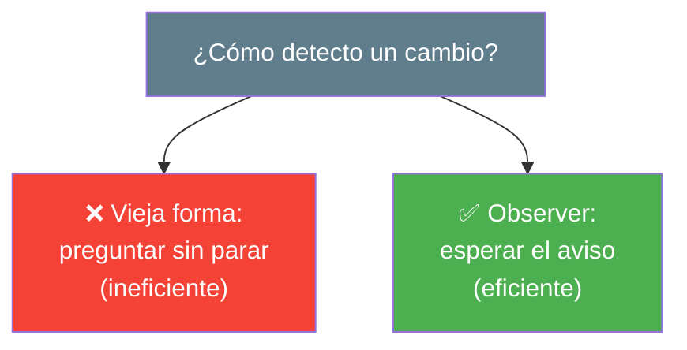
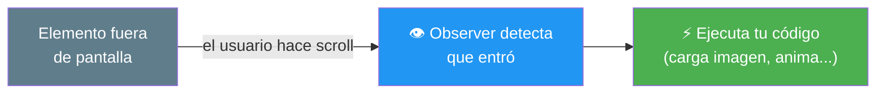
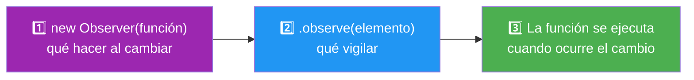
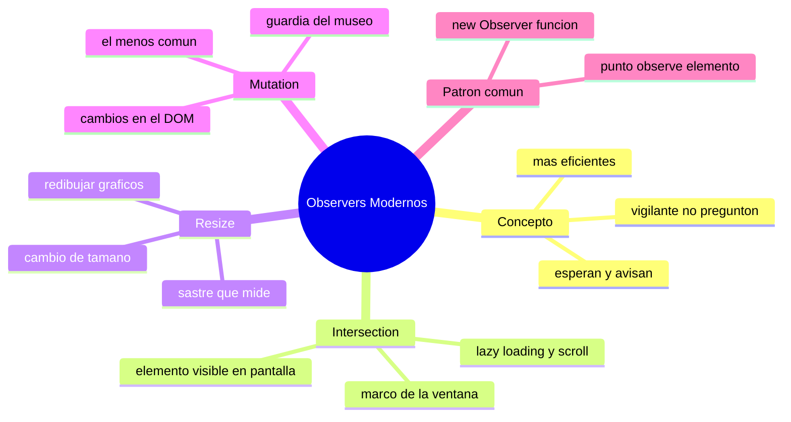

# 🧩 Módulo 28 — Observers Modernos

> 💡 **Antes de empezar:** ¿Cómo hacen las webs para cargar imágenes justo cuando llegas a ellas al hacer scroll? ¿O para reaccionar cuando cambias el tamaño de la ventana? La respuesta son los _observers_ (observadores): vigilantes inteligentes que avisan a tu código cuando algo sucede, sin que tengas que estar preguntando constantemente. Hoy conocerás tres de ellos. Es como tener asistentes que vigilan por ti y te dan un toque solo cuando pasa algo importante. 👁️

---

## 🎯 ¿Qué aprenderás en este módulo?

Al terminar serás capaz de:

- Detectar cuándo un elemento entra o sale de la pantalla (Intersection Observer).
- Reaccionar a cambios de tamaño de un elemento (Resize Observer).
- Vigilar cambios en el contenido del DOM (Mutation Observer).
- Entender por qué los observers son más eficientes que la "vieja forma".

> 🌱 **Nota:** Los observers son herramientas modernas y elegantes para casos concretos. No los usarás a diario, pero cuando necesites "reaccionar a algo que cambia", son la solución profesional y eficiente. Reconocerlos te ahorra reinventar la rueda.

---

## 👁️ ¿Qué es un observer y por qué existe?

Un **observer** es un objeto que _vigila_ algo y ejecuta tu código cuando ese algo cambia. La clave es que es _pasivo_: espera tranquilamente y solo actúa cuando ocurre lo que vigila.

### 🎣 La metáfora del vigilante vs el preguntón

Imagina dos formas de saber si llegó tu pizza:

- **La vieja forma (preguntar sin parar):** asomarte a la ventana cada 5 segundos, gastando energía aunque no haya nada. Agotador e ineficiente.
- **La forma observer (vigilante):** ponerle un timbre a la puerta. No haces _nada_ hasta que suena. Eficiente y tranquilo.

Antes de los observers, para detectar cambios había que "preguntar constantemente" (por ejemplo, revisar la posición del scroll miles de veces). Eso era lento y desperdiciaba recursos. Los observers cambiaron eso: _tú esperas, ellos avisan_.



> 🧠 **Idea clave:** Los observers invierten la lógica. En vez de tu código _persiguiendo_ los cambios, los cambios _te buscan a ti_. Esto es más eficiente y mantiene tu app fluida (¡recuerda el rendimiento del Módulo 25!).

---

## 1. Intersection Observer: ¿está visible en pantalla?

El **Intersection Observer** detecta cuándo un elemento _entra o sale_ del área visible de la pantalla (el viewport). Es el más popular y útil de los tres.

### 🪟 La metáfora del marco de la ventana

Imagina que la pantalla es una ventana y los elementos son objetos que pasan por fuera. El Intersection Observer es un vigilante que te avisa el momento exacto en que un objeto _aparece_ en el marco de la ventana o _desaparece_ de él.

```javascript
// Creamos el observador con la acción a ejecutar
const observador = new IntersectionObserver((entradas) => {
  entradas.forEach((entrada) => {
    if (entrada.isIntersecting) {
      console.log("¡Un elemento entró en pantalla!");
      entrada.target.classList.add("visible");  // por ejemplo, animarlo
    }
  });
});

// Le decimos qué elemento(s) vigilar
const elemento = document.querySelector("#caja");
observador.observe(elemento);
```

> 🔍 **Cómo funciona:** Creas el observer con una función que se ejecuta cuando algo cambia. Luego le dices qué observar con `.observe()`. Cuando el elemento entra o sale de pantalla, tu función recibe la info, y `entrada.isIntersecting` te dice si está visible (`true`) o no.

> 💡 **Usos típicos (¡los ves todos los días!):**
> 
> - **Lazy loading:** cargar imágenes solo cuando estás a punto de verlas (ahorra datos).
> - **Animaciones al hacer scroll:** que un elemento aparezca con efecto al entrar en pantalla.
> - **Scroll infinito:** cargar más contenido cuando llegas al final de la lista.



---

## 2. Resize Observer: ¿cambió de tamaño?

El **Resize Observer** detecta cuándo un _elemento_ cambia de tamaño. No la ventana entera (eso ya existía con otro evento), sino un elemento específico.

### 📏 La metáfora del sastre que mide

Es como un sastre que vigila tus medidas: en cuanto cambias de talla, lo nota y ajusta la ropa. El Resize Observer vigila el tamaño de un elemento y te avisa cuando cambia, para que puedas reaccionar (reacomodar contenido, redibujar un gráfico, etc.).

```javascript
const observador = new ResizeObserver((entradas) => {
  entradas.forEach((entrada) => {
    const { width, height } = entrada.contentRect;
    console.log(`Nuevo tamaño: ${Math.round(width)} x ${Math.round(height)}`);
  });
});

const caja = document.querySelector("#caja");
observador.observe(caja);
```

> 🔍 **Lo útil:** `entrada.contentRect` te da el nuevo ancho y alto del elemento. Reaccionas a _ese_ cambio específico, sin tener que calcular nada a mano.

> 💡 **Usos típicos:** gráficos o mapas que deben redibujarse al cambiar de tamaño, diseños que se reorganizan según el espacio disponible de un contenedor (no de toda la ventana), o ajustar el texto a su caja.

---

## 3. Mutation Observer: ¿cambió el contenido del DOM?

El **Mutation Observer** vigila _cambios en el DOM_: cuando se añaden o eliminan elementos, o cambian sus atributos. Es el más especializado de los tres.

### 🔬 La metáfora del guardia del museo

Es como un guardia de seguridad de un museo que vigila las salas: si alguien añade, quita o mueve una obra, lo detecta al instante. El Mutation Observer vigila tu DOM y te avisa cuando su estructura cambia.

```javascript
const observador = new MutationObserver((mutaciones) => {
  mutaciones.forEach((mutacion) => {
    if (mutacion.addedNodes.length > 0) {
      console.log("Se añadió un elemento nuevo al DOM");
    }
  });
});

const lista = document.querySelector("#lista");
// Le decimos QUÉ vigilar: hijos (childList) y subárbol
observador.observe(lista, { childList: true, subtree: true });
```

> 🔍 **Cómo funciona:** Igual que los otros, creas el observer con una función y observas un elemento. La diferencia es que le pasas _opciones_ indicando qué tipos de cambios vigilar (elementos hijos, atributos, etc.).

> 💡 **Usos típicos:** detectar cuando contenido cargado dinámicamente aparece, reaccionar a cambios hechos por otro código, o construir herramientas que se adaptan a un DOM cambiante. Es más de "nicho", pero poderoso cuando se necesita.

> 😌 **No te abrumes con este:** El Mutation Observer es el menos común de los tres. Basta con saber que existe para vigilar cambios del DOM. El que de verdad usarás seguido es el Intersection Observer.

---

## 📊 Los tres de un vistazo

|Observer|Vigila...|Uso estrella|Metáfora|
|---|---|---|---|
|**Intersection**|Si un elemento está visible en pantalla|Lazy loading, animaciones al scroll|Marco de la ventana|
|**Resize**|Si un elemento cambió de tamaño|Redibujar gráficos al redimensionar|Sastre que mide|
|**Mutation**|Si el DOM cambió (elementos, atributos)|Reaccionar a cambios dinámicos|Guardia del museo|

> 🧠 **El patrón compartido:** Los tres se usan igual: (1) creas el observer con `new ...Observer(función)`, (2) le dices qué vigilar con `.observe(elemento)`, y (3) tu función se ejecuta cuando pasa algo. ¡Aprende el patrón una vez y los entiendes los tres!



---

## 🛠️ Mini práctica: ¡tu turno!

Estos ejercicios necesitan un archivo HTML. 🧪

### Ejercicio 1 — Animación al hacer scroll (Intersection Observer)

```html
<!DOCTYPE html>
<html>
<head>
  <style>
    .caja {
      height: 200px; margin: 800px 0;  /* mucho espacio para hacer scroll */
      background: #ddd;
      opacity: 0; transition: opacity 0.6s;
    }
    .caja.visible { opacity: 1; }
  </style>
</head>
<body>
  <div class="caja">Aparezco al hacer scroll ✨</div>

  <script>
    const observador = new IntersectionObserver((entradas) => {
      entradas.forEach((entrada) => {
        if (entrada.isIntersecting) {
          entrada.target.classList.add("visible");
        }
      });
    });
    observador.observe(document.querySelector(".caja"));
  </script>
</body>
</html>
```

> 🔍 **Prueba:** Haz scroll hacia abajo. La caja aparecerá con un efecto suave justo cuando entre en pantalla. ¡Eso lo ves en webs profesionales todo el tiempo!

### Ejercicio 2 — Detecta cambios de tamaño (Resize Observer)

```html
<!DOCTYPE html>
<html>
<body>
  <textarea id="caja" style="width:200px;">Arrástrame por la esquina para cambiar mi tamaño</textarea>
  <p id="info"></p>

  <script>
    const observador = new ResizeObserver((entradas) => {
      const { width, height } = entradas[0].contentRect;
      document.querySelector("#info").textContent =
        `Tamaño: ${Math.round(width)} x ${Math.round(height)}`;
    });
    observador.observe(document.querySelector("#caja"));
  </script>
</body>
</html>
```

> 🎯 **Prueba:** Arrastra la esquina del textarea y mira cómo el tamaño se actualiza en tiempo real.

### Ejercicio 3 — Reflexión

Piensa en webs que uses: ¿dónde has visto imágenes que cargan al hacer scroll, o contenido que aparece con animación al bajar? Ahora sabes que detrás hay un Intersection Observer. Reconocer la tecnología tras lo que ves es señal de que estás pensando como desarrollador. 🧠

---

## 🧭 Resumen visual del módulo



---

## ✅ Checklist: ¿lo lograste?

- [ ] Entiendo que un observer espera y avisa (en vez de preguntar sin parar).
- [ ] Uso Intersection Observer para detectar elementos visibles.
- [ ] Conozco usos como lazy loading y animaciones al scroll.
- [ ] Uso Resize Observer para reaccionar a cambios de tamaño.
- [ ] Conozco el Mutation Observer para vigilar cambios del DOM.
- [ ] Reconozco el patrón común: crear, observar, reaccionar.

Si marcaste la mayoría, **conoces una de las herramientas más elegantes del navegador moderno**. 💪

---

## 🌱 Reflexión final

Los observers son un ejemplo precioso de cómo la web ha ido madurando. Donde antes había soluciones torpes e ineficientes (preguntar constantemente por los cambios), ahora hay herramientas elegantes que esperan pacientemente y avisan solo cuando es necesario. Esa filosofía —_reaccionar en vez de perseguir_— no solo hace tu código más eficiente, sino también más limpio y fácil de entender.

De los tres, el que de verdad iluminará tus proyectos es el **Intersection Observer**. Una vez que lo conoces, ves su huella por todas partes: imágenes que cargan justo a tiempo, secciones que se animan al aparecer, feeds que cargan más contenido al llegar al final. Poder recrear esos efectos profesionales con unas pocas líneas es muy satisfactorio, y tus usuarios disfrutarán de una experiencia más fluida.

Como siempre, no necesitas memorizar los tres ni usarlos en cada proyecto. Lo valioso es saber que _existen_ y reconocer el patrón compartido (crear, observar, reaccionar). Cuando un día pienses "quiero que algo pase cuando este elemento aparezca en pantalla", recordarás que el observer perfecto te está esperando. Y este módulo estará aquí como referencia.

> 🎯 **El secreto sigue siendo el mismo:** un pasito a la vez. Hoy aprendiste a hacer que tu código _reaccione_ a lo que ocurre en la página, de forma eficiente y elegante. Es una de esas herramientas que, una vez que las conoces, no quieres soltar.

**¡Nos vemos en el Módulo 29!**