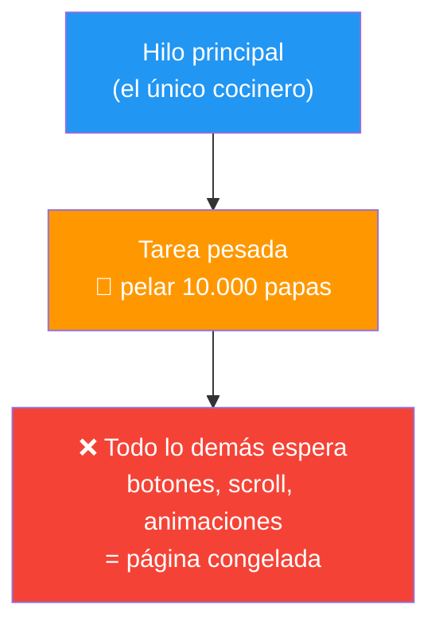
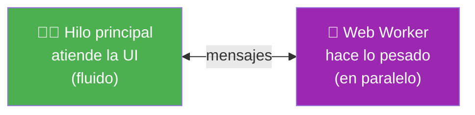
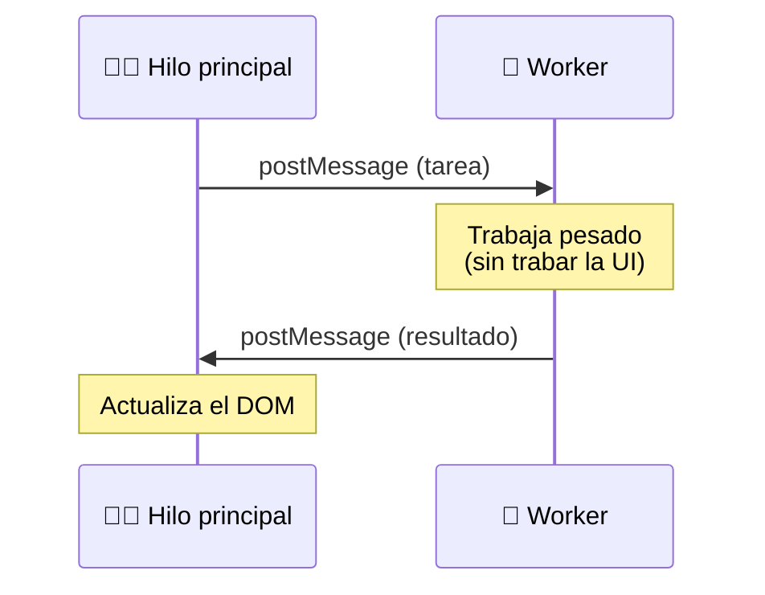
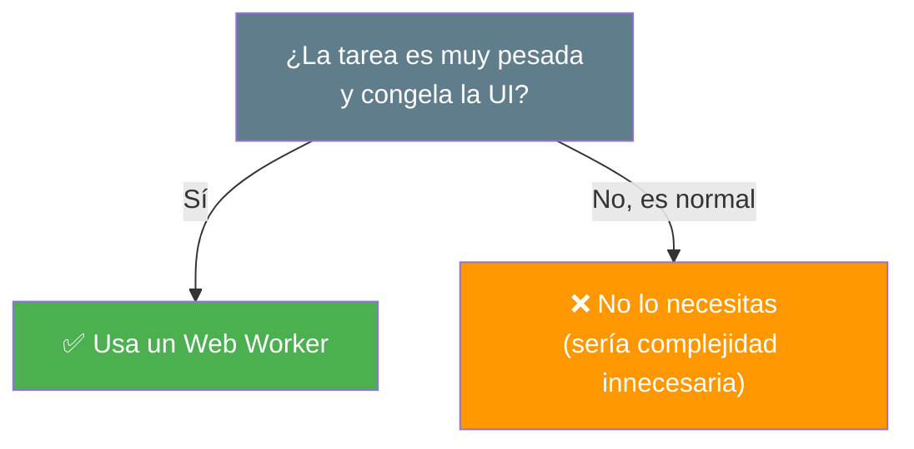
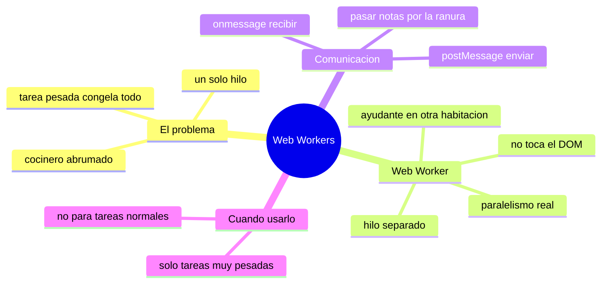

# 🧩 Módulo 29 — Web Workers

> 💡 **Antes de empezar:** ¿Recuerdas del Módulo 13 que JavaScript hace _una sola cosa a la vez_? Eso significa que una tarea muy pesada puede "congelar" toda la página mientras se ejecuta. Hoy aprenderás la solución: los Web Workers, que permiten ejecutar tareas pesadas _en segundo plano_, en un "hilo" aparte, sin trabar la interfaz. Es como contratar un ayudante para que haga el trabajo duro en otra habitación, mientras tú sigues atendiendo a la gente sin interrupciones. 👷‍♂️

---

## 🎯 ¿Qué aprenderás en este módulo?

Al terminar serás capaz de:

- Entender por qué una tarea pesada congela la página.
- Comprender qué son los Web Workers y cómo ejecutan código en paralelo.
- Mover tareas pesadas a un worker para mantener la UI fluida.
- Comunicar el hilo principal con el worker mediante mensajes.

> 🌱 **Nota:** Los Web Workers son una herramienta _especializada_ para casos concretos (cálculos muy pesados). No los necesitarás en la mayoría de proyectos, pero saber que existen te da una solución cuando la lentitud aparezca. Considera este módulo como conocer una herramienta de potencia para cuando haga falta.

---

## 🧊 El problema: cuando la página se "congela"

Como JavaScript ejecuta todo en un solo hilo (el "hilo principal"), si le pides una tarea que tarda mucho —procesar millones de datos, un cálculo enorme—, _todo lo demás se detiene_: los botones no responden, las animaciones se traban, la página parece "colgada".

### 🍳 La metáfora del cocinero abrumado

Imagina un cocinero (el hilo principal) que atiende a los clientes _y_ además debe pelar 10.000 papas. Mientras pela las papas, _no puede atender a nadie_: los clientes esperan, frustrados. La cocina entera se paraliza por una sola tarea pesada.



> 🧠 **El problema en una frase:** Una tarea pesada en el hilo principal _bloquea_ la interfaz, y el usuario percibe la app como rota o lenta. Necesitamos hacer ese trabajo _sin_ ocupar al cocinero principal.

---

## 1. Web Workers: un ayudante en otra habitación

Un **Web Worker** es un script de JavaScript que corre en un _hilo separado_, en paralelo al hilo principal. Puede hacer trabajo pesado _sin_ bloquear la interfaz.

### 👷 La metáfora del ayudante de cocina

El Web Worker es como contratar un ayudante y mandarlo a _otra habitación_ a pelar las papas. Mientras él trabaja allá, el cocinero principal sigue atendiendo clientes con normalidad. Cuando el ayudante termina, le pasa el resultado y todos contentos. Dos personas trabajando _a la vez_, sin estorbarse.



> 🧠 **Idea clave:** El worker corre _de verdad_ al mismo tiempo que el hilo principal (paralelismo real). Por eso una tarea pesada en el worker _no_ congela la página: ocurre en "otra habitación".

> ⚠️ **Una limitación importante:** El worker _no_ puede tocar el DOM (no puede modificar la página directamente). Vive aislado, enfocado en cálculos. Cuando termina, le manda el resultado al hilo principal, y _este_ actualiza la página. Es como el ayudante: pela las papas, pero quien sirve el plato es el cocinero principal.

---

## 2. Cómo se comunican: mensajes de ida y vuelta

El hilo principal y el worker no comparten variables directamente. Se comunican enviándose **mensajes**, como dos personas que se pasan notas por debajo de la puerta.

### 📨 La metáfora de pasar notas

Imagina dos habitaciones conectadas por una ranura. El cocinero pasa una nota: "pela estas papas". El ayudante trabaja y devuelve otra nota: "listas, aquí están". Así se comunican el hilo principal y el worker: con `postMessage` (enviar nota) y `onmessage` (recibir nota).

**Archivo principal (`app.js`):**

```javascript
// Crear el worker (apunta a otro archivo)
const worker = new Worker("worker.js");

// Enviar una tarea al worker
worker.postMessage({ numero: 1000000 });

// Recibir el resultado cuando termine
worker.onmessage = (evento) => {
  console.log("El worker terminó:", evento.data);
  // Aquí SÍ podemos actualizar el DOM (estamos en el hilo principal)
};
```

**Archivo del worker (`worker.js`):**

```javascript
// El worker escucha las tareas que le llegan
onmessage = (evento) => {
  const numero = evento.data.numero;

  // Hace el trabajo pesado (esto NO congela la página principal)
  let suma = 0;
  for (let i = 0; i < numero; i++) {
    suma += i;
  }

  // Devuelve el resultado al hilo principal
  postMessage(suma);
};
```

> 🔍 **El flujo completo:**
> 
> 1. El hilo principal crea el worker y le manda datos con `postMessage`.
> 2. El worker recibe con `onmessage`, hace el trabajo pesado en paralelo.
> 3. El worker devuelve el resultado con `postMessage`.
> 4. El hilo principal lo recibe con `onmessage` y actualiza la UI.



---

## 3. Performance UI: por qué esto importa

El beneficio real de los Web Workers es mantener la **interfaz fluida** incluso durante cálculos pesados. La diferencia para el usuario es enorme.

### Sin worker vs con worker

```javascript
// ❌ SIN worker: el cálculo pesado congela TODO
boton.addEventListener("click", () => {
  let suma = 0;
  for (let i = 0; i < 10000000000; i++) {  // cálculo enorme
    suma += i;
  }
  // Mientras esto corre, la página está CONGELADA 🧊
  resultado.textContent = suma;
});

// ✅ CON worker: el cálculo corre aparte, la página sigue fluida
boton.addEventListener("click", () => {
  worker.postMessage("calcular");
  // La página sigue respondiendo mientras el worker trabaja 😎
});
worker.onmessage = (e) => {
  resultado.textContent = e.data;  // mostramos cuando termina
};
```

> 🎯 **La gran diferencia:** Sin worker, el usuario no puede hacer _nada_ mientras el cálculo corre (ni siquiera hacer scroll). Con worker, la página sigue 100% interactiva, y el resultado aparece cuando esté listo. Experiencia profesional vs experiencia frustrante.

> 💡 **¿Cuándo usar un worker?** Solo cuando tengas una tarea _de verdad_ pesada: procesar imágenes, analizar grandes volúmenes de datos, cálculos matemáticos intensos, parsear archivos enormes. Para tareas normales (la inmensa mayoría), _no_ hacen falta: añadirían complejidad sin beneficio.



---

## 🛠️ Mini práctica: ¡tu turno!

> 📌 **Nota:** Los workers necesitan archivos separados y, a veces, un servidor local para funcionar (por seguridad del navegador). Estos ejemplos son para que entiendas la _estructura_; puedes probarlos con una extensión de servidor local como "Live Server".

### Ejercicio 1 — La estructura básica

**`index.html`:**

```html
<!DOCTYPE html>
<html>
<body>
  <button id="calcular">Calcular (pesado)</button>
  <p id="estado">Listo</p>

  <script>
    const worker = new Worker("worker.js");
    const estado = document.querySelector("#estado");

    document.querySelector("#calcular").addEventListener("click", () => {
      estado.textContent = "⏳ Calculando en segundo plano...";
      worker.postMessage(1000000000);  // mandamos la tarea
    });

    worker.onmessage = (e) => {
      estado.textContent = "✅ Resultado: " + e.data;
    };
  </script>
</body>
</html>
```

**`worker.js`:**

```javascript
onmessage = (e) => {
  let suma = 0;
  for (let i = 0; i < e.data; i++) {
    suma += i;
  }
  postMessage(suma);
};
```

> 🔍 **Observa el truco:** Mientras el worker calcula, prueba a interactuar con la página (seleccionar texto, hacer scroll). ¡Sigue respondiendo! Sin el worker, estaría congelada.

### Ejercicio 2 — Reflexión

Piensa en tus proyectos anteriores: ¿alguno tuvo un momento en que la página se "trababa"? Si la tarea era pesada (procesar muchos datos), un worker habría ayudado. Identificar _cuándo_ una herramienta aplica es tan importante como saber usarla.

> 💡 **Reto mental:** Imagina una app que aplica filtros a una foto de alta resolución. ¿Por qué sería buen candidato para un worker? (Pista: procesar millones de píxeles es pesado y congelaría la UI sin un worker).

---

## 🧭 Resumen visual del módulo



---

## ✅ Checklist: ¿lo lograste?

- [ ] Entiendo por qué una tarea pesada congela la página (un solo hilo).
- [ ] Sé que un Web Worker corre en paralelo, en otro hilo.
- [ ] Comprendo que el worker no puede tocar el DOM directamente.
- [ ] Uso `postMessage` y `onmessage` para comunicar hilo y worker.
- [ ] Sé que los workers solo valen la pena para tareas muy pesadas.

Si marcaste la mayoría, **conoces cómo evitar que las tareas pesadas arruinen la experiencia**. 💪

---

## 🌱 Reflexión final

Los Web Workers resuelven una limitación fundamental que conociste hace tiempo: que JavaScript hace una sola cosa a la vez (Módulo 13). Durante mucho tiempo eso parecía un techo inquebrantable, pero los workers ofrecen una salida elegante: si necesitas hacer dos cosas a la vez de verdad, contrata un ayudante en otro hilo. Es una de esas herramientas que, aunque no uses seguido, te alegra muchísimo conocer el día que la necesitas.

Quiero ser honesto sobre su lugar en tu aprendizaje: los Web Workers son una herramienta de _nicho_. La gran mayoría de las apps web nunca los necesitan, porque rara vez hacen cálculos tan pesados como para congelar la interfaz. Por eso no debes sentir que "tienes que" usarlos. Lo valioso es que ahora _sabes que existen_ y reconocerás el síntoma —una página que se traba durante una tarea pesada— y su cura. Esa capacidad de diagnóstico es lo que importa.

Y nota cómo todo se conecta: este módulo solo tiene pleno sentido porque entendiste el hilo único en el Módulo 13, y porque te preocupaste por el rendimiento en el Módulo 25. Cada concepto que aprendes se apoya en los anteriores y refuerza tu comprensión global. Así se construye, ladrillo a ladrillo, el conocimiento sólido de un programador.

> 🎯 **El secreto sigue siendo el mismo:** un pasito a la vez. Hoy aprendiste a darle a JavaScript un "segundo par de manos" para cuando el trabajo sea demasiado. No lo usarás siempre, pero saber que la opción existe te da tranquilidad y poder.

**¡Nos vemos en el Módulo 30!**